# LUIS Action Binding Sample

A sample that contains a core implementation for doing LUIS Action Binding using the [Microsoft.Cognitive.LUIS.ActionBinding](Microsoft.Cognitive.LUIS.ActionBinding) framework in order to handle LUIS intents taking a service result as input. In addition, the solution contains sample Actions ([LuisActions.Samples.Shared](LuisActions.Samples.Shared)) that are commonly shared, and shows how to integrate them in a console, a bot and a ASP.NET MVC applications.

[![Deploy to Azure][Deploy Button]][Deploy CSharp/LUISActionBinding]

[Deploy Button]: https://azuredeploy.net/deploybutton.png
[Deploy CSharp/LUISActionBinding]: https://azuredeploy.net

### Prerequisites

The minimum prerequisites to run this sample are:
* The latest update of Visual Studio 2015. You can download the community version [here](http://www.visualstudio.com) for free.
* The Bot Framework Emulator. To install the Bot Framework Emulator, download it from [here](https://emulator.botframework.com/). Please refer to [this documentation article](https://github.com/microsoft/botframework-emulator/wiki/Getting-Started) to know more about the Bot Framework Emulator.

#### LUIS Application
If you want to test this sample, you have to import the pre-build [LUIS_MODEL.json](LUIS_MODEL.json) file to your LUIS account.

The first step to using LUIS is to create or import an application. Go to the home page, www.luis.ai, and log in. After creating your LUIS account you'll be able to Import an Existing Application where can you can select a local copy of the LUIS_MODEL.json file an import it.


Once you imported the application you'll need to "train" the model ([Training](https://www.microsoft.com/cognitive-services/en-us/LUIS-api/documentation/Train-Test)) before you can "Publish" the model in an HTTP endpoint. For more information, take a look at [Publishing a Model](https://www.microsoft.com/cognitive-services/en-us/LUIS-api/documentation/PublishApp).

Finally, edit the .config files for each sample ([Bot](LuisActions.Samples.Bot/Web.config), [Web](LuisActions.Samples.Web/Web.config), [Console](LuisActions.Samples.Console/App.config)) and update the `LUIS_SubscriptionKey` and `LUIS_ModelId` appSettings with the values corresponding to your Subscription and Application.

#### Where to find the Application ID and Subscription Key

You'll need these two values to configure the LuisDialog through the LuisModel attribute:

1. Application ID

    In the LUIS application's dashboard, you can copy the App ID from the address bar.
    
    
    
2. Subscription Key

    In the [My keys page](https://www.luis.ai/home/keys), copy the Programmatic API Key.
    
    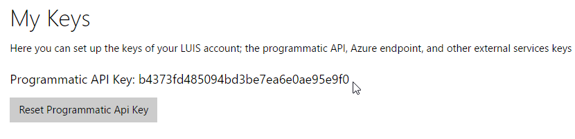

### What is LUIS Action Binding?

There are times when you may want to link an intent to an action at client side (e.g.: in your Bot, or ASP.NET MVC, or even a console app), with an easy binding logic for it, where you can also resolve complex things in order to fulfill an user's intent. In the same way that you can define an intent at LUIS UI for your app, you can also specify requirements for this action to be triggered when bound to an intent at client side. These requirements are known as action members, and will match recognizable entities for the intent that the action maps to.

The framework for client side Action Binding supports only one action per intent. Each action includes members (properties) mapping to entities. These action members can be optional or required, the client framework will provide you the tools to validate the action's state in order to see if it can be fulfilled or if further information is required from the user.

As said, the framework provides contracts to allow defining your actions at client side, a way to bind them to LUIS intents, and additional objects that allows validating and filling mandatory missing entities before you can proceed with the action fulfillment in order to complete the flow.

### Framework Supported Scenarios

The framework supports three main scenarios (out of the box at the core Bot dialog) which are described below, but it also provides tools that you can use to implement or support your custom scenarios within your own apps.

#### Scenario #1 : Switch from an Action to a new Action

While filling a parameter for the current action, the user can provide an input that triggers the execution of a different action (related with a different intent)

Next, there is a sample to depict the scenario:

Scenario shows the user changing its mind (context switching)

````
Bot: What do you want to do?
User: Find me a hotel in Madrid                         -- This would trigger a new `FindHotels` intent with Madrid as Location entity
Bot: When do you want to check-in?
User: Today
Bot: When do you want to check-out?
User: I changed my mind, find flights to Madrid         -- This would trigger a new `FindFlights` intent with Madrid as Location entity (`FindHotels` progress is discarded)
Bot: When do you want to flight?
````

#### Scenario #2 : Trigger a Contextual Action within a valid Context

While filling a parameter for the current action, the user can provide an input that will trigger a contextual action that makes sense to execute it in the context of the current action.

Next, there is a sample to depict the scenario:

Scenario shows an user changing one of the context parameters already answered

````
Bot: What do you want to do?
User: Find me a hotel in Madrid                     -- This would trigger a new `FindHotels` intent with Madrid as Location entity
Bot: When do you want to check-in?
User: Today
Bot: When do you want to check-out?
User: Sorry, change the checkin date to tomorrow    -- This would trigger a `FindHotels-ChangeCheckin` intent with tomorrow as date (but will execute within the context of `FindHotels` and will update its check-in date previously set)
Bot: Ok, I changed the check-in date to tomorrow
Bot: When do you want to check-out?
````

#### Scenario #3 : Trigger a Contextual Action with no previous Context (ie. from scratch)

The user can provide an input that will trigger a contextual action (with no current context). The framework supports this scenario by providing a way to instantiate the contexts chain for it (ie. the chain of parent actions that will provide the whole context), and finally executes the request.

Next, there is a sample to depict the scenario:

Scenario shows an user changing a check-in date within its reservation (stored in a booking system)

````
User: Please change my check-in date to tomorrow
Bot: Ok, I changed the check-in date to tomorrow                -- This triggered the `FindHotels-ChangeCheckin` intent which should run in the context of the `FindHotels` action (so main action also is instanced)
Bot: I changed your reservation in Madrid from 03/25 to 03/27	-- The required parameters of the main context are iterated until it can call the action fulfillment
````

The framework also provides, within this scenario, a callback that you can use to hydrate or re-create the parent contexts for the action you are starting. So, for example, in case you have a booking system and you want to change a parameter within a 'PerformBooking' reference (main intent), you can have a related intent 'PerformBookingCheckinChange' which runs in the context of the previous one and if the user already has a reservation you can hydrate the context back from the repository where you stored it (more details about this specific scenario through the document).

### Code Highlights

As said, actions are objects that you define to fulfill a LUIS intent once it has been recognized by LUIS service. Each action would likely be mapped to one intent (although you can map an action to several intents if your domain would required it), and their models contain typed members (properties) that will be used to map entity values recognized within the intent by LUIS service.

As an example, you might have defined a `GetWeatherInPlace` intent within your LUIS app, and that intent would likely have a mandatory entity which is the `Place` you are requiring the weather information for. In order to fulfill that requirement, you would have an action object that will map to that intent, and its model will have a mandatory `string` property for the `Place` entity. The action is responsible for fulfilling the intent by using the appropiate weather service to get the required information.

In addition, you can define contextual actions that ran in the context of a parent action. You can have a `FindHotels` action and an additional contextual action for updating the check-in date. Actions and contextual actions both map to intents within your LUIS service, but the only difference is how you represent them in application and the behavior you want them to achieve. For this, as you will see, the framework has particular interfaces that allows you define actions or contextual actions.

#### Provisioned LUIS app

The provisioned app for the samples have the following intents and entities:


Below is a table describined the relations between the intents and entities recognized by them:

| Intent | Entities recognized | Utterance sample |
|--------|---------------------|------------------|
|FindAirportByCode|Code|Find SFO airport|
|FindHotels|Category, Checkin, Checkout, Place, RoomType|Find 3 stars standard rooms in Barcelona from 02/15 to 02/17|
|FindHotels-ChangeCheckin|Checkin|Change the check-in date to today (this changes the check-in within the `FindHotels` context)|
|FindHotels-ChangeCheckout|Checkout|Change the check-out date to tomorrow (this changes the check-out within the `FindHotels` context)|
|FindHotels-ChangeLocation|Place|Change the location to Madrid (this changes the place within the `FindHotels` context)|
|TimeInPlace|Place|What is the time in Madrid?|
|WeatherInPlace|Place|Tell me the weather in Buenos Aires|

You can find the JSON file to recreate the app into your own subscription here: [LUIS_MODEL.json](../LUIS_MODEL.json).

#### Microsoft.Cognitive.LUIS.ActionBinding project

At this project you can find the core stuff to implement LUIS action binding and react to LUIS intents within your own apps. Each LUIS action should implement an [ILuisAction](Microsoft.Cognitive.LUIS.ActionBinding/ILuisAction.cs) interface which is the basic contract for action binding implementation that are recognized by the [LuisActionResolver](Microsoft.Cognitive.LUIS.ActionBinding/LuisActionResolver.cs) when an intent should be handled and fulfilled.

````C#
public interface ILuisAction
{
    Task<object> FulfillAsync();

    bool IsValid(out ICollection<ValidationResult> results);
}
````

There is an abstract [BaseLuisAction](Microsoft.Cognitive.LUIS.ActionBinding/BaseLuisAction.cs) base class within the project which provides an implementation for the [ILuisAction.IsValid](Microsoft.Cognitive.LUIS.ActionBinding/BaseLuisAction.cs#L14-L33) method which provides validation for the model defined by the action, relying on Data Annotations.

````C#
[Serializable]
public abstract class BaseLuisAction : ILuisAction
{
    public abstract Task<object> FulfillAsync();

    public virtual bool IsValid(out ICollection<ValidationResult> validationResults)
    {
        var context = new ValidationContext(this, null, null);

        validationResults = new List<ValidationResult>();
        var result = Validator.TryValidateObject(this, context, validationResults, true);

        // do order properties
        validationResults = validationResults
            .OrderBy(r => LuisActionResolver.GetOrderForParam(this, r.MemberNames.First()))
            .ThenBy(r => r.MemberNames.First())
            .ToList();

        return result;
    }
}
````

There is also another pair of interface and abstract class which can be used to implement contextual actions. This interface extends the previously shown `ILuisAction` interface, but has a `Context` member. The interface for defining contextual actions is called [ILuisContextualAction](Microsoft.Cognitive.LUIS.ActionBinding/ILuisContextualAction.cs) and it is shown below:

````C#
public interface ILuisContextualAction<T> : ILuisAction where T : ILuisAction
{
    T Context { get; set; }
}
````

The abstract class in this case is [BaseLuisContextualAction](Microsoft.Cognitive.LUIS.ActionBinding/BaseLuisContextualAction.cs) and just provides an implementation for the `Context` member of the interface.

````C#
[Serializable]
public abstract class BaseLuisContextualAction<T> : BaseLuisAction, ILuisContextualAction<T> where T : ILuisAction
{
    public T Context { get; set; }
}
````

An attribute named [LuisActionBindingAttribute](Microsoft.Cognitive.LUIS.ActionBinding/Attributes/LuisActionBindingAttribute.cs) is used to bind your actions to intents while defining action behavior in different scenarios, and the [LuisActionResolver.ResolveActionFromLuisIntent](Microsoft.Cognitive.LUIS.ActionBinding/LuisActionResolver.cs#L270-L312) uses it to get the appropiate type for an intent contained within the `LuisResult` used as input, and return the appropiate instance for it with the action model property values (that map to entities) resolved.

````C#
[AttributeUsage(AttributeTargets.Class, AllowMultiple = true)]
public class LuisActionBindingAttribute : Attribute
{
    public LuisActionBindingAttribute(string intentName)
    {
        if (string.IsNullOrWhiteSpace(intentName))
        {
            throw new ArgumentException(nameof(intentName));
        }

        this.IntentName = intentName;

        // setting defaults
        this.CanExecuteWithNoContext = true;
        this.ConfirmOnSwitchingContext = true;

        this.FriendlyName = this.IntentName;
    }

    public bool CanExecuteWithNoContext { get; set; }

    public bool ConfirmOnSwitchingContext { get; set; }

    public string FriendlyName { get; set; }

    public string IntentName { get; private set; }
}
````

| Member | Usage |
|--------|-------|
|CanExecuteWithNoContext|Indicates if the action can be executed without a previous parent context - only applies to contextual actions which can be triggered from scratch|
|ConfirmOnSwitchingContext|Indicates if the framework should ask for user confirmation when trying to switch from one context to a completely different one|
|FriendlyName|The friendly name is used to be displayed in some cases, as for example when you are switching from one action to another a prompt might ask you to confirm the switch and the friendly names of the actions are being shown in the confirmation message|
|IntentName|Is the intent to which this action maps to|

There is also another attribute which can be used to map action members to entities recognized by LUIS in several ways. The attribute [LuisActionBindingParamAttribute](Microsoft.Cognitive.LUIS.ActionBinding/Attributes/LuisActionBindingParamAttribute.cs) has the following implementation and members:

````C#
[AttributeUsage(AttributeTargets.Property, AllowMultiple = false)]
public class LuisActionBindingParamAttribute : Attribute
{
    public string CustomType { get; set; }

    public string BuiltinType { get; set; }

    public int Order { get; set; }
}
````

| Member | Usage |
|--------|-------|
|CustomType|Indicates the custom type of the entity this parameter should matches to - if no custom type defined then the assignation process will try to match using the property name|
|BuiltinType|Indicates the built-in type of the entity this parameter should matches to - this is when no custom type or param name previuosly matched with the any entity type|
|Order|Indicates the order in with each of the required parameters should be asked to the user|

> NOTE: Within the implemented actions provided you will see how to use these attributes' settings for different scenarios.

Once you have your models implementing the `ILuisAction` interface (or the `ILuisContextualAction`), and having the `LuisActionBindingAttribute` and the `LuisActionBindingParamAttribute` decorating them, you can obtain the appropiate action instance for an intent from the `LuisResult` instance you need to provide as input, and finally, you can call the action fulfillment to get its result in the following way:

````C#
var resolver = new LuisActionResolver(this.GetType().Assembly);

var myAction = resolver.ResolveActionFromLuisIntent(luisResult);

var result = await myAction.FulfillAsync();
````

As you see the `LuisActionResolver` is being constructed using an assembly instance as input. That assembly instance will be used to lookup for all the types which have `LuisActionBindingAttribute` attributes decorating them. Then, the `ResolveActionFromLuisIntent` will get an `ILuisAction` instance (if there is one that maps the intent targeted within the `luisResult` argument), and will assign the entities found by LUIS service to your model properties.

Within the [ILuisAction.FulfillAsync](Microsoft.Cognitive.LUIS.ActionBinding/ILuisAction.cs#L9) you do whatever it is required to fulfill the intent returned from LUIS service, and provide a meaningful result.

In addition, the `LuisActionResolver` class has lot of static helper methods that are being used within the framework to implement the behavior for the three scenarios depicted at the beginning, but as they are public, you can use it within your own implementation as well (as you can see in the [console sample](LuisActions.Samples.Console/)).

These helper methods are:

|Helper method|usage|
|-------------|-----|
|AssignValue|It is used to assign a value to a parameter member within an action instance|
|QueryValueFromLuisAsync|It is used to evaluate an user response to a query, and see if it matches to a new intent that possibly should be executed - otherwise assigns the value to a parameter member within an action instance|
|GetActionDefinition|Gets the action definition - ie. the attribute decorating the action class you defined|
|GetParameterDefinition|Gets the parameter definition - ie. the attribute decorating a member within an action instance you defined, if any|
|IsValidContextualAction|Returns true if the action instance you are targetting is a contextual action that is valid in the context of the other action instance you are currently handling|
|IsContextualAction|Returns if the action instance provided is a contextual action - ie. if it implements the `ILuisContextualAction` interface|
|UpdateIfValidContextualAction|It is used to setup the context in the contextual action, only if it is valid in the context of the parent action provided|
|CanStartWithNoContextAction|Returns true if the action instance can be triggered from scratch - ie. with no context|
|BuildContextForContextualAction|Builds the parent context for a contextual action instance and assigns it|
|ResolveActionFromLuisIntent|Gets the proper action instance for a `LuisResult` instance with the intent and entities results|

#### LuisActions.Samples.Shared project

At this project you can find samples on how to implement `ILuisAction` interface for the [intents provisioned](#provisioned-luis-app) within the sample LUIS service app.

As an example you can see the [FindHotelsAction](LuisActions.Samples.Shared/FindHotelsAction.cs) which corresponds to the `FindHotels` intent mentioned before. Within the implementation you can see it is inheriting from [BaseLuisAction](LuisActions.Samples.Shared/FindHotelsAction.cs#L10) in order to use the implementation of the [ILuisAction.IsValid](Microsoft.Cognitive.LUIS.ActionBinding/BaseLuisAction.cs#L14-L33) method. In addition, the class is decorated with the [LuisActionBindingAttribute](LuisActions.Samples.Shared/FindHotelsAction.cs#L9) and it has [5 properties](LuisActions.Samples.Shared/FindHotelsAction.cs#L12-L27) which map to recognizable LUIS entities (as you can see, from the data annotations used there, some are required while others are not). The [ILuisAction.FulfillAsync](LuisActions.Samples.Shared/FindHotelsAction.cs#L29-L32) implementation in this case is a mock just returning a text saying "no hotels were found", but it is here where you would call a booking service in order to find available rooms to fulfill the user's request.

````C#
[Serializable]
[LuisActionBinding("FindHotels", FriendlyName = "Find Hotel Room")]
public class FindHotelsAction : BaseLuisAction
{
    public string Category { get; set; }

    [Required(ErrorMessage = "Please provide the check-in date")]
    [LuisActionBindingParam(BuiltinType = BuiltInDatetimeTypes.Date, Order = 2)]
    public DateTime? Checkin { get; set; }

    [Required(ErrorMessage = "Please provide the check-out date")]
    [LuisActionBindingParam(BuiltinType = BuiltInDatetimeTypes.Date, Order = 3)]
    public DateTime? Checkout { get; set; }

    [Required(ErrorMessage = "Please provide a location")]
    [Location(ErrorMessage = "Please provide a valid location")]
    [LuisActionBindingParam(BuiltinType = BuiltInGeographyTypes.City, Order = 1)]
    public string Place { get; set; }

    public string RoomType { get; set; }

    public override Task<object> FulfillAsync()
    {
        return Task.FromResult((object)$"Sorry, there are no {this.RoomType} rooms available at {this.Place} for your chosen dates ({this.Checkin.Value.ToShortDateString()} to {this.Checkout.Value.ToShortDateString()}), please try another search.");
    }
}
````

As you can see the `FindHotelsAction` is decorated with the `LuisActionBindingAttribute` and, besides its `IntentName`, it has a `FriendlyName` which will be displayed when information related to this action should be presented to the user. In addition, if you inspect each of the members, you will find in some of them the usage of the `LuisActionBindingParamAttribute` to define the `Order` in which each one of the required parameters should be asked to the user.

Within our LUIS app model, the entity types matches the name of the parameters, so there is no need to set the `CustomType` to map the members to each one of them. We are still using the `BuiltInType` to map DateTime and Geographic entities.

Below you can see an implementation of a contextual action in the [FindHotelsAction_ChangeLocation](LuisActions.Samples.Shared/FindHotelsAction_ChangeLocation.cs) class, which is related to the one shown above. This contextual action is used in this case to update the `Place` parameter within the `FindHotelsAction`:

````C#
[Serializable]
[LuisActionBinding("FindHotels-ChangeLocation", FriendlyName = "Change the hotel location")]
public class FindHotelsAction_ChangeLocation : BaseLuisContextualAction<FindHotelsAction>
{
    [Required(ErrorMessage = "Please provide a new location for your hotel")]
    [Location(ErrorMessage = "Please provide a new valid location for your hotel")]
    [LuisActionBindingParam(BuiltinType = BuiltInGeographyTypes.City)]
    public string Place { get; set; }

    public override Task<object> FulfillAsync()
    {
        if (this.Context == null)
        {
            throw new InvalidOperationException("Action context not defined.");
        }

        // assign new location to FindHotelsAction
        this.Context.Place = this.Place;

        return Task.FromResult((object)$"Hotel location changed to {this.Place}");
    }
}
````

As you can see first the action is inheriting from the [BaseLuisContextualAction](Microsoft.Cognitive.LUIS.ActionBinding/BaseLuisContextualAction.cs) class, which implements the [ILuisContextualAction](Microsoft.Cognitive.LUIS.ActionBinding/ILuisContextualAction.cs) interface (this is a mandatory requisite to define a contextual action). More precisely the action requires a `FindHotelsAction` as context to be meaningful (declared in the generic argument of the base class). The next think you should observe is the `FulfillAsync` method, where the action is checking that a valid context is provided within the instance and then it updates the `Place` property on it.

Other samples within the project follow the same logic, nevertheless if you take a look at [GetWeatherInPlaceAction](LuisActions.Samples.Shared/GetWeatherInPlaceAction.cs#L18-L40) or [FindAirportByCodeAction](LuisActions.Samples.Shared/FindAirportByCodeAction.cs#L22-L49) you will see fulfillments that actually have more interesting handling implemented (ie. not mocked).

Also, within the project, you can see samples of other contextual actions that ran under the `FindHotelsAction` action context, but have different configuration settings. For example they cannot be triggered from scratch, like the `FindHotelsAction_ChangeLocation`. These contextual actions are the following ones: [FindHotelsAction_ChangeCheckin](LuisActions.Samples.Shared/FindHotelsAction_ChangeCheckin.cs#L9) and [FindHotelsAction_ChangeCheckout](LuisActions.Samples.Shared/FindHotelsAction_ChangeCheckout.cs#L9) (check at the `CanExecuteWithNoContext` set to `false` within the attribute decorating them).

#### LuisActions.Samples.Bot project

At this project you can see how the action samples are used within a bot application.

The key class here is the [RootDialog](LuisActions.Samples.Bot/RootDialog.cs), which [inherits from LuisActionDialog](LuisActions.Samples.Bot/RootDialog.cs#L15).

The [LuisActionDialog](Microsoft.Cognitive.LUIS.ActionBinding/Bot/LuisActionDialog.cs) has been created in order to easily integrate `LuisIntentAttribute` attributes at your intent handler methods within your inherited dialog, with the `ILuisAction` implementations you might have (mapping those intents), getting the appropiate action fulfillment result for a particular user's request and sending it back to the intent handler after being resolved. For this, the `LuisActionDialog` defines [new signatures](Microsoft.Cognitive.LUIS.ActionBinding/Bot/LuisActionDialog.cs#L14-L16) for these handlers, and as said, the dialog obtains the action linked to the intent by using the `LuisActionBindingAttribute.IntentName` decorating your implemented `ILuisAction` classes, and calls the intent handler with the object you return at the `FulfillAsync` method of your action.

````C#
public delegate Task LuisActionHandler(IDialogContext context, object actionResult);

public delegate Task LuisActionActivityHandler(IDialogContext context, IAwaitable<IMessageActivity> message, object actionResult);
````

As you can see the first `LuisActionDialog` [constructor](Microsoft.Cognitive.LUIS.ActionBinding/Bot/LuisActionDialog.cs#L25-L27) receives a list of assemblies where it should lookup for `ILuisAction` implementations decorated with the `LuisActionBindingAttribute`, as well as several `ILuisService` instances that will be used to resolve the user's intent.

````C#
public LuisActionDialog(IEnumerable<Assembly> assemblies, params ILuisService[] services) : this(assemblies, null, services)
{
}
````

The second [constructor](Microsoft.Cognitive.LUIS.ActionBinding/Bot/LuisActionDialog.cs#L29-L39) receives, in addition to the arguments shown before, an `Action<ILuisAction, object>` which will be used on the scenario #3 when creating the parent contexts for a contextual action that can be executed from scratch. The developer can use this callback to *hydrate* back the parent context within the action chain in order to continue or update an already processed context.

````C#
public LuisActionDialog(IEnumerable<Assembly> assemblies, Action<ILuisAction, object> onContextCreation, params ILuisService[] services) : base(services)
{
    if (assemblies == null)
    {
        throw new ArgumentNullException(nameof(assemblies));
    }

    this.onContextCreation = onContextCreation;

    this.actionResolver = new LuisActionResolver(assemblies.ToArray());
}
````

In addition, the dialog has a key override for the [MessageReceived](Microsoft.Cognitive.LUIS.ActionBinding/Bot/LuisActionDialog.cs#L#L41-L97) protected method in order to use our [LuisActionResolver](Microsoft.Cognitive.LUIS.ActionBinding/Bot/LuisActionDialog.cs#L62) instead of the default implemented logic which checks the `LuisResult` returned from LUIS service and creates a child dialog if it needs to prompt for missing parameters while interacting with LUIS service back and forth for each one of them.

````C#
protected override async Task MessageReceived(IDialogContext context, IAwaitable<IMessageActivity> item)
{
    var message = await item;
    var messageText = await GetLuisQueryTextAsync(context, message);

    var tasks = this.services.Select(s => s.QueryAsync(messageText, context.CancellationToken)).ToArray();
    var results = await Task.WhenAll(tasks);

    var winners = from result in results.Select((value, index) => new { value, index })
                  let resultWinner = this.BestIntentFrom(result.value)
                  where resultWinner != null
                  select new LuisServiceResult(result.value, resultWinner, this.services[result.index]);

    var winner = this.BestResultFrom(winners);

    if (winner == null)
    {
        throw new InvalidOperationException("No winning intent selected from Luis results.");
    }

    var intentName = default(string);
    var luisAction = this.actionResolver.ResolveActionFromLuisIntent(winner.Result, out intentName);
    if (luisAction != null)
    {
        var executionContextChain = new List<ActionExecutionContext> { new ActionExecutionContext(intentName, luisAction) };
        while (LuisActionResolver.IsContextualAction(luisAction))
        {
            var luisActionDefinition = default(LuisActionBindingAttribute);
            if (!LuisActionResolver.CanStartWithNoContextAction(luisAction, out luisActionDefinition))
            {
                await context.PostAsync($"Cannot start contextual action '{luisActionDefinition.FriendlyName}' without a valid context.");

                return;
            }

            luisAction = LuisActionResolver.BuildContextForContextualAction(luisAction, out intentName);
            if (luisAction != null)
            {
                this.onContextCreation?.Invoke(luisAction, context);

                executionContextChain.Insert(0, new ActionExecutionContext(intentName, luisAction));
            }
        }

        var validationResults = default(ICollection<ValidationResult>);
        if (!luisAction.IsValid(out validationResults))
        {
            var childDialog = new LuisActionMissingEntitiesDialog(winner.LuisService, executionContextChain);

            context.Call(childDialog, this.LuisActionMissingDialogFinished);
        }
        else
        {
            await this.DispatchToLuisActionActivityHandler(context, item, intentName, luisAction);
        }
    }
}
````

One of the focus of action binding models is resolving the required missing values by just interacting with the user, with no need to call LUIS service any further after the first call. This is why there is a custom [LuisActionMissingEntitiesDialog](Microsoft.Cognitive.LUIS.ActionBinding/Bot/LuisActionDialog.cs#L202-L387) implementation to resolve missing mandatory entities (the default child used by `LuisDialog` calls LUIS service to validate each provided missing value). If you check the [MessageReceivedAsync](Microsoft.Cognitive.LUIS.ActionBinding/Bot/LuisActionDialog.cs#L252-L334) method, it calls itself again and again while there are still [invalid values](Microsoft.Cognitive.LUIS.ActionBinding/Bot/LuisActionDialog.cs#L325-L329) at the action model, otherwise it returns the [updated ILuisAction](Microsoft.Cognitive.LUIS.ActionBinding/Bot/LuisActionDialog.cs#L331-L333) in order to get the fulfillment result and dispatch it to the proper intent handler method at the parent.

````C#
protected virtual async Task MessageReceivedAsync(IDialogContext context, IAwaitable<IMessageActivity> item)
{
    var nextPromptIdx = 0;

    var validationResults = default(ICollection<ValidationResult>);
    this.luisAction.IsValid(out validationResults);

    if (item != null)
    {
        var message = await item;

        var paramName = validationResults.First().MemberNames.First();
        var paramValue = message.Text;

        var result = await LuisActionResolver.QueryValueFromLuisAsync(this.luisService, this.luisAction, paramName, paramValue, context.CancellationToken);

        if (result.Succeed)
        {
            nextPromptIdx++;
        }
        else if (!string.IsNullOrWhiteSpace(result.NewIntent) && result.NewAction != null)
        {
            var currentActionDefinition = LuisActionResolver.GetActionDefinition(this.luisAction);

            var isContextual = false;
            if (LuisActionResolver.IsValidContextualAction(result.NewAction, this.luisAction, out isContextual))
            {
                var executionContextChain = new List<ActionExecutionContext> { new ActionExecutionContext(result.NewIntent, result.NewAction) };

                var childDialog = new LuisActionMissingEntitiesDialog(this.luisService, executionContextChain);

                context.Call(childDialog, this.AfterContextualActionFinished);

                return;
            }
            else if (isContextual & !LuisActionResolver.IsContextualAction(this.luisAction))
            {
                var newActionDefinition = LuisActionResolver.GetActionDefinition(result.NewAction);

                await context.PostAsync($"Cannot execute action '{newActionDefinition.FriendlyName}' in the context of '{currentActionDefinition.FriendlyName}' - continuing with current action");
            }
            else if (!this.luisAction.GetType().Equals(result.NewAction.GetType()))
            {
                var newActionDefinition = LuisActionResolver.GetActionDefinition(result.NewAction);

                var valid = LuisActionResolver.UpdateIfValidContextualAction(result.NewAction, this.luisAction, out isContextual);
                if (!valid && isContextual)
                {
                    await context.PostAsync($"Cannot switch to action '{newActionDefinition.FriendlyName}' from '{currentActionDefinition.FriendlyName}' due to invalid context - continuing with current action");
                }
                else if (currentActionDefinition.ConfirmOnSwitchingContext)
                {
                    // serialize overrun info
                    this.overrunData = result;

                    PromptDialog.Confirm(
                        context,
                        this.AfterOverrunCurrentActionSelected,
                        $"Do you want to discard the current action '{currentActionDefinition.FriendlyName}' and start executing '{newActionDefinition.FriendlyName}' action?");

                    return;
                }
                else
                {
                    this.intentName = result.NewIntent;
                    this.luisAction = result.NewAction;

                    this.luisAction.IsValid(out validationResults);
                }
            }
        }
    }

    if (validationResults.Count > nextPromptIdx)
    {
        await context.PostAsync(validationResults.ElementAt(nextPromptIdx).ErrorMessage);
        context.Wait(this.MessageReceivedAsync);
    }
    else
    {
        context.Done(new ActionExecutionContext(this.intentName, this.luisAction));
    }
}
````

In addition, it is in the code within these classes where the scenarios described in the beginning of this document are being analyzed and triggered. You can see the [code for scenario #1 here](Microsoft.Cognitive.LUIS.ActionBinding/Bot/LuisActionDialog.cs#L293-L321) (switching from intent to intent), the [code for scenario#2 here](Microsoft.Cognitive.LUIS.ActionBinding/Bot/LuisActionDialog.cs#L277-L286) (trigger a contextual action within a parent context) and the [code for scenario #3 here](Microsoft.Cognitive.LUIS.ActionBinding/Bot/LuisActionDialog.cs#L66-L83) (trigger a contextual action from scratch). There is also [code here](Microsoft.Cognitive.LUIS.ActionBinding/Bot/LuisActionDialog.cs#L287-L292) to validate when an action trigger/process is not valid in the current context.

Back to the [RootDialog](LuisActions.Samples.Bot/RootDialog.cs) at Bot sample, we can see first at the constructor that we are using a custom action as a callback to update the contexts in the execution chain when a context creation is happening due to triggering scenario #3. There, we are just [handling the `FindHotelsAction` context](LuisActions.Samples.Bot/RootDialog.cs#L19-L38) as a sample and simply setting the checkin/checkout date to one night at the action context, but you can use a similar approach to do more complex stuff like getting a booking reference from a booking system and so on.

````C#
public RootDialog() : base(
    new Assembly[] { typeof(FindHotelsAction).Assembly },
    (action, context) =>
    {
        // Here you can implement a callback to hydrate action contexts as per request

        // For example:
        // If your action is related with a 'Booking' intent, then you could do something like:
        // BookingSystem.Hydrate(action) - hydrate action context already stored within some repository
        // (ex. using a booking ref that you can get from the context somehow)

        // To simply showcase the idea, here we are setting the checkin/checkout dates for one night
        // when the user starts a contextual intent related with the 'FindHotelsAction'

        // So if you simply write 'Change location to Madrid' the main action will have required parameters already set up
        // and, as in this case the context is an IDialogContext, you can get the user information for any purpose
        if (action is FindHotelsAction)
        {
            (action as FindHotelsAction).Checkin = DateTime.Today;
            (action as FindHotelsAction).Checkout = DateTime.Today.AddDays(1);
        }
    },
    new LuisService(new LuisModelAttribute(ConfigurationManager.AppSettings["LUIS_ModelId"], ConfigurationManager.AppSettings["LUIS_SubscriptionKey"])))
{
}
````

Next, we can see there are [3 handlers](LuisActions.Samples.Bot/RootDialog.cs#L43-L84) for intents we have defined in our provisioned LUIS app. As you can see, the [signature for handler methods](LuisActions.Samples.Bot/RootDialog.cs#L71) having any `LuisIntentAttribute` is different from what you would expect if you were inheriting directly from `LuisDialog` (check [this other sample](https://github.com/Microsoft/BotBuilder-Samples/blob/master/CSharp/intelligence-LUIS/Dialogs/RootLuisDialog.cs#L37) to see the differences).

Within this root sample's dialog, you'll a handler for one or more intents. This is done that way because the related actions are returning the same type, so you can handle/show it similarly without caring about result internals. This ['type agnostic' handler](LuisActions.Samples.Bot/RootDialog.cs#L43-L54) logic gets the result, which in these cases we know is a `string` type, because we implemented and mapped the actions for those intents, and returns this result directly in the message's text to the user.

````C#
[LuisIntent("FindHotels")]
[LuisIntent("TimeInPlace")]
public async Task IntentActionResultHandlerAsync(IDialogContext context, object actionResult)
{
    // we know these actions return a string for their related intents,
    // although you could have individual handlers for each intent
    var message = context.MakeMessage();

    message.Text = actionResult != null ? actionResult.ToString() : "Cannot resolve your query";

    await context.PostAsync(message);
}
````

In addition, we have other handlers that receive custom model instances as result from the action fulfillment. There, the result is being cast to their respective model and used to create a custom response with its values. You can see the logic for the [`WeatherInPlace` intent handler](LuisActions.Samples.Bot/RootDialog.cs#L56-L68) where the result object type is known and used in a different way.

````C#
[LuisIntent("WeatherInPlace")]
public async Task WeatherInPlaceActionHandlerAsync(IDialogContext context, object actionResult)
{
    // we know the action for this intent returns a WeatherInfo, so we cast the result
    var weatherInfo = (WeatherInfo)actionResult;

    var message = context.MakeMessage();
    message.Text = weatherInfo != null
        ? $"The current weather in {weatherInfo.Location}, {weatherInfo.Country} is {weatherInfo.Condition} (humidity {weatherInfo.Humidity}%)"
        : "Weather information not available";

    await context.PostAsync(message);
}
````

> NOTE: All the `ILuisAction` and `ILuisContextualAction` implementations you plan to use with the `LuisActionDialog` should be serializable.

#### LuisActions.Samples.Web project

At this project you can see how the action samples are used within an ASP.NET MVC application.

The key class here is the [HomeController](LuisActions.Samples.Web/Controllers/HomeController.cs) and its [POST Index](LuisActions.Samples.Web/Controllers/HomeController.cs#L21-L54) handler where it receives a custom model containing the user query, along with the action instance resolved for the user's intent (this method is 're-entrant', as it will be called until the action instance for the intent is valid). If the intent has not been obtained yet (at the first POST call), the method performs a [call to LUIS service](LuisActions.Samples.Web/Controllers/HomeController.cs#L24-L34) in order to resolve it.

````C#
[HttpPost]
public async Task<ActionResult> Index(QueryViewModel model)
{
    if (!model.HasIntent)
    {
        var luisService = new LuisService(new LuisModelAttribute(ConfigurationManager.AppSettings["LUIS_ModelId"], ConfigurationManager.AppSettings["LUIS_SubscriptionKey"]));
        var luisResult = await luisService.QueryAsync(model.Query, CancellationToken.None);
        var resolver = new LuisActionResolver(typeof(GetTimeInPlaceAction).Assembly);
        var action = resolver.ResolveActionFromLuisIntent(luisResult);
        model.LuisAction = action;

        // TODO: this is dangerous. This should be stored somewhere else, not in the client, or at least encrypted
        model.LuisActionType = action.GetType().AssemblyQualifiedName;
    }

    ModelState.Clear();
    var isValid = TryValidateModel(model.LuisAction);
    if (isValid)
    {
        // fulfill
        var actionResult = await model.LuisAction.FulfillAsync();
        return this.View("ActionFulfill", actionResult);
    }
    else
    {
        // not valid, continue to present form with missing/invalid parameters
        return this.View(model);
    }
}
````

If the action instance contains a valid model, meaning all mandatory member values and validation passes, the execution continues with the [action fulfillment](LuisActions.Samples.Web/Controllers/HomeController.cs#L40-L47). Otherwise, it will return the same view and perform [re-entrant calls](LuisActions.Samples.Web/Controllers/HomeController.cs#L51-L52) until the action model can be validated.

The helper class [LuisActionModelBinder](LuisActions.Samples.Web/Helpers/LuisActionModelBinder.cs#L8-L31) is where the action instance is 'hydrated' back from the model exchanged with the view in order to be available at the controller's method when checking for its [valid state](LuisActions.Samples.Web/Controllers/HomeController.cs#L37).

````C#
public class LuisActionModelBinder : DefaultModelBinder
{
    public override object BindModel(ControllerContext controllerContext, ModelBindingContext context)
    {
        HttpRequestBase request = controllerContext.HttpContext.Request;
        var type = request.Form["LuisActionType"]; 
        if (!string.IsNullOrWhiteSpace(type))
        {
            var action = Activator.CreateInstance(Type.GetType(type));

            Func<object> modelAccessor = () => action;
            context.ModelMetadata = new ModelMetadata(
                new DataAnnotationsModelMetadataProvider(),
                context.ModelMetadata.ContainerType,
                modelAccessor,
                action.GetType(),
                context.ModelName);

            return base.BindModel(controllerContext, context);
        }

        return null;
    }
}
````

#### LuisActions.Samples.Console project

At this project you can see how the action samples are used within a Console application.

The triggering method here is the [RunQuery](LuisActions.Samples.Console/Program.cs##L139-L177) which sends the user's query to LUIS Service in order to get the user's intent, and with the `LuisResult` response it uses the `LuisActionResolver` to get an instance of the [proper action](LuisActions.Samples.Console/Program.cs#L148-L149) for the response's intent. After getting the intent action it builds the execution context chain (if needed) and send the actions to execute to the [RunActions](LuisActions.Samples.Console/Program.cs#L171) method.

````C#
private static async Task RunQuery(string query)
{
    // Process message
    var luisService = new LuisService(new LuisModelAttribute(ConfigurationManager.AppSettings["LUIS_ModelId"], ConfigurationManager.AppSettings["LUIS_SubscriptionKey"]));
    var luisResult = await luisService.QueryAsync(query, CancellationToken.None);

    // Try to resolve intent to action
    var intentName = default(string);
    var intentEntities = default(IList<EntityRecommendation>);
    var intentAction = new LuisActionResolver(typeof(GetTimeInPlaceAction).Assembly)
        .ResolveActionFromLuisIntent(luisResult, out intentName, out intentEntities);

    if (intentAction != null)
    {
        var executionContextChain = new List<ActionExecutionContext> { new ActionExecutionContext(intentName, intentAction) };
        while (LuisActionResolver.IsContextualAction(intentAction))
        {
            var luisActionDefinition = default(LuisActionBindingAttribute);
            if (!LuisActionResolver.CanStartWithNoContextAction(intentAction, out luisActionDefinition))
            {
                Console.WriteLine($"Cannot start contextual action '{luisActionDefinition.FriendlyName}' without a valid context.");

                return;
            }

            intentAction = LuisActionResolver.BuildContextForContextualAction(intentAction, out intentName);
            if (intentAction != null)
            {
                executionContextChain.Insert(0, new ActionExecutionContext(intentName, intentAction));
            }
        }

        await RunActions(luisService, executionContextChain);
    }
    else
    {
        Console.WriteLine("Could not understand the input.");
    }
}
````

The executing [RunActions](LuisActions.Samples.Console/Program.cs#L38-L137) method then sees if there are more than one action to execute, and it calls recursively after extracting the first action from the list. Then, with the first action extracted, it checks if it is valid, and while it is not, asks the user for [invalid entity values](LuisActions.Samples.Console/Program.cs#L59-L129). In addition, within this loop the logic checks if a new scenario should be switched into (see detailed explanation on how this is evaluated at the Bot sample).

Finally, when the action model is valid it calls the [FulfillAsync](LuisActions.Samples.Console/Program.cs#L131) operation in order to execute the action mapped to the received intent.

````C#
private static async Task<ActionExecutionContext> RunActions(ILuisService luisService, IList<ActionExecutionContext> actions)
{
    if (actions == null || actions.Count == 0)
    {
        Console.WriteLine(">> ERROR: Action chain cannot be null or empty.");

        return null;
    }

    var actionExecutionContext = actions.First();
    var intentAction = actions.First().Action;

    actions.RemoveAt(0);
    if (actions.Count > 0)
    {
        await RunActions(luisService, actions);
    }

    var validationResults = default(ICollection<ValidationResult>);
    bool isValid = intentAction.IsValid(out validationResults);

    while (!isValid)
    {
        var fieldValidation = validationResults.FirstOrDefault();
        if (fieldValidation != null)
        {
            var paramName = fieldValidation.MemberNames.First();
            Console.Write("({0}) {1}: ", paramName, fieldValidation.ErrorMessage);
            var input = Console.ReadLine();

            var queryResult = await LuisActionResolver.QueryValueFromLuisAsync(luisService, intentAction, paramName, input, CancellationToken.None);

            if (!queryResult.Succeed && !string.IsNullOrWhiteSpace(queryResult.NewIntent) && queryResult.NewAction != null)
            {
                var newActionDefinition = LuisActionResolver.GetActionDefinition(queryResult.NewAction);
                var currentActionDefinition = LuisActionResolver.GetActionDefinition(intentAction);

                var isContextual = false;
                if (LuisActionResolver.IsValidContextualAction(queryResult.NewAction, intentAction, out isContextual))
                {
                    var executionContextChain = new List<ActionExecutionContext> { new ActionExecutionContext(queryResult.NewIntent, queryResult.NewAction) };

                    var executionContext = await RunActions(luisService, executionContextChain);
                    if (executionContext.ChangeRootSignaling)
                    {
                        if (LuisActionResolver.IsContextualAction(intentAction))
                        {
                            return executionContext;
                        }
                        else
                        {
                            intentAction = executionContext.Action;
                        }
                    }
                }
                else if (isContextual && !LuisActionResolver.IsContextualAction(intentAction))
                {
                    Console.WriteLine($"Cannot execute action '{newActionDefinition.FriendlyName}' in the context of '{currentActionDefinition.FriendlyName}' - continuing with current action");
                }
                else
                {
                    var valid = LuisActionResolver.UpdateIfValidContextualAction(queryResult.NewAction, intentAction, out isContextual);
                    if (!valid && isContextual)
                    {
                        Console.WriteLine($"Cannot switch to action '{newActionDefinition.FriendlyName}' from '{currentActionDefinition.FriendlyName}' due to invalid context - continuing with current action");
                    }
                    else if (currentActionDefinition.ConfirmOnSwitchingContext)
                    {
                        Console.Write($"You are about to discard the current action '{currentActionDefinition.FriendlyName}' and start executing '{newActionDefinition.FriendlyName}'\nContinue? ");
                        var response = Console.ReadLine();

                        if (response.ToUpperInvariant().StartsWith("Y"))
                        {
                            if (LuisActionResolver.IsContextualAction(intentAction) && !LuisActionResolver.IsContextualAction(queryResult.NewAction))
                            {
                                return new ActionExecutionContext(queryResult.NewIntent, queryResult.NewAction) { ChangeRootSignaling = true };
                            }

                            intentAction = queryResult.NewAction;
                        }
                    }
                    else
                    {
                        intentAction = queryResult.NewAction;
                    }
                }
            }

            // re-evaluate
            isValid = intentAction.IsValid(out validationResults);
        }
    }

    var result = await intentAction.FulfillAsync();

    // We just show the ToString() of the result - not care about the result type here
    Console.WriteLine(result != null ? result.ToString() : "Cannot resolve your query");

    return actionExecutionContext;
}
````

> NOTE: To simplify the sample just the `ToString()` method of the fulfillment result value is used.

### Outcome

Within the sample applications you will see the following results while interacting with them:

#### LuisActions.Samples.Bot app

##### FindHotels intent

| All mandatory members recognized | Missing mandatory members |
|----------------------------------|---------------------------|
|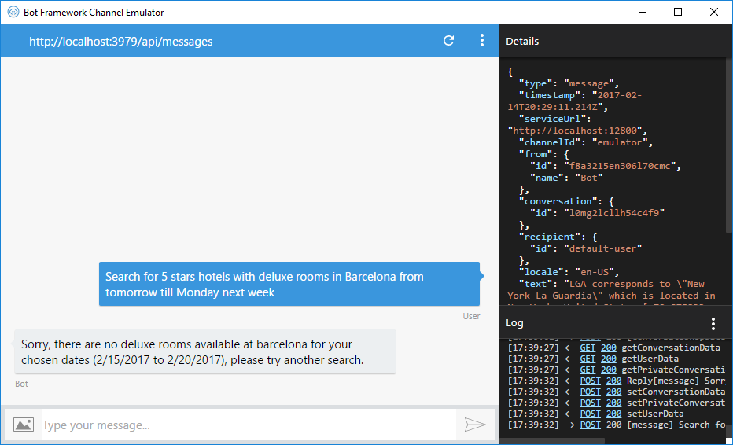|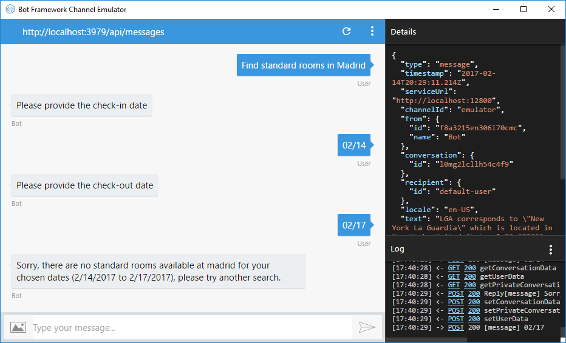|

##### FindAirportByCode intent

| All mandatory members recognized | Missing mandatory members |
|----------------------------------|---------------------------|
||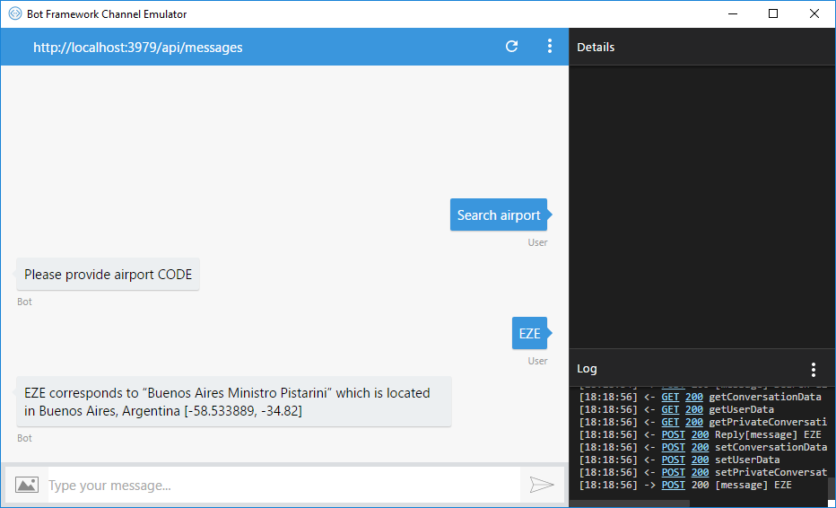|

##### GetWeatherInPlace intent

| All mandatory members recognized | Missing mandatory members |
|----------------------------------|---------------------------|
||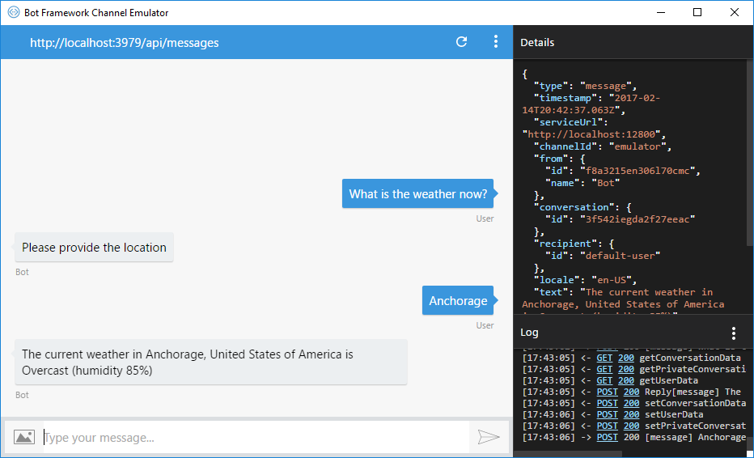|

##### Scenario #1 - Switch from current Intent to a new Intent

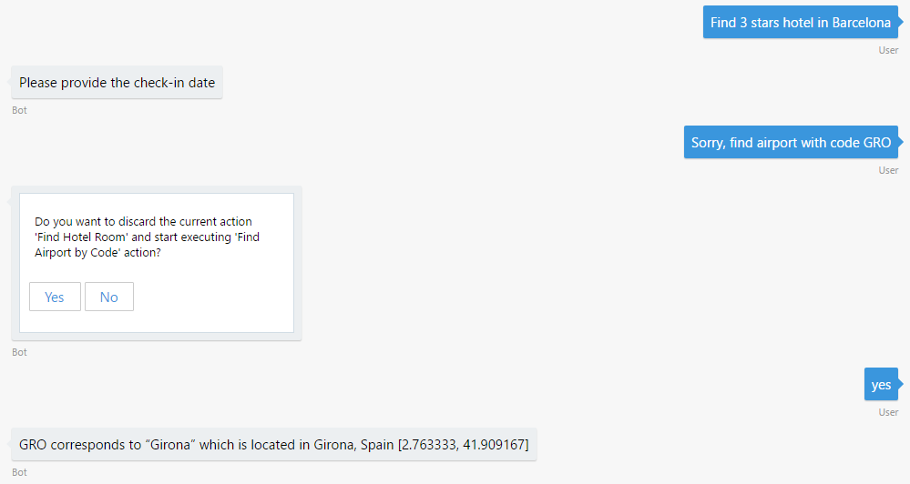
User triggers the ‘FindHotels’ intent/action, but when answering required parameters it changes its mind and triggers the ‘FindAirportByCode’ intent/action confirming context switching

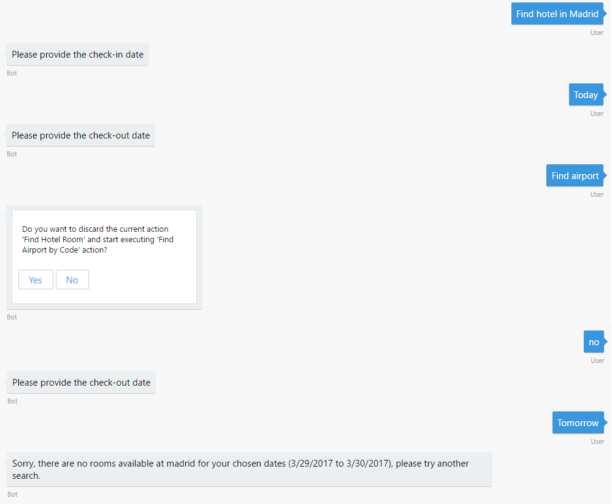
User triggers the ‘FindHotels’ intent/action, but when answering required parameters it changes its mind and triggers the ‘FindAirportByCode’ intent/action but prefers to continue with ‘FindHotels’

##### Scenario #2 - Within the current Intent trigger a related Intent


User triggers the ‘FindHotels’ intent/action looking for an hotel in ‘Barcelona’, but while answering required parameters it changes its mind and decides to update the location to ‘Madrid’ (under the hood this triggers the ‘FindHotelsAction_ChangeLocation’ action shown above)


User triggers the ‘FindHotels’ intent/action looking for an hotel in ‘Pinamar, but while answering required parameters it changes its mind and decides to update the check-in date but while changing the date it changes its mind again and chooses to change the location first (this produces a context switch of contextual actions under the same valid context [FindHotels])

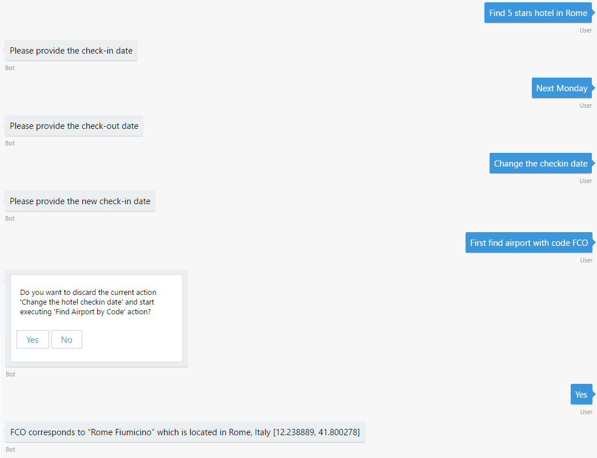
User triggers the ‘FindHotels’ intent/action looking for an hotel in ‘Rome’, but while answering required parameters it changes its mind and decides to update the already answered check-in date, but while changing the date it changes its mind again and decides to validate first if its destination airport ‘FCO’ corresponds to Rome (this produces a full context switch from ‘FindHotels’ context to ‘FindAirportByCode’)

##### Scenario #3 - Trigger a contextual Intent with no context

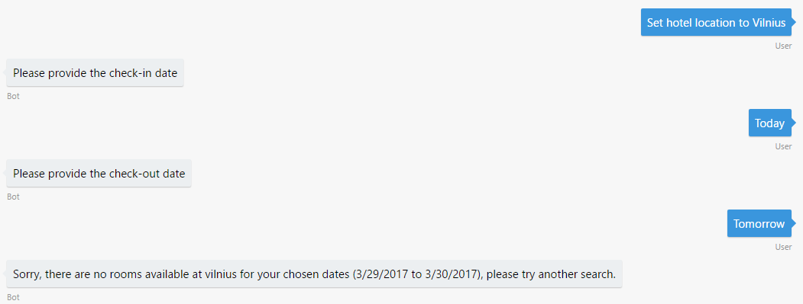
User's request triggers the ‘FindHotelsAction_ChangeLocation’ intent/action, and as it is configured to allow triggering it with no current context (by default) the framework creates the context for it (FindHotels) and executes it (processing first the user's intent and then the root context stuff)


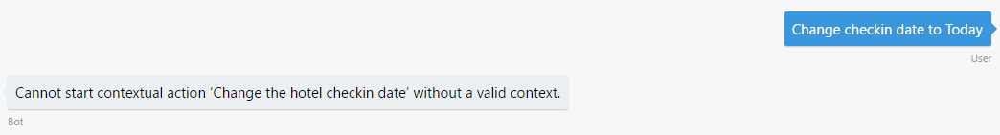
User's request triggers the ‘FindHotelsAction_ChangeCheckin’ intent/action, but as it is configured to not allow triggering it with no current context the framework shows the depicted message and do not execute the action

#### LuisActions.Samples.Web app

##### FindHotels intent

| All mandatory members recognized | Missing mandatory members |
|----------------------------------|---------------------------|
||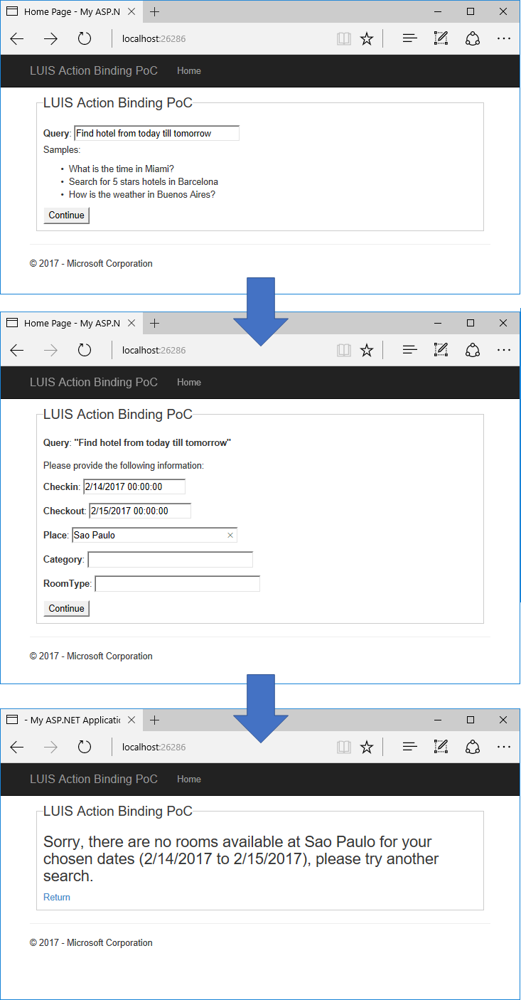|

##### FindAirportByCode intent

| All mandatory members recognized | Missing mandatory members |
|----------------------------------|---------------------------|
|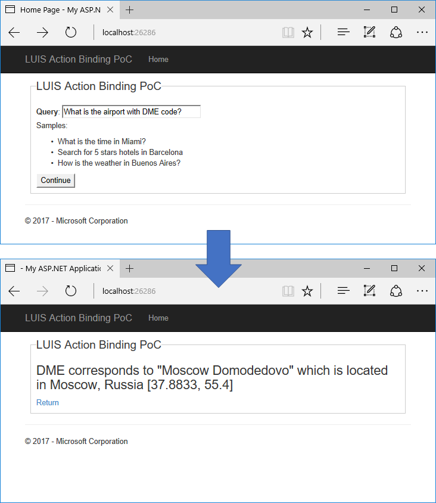||

##### GetWeatherInPlace intent

| All mandatory members recognized | Missing mandatory members |
|----------------------------------|---------------------------|
|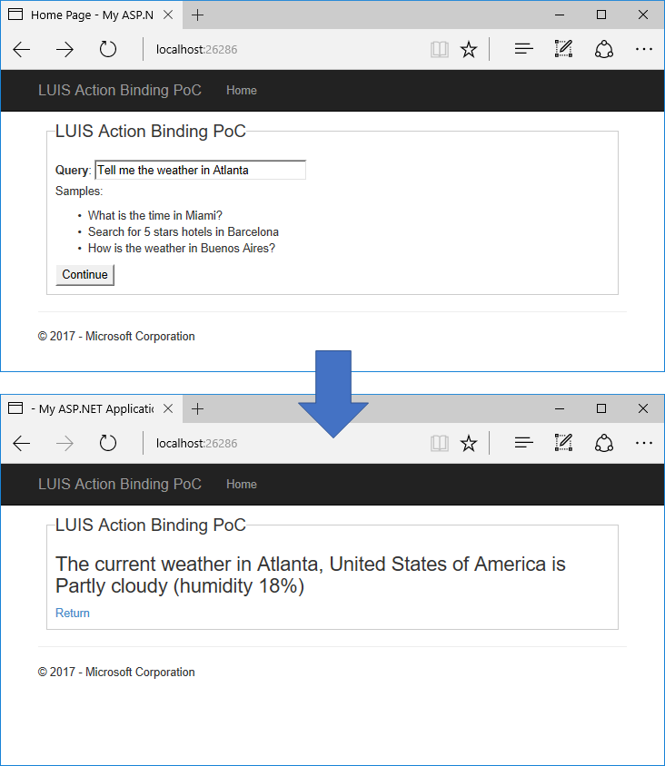|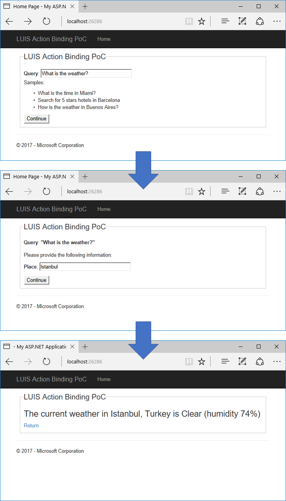|

#### LuisAction.Samples.Console app

##### FindHotels intent

| All mandatory members recognized | Missing mandatory members |
|----------------------------------|---------------------------|
|||

##### FindAirportByCode intent

| All mandatory members recognized | Missing mandatory members |
|----------------------------------|---------------------------|
|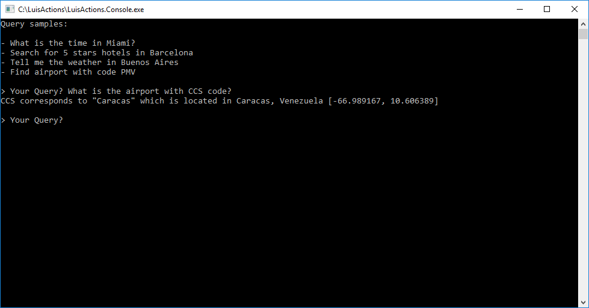||

##### GetWeatherInPlace intent

| All mandatory members recognized | Missing mandatory members |
|----------------------------------|---------------------------|
|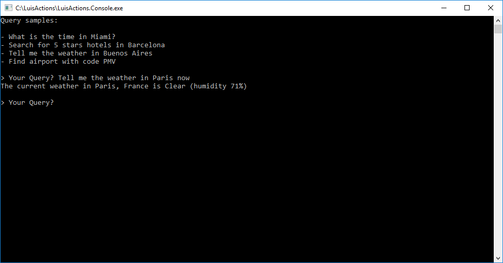||

### More Information

To get more information about how to get started in Bot Builder for .NET and Conversations please review the following resources:
* [Bot Builder for .NET](https://docs.microsoft.com/en-us/bot-framework/dotnet/)
* [Enable language understanding with LUIS](https://docs.microsoft.com/en-us/bot-framework/dotnet/bot-builder-dotnet-luis-dialogs)
* [LUIS Help Docs](https://www.luis.ai/Help/)
* [Cognitive Services Documentation](https://www.microsoft.com/cognitive-services/en-us/luis-api/documentation/home)
* [Specify initial form state and entities](https://docs.microsoft.com/en-us/bot-framework/dotnet/bot-builder-dotnet-formflow-advanced#specify-initial-form-state-and-entities)
* Other examples using LUIS
    * [Alarm Bot](https://docs.microsoft.com/en-us/bot-framework/dotnet/bot-builder-dotnet-luis-dialogs#alarm-bot-implementation)
    * [Weather Bot](https://docs.microsoft.com/en-us/bot-framework/cognitive-services-add-bot-language#language-understanding-bot-example)
