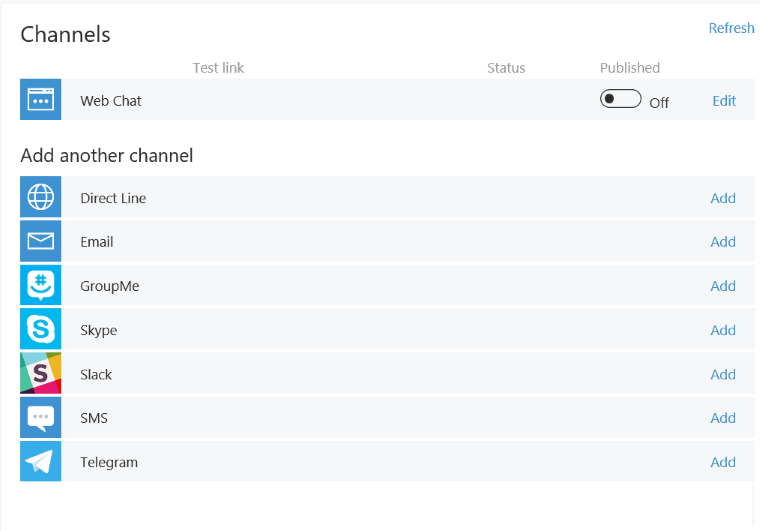
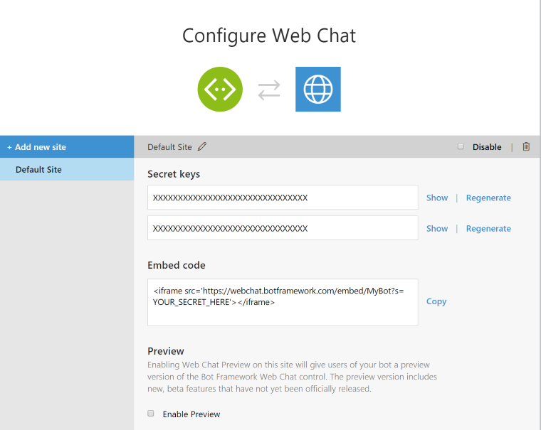
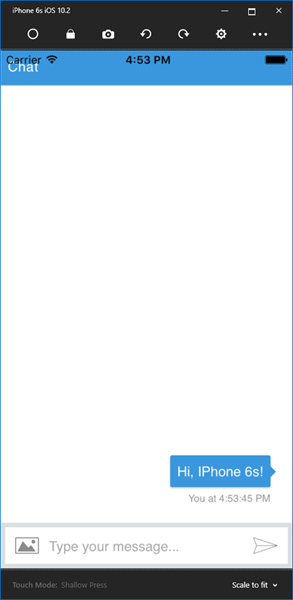
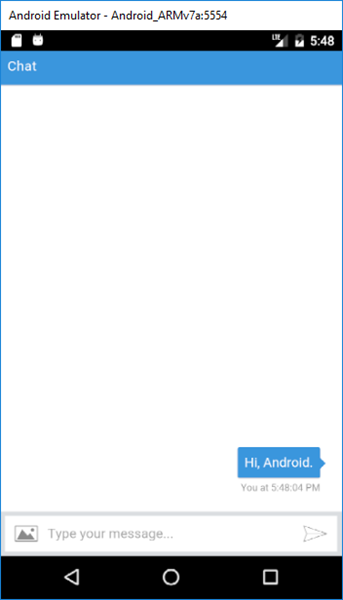
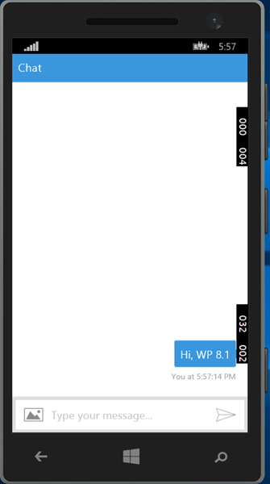

# Bot in Apps Sample

A sample bot showing how to go beyond by becoming embedded into larger applications.

### Prerequisites
The minimum prerequisites to run this sample are:
* The latest update of Visual Studio 2015. You can download the community version [here](http://www.visualstudio.com) for free.
* The Xamarin Platform. You can download it from [here](https://www.xamarin.com/platform) for free.
* Register your bot with the Microsoft Bot Framework. Please refer to [this](https://docs.microsoft.com/en-us/bot-framework/portal-register-bot) for the instructions.
* Enable the Web Chat channel, edit the settings 

   
  
  and add a new site to get the Web Chat Embed code. 

   
 
  Refer to [this](https://docs.microsoft.com/en-us/bot-framework/portal-configure-channels) for more information on how to configure channels. 

* Update the `WebView`'s source of the [WebPage.cs](WorkingWithWebview/WebPage.cs#L11) file of the `WorkingWithWebview` project with the Web chat embed code. 

	````C#
	public class WebPage : ContentPage
	{
		public WebPage()
		{
			var browser = new WebView();

			browser.Source = "https://webchat.botframework.com/embed/<YOUR SECRET KEY HERE>";

			this.Content = browser;
		}
	}
	````

### Code Highlights

The Xamarin `WebView` is a view for displaying web and HTML content in your app. It comes with support for the following types of content:

* HTML & CSS websites – WebView has full support for websites written using HTML & CSS, including JavaScript support.
* Documents – Because WebView is implemented using native components on each platform, WebView is capable of showing documents that are viewable on each platform. That means that PDF files work on iOS and Android, but not Windows Phone.
* HTML strings – WebView can show HTML strings from memory.
* Local Files – WebView can present any of the content types above embedded in the app.

> WebView on Windows and Windows Phone does not support Silverlight, Flash or any ActiveX controls, even if they are supported by Internet Explorer on that platform.

The `WorkingWithWebview` project is a Portable Class Library (PCL) project. Portable Class Libraries allow you to write code and produce libraries that can be shared across mulitple platforms including Xamarin.iOS, Xamarin.Android and Windows Phone 

This project defines the app's layout and is being used by each of the platform projects in the solution.

Check out the [`App.cs`](WorkingWithWebview/App.cs#L9) file of the `WorkingWithWebview` project defining how the main page of the application will looks like.

````C#
public App()
{
	this.MainPage = new WebPage { Title = "Web Page" };
}
```` 

Check out the [MainActivity.cs](Android/MainActivity.cs#L16) of the Android project using an instance of the App class defined in the PCL project when loading the Android application.

````C#
public class MainActivity : global::Xamarin.Forms.Platform.Android.FormsApplicationActivity
{
	protected override void OnCreate(Bundle bundle)
	{
		base.OnCreate(bundle);

		global::Xamarin.Forms.Forms.Init(this, bundle);

		this.LoadApplication(new App());
	}
}
````

### Outcome

You will see the following result, depending the project you choose to run:

| iOS | Universal App | Android | Windows Phone |
|---|---|---|---|
|||||

### More Information

To get more information about how to get started with the embeddable web chat control for the Microsoft Bot Framework and Xamarin's WebView please review the following resources:
* [Web chat control](https://github.com/Microsoft/BotFramework-webchat)
* [Introduction to Portable Class Libraries](https://developer.xamarin.com/guides/cross-platform/application_fundamentals/pcl/introduction_to_portable_class_libraries/)
* [Web View](https://developer.xamarin.com/guides/xamarin-forms/user-interface/webview/)
* [Working with WebView in Xamarin.Forms](http://developer.xamarin.com/guides/cross-platform/xamarin-forms/working-with/webview)
