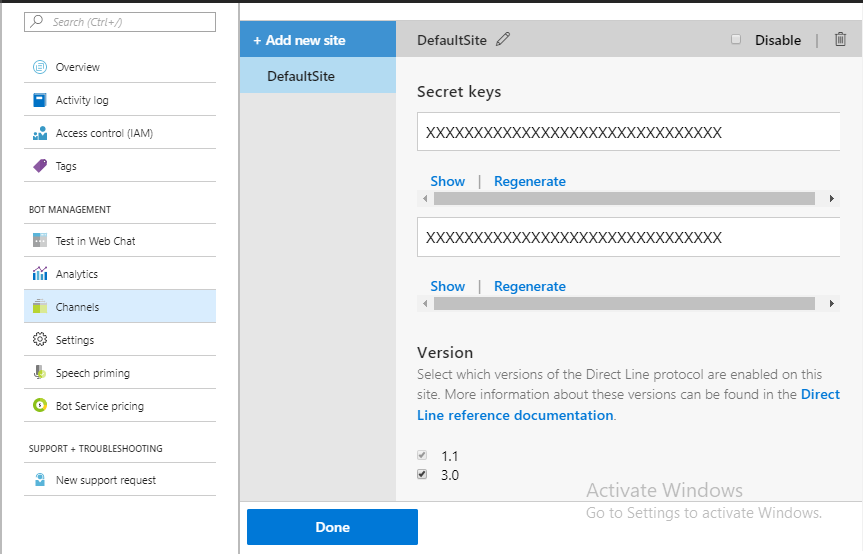
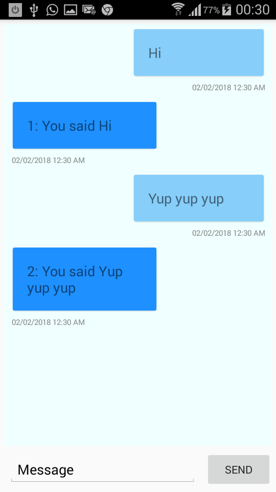

# Bot App with DirectLine Sample

A sample showing how to build a simple app to communicate with your bot via direct line.

### Prerequisites
The minimum prerequisites to run this sample are:

Visual Studio 2017

The Xamarin.Forms Platform.

Register your bot with the Microsoft Bot Framework on Azure. Check this [link](https://docs.microsoft.com/fr-fr/bot-framework/bot-service-quickstart) for more info about this.

Enable the DirectLine channel, and get your secrets.



### Code

Let's start the direct line client.

NB: Your shared project should be a .Net standard project and you should install this nuget package to it [Microsoft.Bot.Connector.DirectLine](https://www.nuget.org/packages/Microsoft.Bot.Connector.DirectLine)

```C#
public BotConnectorService()
        {
            Client = new DirectLineClient(directLineSecret);
        }

        public async Task SetUpAsync()
        {
            if (!started)
            {
                BotConversation = await Client.Conversations
                    .StartConversationAsync().ConfigureAwait(false);
                started = true;
            }
        }
 ```
 This code snipet will connect your client to you bot and start a conversation with it.
 
 ```C#
 public async Task SendMessageAsync(string messge, string userName = "")
        {
            var userMesage = new Activity()
            {
                From = new ChannelAccount(userName),
                Text = messge,
                Type = ActivityTypes.Message
            };

await Client.Conversations.PostActivityAsync(BotConversation.ConversationId, userMesage)
                .ConfigureAwait(false);
            //We initiate the process of receiving messages
            //From the Bot.
            await ReceiveMessageAsync();
      }
      
      public async Task ReceiveMessageAsync()
        {
            //Send the message to the bot
            var response = await Client.Conversations.GetActivitiesAsync(
                BotConversation.ConversationId, WaterMark).ConfigureAwait(false);

            WaterMark = response.Watermark;

            var activities = new List<Activity>();
            foreach (var activity in response.Activities)
            {
                //Get only the activities corresponding to the Bot.
                if (activity.From.Id == BOT_HANDLE)
                    activities.Add(activity);
            }

            //Fire the event for message received.
            BotMessageReceived?.Invoke(CreateBotMessages(activities));
        }
         
        private List<BotMessage> CreateBotMessages(IEnumerable<Activity> activities)
        {
            var botMessages = new List<BotMessage>();

            foreach (var activity in activities)
            {
                botMessages.Add(new BotMessage() { ActivityId = activity.Id, Content = activity.Text, ISent = false });
            }

            return botMessages;
        }
```

This code snipet shows how messages are sent and received from the bot.

Now, since we can send and receive messages, the app will update the UI depending on the messages either from the user or the bot.

```C#
 public RelayCommand SendCommand { get; private set; }
        ObservableCollection<BotMessage> _botMessages;
        public ObservableCollection<BotMessage> BotMessages
        {
            get => _botMessages;
            set => SetProperty(ref _botMessages, value);
        }
        BotConnectorService _botService;
        private string _currentMessage;
        public string CurrentMessage
        {
            get => _currentMessage; 
            set => SetProperty(ref _currentMessage, value); 
        }
```
These properties are bound from the View Model to the View and update the UI as messages are received or sent.

The View will have a simple conversational interface.

```XAML
<ContentPage xmlns="http://xamarin.com/schemas/2014/forms"
             xmlns:x="http://schemas.microsoft.com/winfx/2009/xaml"
             xmlns:local="clr-namespace:BotOnXamarin.Forms.Views"
             x:Class="BotOnXamarin.Forms.Views.MainPage">

    <ContentPage.Resources>
        <ResourceDictionary>
            <local:ChatDataTemplateSelector x:Key="ChatDataTemplateSelector"/>
        </ResourceDictionary>
    </ContentPage.Resources>
    
    <ContentPage.Content>
        <StackLayout Margin="5">
            <ListView x:Name="ChatListView"
                  VerticalOptions="FillAndExpand"
                      SelectedItem="{Binding SelectedMessage}"
                      ItemsSource="{Binding BotMessages, Mode=TwoWay}"
                  BackgroundColor="Azure"
                  HasUnevenRows="True" 
                  SeparatorVisibility="None"
                  ItemTemplate="{StaticResource ChatDataTemplateSelector}"/>
            <StackLayout Orientation="Horizontal">
                <Entry Placeholder="Message" Margin="5" Keyboard="Chat"
                       Text="{Binding CurrentMessage, Mode=TwoWay}"
                       HorizontalOptions="FillAndExpand"/>
                <Button Text="Send" Command="{Binding SendCommand}"/>
            </StackLayout>
        </StackLayout>
    </ContentPage.Content>

</ContentPage>
```
### Results

The sample app shoud be up and running as shown here. 

### More details for this sample
* [Direct Line](https://docs.microsoft.com/en-us/bot-framework/bot-service-channel-connect-directline)
* [Xamarin.Forms](https://developer.xamarin.com/guides/xamarin-forms/)
* [Further details](https://doumer.me/2018/02/15/build-a-cross-platform-mobile-app-for-your-chat-bot/) on building this sample app


