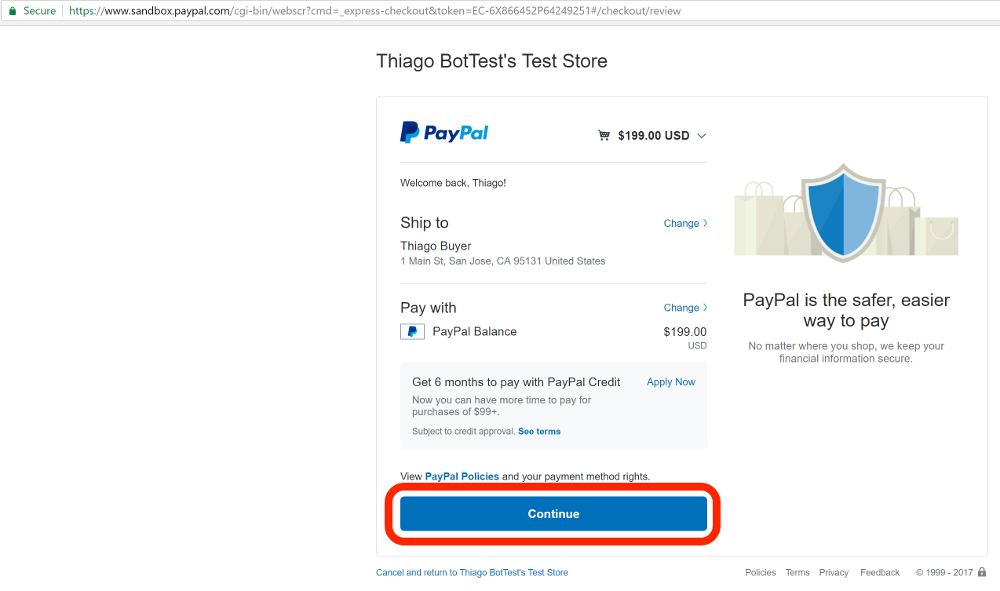
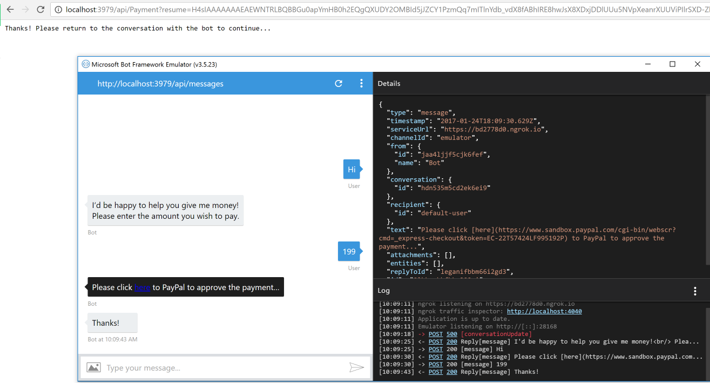
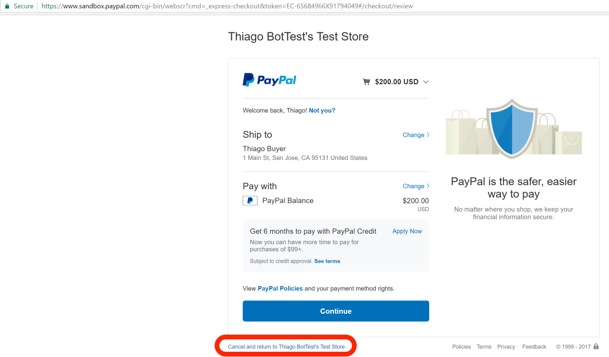
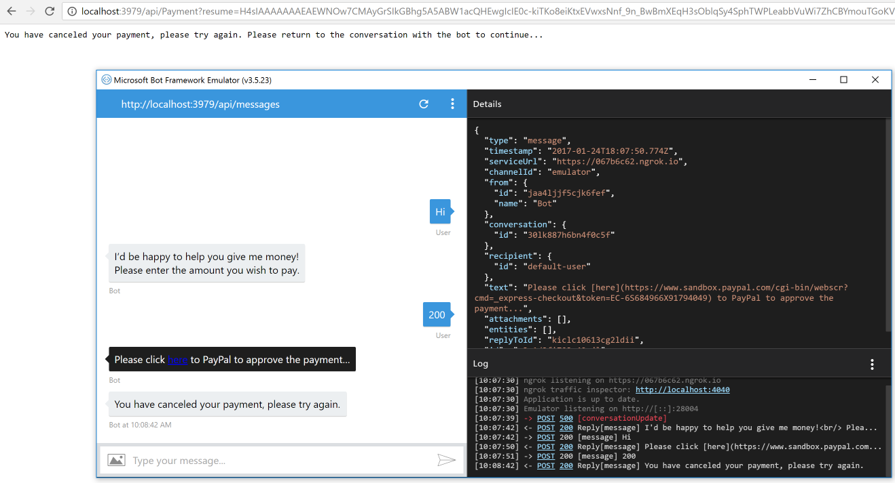

# PayPal Bot Sample

A sample bot that forwards the user to complete a PayPal payment and then resumes the conversation. This sample is a simple starting point for more complex PayPal transactions through bots. By redirecting to PayPal and resuming once done we ensure the bot does not handle the financial transaction itself and just facilitates it.

### Prerequisites

The minimum prerequisites to run this sample are:
* The latest update of Visual Studio 2015. You can download the community version [here](http://www.visualstudio.com) for free.
* The Bot Framework Emulator. To install the Bot Framework Emulator, download it from [here](https://emulator.botframework.com/). Please refer to [this documentation article](https://github.com/microsoft/botframework-emulator/wiki/Getting-Started) to know more about the Bot Framework Emulator.
* [A PayPal developer account](https://developer.paypal.com/) with:
  * A test Business (Merchant) account to be the test seller account and 
  * A test Personal account to use as the test buyer making a payment. Make sure to include funds in the test Personal account when creating it so you can use those for the test payments.
* A [PayPal REST API app](https://developer.paypal.com/developer/applications) associated with the Business (Merchant) account mentioned above. You won't need a Webhook configured in this PayPal app. Take note of the Client ID, App ID, and Secret when creating the app.

### Highlights

The bot instructs the user to click a link to perform a payment on PayPal and points PayPal's completion Url back to a new Controller within the bot (`PaymentController`).

When the request is sent to `PaymentController`, the bot resumes the conversation using a stored ResumptionCookie for the user on the channel where the payment flow was initiated. It pulls relevant information from the PayPal response to know whether or not payment was successful at PayPal before completing the payment.

The code uses the [PayPal .NET SDK](https://www.nuget.org/packages/paypal). Before running:
* Update the **PayPal** section in `Web.config` with the values from the PayPal REST API app you created 
* Update the **MS_WebHookReceiverSecret_PayPal** setting in the `appSettings` section with the same value as clientSecret from the **PayPal** section

### Examples

After starting a conversation with the bot, it'll ask the amount you want to pay. Once a numeric amount is provided, it'll build the link for the user to follow to complete the transaction on the PayPal website.

#### Success Flow

On the PayPal website if you log in with the test Personal account you created as part of the pre-requisites you'll be able to complete the payment:

And here is the conversation in the Bot Emulator for the successful transaction:

#### Cancellation Flow

On the PayPal website if the user decides to cancel the transaction it will not complete the payment:

And here is the conversation in the Bot Emulator for the cancelled transaction:

### Code of Conduct

This project has adopted the [Microsoft Open Source Code of Conduct](https://opensource.microsoft.com/codeofconduct/).
For more information see the [Code of Conduct FAQ](https://opensource.microsoft.com/codeofconduct/faq/) or
contact [opencode@microsoft.com](mailto:opencode@microsoft.com) with any additional questions or comments.

### Copyright and license

Code released under [the MIT license](LICENSE)
