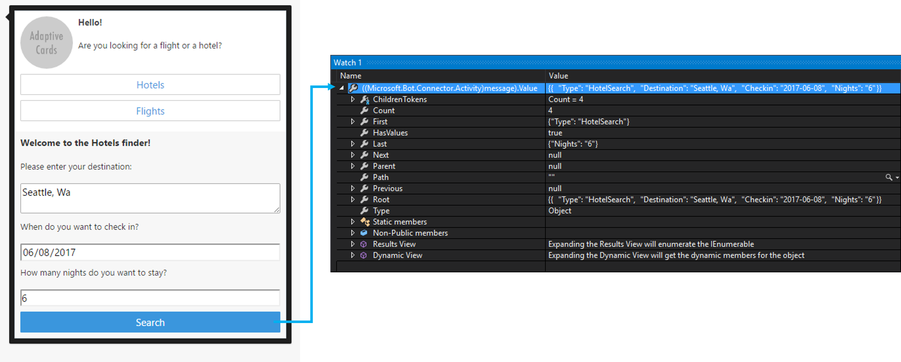
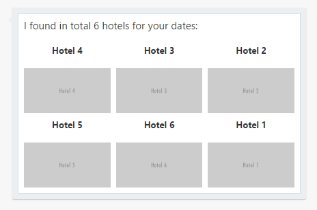
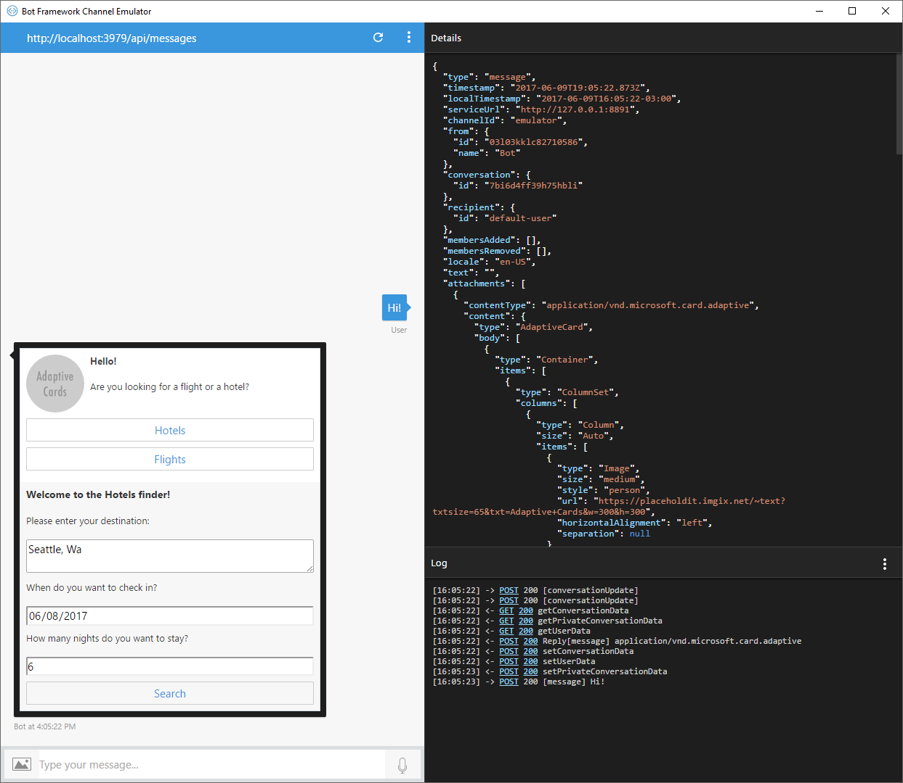
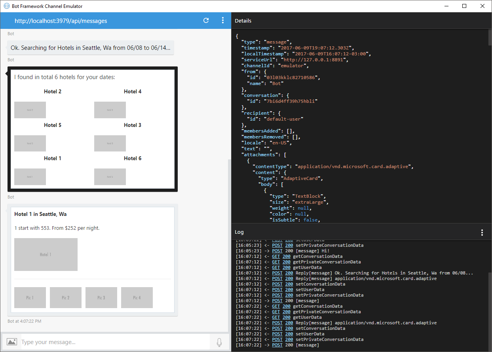

# Adaptive Cards Bot Sample

A sample bot using [Adaptive Cards](http://adaptivecards.io/) and how to handle user interaction with them.

[![Deploy to Azure][Deploy Button]][Deploy CSharp/AdaptiveCards]

[Deploy Button]: https://azuredeploy.net/deploybutton.png
[Deploy CSharp/AdaptiveCards]: https://azuredeploy.net

### Prerequisites

The minimum prerequisites to run this sample are:
* The latest update of Visual Studio 2015. You can download the community version [here](http://www.visualstudio.com) for free.
* The Bot Framework Emulator. To install the Bot Framework Emulator, download it from [here](https://emulator.botframework.com/). Please refer to [this documentation article](https://github.com/microsoft/botframework-emulator/wiki/Getting-Started) to know more about the Bot Framework Emulator.

### Code Highlights

[Adaptive Cards](http://adaptivecards.io/) are an open card exchange format that enables developers to exchange UI content in a common and consistent way. The Bot Framework has the ability  to use this type of cards and provide a richer interaction experience.

The Adaptive Card can contain any combination of text, speech, images, buttons, and input fields. Adaptive Cards are created using the JSON format specified in Adaptive Cards schema, which gives you full control over card content and format.

For .NET, there is [Microsoft.AdaptiveCards NuGet](https://www.nuget.org/packages/Microsoft.AdaptiveCards/) that implements classes for building these cards and handles the serialization, so you don't have to hustle with JSON and you get Intellisense from Visual Studio.

The aesthetics of the card are adapted to the channel's look and feel, making it feel native to the app and familiar to the user. You can use the [Adaptive Cards' Visualizer](http://adaptivecards.io/visualizer) to see how your card renders on different channels.

> Note: At the time of writing this sample, the Adaptive Cards support on the different channels is limited. This sample works properly on the Emulator and WebChat channel. See [more information](https://github.com/Microsoft/AdaptiveCards/issues/367) about channel support.

See how the sample composes a [welcome card](Dialogs/RootDialog.cs#L86-L161) along with search options:

````C#
AdaptiveCard card = new AdaptiveCard()
{
    Body = new List<CardElement>()
    {
        new Container()
        {
            Speak = "<s>Hello!</s><s>Are you looking for a flight or a hotel?</s>",
            Items = new List<CardElement>()
            {
                new ColumnSet()
                {
                    Columns = new List<Column>()
                    {
                        new Column()
                        {
                            Size = ColumnSize.Auto,
                            Items = new List<CardElement>()
                            {
                                new Image()
                                {
                                    Url = "https://placeholdit.imgix.net/~text?txtsize=65&txt=Adaptive+Cards&w=300&h=300",
                                    Size = ImageSize.Medium,
                                    Style = ImageStyle.Person
                                }
                            }
                        },
                        new Column()
                        {
                            Size = ColumnSize.Stretch,
                            Items = new List<CardElement>()
                            {
                                new TextBlock()
                                {
                                    Text =  "Hello!",
                                    Weight = TextWeight.Bolder,
                                    IsSubtle = true
                                },
                                new TextBlock()
                                {
                                    Text = "Are you looking for a flight or a hotel?",
                                    Wrap = true
                                }
                            }
                        }
                    }
                }
            }
        }
    },
    // Buttons
    Actions = new List<ActionBase>() { /* */ }
};
````

The previous code will generate a card similar to this one:


Adaptive Cards are created using JSON, but with the [Microsoft.AdaptiveCards NuGet](https://www.nuget.org/packages/Microsoft.AdaptiveCards/) you can create them by composing card objects. You then attach these AdaptiveCard objects to a message:

````C#
Attachment attachment = new Attachment()
{
    ContentType = AdaptiveCard.ContentType,
    Content = card
};

var reply = context.MakeMessage();
reply.Attachments.Add(attachment);

await context.PostAsync(reply, CancellationToken.None);
````

Adaptive Cards contain many elements that allow to exchange UI content in a common and consistent way. Some of these elements are:

- **TextBlock**

  The TextBlock element allows for the inclusion of text, with various font sizes, weight and color.

- **ImageSet** and **Image**

  The ImageSet allows for the inclusion of a collection images like a photo set, and the Image element allows for the inclusion of images.

- **Input elements**

  Input elements allow you to ask for native UI to build simple forms:

  - **Input.Text** - get text content from the user
  - **Input.Date** - get a Date from the user
  - **Input.Time** - get a Time from the user
  - **Input.Number** - get a Number from the user
  - **Input.ChoiceSet** - Give the user a set of choices and have them pick
  - **Input.ToggleChoice** - Give the user a single choice between two items and have them pick

- **Container**

  A Container is a CardElement which contains a list of CardElements that are logically grouped.

- **ColumnSet** and **Column**

  The columnSet element adds the ability to have a set of Column objects.

- **FactSet**

  The FactSet element makes it simple to display a series of "facts" (e.g. name/value pairs) in a tabular form.

Finally, Adaptive Cards support special elements that enable interaction:

- **Action.OpenUrl**

  When Action.OpenUrl is invoked it will show the given url, either by launching it to an external web browser or showing in-situ with embedded web browser.

- **Action.Submit**

  Action.Submit gathers up input fields, merges with optional data field and generates event to client asking for data to be submitted. The Bot Framework will send an activity through the messaging medium to the bot.

- **Action.Http**

  Action.Http represents the properties needed to do an Http request. All input properties are available for use via data binding. Properties can be data bound to the Uri and Body properties, allowing you to send a request to an arbitrary url.

- **Action.ShowCard**

  Action.ShowCard defines an inline AdaptiveCard which is shown to the user when it is clicked.

You can visit the [Adaptive Cards Schema Explorer](http://adaptivecards.io/explorer/) for samples and the properties each element supports.

#### Creating an inline Adaptive Card

A card may offer the user multiple options to continue. Each option can be offered as a button that, once clicked, expands into a new card within the existing one. This is accomplised using a *ShowCard Action*.
See the [Flight's option](Dialogs/RootDialog.cs#L143-L159) for a simple card and the [Hotel's option](Dialogs/RootDialog.cs#L137-L142) for a complex one.
These are defined within the `Actions` element of the main card as `ShowCardAction` objects. These objects then host the child card in their `Card` property:

````C#
AdaptiveCard card = new AdaptiveCard()
{
    Body = new List<CardElement>() { /* */ },
    // Buttons
    Actions = new List<ActionBase>() {
        new ShowCardAction()
        {
            Title = "Hotels",
            Speak = "<s>Hotels</s>",
            Card = GetHotelSearchCard()
        },
        new ShowCardAction()
        {
            Title = "Flights",
            Speak = "<s>Flights</s>",
            Card = new AdaptiveCard()
            {
                Body = new List<CardElement>()
                {
                    new TextBlock()
                    {
                        Text = "Flights is not implemented =(",
                        Speak = "<s>Flights is not implemented</s>",
                        Weight = TextWeight.Bolder
                    }
                }
            }
        }
    }
};
````

#### Collecting and handling input from the user

Adaptive Cards can include input controls for gathering information from the user that is viewing the card.

At the time of writing this sample, the Adaptive Cards support for input controls is: [Text](http://adaptivecards.io/explorer/#InputText), [Date](http://adaptivecards.io/explorer/#InputDate), [Time](http://adaptivecards.io/explorer/#InputTime), [Number](http://adaptivecards.io/explorer/#InputNumber) and for selecting options there are the [Toggle](http://adaptivecards.io/explorer/#InputToggle) and [ChoiceSet](http://adaptivecards.io/explorer/#InputChoiceSet).

See [hotel's search form](Dialogs/RootDialog.cs#L191-L235) for a simple sample:

````C#
new AdaptiveCard()
{
    Body = new List<CardElement>()
    {
            // Hotels Search form
            new TextBlock()
            {
                Text = "Welcome to the Hotels finder!",
                Speak = "<s>Welcome to the Hotels finder!</s>",
                Weight = TextWeight.Bolder,
                Size = TextSize.Large
            },
            new TextBlock() { Text = "Please enter your destination:" },
            new TextInput()
            {
                Id = "Destination",
                Speak = "<s>Please enter your destination</s>",
                Placeholder = "Miami, Florida",
                Style = TextInputStyle.Text
            },
            new TextBlock() { Text = "When do you want to check in?" },
            new DateInput()
            {
                Id = "Checkin",
                Speak = "<s>When do you want to check in?</s>"
            },
            new TextBlock() { Text = "How many nights do you want to stay?" },
            new NumberInput()
            {
                Id = "Nights",
                Min = 1,
                Max = 60,
                Speak = "<s>How many nights do you want to stay?</s>"
            }
    },
    Actions = new List<ActionBase>()
    {
        new SubmitAction()
        {
            Title = "Search",
            Speak = "<s>Search</s>",
            DataJson = "{ \"Type\": \"HotelSearch\" }"
        }
    }
};
````

The above card will generate a card similar to this one:


Submitting the information can be be done in two possible ways:

- **Http**

  Action.Http represents the properties needed to do an Http request. All input properties are available for use via data binding. Properties can be data bound to the Uri and Body properties, allowing you to send a request to an arbitrary url. This method can be used to call a service hosted elsewhere through HTTP.

- **Submit**

  Action.Submit gathers up input fields, merges with optional data field and generates event to client asking for data to be submitted. The Bot Framework will send an activity through the messaging medium to the bot. This is the method used in the sample.

When using the **Submit** method, the Bot Framework will handle the submission and your bot will receive a new `IMessageActivity` with its `Value` property filled with the form data as a dynamic object.

````C#
public virtual async Task MessageReceivedAsync(IDialogContext context, IAwaitable<IMessageActivity> result)
{
    var message = await result;

    if (message.Value != null)
    {
        // Got an Action Submit
        dynamic value = message.Value;
        string submitType = value.Type.ToString();
        switch (submitType)
        {
            case "HotelSearch":
                /* */
                return;

            case "HotelSelection":
                /* */
                return;
        }
    }

    // ...
}
````



You'll note in the `SumitAction` that there is a `DataJson` property with a JSON object as `{ "Type": "HotelSearch }`. The `Type` attribute is later used to identify the originating submit action. When submitting, the Adaptive Card combines the form values to the [Submit Action's `DataJson` property](http://adaptivecards.io/explorer/#ActionSubmit).

Once received the search form parameters, [validation is triggered](Dialogs/RootDialog.cs#L43-L52), and once it passes, the [`HotelsDialog`](Dialogs/HotelsDialog.cs) is invoked with the same `IMessageActivity` object containing the search parameters:

````C#
await context.Forward(new HotelsDialog(), this.ResumeAfterOptionDialog, message, CancellationToken.None);
````

#### Displaying information with ColumnSet

For displaying the hotel search results, the sample uses `ColumnSet` and `Columns` to format them into rows and columns. See how the [`HotelsDialog`](Dialogs/HotelsDialog.cs#L49-L59) makes use of these elements to create the layout depicted below:

````C#
// Hotels in rows of three
var rows = Split(hotels, 3)
    .Select(group => new ColumnSet()
    {
        Columns = new List<Column>(group.Select(AsHotelItem))
    });

var card = new AdaptiveCard()
{
    Body = intro.Union(rows).ToList()
};

// ...

private Column AsHotelItem(Hotel hotel)
{
    var submitActionData = JObject.Parse("{ \"Type\": \"HotelSelection\" }");
    submitActionData.Merge(JObject.FromObject(hotel));

    return new Column()
    {
        Size = "20",
        Items = new List<CardElement>()
        {
            new TextBlock()
            {
                Text = hotel.Name,
                Speak = $"<s>{hotel.Name}</s>",
                HorizontalAlignment = HorizontalAlignment.Center,
                Wrap = false,
                Weight = TextWeight.Bolder
            },
            new Image()
            {
                Size = ImageSize.Auto,
                Url = hotel.Image
            }
        },
        SelectAction = new SubmitAction()
        {
            DataJson = submitActionData.ToString()
        }
    };
}
````



### Outcome

You will see the following in the Bot Framework Emulator when opening and running the sample.





### More Information

To get more information about how to get started in Bot Builder for Node and Attachments please review the following resources:
* [Bot Builder for .NET](https://docs.microsoft.com/en-us/bot-framework/dotnet/)
* [Microsoft.AdaptiveCards NuGet](https://www.nuget.org/packages/Microsoft.AdaptiveCards/)
* [Adaptive Cards](http://adaptivecards.io/)
* [Adaptive Cards Visualizer](http://adaptivecards.io/visualizer/)
* [Adaptive Cards Schema Explorer](http://adaptivecards.io/explorer/)
* [Send an Adaptive Card](https://docs.microsoft.com/en-us/bot-framework/dotnet/bot-builder-dotnet-add-rich-card-attachments#a-idadaptive-carda-add-an-adaptive-card-to-a-message)

> **Limitations**
> The functionality provided in this sample only works with WebChat and the Emulator. Other channels have limited functionality as described in the following [link](https://github.com/Microsoft/AdaptiveCards/issues/367).