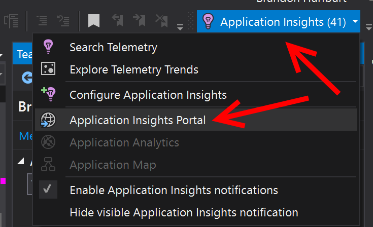
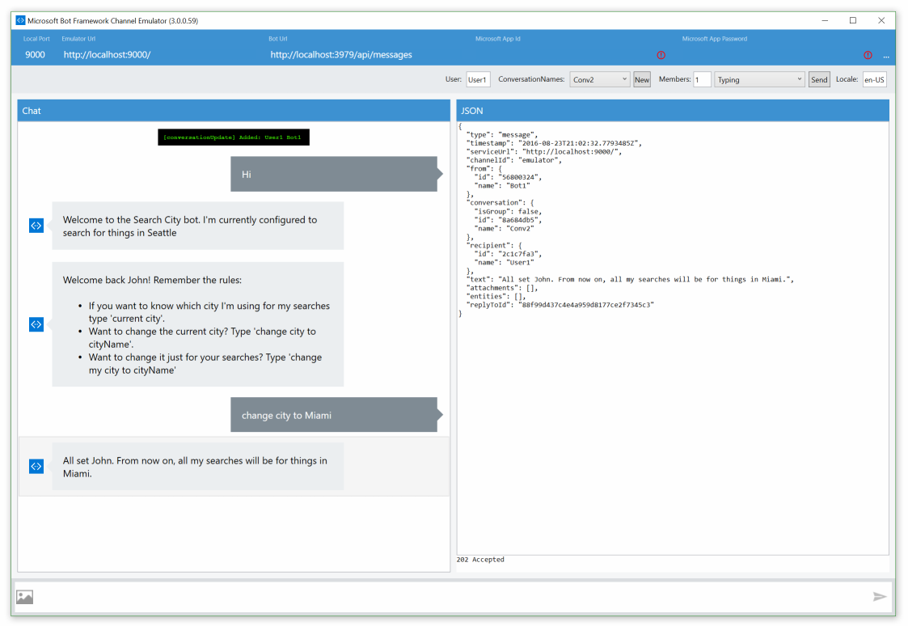
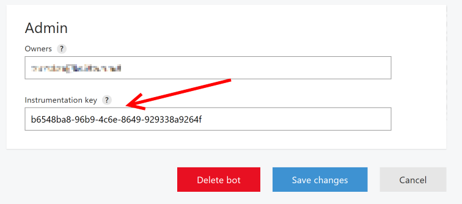

# Application Insights integration Bot Sample
A sample bot which logs telemetry to an Application Insights instance.

[![Deploy to Azure][Deploy Button]][Deploy CSharp/AppInsights]

[Deploy Button]: https://azuredeploy.net/deploybutton.png
[Deploy CSharp/AppInsights]: https://azuredeploy.net

### Prerequisites

The minimum prerequisites to run this sample are:
* The latest update of Visual Studio 2015. You can download the community version [here](http://www.visualstudio.com) for free.
* The Bot Framework Emulator. To install the Bot Framework Emulator, download it from [here](https://emulator.botframework.com/). Please refer to [this documentation article](https://github.com/microsoft/botframework-emulator/wiki/Getting-Started) to know more about the Bot Framework Emulator.
* An Application Insights instance in Azure. The Instrumentation Key for which must be put in [ApplicationInsights.config](ApplicationInsights.config#L87)

### Code Highlights

This bot is based off the StateDialog bot, but adds in the ability to log custom telemetry events to an Application Insights instance in Azure.

The notable changes to the StateDialog bot which enable telemetry logging are threefold:

1. Addition of a `TelemetryClient` object in the Application Global namespace:

   ````C#
    public class WebApiApplication : System.Web.HttpApplication
    {
        public static Microsoft.ApplicationInsights.TelemetryClient Telemetry { get; } = new Microsoft.ApplicationInsights.TelemetryClient();
    ...
   ````
2. [Extension methods](TelemetryExtensions.cs) to enable creation of Telemetry objects that will be pre-populated with conversation and user data to enable quick filter/pivoting in the Application Insights dashboard.
3. Usage of these methods throughout the bot's code (eg: here, here, and here)

### Outcome

After configuring, running the bot (locally or in a deployed instance), and having a conversation with it [see the State bot sample for details on the conversation flow](../core-State) you will begin to see events hitting the Application Insights instance you configured within seconds. You can easily filter these events by turning **off** showing Dependency Events so that you're only looking at Custom telemetry (Events, Exceptions, Trace)

When you run the sample in Visual Studio, you'll see a button appear in your toolbar. Next to it will be the count of Telemetry Items that have been sent to your Application Insights instance by the current execution of the bot. From this button you can quickly & easily get to the Application Insights instance, as well.



Clicking the button directly will open up a new pane in Visual Studio from which you can view, filter, and search your telemetry items. For viewing your custom-logged items we recommend unchecking `Dependency` and `Request` telemetry. However, note that these are useful in watching what, when, and how the bot framework's endpoints are used by your bot web application.



Clicking on any item in the table will open up another pane allowing you to view and filter the various properties of that telemetry event.


For more information logged directly from the Bot Connector, be sure to put your instrumentation key in to your bot's listing in the Bot Directory.

