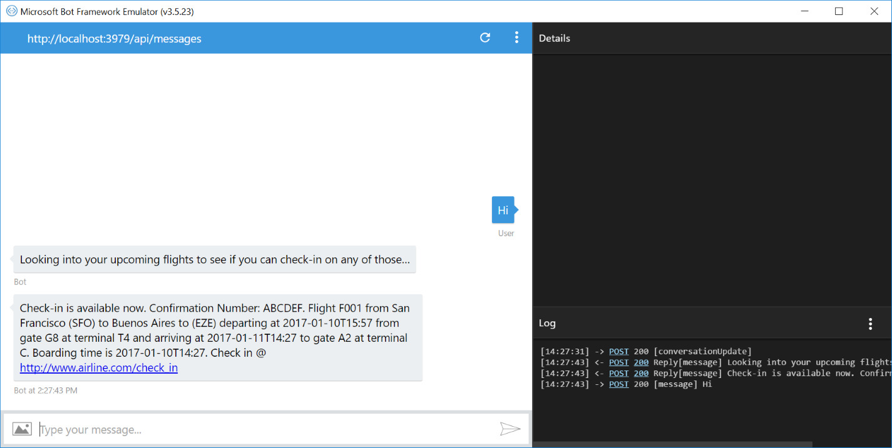

# ChannelData Bot Sample

A sample bot sending native metadata to Facebook using ChannelData.

[![Deploy to Azure][Deploy Button]][Deploy CSharp/ChannelData]

[Deploy Button]: https://azuredeploy.net/deploybutton.png
[Deploy CSharp/ChannelData]: https://azuredeploy.net

### Prerequisites

The minimum prerequisites to run this sample are:
* The latest update of Visual Studio 2015. You can download the community version [here](http://www.visualstudio.com) for free.
* The Bot Framework Emulator. To install the Bot Framework Emulator, download it from [here](https://emulator.botframework.com/). Please refer to [this documentation article](https://github.com/microsoft/botframework-emulator/wiki/Getting-Started) to know more about the Bot Framework Emulator.
*  To fully test this sample you must:
    *  Register you bot in [Microsoft Bot Framework Portal](https://dev.botframework.com/bots). Please refer to [this](https://docs.microsoft.com/en-us/bot-framework/portal-register-bot) for the instructions. Once you complete the registration, update the [Bot's Web.config](Web.config#L9-L11) file with the registered config values (Bot Id, MicrosoftAppId and MicrosoftAppPassword). 
    *  Enable the Facebook Messenger Channel. Refer to [this](https://docs.microsoft.com/en-us/bot-framework/thirdparty-channels/channel-facebook) for more information on how to configure channels.
    *  [Publish your bot, for example to Azure](https://docs.microsoft.com/en-us/bot-framework/publish-bot-overview) or use [Ngrok to interact with your local bot in the cloud](https://blogs.msdn.microsoft.com/jamiedalton/2016/07/29/ms-bot-framework-ngrok/).

### Code Highlights

If you want to be able to take advantage of special features or concepts for a channel we provide a way for you to send native metadata to that channel giving you much deeper control over how your bot interacts on a channel. The way you do this is to pass extra properties via the ChannelData property.

>NOTE: You do not need to use this feature unless you feel the need to access functionality not provided by the normal Activity.

The Facebook adapter supports sending full attachments via the ChannelData field. This allows you to do anything natively that Facebook supports via the attachment schema, such as Send a check-in reminder message.
Check out the [ChannelDataDialog](ChannelDataDialog.cs#L43-L82) class where a new [`FacebookAttachment`](Models/FacebookAttachment.cs) instance is send to the Facebook API using the ChannelData property.

````C#
private static FacebookAttachment GetFlightAttachment()
{
    return new FacebookAttachment()
    {
        Payload = new AirlineCheckIn()
        {
            IntroMessage = "Check-in is available now",
            Locale = "en_US",
            PnrNumber = "ABCDEF",
            CheckInUrl = "http://www.airline.com/check_in",
            FlightInfo = new[]
            {
                new FlightInfo()
                {
                    FlightNumber = "F001",
                    DepartureAirport = new Airport()
                    {
                        AirportCode = "SFO",
                        City = "San Francisco",
                        Terminal = "T4",
                        Gate = "G8"
                    },
                    ArrivalAirport = new Airport()
                    {
                        AirportCode = "EZE",
                        City = "Buenos Aires",
                        Terminal = "C",
                        Gate = "A2"
                    },
                    FlightSchedule = new FlightSchedule()
                    {
                        BoardingTime = DateTime.Now.AddDays(1).ToString("yyyy-MM-ddTH:mm"),
                        DepartureTime = DateTime.Now.AddDays(1).AddHours(1.5).ToString("yyy-MM-ddTH:mm"),
                        ArrivalTime = DateTime.Now.AddDays(2).ToString("yyyy-MM-ddTH:mm")
                    }
                }
            }
        }
    };
}
````

Because the `ChannelData` is a `dynamic` property, it will hold any custom model class. In this sample, all [Models](Models) classes were built to match the "attachment" JSON Schema described in the [Facebook's Send API Reference](https://developers.facebook.com/docs/messenger-platform/send-api-reference).
Check out the [ChannelDataDialog](ChannelDataDialog.cs#L33-L36) class using the ChannelData property to send the Airline Checkin Reminder. Additionally, the sample includes very little logic to render the attachment appropriately for different channels.

````C#
if (message.ChannelId != "facebook")
{
    reply.Text = flightAttachment.ToString();
}
else
{
    reply.ChannelData = new FacebookChannelData()
    {
        Attachment = flightAttachment
    };
}
````

### Outcome

You will see the following in the Bot Framework Emulator when opening and running the sample solution.



On the other hand, you will see the following in your Facebook Messenger.


### More Information

To get more information about how to get started in Bot Builder for .NET and ChannelData please review the following resources:

* [Implement channel-specific functionality](https://docs.microsoft.com/en-us/bot-framework/dotnet/bot-builder-dotnet-channeldata)
* [Create a Facebook notification](https://docs.microsoft.com/en-us/bot-framework/dotnet/bot-builder-dotnet-channeldata#create-a-facebook-notification)
* [Facebook Messenger - Send API Reference](https://developers.facebook.com/docs/messenger-platform/send-api-reference/airline-checkin-template)
