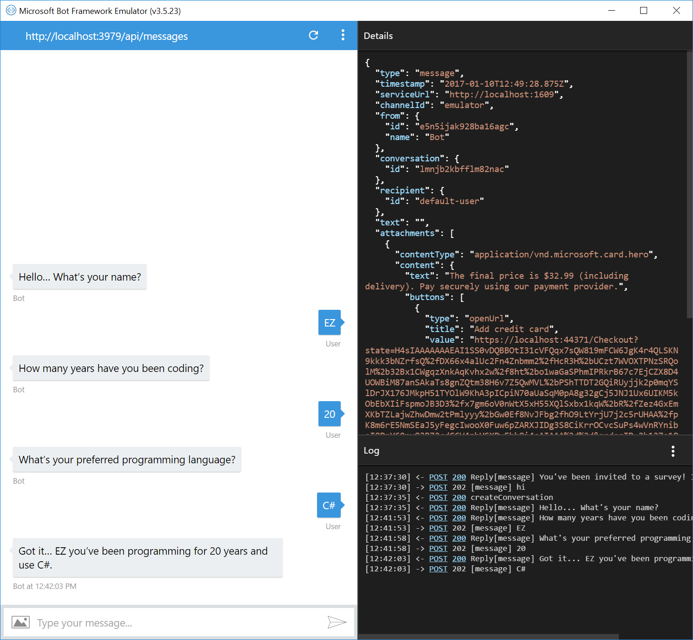

# Create New Conversation Bot Sample

A sample bot that starts a new conversation using a previously stored user address.

[![Deploy to Azure][Deploy Button]][Deploy CSharp/CreateNewConversation]

[Deploy Button]: https://azuredeploy.net/deploybutton.png
[Deploy CSharp/CreateNewConversation]: https://azuredeploy.net

### Prerequisites

The minimum prerequisites to run this sample are:
* The latest update of Visual Studio 2015. You can download the community version [here](http://www.visualstudio.com) for free.
* The Bot Framework Emulator. To install the Bot Framework Emulator, download it from [here](https://emulator.botframework.com/). Please refer to [this documentation article](https://github.com/microsoft/botframework-emulator/wiki/Getting-Started) to know more about the Bot Framework Emulator.

### Code Highlights

Bot Builder uses dialogs to model a conversational process, the exchange of messages, between bot and user. Conversations are usually initiated by the user but sometimes it might be useful for the bot to proactively start a new dialog to interact with the user.
In this sample starting a new dialog is a two steps process: First, creating the new conversation, and then, passing the control to the new dialog.

The `ConversationReference` contains information that can be used to resume a conversation with a user. In this case, we'll use the conversation reference to craft a new direct message to the user within a new  conversation.


Check out the use of the `ConnectorClient.CreateDirectConversationAsync()` method in the [SurveyTriggerer.cs](SurveyTriggerer.cs#L14-L69) class to create a new Bot-to-User conversation and how the `conversationReference.GetPostToBotMessage()` is used to find the proper dependencies to execute `stack.Call()` and initiate a new `SurveyDialog`.

````C#
public static async Task StartSurvey(ConversationReference conversationReference, CancellationToken token)
{
    var container = WebApiApplication.FindContainer();

    // the ConversationReference has the "key" necessary to resume the conversation
    var message = conversationReference.GetPostToBotMessage();

    ConnectorClient client = new ConnectorClient(new Uri(message.ServiceUrl));

    try
    {
        var conversation = await client.Conversations.CreateDirectConversationAsync(message.Recipient, message.From);
        message.Conversation.Id = conversation.Id;
    }
    catch (HttpOperationException ex)
    {
        var reply = message.CreateReply();
        reply.Text = ex.Message;

        await client.Conversations.SendToConversationAsync(reply);

        return;
    }

    // we instantiate our dependencies based on an IMessageActivity implementation
    using (var scope = DialogModule.BeginLifetimeScope(container, message))
    {
        // find the bot data interface and load up the conversation dialog state
        var botData = scope.Resolve<IBotData>();
        await botData.LoadAsync(token);

        // resolve the dialog stack
        IDialogStack stack = stack = scope.Resolve<IDialogStack>();

        // make a dialog to push on the top of the stack
        var child = scope.Resolve<SurveyDialog>();

        // wrap it with an additional dialog that will restart the wait for
        // messages from the user once the child dialog has finished
        var interruption = child.Void<object, IMessageActivity>();

        try
        {
            // put the interrupting dialog on the stack
            stack.Call(interruption, null);

            // start running the interrupting dialog
            await stack.PollAsync(token);
        }
        finally
        {
            // save out the conversation dialog state
            await botData.FlushAsync(token);
        }
    }
}
````

Additionally, the sample includes some "plumbing" components mainly intended to make the `ConversationReference` dependency available to initiate the survey dialog.
For instance, check out the [SurveyService.cs](SurveyService.cs#L20-L23) which stores the `ConversationReference` in the [SurveyScheduler.cs](SurveyScheduler.cs).

````C#
public async Task QueueSurveyAsync()
{
    this.surveyScheduler.Add(this.conversationReference);
}
````

### Outcome

You will see the following when connecting the Bot to the Emulator and send it a message.



On the other hand, you will see the following in Skype.


### More Information

To get more information about how to get started in Bot Builder for .NET and Conversations please review the following resources:
* [Bot Builder for .NET](https://docs.microsoft.com/en-us/bot-framework/dotnet/)
* [Send proactive messages](https://docs.microsoft.com/en-us/bot-framework/dotnet/bot-builder-dotnet-proactive-messages)
* [ConversationReference class](https://docs.botframework.com/en-us/csharp/builder/sdkreference/d2/d10/class_microsoft_1_1_bot_1_1_connector_1_1_conversation_reference.html)

> **Limitations**  
> The functionality provided by the Bot Framework Activity can be used across many channels. Moreover, some special channel features can be unleashed using the [ChannelData property](https://docs.microsoft.com/en-us/bot-framework/dotnet/bot-builder-dotnet-channeldata).
> 
> The Bot Framework does its best to support the reuse of your Bot in as many channels as you want. However, due to the very nature of some of these channels, some features are not fully portable.
> 
> The features used in this sample are fully supported in the following channels:
> - Skype
> - SMS
> - Slack
> - Email
> 
> They are also supported, with some limitations, in the following channel:
> - Telegram
> 
> On the other hand, they are not supported and the sample won't work as expected in the following channels:
> - Facebook
> - Microsoft Teams
> - DirectLine
> - WebChat
> - Kik
> - GroupMe
