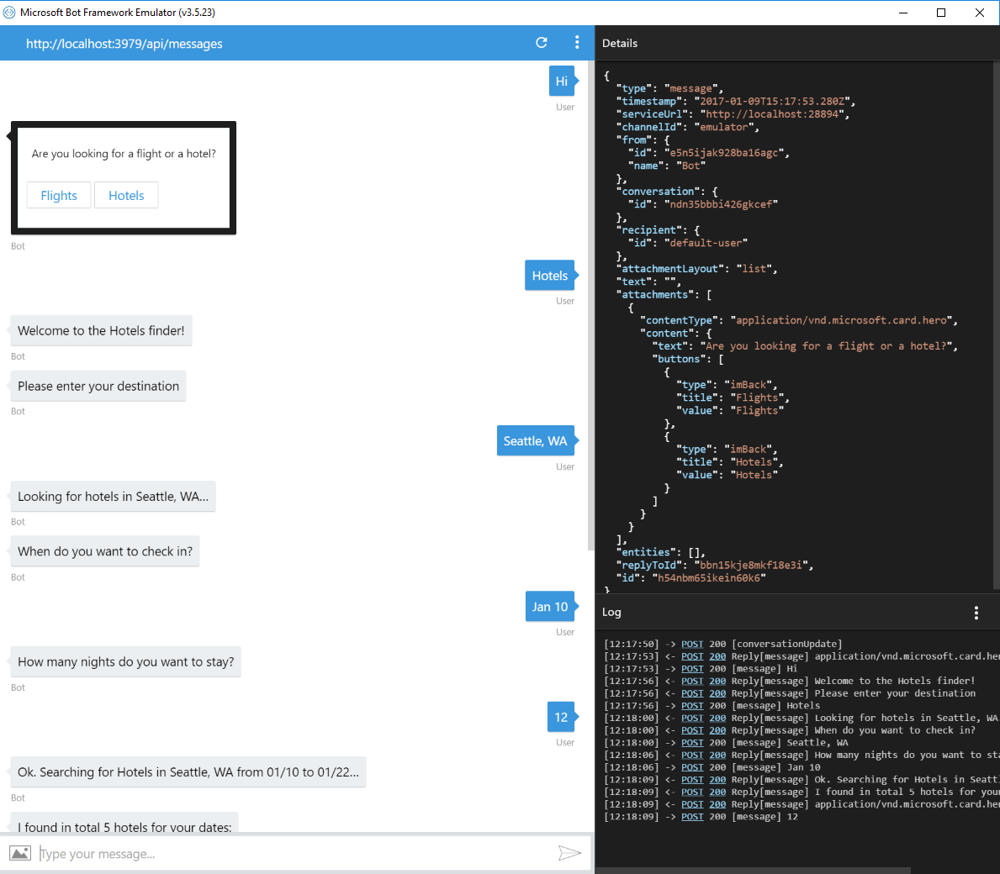

# Multi-Dialog Bot Sample

A sample bot showing different kind of dialogs.

[![Deploy to Azure][Deploy Button]][Deploy CSharp/MultiDialogs]

[Deploy Button]: https://azuredeploy.net/deploybutton.png
[Deploy CSharp/MultiDialogs]: https://azuredeploy.net

### Prerequisites

The minimum prerequisites to run this sample are:
* The latest update of Visual Studio 2015. You can download the community version [here](http://www.visualstudio.com) for free.
* The Bot Framework Emulator. To install the Bot Framework Emulator, download it from [here](https://emulator.botframework.com/). Please refer to [this documentation article](https://github.com/microsoft/botframework-emulator/wiki/Getting-Started) to know more about the Bot Framework Emulator.

### Code Highlights

Dialogs model a conversational process, where the exchange of messages between bot and user is the primary channel for interaction with the outside world.
Dialogs can be composed with other dialogs to maximize reuse, and a dialog context maintains a stack of dialogs active in the conversation.

The [`RootDialog`](Dialogs/RootDialog.cs) class, which represents our conversation, is wired into the `MessageController.Post()` method. Check out the [MessagesController](Controllers/MessagesController.cs#L22) class passing a delegate to the `Conversation.SendAsync()` method that will be used to construct a `RootDialog` and execute the dialog's `StartAsync()` method.


````C#
public async Task<HttpResponseMessage> Post([FromBody]Activity activity)
{
    if (activity.Type == ActivityTypes.Message)
    {
        await Conversation.SendAsync(activity, () => new RootDialog());
    }
    else
    {
        this.HandleSystemMessage(activity);
    }

    var response = Request.CreateResponse(HttpStatusCode.OK);
    return response;
}
````

The `IDialogContext.Forward()` method can be used to call a child dialog, add it to the top of the stack and post the item to the child dialog. In the [RootDialog](Dialogs/RootDialog.cs#L28) class, `context.Forward()` is used to make the [`SupportDialog`](Dialogs/SupportDialog.cs) handle any message including specific keywords.


````C#
public virtual async Task MessageReceivedAsync(IDialogContext context, IAwaitable<IMessageActivity> result)
{
    var message = await result;

    if (message.Text.ToLower().Contains("help") || message.Text.ToLower().Contains("support") || message.Text.ToLower().Contains("problem"))
    {
        await context.Forward(new SupportDialog(), this.ResumeAfterSupportDialog, message, CancellationToken.None);
    }
    else
    {
        this.ShowOptions(context);
    }
}
````

The `IDialogContext.Call()` method can be used to Call a child dialog and add it to the top of the stack transferring control to the new dialog.
Check out the [RootDialog](Dialogs/RootDialog.cs#L47-L56) class, `ShowOptions()` method usage of `context.Call()` to give control of the conversation to a new dialog depending on the selected option.

````C#
switch (optionSelected)
{
    case FlightsOption:
        context.Call(new FlightsDialog(), this.ResumeAfterOptionDialog);
        break;

    case HotelsOption:
        context.Call(new HotelsDialog(), this.ResumeAfterOptionDialog);
        break;
}
````

Once the child dialog finishes, the `IDialogContext.Done()` should be called to complete the current dialog and return a result to the parent dialog. The sample below shows how the [`SupportDialog`](Dialogs/SupportDialog.cs#L24) uses `context.Done()` to return the ticket number to the parent dialog.

````C#
public virtual async Task MessageReceivedAsync(IDialogContext context, IAwaitable<IMessageActivity> result)
{
    var message = await result;

    var ticketNumber = new Random().Next(0, 20000);

    await context.PostAsync($"Your message '{message.Text}' was registered. Once we resolve it; we will get back to you.");

    context.Done(ticketNumber);
}
````

#### Handling Exceptions
The `IDialogContext.Fail()` method can be used to fail the current dialog and return an exception to the parent dialog. Check out the [FlightsDialog](Dialogs/FlightsDialog.cs#L11-L14) class throwing a `NotImplementedException` with a message in the `StartAsync` method.

````C#
public async Task StartAsync(IDialogContext context)
{
    context.Fail(new NotImplementedException("Flights Dialog is not implemented and is instead being used to show context.Fail"));
}
````

Dialog exceptions can be handled in the `ResumeAfter<T>` delegate passed to the `Call` or `Forward` method. Check out how to handle dialog exceptions in the `ResumeAfterOptionDialog` method of the [RootDialog](Dialogs/RootDialog.cs#L76-L83) by awaiting the result argument within a `try/catch` block.

````C#
private async Task ResumeAfterOptionDialog(IDialogContext context, IAwaitable<object> result)
{
    try
    {
        var message = await result;
    }
    catch (Exception ex)
    {
        await context.PostAsync($"Failed with message: {ex.Message}");
    }
    finally
    {
        context.Wait(this.MessageReceivedAsync);
    }
}
````

#### FormFlow
In order to simplify building guided conversations the Bot framework provides a powerful dialog building block known as FormFlow. FormFlow sacrifices some of the flexibility provided by dialogs, but in a way that requires much less effort. A FormFlow dialog guides the user through filling in the form while providing help and guidance along the way.
Check out the [HotelsDialog](Dialogs/HotelsDialog.cs#L19) class usage of `FormDialog.FromForm()` and `FormBuilder<T>` to automatically generate a FormDialog from a C# class.

````C#
public async Task StartAsync(IDialogContext context)
{
    await context.PostAsync("Welcome to the Hotels finder!");

    var hotelsFormDialog = FormDialog.FromForm(this.BuildHotelsForm, FormOptions.PromptInStart);

    context.Call(hotelsFormDialog, this.ResumeAfterHotelsFormDialog);
}

private IForm<HotelsQuery> BuildHotelsForm()
{
    OnCompletionAsyncDelegate<HotelsQuery> processHotelsSearch = async (context, state) =>
    {
        await context.PostAsync($"Ok. Searching for Hotels in {state.Destination} from {state.CheckIn.ToString("MM/dd")} to {state.CheckIn.AddDays(state.Nights).ToString("MM/dd")}...");
    };

    return new FormBuilder<HotelsQuery>()
        .Field(nameof(HotelsQuery.Destination))
        .Message("Looking for hotels in {Destination}...")
        .AddRemainingFields()
        .OnCompletion(processHotelsSearch)
        .Build();
}
````

#### Prompts
Finally, the Bot framework comes with a number of built-in prompts encapsulated in the `PromptDialog` class that can be used to collect input from a user. In the sample, the `PromptDialog.Choice()` method asks the user to pick an option from a list.

````C#
private void ShowOptions(IDialogContext context)
{
    PromptDialog.Choice(context, this.OnOptionSelected, new List<string>() { FlightsOption, HotelsOption }, "Are you looking for a flight or a hotel?", "Not a valid option", 3);
}
````


### Outcome

You will see the following result in the Bot Framework Emulator when opening and running the sample solution.



You will see the following in your Facebook Messenger.


On the other hand, you will see the following in Skype.


### More Information

To get more information about how to get started in Bot Builder for .NET and Conversations please review the following resources:
* [Bot Builder for .NET](https://docs.microsoft.com/en-us/bot-framework/dotnet/)
* [Dialogs](https://docs.microsoft.com/en-us/bot-framework/dotnet/bot-builder-dotnet-dialogs)
* [IDialogContext Interface](https://docs.botframework.com/en-us/csharp/builder/sdkreference/d1/dc6/interface_microsoft_1_1_bot_1_1_builder_1_1_dialogs_1_1_i_dialog_context.html)
* [Guide conversations with FormFlow](https://docs.microsoft.com/en-us/bot-framework/dotnet/bot-builder-dotnet-formflow)
* [PromptDialog](https://docs.botframework.com/en-us/csharp/builder/sdkreference/d9/d03/class_microsoft_1_1_bot_1_1_builder_1_1_dialogs_1_1_prompt_dialog.html)

> **Limitations**  
> The functionality provided by the Bot Framework Activity can be used across many channels. Moreover, some special channel features can be unleashed using the [ChannelData property](https://docs.microsoft.com/en-us/bot-framework/dotnet/bot-builder-dotnet-channeldata).
> 
> The Bot Framework does its best to support the reuse of your Bot in as many channels as you want. However, due to the very nature of some of these channels, some features are not fully portable.
> 
> The features used in this sample are fully supported in the following channels:
> - Skype
> - Facebook
> - Microsoft Teams
> - Slack
> - DirectLine
> - WebChat
> - Kik
> - Email
> - GroupMe
> 
> They are also supported, with some limitations, in the following channels:
> - Telegram
> - SMS
