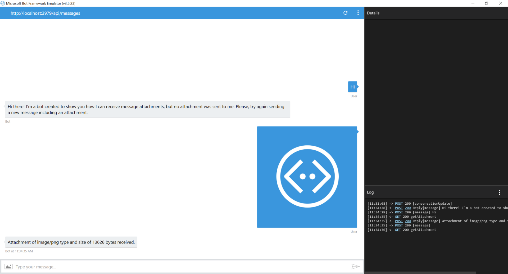

# Receive Attachment Bot Sample

A sample bot that receives attachments sent by the user and downloads them.

[![Deploy to Azure][Deploy Button]][Deploy CSharp/ReceiveAttachment]
[Deploy Button]: https://azuredeploy.net/deploybutton.png
[Deploy CSharp/ReceiveAttachment]: https://azuredeploy.net

### Prerequisites

The minimum prerequisites to run this sample are:
* The latest update of Visual Studio 2015. You can download the community version [here](http://www.visualstudio.com) for free.
* The Bot Framework Emulator. To install the Bot Framework Emulator, download it from [here](https://emulator.botframework.com/). Please refer to [this documentation article](https://github.com/microsoft/botframework-emulator/wiki/Getting-Started) to know more about the Bot Framework Emulator.

### Code Highlights

Many messaging channels provide the ability to attach richer objects. Once you send a simple media attachment (image/audio/video/file) to the messaging channel, it will mapped to an attachment data structure in the Attachments property of the activity. The Attachments property is an array of Attachment objects which allow you to send and receive images and other content. Check out the key code located in the [ReceiveAttachmentDialog](ReceiveAttachmentDialog.cs#L24-L43) class where the `message.Attachments` property of the message activity is read to get the first attachment and download it.

> Note: The Skype and Microsoft Teams attachment URLs are secured by JwtToken; you should set the JwtToken of your bot as the authorization header for the HTTP GET request your bot initiates to fetch content. Below is the sample code that temporarily works around this issue and set the JwtToken on the HTTP request. You should be careful when you send the bot's JwtToken to a third party server and should always make sure to send it to trusted parties.

````C#
public virtual async Task MessageReceivedAsync(IDialogContext context, IAwaitable<IMessageActivity> argument)
{
    var message = await argument;

    if (message.Attachments != null && message.Attachments.Any())
    {
        var attachment = message.Attachments.First();
        using (HttpClient httpClient = new HttpClient())
        {
            // Skype & MS Teams attachment URLs are secured by a JwtToken, so we need to pass the token from our bot.
            if ((message.ChannelId.Equals("skype", StringComparison.InvariantCultureIgnoreCase) || message.ChannelId.Equals("msteams", StringComparison.InvariantCultureIgnoreCase)) 
                && new Uri(attachment.ContentUrl).Host.EndsWith("skype.com"))
            {
                var token = await new MicrosoftAppCredentials().GetTokenAsync();
                httpClient.DefaultRequestHeaders.Authorization = new AuthenticationHeaderValue("Bearer", token);
            }

            var responseMessage = await httpClient.GetAsync(attachment.ContentUrl);

            var contentLenghtBytes = responseMessage.Content.Headers.ContentLength;

            await context.PostAsync($"Attachment of {attachment.ContentType} type and size of {contentLenghtBytes} bytes received.");
        }
    }
    else
    {
        await context.PostAsync("Hi there! I'm a bot created to show you how I can receive message attachments, but no attachment was sent to me. Please, try again sending a new message including an attachment.");
    }

    context.Wait(this.MessageReceivedAsync);
}
````

### Outcome

You will see the following in the Bot Framework Emulator when opening and running the sample solution.



### More Information

To get more information about how to get started in Bot Builder for .NET and Attachments please review the following resources:
* [Bot Builder for .NET](https://docs.botframework.com/en-us/csharp/builder/sdkreference/index.html)
* [Attachments Property](https://docs.botframework.com/en-us/csharp/builder/sdkreference/activities.html#attachmentsproperty)
* [Attachments, Cards and Actions](https://docs.botframework.com/en-us/csharp/builder/sdkreference/attachments.html)
