# Contoso Flowers Sample Bot

Your company started looking for a new platform to create new chat bots and port existing bots and is searching which better suits their needs. One of the requirements is that you'll need to support different platforms (Facebook, Slack, Skype and Webchat).
Several chat bots already exists in these platforms using different tools and learned that different platforms support different native features. Moreover, there's a running implementation of the bot in the native platform (e.g. a Facebook bot) which makes you want to make sure using native features is supported.

You came across the Microsoft Bot Framework which support a great variety of channels (platforms), programming languages (C# and Node) and supports both state-of-the-art standard bot features and mechanisms to also take advantage of native features (via ChannelData).

[![Deploy to Azure][Deploy Button]][Deploy CSharp/ContosoFlowers]

[Deploy Button]: https://azuredeploy.net/deploybutton.png
[Deploy CSharp/ContosoFlowers]: https://azuredeploy.net

### Prerequisites

The minimum prerequisites to run this sample are:
* The latest update of Visual Studio 2015. You can download the community version [here](http://www.visualstudio.com) for free.
* The Bot Framework Emulator. To install the Bot Framework Emulator, download it from [here](https://emulator.botframework.com/). Please refer to [this documentation article](https://github.com/microsoft/botframework-emulator/wiki/Getting-Started) to know more about the Bot Framework Emulator.

#### Rich cards
Many messaging channels provide the ability to attach richer objects. The Bot Framework has the ability to render rich cards as attachments.

The bot will render a Welcome message upon the first message using a [HeroCard](https://docs.microsoft.com/en-us/bot-framework/dotnet/bot-builder-dotnet-add-rich-card-attachments#add-a-hero-card) attachment within the [`RootDialog.WelcomeMessageAsync` method](ContosoFlowers/Dialogs/RootDialog.cs#L54-L72).
The sample also includes the [`HeroCardExtensions`](ContosoFlowers.BotAssets/Extensions/HeroCardExtensions.cs) class providing methods to ease the creation of rich cards.

````C#
private async Task WelcomeMessageAsync(IDialogContext context)
{
    var reply = context.MakeMessage();

    var options = new[]
    {
        Resources.RootDialog_Welcome_Orders,
        Resources.RootDialog_Welcome_Support
    };
    reply.AddHeroCard(
        Resources.RootDialog_Welcome_Title,
        Resources.RootDialog_Welcome_Subtitle,
        options,
        new[] { "https://placeholdit.imgix.net/~text?txtsize=56&txt=Contoso%20Flowers&w=640&h=330" });

    await context.PostAsync(reply);

    context.Wait(this.OnOptionSelected);
}
````
| Emulator | Facebook | Skype |
|----------|-------|----------|
|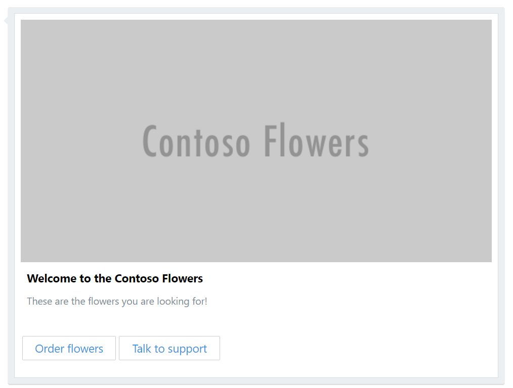|||

Another example of rich card, is the [ReceiptCard](https://docs.microsoft.com/en-us/bot-framework/dotnet/bot-builder-dotnet-add-rich-card-attachments#add-a-receipt-card-to-a-message) which renders differently depending on the messaging channel being supported.
The receipt card is created in the [`RootDialog.GetReceiptCard` method](ContosoFlowers/Dialogs/RootDialog.cs#L345-L369) and is rendered once the bot's user checkouts an order.
 
````C#
private Attachment GetReceiptCard()
{
    var order = this.ordersService.RetrieveOrder(this.order.OrderID);
    var creditCardOffuscated = order.PaymentDetails.CreditCardNumber.Substring(0, 4) + "-****";
    var receiptCard = new ReceiptCard
    {
        Title = Resources.RootDialog_Receipt_Title,
        Facts = new List<Fact> {
            new Fact(Resources.RootDialog_Receipt_OrderID, order.OrderID),
            new Fact(Resources.RootDialog_Receipt_PaymentMethod, creditCardOffuscated)
        },
        Items = new List<ReceiptItem>
        {
            new ReceiptItem(
                title: order.FlowerCategoryName,
                subtitle: order.Bouquet.Name,
                price: order.Bouquet.Price.ToString("C"),
                image: new CardImage(order.Bouquet.ImageUrl)),
        },
        Total = order.Bouquet.Price.ToString("C")
    };

    return receiptCard.ToAttachment();
}
````

| Emulator | Facebook | Skype |
|----------|-------|----------|
|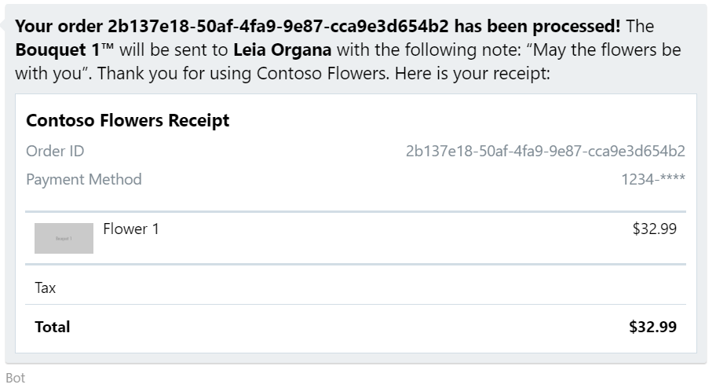|||

> You can also see a full sample explaining the different types of rich cards in the [Rich Cards Bot Sample](../cards-RichCards).

#### Carousel of Cards
You can send multiple rich card attachments in a single message. On most channels they will be sent as a list of rich cards, but some channels (like Skype and Facebook) can render them as a carousel of rich cards.

Listing categories and product accompanied with a descriptive image is an example of how a Carousel of Cards can be used. The [`FlowerCategoriesDialog`](ContosoFlowers/Dialogs/FlowerCategoriesDialog.cs) and the [`BouquetsDialog`](ContosoFlowers/Dialogs/BouquetsDialog.cs) inherits the reusable [`PagedCarouselDialog`](ContosoFlowers.BotAssets/Dialogs/PagedCarouselDialog.cs) class which showcase how a carousel of very rich cards can be created.
Specifically, the [`PagedCarouselDialog<T>.ShowProducts` method](ContosoFlowers.BotAssets/Dialogs/PagedCarouselDialog.cs#L67-L83) renders an attachments list using the `AttachmentLayoutTypes.Carousel` layout.

````C#
protected async Task ShowProducts(IDialogContext context)
{
    var reply = context.MakeMessage();
    reply.AttachmentLayout = AttachmentLayoutTypes.Carousel;
    reply.Attachments = new List<Attachment>();

    var productsResult = this.GetCarouselCards(this.pageNumber, this.pageSize);
    foreach (HeroCard productCard in productsResult.Cards)
    {
        reply.Attachments.Add(productCard.ToAttachment());
    }

    await context.PostAsync(reply);

    if (productsResult.TotalCount > this.pageNumber * this.pageSize)
    {
        await this.ShowMoreOptions(context);
    }
}
````

| Emulator | Facebook | Skype |
|----------|-------|----------|
|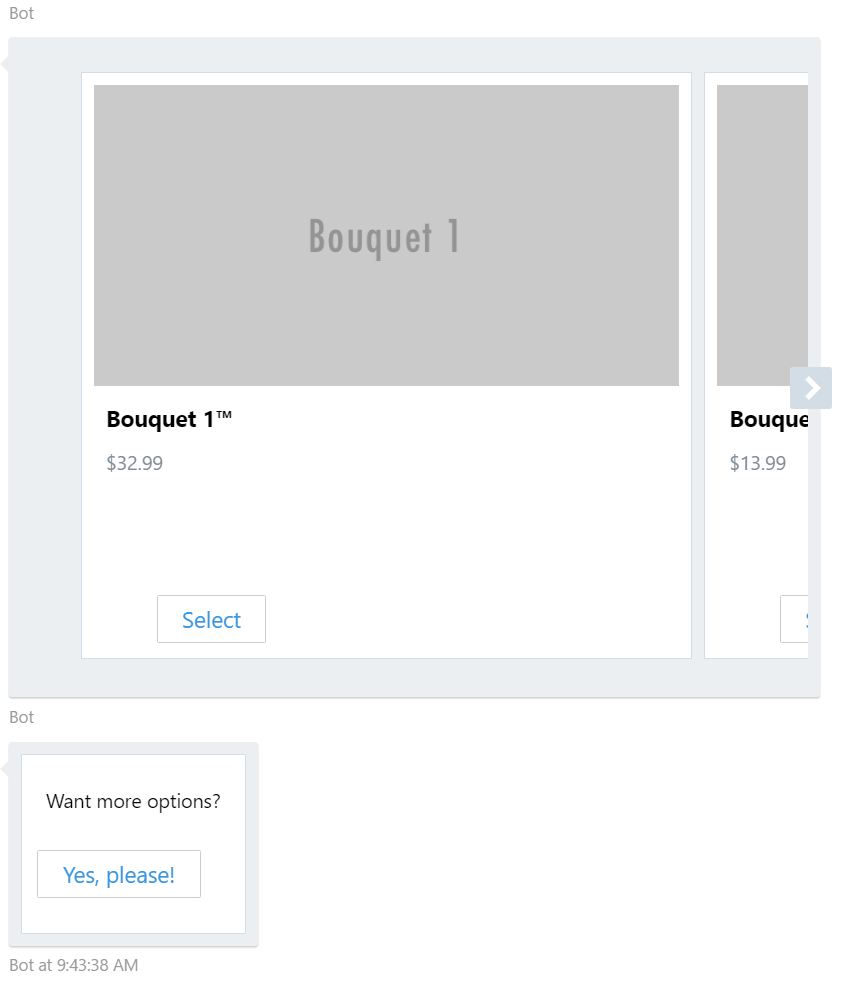|||

> You can also see a full sample bot sending multiple rich card attachments in a single message using the Carousel layout in the [Carousel of Cards Bot Sample](../cards-CarouselCards).

#### Multi-Dialogs Approach
Dialogs can be composed with other dialogs to maximize reuse, and a dialog context maintains a stack of dialogs active in the conversation.
In this sample, the main flow is implemented in the [`RootDialog` class](ContosoFlowers/Dialogs/RootDialog.cs) and it is composed of several other classes implementing [`IDialog`](https://docs.microsoft.com/en-us/bot-framework/dotnet/bot-builder-dotnet-dialogs).

> You can also see a full sample bot showing different kind of dialogs in the [Multi-Dialog Bot Sample](../core-MultiDialogs).

#### Creating Reusable Components
As seen in the two examples above, you can reuse your dialogs in different segments of the bot's flow, or even different bots, and extract them into a library. An example of this is the [ContosoFlowers.BotAssets project](ContosoFlowers.BotAssets) which includes several reusable dialogs and extension methods.

- Contoso Flowers' Dialogs
    - [PagedCarouselDialog](ContosoFlowers.BotAssets/Dialogs/PagedCarouselDialog.cs)
    - [PromptStringRegex](ContosoFlowers.BotAssets/Dialogs/PromptStringRegex.cs)
    - [SavedAddressDialog](ContosoFlowers.BotAssets/Dialogs/SavedAddressDialog.cs)
- Extensions
    - [HeroCardExtensions](ContosoFlowers.BotAssets/Extensions/HeroCardExtensions.cs)
    - [IBotDataBagExtensions](ContosoFlowers.BotAssets/Extensions/IBotDataBagExtensions.cs)

Additionally, the [Bing Location Control](https://github.com/Microsoft/BotBuilder-Location) is being used to resolve and validate the shipping and billing addresses, backed by Bing Maps REST services.
Take a look [here](ContosoFlowers/ContosoFlowersModule.cs#L46-L53) to see how to leverage DI to configure the control, and [here](ContosoFlowers/Dialogs/RootDialog.cs#L82-L91) to see how to use the DialogFactory to create an instance of the Control's Location Dialog.

| Emulator | Facebook | Skype |
|----------|-------|----------|
|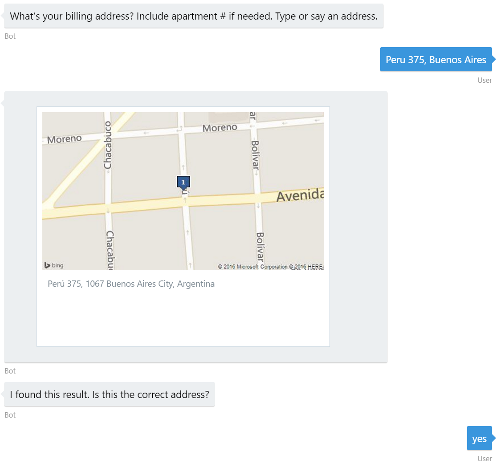|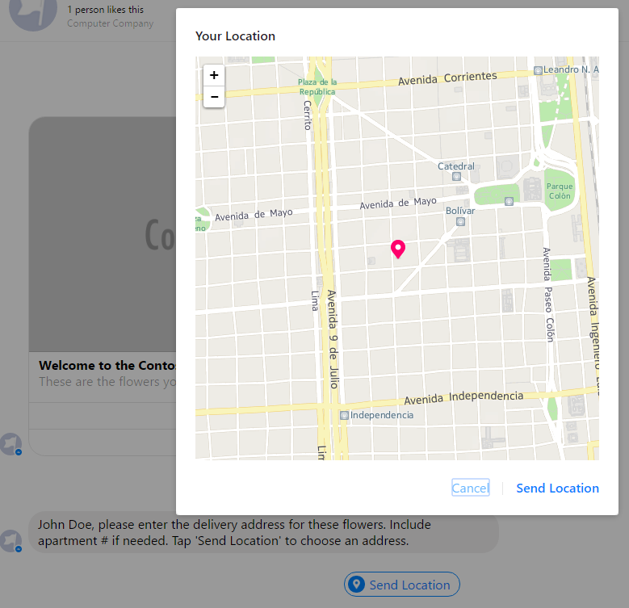|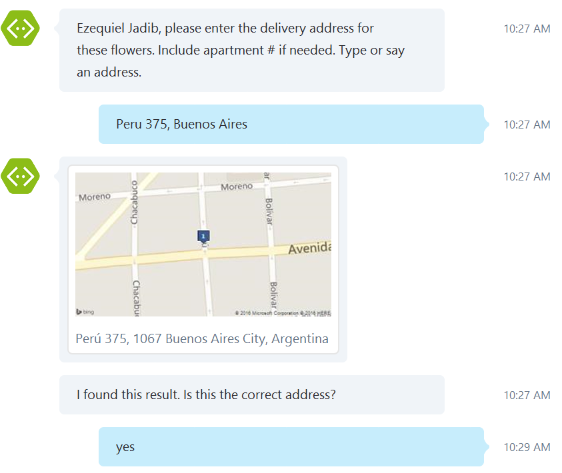|

#### Complex Forms
Handling a guided conversation like ordering a bouquet of flowers for your loved one can require a lot of effort. In order to simplify building guided conversations the Bot Framework provides a powerful dialog building block known as [FormFlow](https://docs.microsoft.com/en-us/bot-framework/dotnet/bot-builder-dotnet-formflow). A FormFlow dialog guides the user through filling in the form; a collection of fields that you want to fill in through a conversation with the user.

In this sample, the [`Order` class](ContosoFlowers/Models/Order.cs) serves as the model that holds the Form values entered by the user. You can see several `Prompt` and `Pattern` attributes decorating properties which helps customizing the FormFlow behavior.
Included in the class, there's a static [`BuildOrderForm` method](ContosoFlowers/Models/Order.cs#L68-L101) that uses a `FormBuilder` to build your form. Follow this approach for maximum flexibility which allow specifying each fields behavior as needed.

````C#
public static IForm<Order> BuildOrderForm()
{
    return new FormBuilder<Order>()
        .Field(nameof(RecipientFirstName))
        .Field(nameof(RecipientLastName))
        .Field(nameof(RecipientPhoneNumber))
        .Field(nameof(Note))
        .Field(new FieldReflector<Order>(nameof(UseSavedSenderInfo))
            .SetActive(state => state.AskToUseSavedSenderInfo)
            .SetNext((value, state) =>
            {
                var selection = (UseSaveInfoResponse)value;

                if (selection == UseSaveInfoResponse.Edit)
                {
                    state.SenderEmail = null;
                    state.SenderPhoneNumber = null;
                    return new NextStep(new[] { nameof(SenderEmail) });
                }
                else
                {
                    return new NextStep();
                }
            }))
        .Field(new FieldReflector<Order>(nameof(SenderEmail))
            .SetActive(state => !state.UseSavedSenderInfo.HasValue || state.UseSavedSenderInfo.Value == UseSaveInfoResponse.Edit)
            .SetNext(
                (value, state) => (state.UseSavedSenderInfo == UseSaveInfoResponse.Edit)
                ? new NextStep(new[] { nameof(SenderPhoneNumber) })
                : new NextStep()))
        .Field(nameof(SenderPhoneNumber), state => !state.UseSavedSenderInfo.HasValue || state.UseSavedSenderInfo.Value == UseSaveInfoResponse.Edit)
        .Field(nameof(SaveSenderInfo), state => !state.UseSavedSenderInfo.HasValue || state.UseSavedSenderInfo.Value == UseSaveInfoResponse.Edit)
        .Build();
}
````

Finally, is worth mention how this is all combined into an Order `FormDialog` called from the main [RootDialog](ContosoFlowers/Dialogs/RootDialog.cs#L142-L143).

````C#
var orderForm = new FormDialog<Models.Order>(this.order, Models.Order.BuildOrderForm, FormOptions.PromptInStart);
context.Call(orderForm, this.AfterOrderForm);
````

| Emulator | Facebook | Skype |
|----------|-------|----------|
|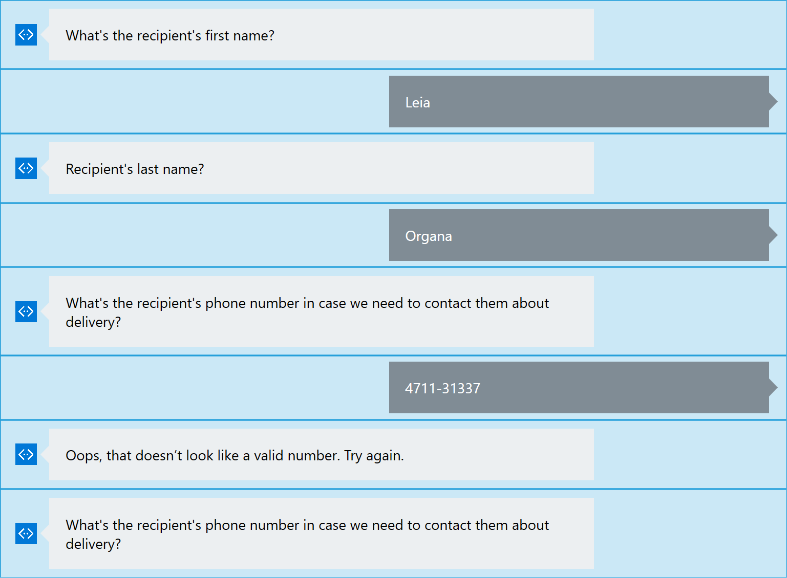|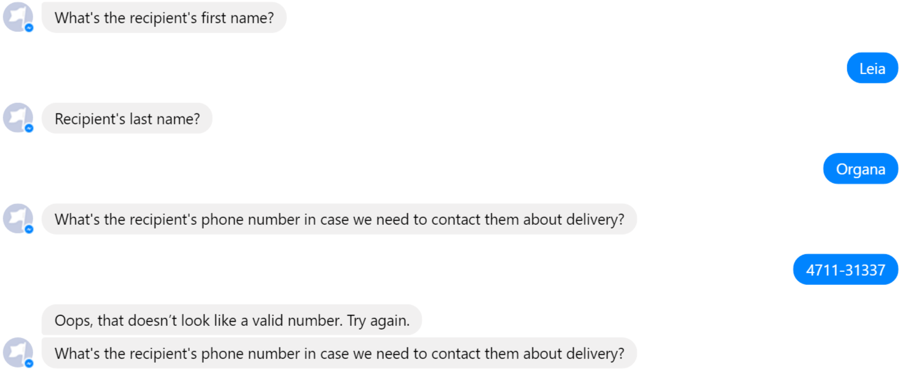|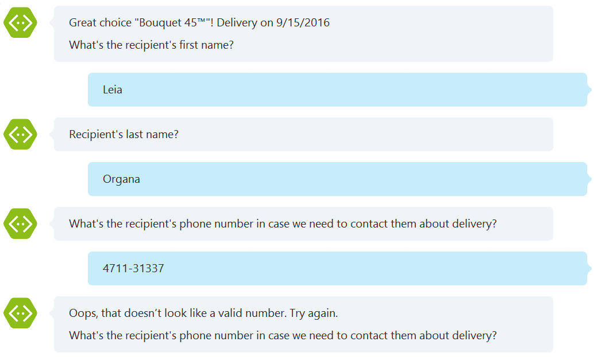|

#### Localization
Once you have a great bot working in a single language, you might want to enable it in other languages. The localization language is determined by the current thread's `CurrentUICulture` and `CurrentCulture`. By default the culture comes from the Language field of the current message, but you can change that if you wish.
However, you'll notice there's almost no literal strings in the code that reach the user and they were all moved to a [`Resources` file](ContosoFlowers/Properties/Resources.resx) This is a good practice since you'll probably want to adapt the messages without changing the conversation's flow. An example of this is the previously highlighted `WelcomeMessageAsync` method.

````C#
private async Task WelcomeMessageAsync(IDialogContext context)
{
    var reply = context.MakeMessage();

    var options = new[]
    {
        Resources.RootDialog_Welcome_Orders,
        Resources.RootDialog_Welcome_Support
    };
    reply.AddHeroCard(
        Resources.RootDialog_Welcome_Title,
        Resources.RootDialog_Welcome_Subtitle,
        options,
        new[] { "https://placeholdit.imgix.net/~text?txtsize=56&txt=Contoso%20Flowers&w=640&h=330" });

    await context.PostAsync(reply);

    context.Wait(this.OnOptionSelected);
}
````

On the other hand, the Bot Framework provides built-in localization for PromptDialog and FormFlow:

> The static strings in a form include strings that are generated from the information in your C# class and from the strings you supply as prompts, templates, messages or confirmations. It does not include strings generated from built-in templates since those are already localized. Since many strings are automatically generated, it is not easy to use normal C# resource strings directly.

This sample includes the [ContosoFlowers.Models.Order.resx](ContosoFlowers/Properties/ContosoFlowers.Models.Order.resx) FormFlow resource file for the `Orders` form. This file was generated with the supplied rview tool included in the NuGet package.


#### State
Bots built using Bot Framework are designed to be stateless so that they can easily be scaled to run across multiple compute nodes. 
The conversation state (i.e. the stack of active dialogs and each dialog's state) is stored in the [Bot State Service](https://docs.microsoft.com/en-us/bot-framework/dotnet/bot-builder-dotnet-state) provided by the Bot Connector service.

The `IDialogContext` has several properties which are useful for tracking state.

Property| Use cases
------------ | ------------- 
ConversationData | Remembering context data associated with a conversation.
PrivateConversationData | Remembering context data associated with a user in a conversation.
UserData | Remembering context data associated with a user (across all channels and conversations).

In this sample, the `UserData` property is used to store and retrieve several user settings. The best example is the [`SettingsDialog`](ContosoFlowers/Dialogs/SettingsDialog.cs) which main purpose is to manage this user data.

| Emulator | Facebook | Skype |
|----------|-------|----------|
|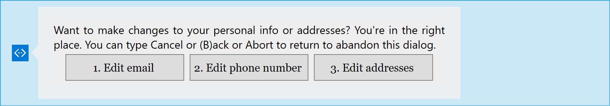|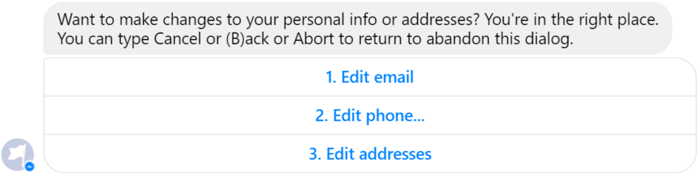||

> You can also see a full sample bot tracking context of a conversation in the [State API Bot Sample](../core-State).

#### Globally Available Commands
Additionally, you'll notice the `SettingsDialog` is globally available meaning that the user can type `settings` anytime and the settings dialog will be taken on top of the conversation's dialog stack.
The [`SettingsScorable`](ContosoFlowers/Dialogs/SettingsScorable.cs) makes this action globally available because a piece of middleware inspects every incoming message and gives all IScorable implementations the opportunity to intercept the message and manipulate the conversation stack, interrupting the normal dialog flow.

| Emulator | Facebook | Skype |
|----------|-------|----------|
|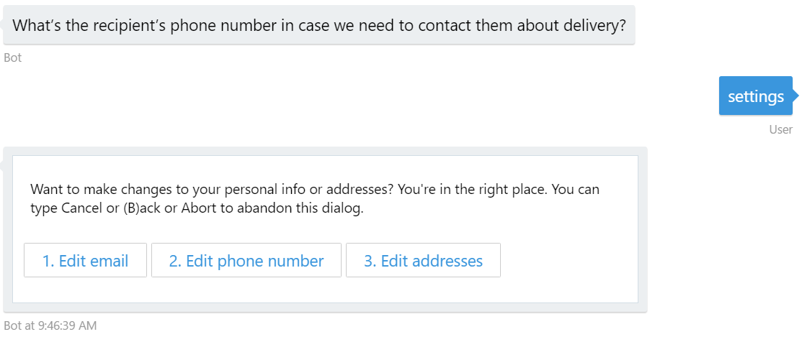|||

#### Dependency Injection
To ease unit testing of Dialogs and other components the Bot Framework leverages [Autofac](https://autofac.org/) for Dependency Injection. The top level composition root class `Conversation` provides the Autofac `IContainer Container`  property for registering a resolving components.
Additionally, as a good practice, you can create and register app-specific [Autofac Modules](http://docs.autofac.org/en/latest/configuration/modules.html). For instance, all dialogs and services as well as the `IScorable` implementation are registered in the [`ContosoFlowersModule`](ContosoFlowers/ContosoFlowersModule.cs) .

> Because all components are serialized to the per-user, per-conversation IBotDataBag all classes must be marked with the serializable attribute. The cleanest solution to reference non-serializable services is to resolve the dependency through Autofac and `FiberModule.Key_DoNotSerialize`.

````C#
builder.RegisterType<ContosoFlowersDialogFactory>()
    .Keyed<IContosoFlowersDialogFactory>(FiberModule.Key_DoNotSerialize)
    .AsImplementedInterfaces()
    .InstancePerLifetimeScope();

builder.RegisterType<RootDialog>()
    .As<IDialog<object>>()
    .InstancePerDependency();

builder.RegisterType<SettingsScorable>()
    .As<IScorable<double>>()
    .InstancePerLifetimeScope();
````

#### External Events - Resuming Conversations
The exchange of messages between bot and user through a channel (e.g. Facebook Messenger, Skype, Slack) is the primary means of interaction. However, in some scenario the bot is waiting for an event that occurs in an external component.
For example, the passing of time, an external authentication provider (e.g. OAuth scenarios) or an external payment service. In such cases, the `ResumptionCookie` has the information necessary to resume the conversation.

In this sample, the user proceed to checkout an order browsing a url provided by the bot. This url includes an encoded version of the ResumptionCookie (using the `ResumptionCookie.GZipSerialize` helper method) generated in the [`RootDialog.BuildCheckoutUrl` method](ContosoFlowers/Dialogs/RootDialog.cs#L272-L260).

````C#
private string BuildCheckoutUrl(string orderID)
{
    var encodedCookie = this.resumptionCookie.GZipSerialize();
    var uriBuilder = new UriBuilder(this.checkoutUriFormat);
    var query = HttpUtility.ParseQueryString(uriBuilder.Query);

    query["state"] = encodedCookie;
    query["orderID"] = orderID;

    uriBuilder.Query = query.ToString();
    var checkoutUrl = uriBuilder.Uri.ToString();
    return checkoutUrl;
}
````

Once the user browse the checkout page and process the payment, the `ResumptionCookie` included in the url is then decoded (using the `ResumptionCookie.GZipDeserialize` method) and used to resume the conversation with the bot. You can check the [`CheckOutController.Index` action](ContosoFlowers/Controllers/CheckOutController.cs#L43-L56) calling the `Conversation.ResumeAsync` method.

````C#
[Route("")]
[HttpPost]
public async Task<ActionResult> Index(string state, string orderId, PaymentDetails paymentDetails)
{
    this.ordersService.ConfirmOrder(orderId, paymentDetails);

    // Send Receipt
    var resumptionCookie = ResumptionCookie.GZipDeserialize(state);
    var message = resumptionCookie.GetMessage();
    message.Text = orderId;
    await Conversation.ResumeAsync(resumptionCookie, message);

    return this.RedirectToAction("Completed", new { orderId = orderId });
}
````

| Emulator | Facebook | Skype |
|----------|-------|----------|
|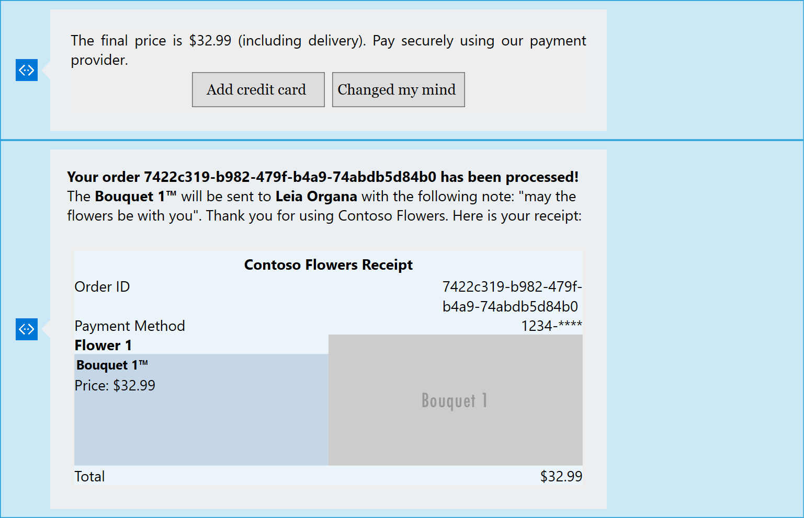|||

#### More Advanced Features
While not covered in this sample, it is important to highlight two features that can help tailoring your bot the your specific needs.

If you want to be able to take advantage of special features or concepts for a channel we provide a way for you to send native metadata to that channel giving you much deeper control over how your bot interacts on a channel. The way you do this is to pass extra properties via the [ChannelData](https://docs.microsoft.com/en-us/bot-framework/dotnet/bot-builder-dotnet-channeldata) property.

> You can also see a full sample bot sending native metadata to Facebook using ChannelData in the [ChannelData Bot Sample](../core-ChannelData).

One of the key problems in human-computer interactions is the ability of the computer to understand what a person wants, and to find the pieces of information that are relevant to their intent. In the [LUIS](https://docs.microsoft.com/en-us/bot-framework/cognitive-services-add-bot-language) application, you will bundle together the intents and entities that are important to your task.

> You can also see a full sample bot using LuisDialog to integrate with a LUIS.ai application in the [LUIS Bot Sample](../intelligence-LUIS).

### More Information

To get more information about how to get started in Bot Builder for .NET please review the following resources:

* [Dialogs](https://docs.microsoft.com/en-us/bot-framework/dotnet/bot-builder-dotnet-dialogs)
* [Add media attachments to messages](https://docs.microsoft.com/en-us/bot-framework/dotnet/bot-builder-dotnet-add-media-attachments)
* [Add rich card attachments to messages](https://docs.microsoft.com/en-us/bot-framework/dotnet/bot-builder-dotnet-add-rich-card-attachments)
* [Implement channel-specific functionality](https://docs.microsoft.com/en-us/bot-framework/dotnet/bot-builder-dotnet-channeldata)
* [Create a Facebook notification](https://docs.microsoft.com/en-us/bot-framework/dotnet/bot-builder-dotnet-channeldata#create-a-facebook-notification)
* [Guide conversations with FormFlow](https://docs.microsoft.com/en-us/bot-framework/dotnet/bot-builder-dotnet-formflow)
* [Manage conversational state](https://docs.microsoft.com/en-us/bot-framework/dotnet/bot-builder-dotnet-state)
* [Autofac](https://autofac.org/)
* [Add language understanding to a bot](https://docs.microsoft.com/en-us/bot-framework/cognitive-services-add-bot-language)

> **Limitations**  
> The functionality provided by the Bot Framework Activity can be used across many channels. Moreover, some special channel features can be unleashed using the [ChannelData property](https://docs.microsoft.com/en-us/bot-framework/dotnet/bot-builder-dotnet-channeldata).
> 
> The Bot Framework does its best to support the reuse of your Bot in as many channels as you want. However, due to the very nature of some of these channels, some features are not fully portable.
> 
> The features used in this sample are fully supported in the following channels:
> - Skype
> - Facebook
> - DirectLine
> - WebChat
> - GroupMe
> 
> They are also supported, with some limitations, in the following channels:
> - Microsoft Teams (Receipt card not supported)
> - Slack
> - Email
> 
> On the other hand, they are not supported and the sample won't work as expected in the following channels:
> - Telegram
> - SMS
> - Kik
