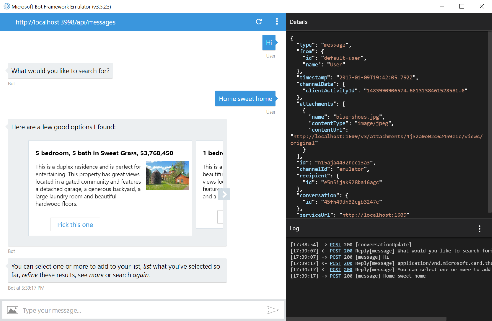
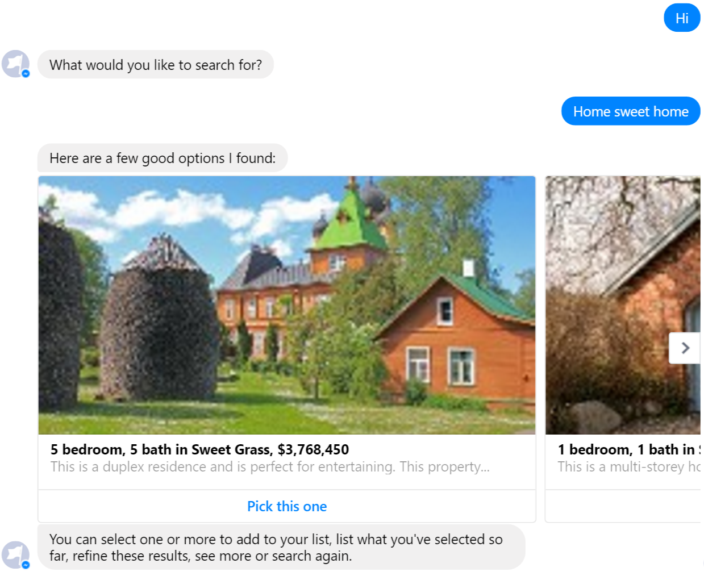
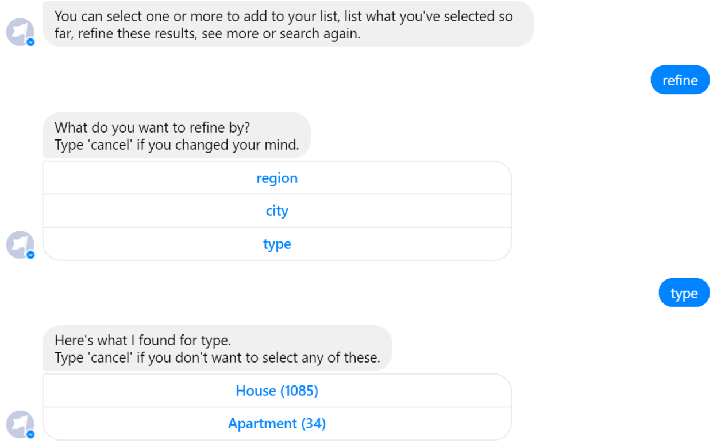
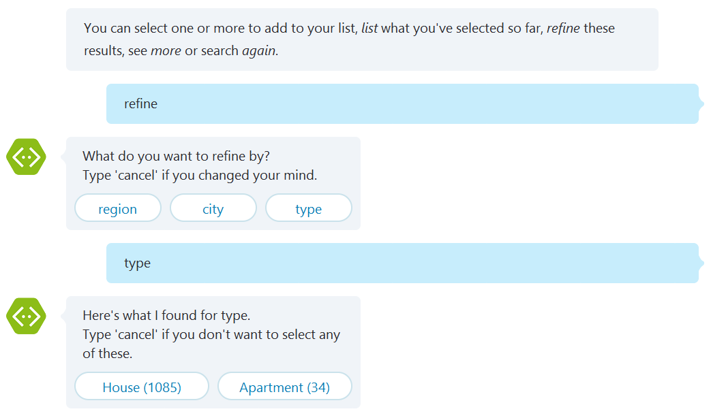
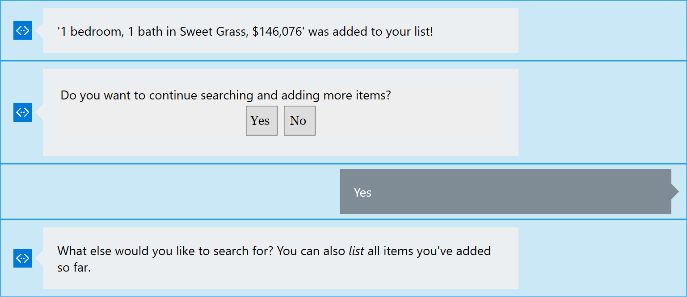
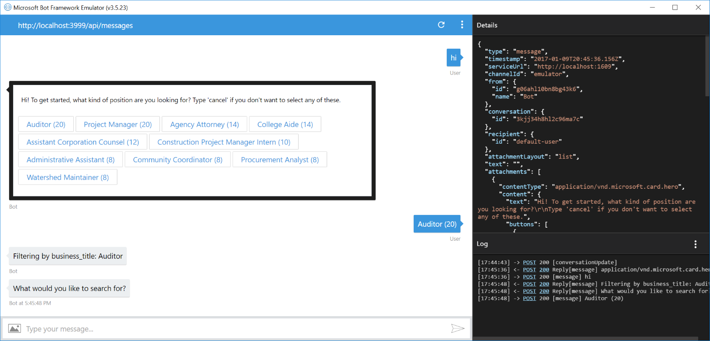

# Azure Search Samples

Depending on the nature of any given bot, sometimes you want to present structured dialogs that take users through tight paths, while in other cases you want to 
help users navigate a large amount of content. In many cases you'll have a mix of dialogs of both kinds in a single bot.  

These samples illustrate how to approach dialogs that need to help the user navigate large amounts of content, creating a data-driven exploration experience.

Content is modeled as a catalog of items where each item has several attributes that may be used for navigation, keyword search or display.

| Real Estate Sample | Job Listing Sample|
|--------------------|-------------------|
|[![Deploy to Azure][Deploy Button]][Deploy CSharp/Search/RealEstateBot]|[![Deploy to Azure][Deploy Button]][Deploy CSharp/Search/JobListingBot]|

[Deploy Button]: https://azuredeploy.net/deploybutton.png
[Deploy CSharp/Search/RealEstateBot]: https://azuredeploy.net?repository=https://github.com/microsoft/BotBuilder-Samples/tree/master/CSharp/demo-Search/RealEstateBot
[Deploy CSharp/Search/JobListingBot]: https://azuredeploy.net?repository=https://github.com/microsoft/BotBuilder-Samples/tree/master/CSharp/demo-Search/JobListingBot

### Prerequisites

The minimum prerequisites to run this sample are:
* The latest update of Visual Studio 2015. You can download the community version [here](http://www.visualstudio.com) for free.
* The Bot Framework Emulator. To install the Bot Framework Emulator, download it from [here](https://emulator.botframework.com/). Please refer to [this documentation article](https://github.com/microsoft/botframework-emulator/wiki/Getting-Started) to know more about the Bot Framework Emulator.

### Azure Search

The samples use [Azure Search](https://azure.microsoft.com/en-us/services/search/) as the backend for these dialogs. This is an Azure service that offers most of the needed pieces of functionality, including keyword search, built-in linguistics, custom scoring, faceted navigation and more. Azure Search can also index content from various sources (Azure SQL DB, DocumentDB, Blob Storage, Table Storage), supports "push" indexing for other sources of data, and can crack open PDFs, Office documents and other formats containing unstructured data. The content catalog goes into an Azure Search index, which we can then query from dialogs.

> As a good practice, all the Azure Search specific components are implemented in the [Search.Azure](Search.Azure/) project while implementation agnostic interfaces and models can be found in the [Search.Contracts](Search.Contracts/)  project.

### Dialogs

The samples include a few different dialogs that are ready to use directly, or can be subtyped to override various pieces of functionality as needed:
* [SearchSelectRefinerDialog](Search.Dialogs/SearchSelectRefinerDialog.cs) helps users pick a refiner (facet). It's a simple wrapper around a "choice" prompt dialog that can use a shared instance of SearchQueryBuilder to ensure you don't prompt users for a field you already refined on.
* [SearchRefineDialog](Search.Dialogs/SearchRefineDialog.cs) allows users to see different values for a given field and select one. This is typically used for filtering later on but can be applied to any case where you want to list distinct values for a given field in the catalog and let the user pick one.
* [SearchDialog](Search.Dialogs/SearchDialog.cs) offers a complete keyword search + refine experience over a search index, and uses the other search dialogs as building blocks. Users can explore the catalog by refining (using facets) and by using keyword search. They can also select items and review their selection. At the end of this dialog a list of one or more selected items is returned. You'll need to subtype this class and at a minimum override GetTopRefiners() (to list refiners (facets) to expore) and ToSearchHit() (to convert your index entries into a common representation that can be rendered).

> You can find these dialogs in the [Search.Dialogs](Search.Dialogs/) project which is ready to reuse in your own bot.

To stitch together multiple instances of these dialogs and have filters and other search options carry over, you can use a shared instance of [SearchQueryBuilder](Search.Contracts/Models/SearchQueryBuilder.cs), which captures all the search-related state.

### Samples

We included two samples here:

1. RealEstateBot is a bot for exploring a real estate catalog. 
  It starts by taking an arbitrary set of keywords.
  
  | Emulator | Facebook | Skype |
  |----------|-------|----------|
  ||||
  
  From there you can go back and forth between keyword search and refinement using region, city and type of property.
  
  | Emulator | Facebook | Skype |
  |----------|-------|----------|
  ||||

  You can pick one or more properties and at the end you'll get a list of your choices (a real bot would probably contact your agent with your elections, or send you a summary email for future reference).
  
  | Emulator | Facebook | Skype |
  |----------|-------|----------|
  ||||

2. JobListingBot is a bot for browing a catalog of job offerings.
  It starts by asking for a top-level refinement, a useful things to do in order to save users from an initial open-ended interation with the bot where they don't know what they can say.
  
  | Emulator | Facebook | Skype |
  |----------|-------|----------|
  ||||

> All samples target a shared, ready-to-use Azure Search service, so you don't need to provision your own to try these out. 

### More Information

To get more information about how to get started in Bot Builder for .NET please review the following resources:

* [Dialogs](https://docs.microsoft.com/en-us/bot-framework/dotnet/bot-builder-dotnet-dialogs)
* [Azure Search](https://azure.microsoft.com/en-us/services/search/)

> **Limitations**  
> The functionality provided by the Bot Framework Activity can be used across many channels. Moreover, some special channel features can be unleashed using the [ChannelData property](https://docs.microsoft.com/en-us/bot-framework/dotnet/bot-builder-dotnet-channeldata).
> 
> The Bot Framework does its best to support the reuse of your Bot in as many channels as you want. However, due to the very nature of some of these channels, some features are not fully portable.
> 
> The features used in these samples are fully supported in the following channels:
> - Skype
> - Facebook
> - Microsoft Teams
> - Telegram
> - DirectLine
> - WebChat
> - Slack
> - GroupMe
> 
> They are also supported, with some limitations, in the following channel:
> - Email
> 
> On the other hand, they are not supported and the sample won't work as expected in the following channels:
> - SMS
> - Kik
