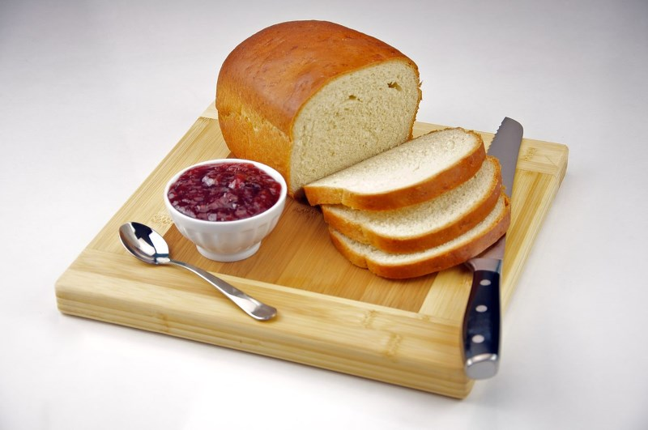
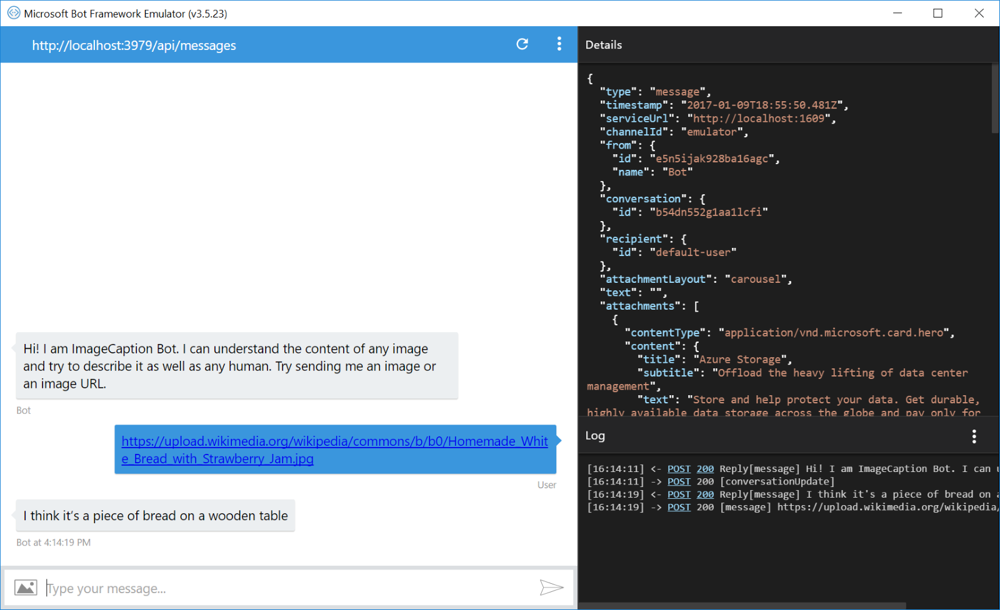
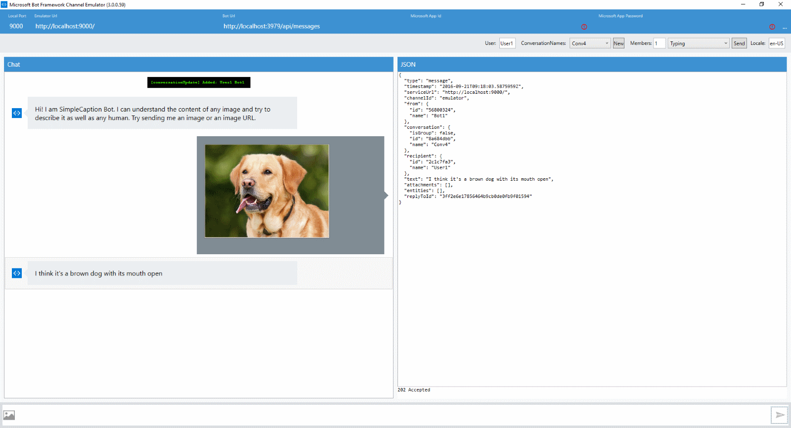

# Image Caption Bot Sample

A sample bot that illustrates how to use the [Microsoft Cognitive Services Computer Vision API](https://www.microsoft.com/cognitive-services/en-us/computer-vision-api) to analyze an image from a stream or a URL and return to the user the image caption.

[![Deploy to Azure][Deploy Button]][Deploy CSharp/ImageCaption]

[Deploy Button]: https://azuredeploy.net/deploybutton.png
[Deploy CSharp/ImageCaption]: https://azuredeploy.net

### Prerequisites

The minimum prerequisites to run this sample are:
* The latest update of Visual Studio 2015. You can download the community version [here](http://www.visualstudio.com) for free.
* The Bot Framework Emulator. To install the Bot Framework Emulator, download it from [here](https://emulator.botframework.com/). Please refer to [this documentation article](https://github.com/microsoft/botframework-emulator/wiki/Getting-Started) to know more about the Bot Framework Emulator.
* This sample currently uses a free trial Microsoft Cognitive service key with limited QPS. Please subscribe to Vision API services [here](https://www.microsoft.com/cognitive-services/en-us/subscriptions) and update the `MicrosoftVisionApiKey` key in [Web.config](Web.config) file to try it out further.

````XML
  <appSettings>
    <add key="MicrosoftVisionApiKey" value="PUT-YOUR-OWN-API-KEY-HERE" />
  </appSettings>
````

### Code Highlights
Microsoft Computer Vision API provides a number of methods that allows you to analyze an image. Check out [IVisionServiceClient.cs](https://github.com/Microsoft/Cognitive-Vision-Windows/blob/master/ClientLibrary/IVisionServiceClient.cs) for a complete reference of the methods available. In this sample we are using `AnalyzeImageAsync(string url, ...)` and `AnalyzeImageAsync(Stream imageStream, ...)` to analyze an image from a URL and stream respectively. The `AnalyzeImageAsync` method returns [AnalysisResult.cs](https://github.com/Microsoft/Cognitive-Vision-Windows/blob/master/ClientLibrary/Contract/AnalysisResult.cs) class which contains rich information about the image:

````C#
namespace Microsoft.ProjectOxford.Vision.Contract
{
    public class AnalysisResult
    {
        public AnalysisResult();

        public Adult Adult { get; set; }
        public Category[] Categories { get; set; }
        public Color Color { get; set; }
        public Description Description { get; set; }
        public Face[] Faces { get; set; }
        public ImageType ImageType { get; set; }
        public Metadata Metadata { get; set; }
        public Guid RequestId { get; set; }
        public Tag[] Tags { get; set; }
    }
}
````

In this sample we are using the API to get the image description and send it back to the user. Check out the use of the `MicrosoftCognitiveCaptionService.GetCaptionAsync()` method in the [MicrosoftCognitiveCaptionService.cs](Services/MicrosoftCognitiveCaptionService.cs) class.

````C#
/// <summary>
/// Gets the caption of the image from an image stream.
/// <remarks>
/// This method calls <see cref="IVisionServiceClient.AnalyzeImageAsync(Stream, string[])"/> and
/// returns the first caption from the returned <see cref="AnalysisResult.Description"/>
/// </remarks>
/// </summary>
/// <param name="stream">The stream to an image.</param>
/// <returns>Description if caption found, null otherwise.</returns>
public async Task<string> GetCaptionAsync(Stream stream)
{
    var client = new VisionServiceClient(ApiKey);
    var result = await client.AnalyzeImageAsync(stream, VisualFeatures);
    return ProcessAnalysisResult(result);
}

/// <summary>
/// Processes the analysis result.
/// </summary>
/// <param name="result">The result.</param>
/// <returns>The caption if found, error message otherwise.</returns>
private static string ProcessAnalysisResult(AnalysisResult result)
{
    string message = result?.Description?.Captions.FirstOrDefault()?.Text;

    return string.IsNullOrEmpty(message) ?
                "Couldn't find a caption for this one" :
                "I think it's " + message;
}
````

### Outcome

You will see the following when connecting the Bot to the Emulator and send it an image URL:

Input:



Output:



You can also choose to upload an image directly to the bot:



### More Information

To get more information about how to get started in Bot Builder for .NET and Microsoft Cognitive Services Computer Vision API please review the following resources:
* [Bot Builder for .NET](https://docs.microsoft.com/en-us/bot-framework/dotnet/)
* [Microsoft Cognitive Services Computer Vision API](https://www.microsoft.com/cognitive-services/en-us/computer-vision-api)
* [Microsoft Cognitive Services Computer Vision API Windows Client Library](https://github.com/Microsoft/Cognitive-vision-windows)
