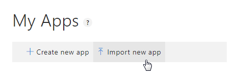
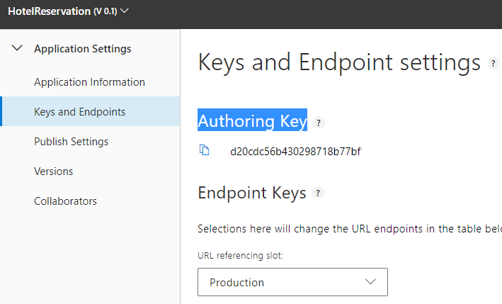
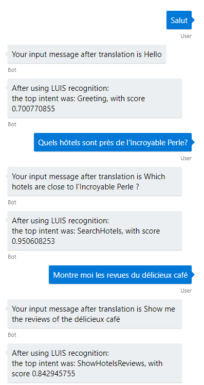

# LUIS Bot Sample

A sample bot using LuisDialog to integrate with a LUIS.ai application while using Translator Library support multiligual interaction with bot.

[![Deploy to Azure][Deploy Button]][Deploy CSharp/LUIS]

[Deploy Button]: https://azuredeploy.net/deploybutton.png
[Deploy CSharp/LUIS]: https://azuredeploy.net

### Prerequisites

The minimum prerequisites to run this sample are:
* The latest update of Visual Studio 2015. You can download the community version [here](http://www.visualstudio.com) for free.
* The Bot Framework Emulator. To install the Bot Framework Emulator, download it from [here](https://emulator.botframework.com/). Please refer to [this documentation article](https://github.com/microsoft/botframework-emulator/wiki/Getting-Started) to know more about the Bot Framework Emulator.


#### LUIS Application

The first step to using LUIS is to create or import an application. Go to the home page, www.luis.ai, and log in. After creating your LUIS account you'll be able to Import an Existing Application where you can select a local copy of the HotelsReservation.json file and import it.



If you want to test this sample, first import the pre-built application [HotelReservation.json](Dialogs/HotelReservation/Resources/HotelReservation.json) file to your LUIS account.

Once you imported the application you'll need to "train" the model ([Training](https://docs.microsoft.com/en-us/azure/cognitive-services/LUIS/luis-how-to-train)) before you can "Publish" it. For more information, take a look at [LUIS - How to Publish](https://docs.microsoft.com/en-us/azure/cognitive-services/LUIS/luis-how-to-publish-app).

Edit the [webconfig.cs](web.config) file and update the LuisModel attribute placeholders with the values corresponding to your Subscription and Application.  For more information, see [LUIS - Subscription Keys](https://docs.microsoft.com/en-us/azure/cognitive-services/LUIS/luis-how-to-azure-subscription)

````XML
    ...
    <appSettings>
        <add key="LuisAppId" value="" />
        <add key="LuisSubscriptionKey" value="" />
    	<add key="TranslatorKey" value="" />
       ...
  </appSettings>
    ...
````

#### Configure Translator Library

Edit the [webconfig.cs](web.config) file and update the files for patterns, customDictionary, nativeLanguages and supportedLanauages at the following directories.

````XML
    ...
    <appSettings>
		...
		<add key="patternsPath" value ="..\Dialogs\HotelReservation\patterns.json"/>
		<add key="dictionaryPath" value ="..\Dialogs\HotelReservation\dictionary.json"/>
		<add key="nativeLanguagesPath" value ="..\Dialogs\HotelReservation\nativeLanguages.json"/>
		<add key="supportedLanguagesPath" value ="..\Dialogs\HotelReservation\supportedLanguages.json"/>
  </appSettings>
   ...
````

#### Where to find the Luis ID, Subscription Key and Translator Key

You'll need these two values to configure the LuisDialog through the LuisModel attribute:

1. Luis ID

    In the LUIS application's dashboard, you can copy the App ID from the address bar.
    
    
    
2. Subscription Key

    Click on the Manage tab from the LUIS application UI.  Then navigate to Keys and Endpoints settings, and use the Authoring Key for this sample.  For instructions on using an actual Subscription Key, see [Using Subscription Keys](https://docs.microsoft.com/en-us/azure/cognitive-services/luis/luis-how-to-azure-subscription) 
    
    
    
3. Translator Key
    Get a key for Translator API from [here](https://azure.microsoft.com/en-us/services/cognitive-services/translator-text-api/)


### Outcome

You will see the following in the Bot Framework Emulator when opening and running the sample solution.



### More Information

To get more information about how to get started in Bot Builder for .NET and Conversations please review the following resources:
* [Bot Builder for .NET](https://docs.microsoft.com/en-us/bot-framework/dotnet/)
* [Recognize intents and entities with LUIS](https://docs.microsoft.com/en-us/azure/bot-service/dotnet/bot-builder-dotnet-luis-dialogs/)
* [LUIS Help Docs](https://docs.microsoft.com/en-us/azure/cognitive-services/LUIS/Home)
* [Cognitive Services Documentation](https://azure.microsoft.com/en-us/services/cognitive-services/)
* [Specify initial form state and entities](https://docs.microsoft.com/en-us/bot-framework/dotnet/bot-builder-dotnet-formflow-advanced#specify-initial-form-state-and-entities)
* [Translator Text API](https://azure.microsoft.com/en-us/services/cognitive-services/translator-text-api/)

> **Limitations**  
> The functionality provided by the Bot Framework Activity can be used across many channels. Moreover, some special channel features can be unleashed using the [ChannelData property](https://docs.microsoft.com/en-us/bot-framework/dotnet/bot-builder-dotnet-channeldata).
> 
> The Bot Framework does its best to support the reuse of your Bot in as many channels as you want. However, due to the very nature of some of these channels, some features are not fully portable.
> 
> The features used in this sample are fully supported in the following channels:
> - Skype
> - Facebook
> - Microsoft Teams
> - DirectLine
> - WebChat
> - Slack
> - GroupMe
> 
> They are also supported, with some limitations, in the following channels:
> - Kik
> - Email
> 
> On the other hand, they are not supported and the sample won't work as expected in the following channels:
> - Telegram
> - SMS
