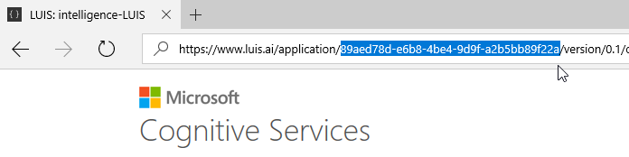
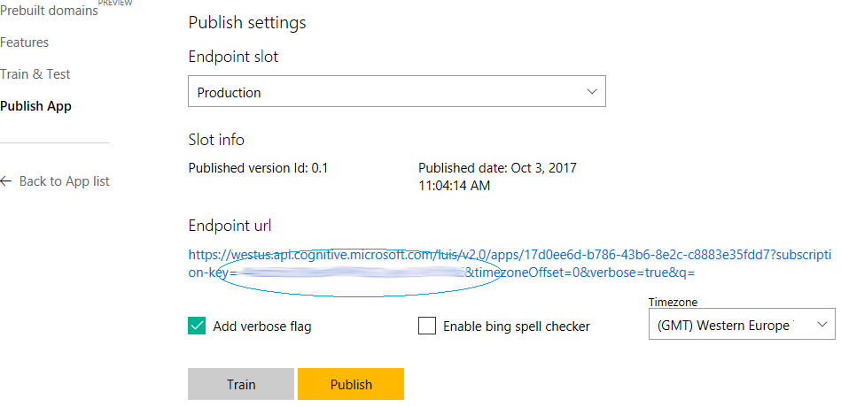
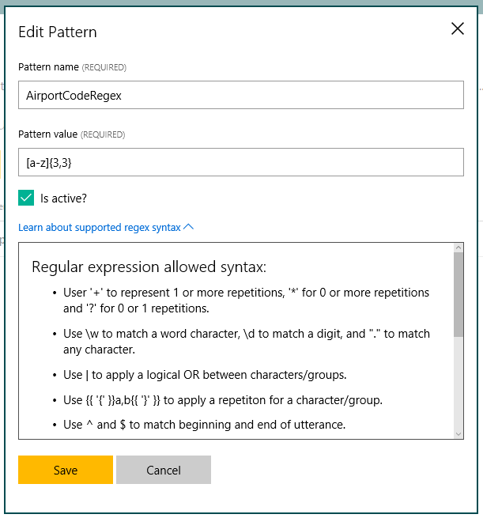
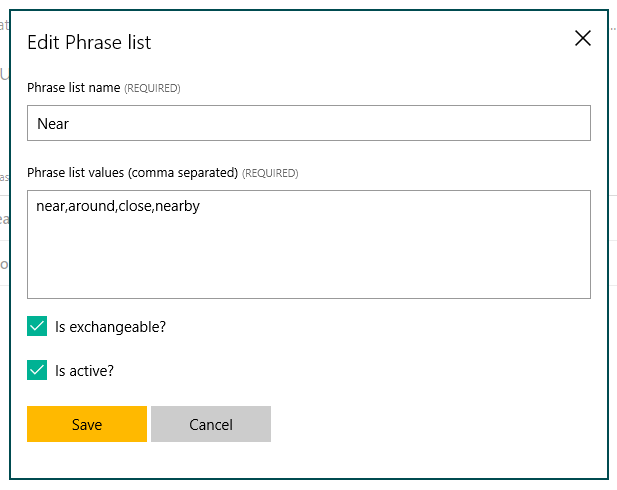
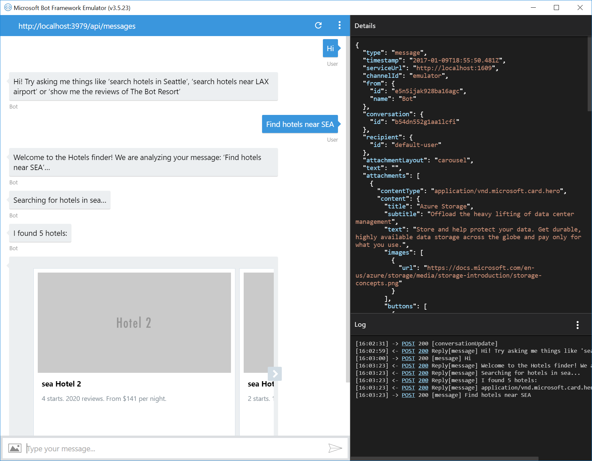

# LUIS Bot Sample

A sample bot using LuisDialog to integrate with a LUIS.ai application.

[![Deploy to Azure][Deploy Button]][Deploy CSharp/LUIS]
[Deploy Button]: https://azuredeploy.net/deploybutton.png
[Deploy CSharp/LUIS]: https://azuredeploy.net

### Prerequisites

The minimum prerequisites to run this sample are:
* The latest update of Visual Studio 2015. You can download the community version [here](http://www.visualstudio.com) for free.
* The Bot Framework Emulator. To install the Bot Framework Emulator, download it from [here](https://aka.ms/bf-bc-emulator). Please refer to [this documentation article](https://docs.botframework.com/en-us/csharp/builder/sdkreference/gettingstarted.html#emulator) to know more about the Bot Framework Emulator.


#### LUIS Application
You can test this sample as-is, using the hosted sample application, or you can import the pre-built [LuisBot.json](LuisBot.json) file to your own LUIS account.

In the case you choose to import the application, the first step to using LUIS is to create or import an application. Go to the home page, www.luis.ai, and log in. After creating your LUIS account you'll be able to Import an Existing Application where can you can select a local copy of the LuisBot.json file an import it. For more information, take a look at [Importing and Exporting Applications](https://www.luis.ai/Help#ImportingApps)


Once you imported the application you'll need to "train" the model ([Training](https://www.luis.ai/Help#Training)) before you can "Publish" the model in an HTTP endpoint. For more information, take a look at [Publishing a Model](https://www.luis.ai/Help#PublishingModel).

Finally, edit the [RootLuisDialog.cs](Dialogs/RootLuisDialog.cs#L20) file and update the LuisModel attribute placeholders with the values corresponding to your Subscription and Application. Also, you must comment out the `#define useSampleModel` line on top of the file.


````C#
#define useSampleModel

    [Serializable]
#if useSampleModel
    [LuisModel("162bf6ee-379b-4ce4-a519-5f5af90086b5", "11be6373fca44ded80fbe2afa8597c18")]
#else
    [LuisModel("YourModelId", "YourSubscriptionKey")]
#endif
    public class RootLuisDialog : LuisDialog<object>
````

#### Where to find the Application ID and Subscription Key

You'll need these two values to configure the LuisDialog through the LuisModel attribute:

1. Application ID
    In the LUIS application's dashboard, select the App Settings option in the right side bar and copy the App ID field value.
    
    
    
2. Subscription Key
    In the [user's settings page](https://www.luis.ai/Home/UserSettings), select the _Subscription Keys_ option and copy the Programmatic API Key.
    
    
    

### Code Highlights

One of the key problems in human-computer interactions is the ability of the computer to understand what a person wants, and to find the pieces of information that are relevant to their intent. In the LUIS application, you will bundle together the intents and entities that are important to your task. Read more about [Creating an Application](https://www.luis.ai/Help#CreatingApplication) in the LUIS Help Docs.
Check out the use of LuisIntent attributes decorating [RootLuisDialog](Dialogs/RootLuisDialog.cs#L43) methods to handle LUIS Intents, for instance `[LuisIntent("SearchHotels")]`.

````C#
[LuisIntent("SearchHotels")]
public async Task Search(IDialogContext context, IAwaitable<IMessageActivity> activity, LuisResult result)
{
    ...
}
````

Each intent handler method accepts the `IDialogContext`, the original incoming `IMessageActivity` message and the `LuisResult` including the matching Intents and Entities for the LUIS query. In the sample below, the [RootLuisDialog](Dialogs/RootLuisDialog.cs#L52) class retrieves a city value from the processed [pre-built entity](https://www.luis.ai/Help/#PreBuiltEntities).

````C#
EntityRecommendation cityEntityRecommendation;

if (result.TryFindEntity(EntityGeographyCity, out cityEntityRecommendation))
{
    cityEntityRecommendation.Type = "Destination";
}
````

You might notice the use of `EntityRecommendation.Type = "Destination"` in the code above. This is useful to map entity values to properties when reusing the LUIS captured entities for the  [`FormDialog<HotelsQuery>`](Dialogs/RootLuisDialog.cs#L57). The properties mapped to entities will be pre-populated. In the case of the `AirportCode` this extra step is not required since the entity name already matches the property name.

````C#
var hotelsFormDialog = new FormDialog<HotelsQuery>(hotelsQuery, this.BuildHotelsForm, FormOptions.PromptInStart, result.Entities);
````

In addition, the `AirportCode` entity makes use of the LUIS Regex Features which helps LUIS infer entities based on an Regular Expression match, for instance, Airport Codes consist of three consecutive alphabetic characters. You can read more about Regex Features in the [Improving Performance](https://www.luis.ai/Help/#Performance) section of the LUIS Help Docs.



Another LUIS Model Feature used is Phrase List Features, for instance, the model includes a phrase list named Near which categorizes the words: near, around, close and nearby. Phrase list features work for both words and phrase and what LUIS learns about one phrase will automatically be applied to the others as well.
> Note: Both RegEx and Phrase List are transparent from the Bot's implementation perspective. Think of model features as "hints" used by the Machine Learning algorithm to help categorize and recognize words that compound Entities and Intents.



### Spelling Correction

If you want to enable spelling correction, set the `IsSpellCorrectionEnabled` key to `true` in the [web.config](web.config) file.

Bing Spell Check API provides a module that allows you to to correct the spelling of the text. Check out the [reference](https://dev.cognitive.microsoft.com/docs/services/56e73033cf5ff80c2008c679/operations/56e73036cf5ff81048ee6727) to know more about the modules available. 

[BingSpellCheckService.cs](Services/BingSpellCheckService.cs) is the core component illustrating how to call the Bing Spell Check RESTful API.

In this sample we added spell correction before calling the dialog. Check out the usage in [MessagesController.cs](Controllers/MessagesController.cs).

````C#
if (IsSpellCorrectionEnabled)
{
    try
    {
        activity.Text = await this.spellService.GetCorrectedTextAsync(activity.Text);
    }
    catch(Exception ex)
    {
        Trace.TraceError(ex.ToString());
    }
}

await Conversation.SendAsync(activity, () => new RootLuisDialog());
````

### Outcome

You will see the following in the Bot Framework Emulator when opening and running the sample solution.



### More Information

To get more information about how to get started in Bot Builder for .NET and Conversations please review the following resources:
* [Bot Builder for .NET](https://docs.botframework.com/en-us/csharp/builder/sdkreference/index.html)
* [Understanding Natural Language](https://docs.botframework.com/en-us/node/builder/guides/understanding-natural-language/)
* [LUIS Help Docs](https://www.luis.ai/Help/)
* [Cognitive Services Documentation](https://www.microsoft.com/cognitive-services/en-us/luis-api/documentation/home)
* [Passing in Initial Form State and Entities](https://docs.botframework.com/en-us/csharp/builder/sdkreference/forms.html#initialState)
* Other examples using LUIS
    * [Dialogs - Alarm Bot](https://docs.botframework.com/en-us/csharp/builder/sdkreference/dialogs.html#alarmBot)
    * [Weather Bot](https://docs.botframework.com/en-us/bot-intelligence/language/#example-weather-bot)
* [Bing Spell Check API](https://www.microsoft.com/cognitive-services/en-us/bing-spell-check-api)

> **Limitations**  
> The functionality provided by the Bot Framework Activity can be used across many channels. Moreover, some special channel features can be unleashed using the [ChannelData property](https://docs.botframework.com/en-us/csharp/builder/sdkreference/channels.html).
> 
> The Bot Framework does its best to support the reuse of your Bot in as many channels as you want. However, due to the very nature of some of these channels, some features are not fully portable.
> 
> The features used in this sample are fully supported in the following channels:
> - Skype
> - Facebook
> - DirectLine
> - WebChat
> - Slack
> - GroupMe
> 
> They are also supported, with some limitations, in the following channels:
> - Kik
> - Email
> 
> On the other hand, they are not supported and the sample won't work as expected in the following channels:
> - Telegram
> - SMS
