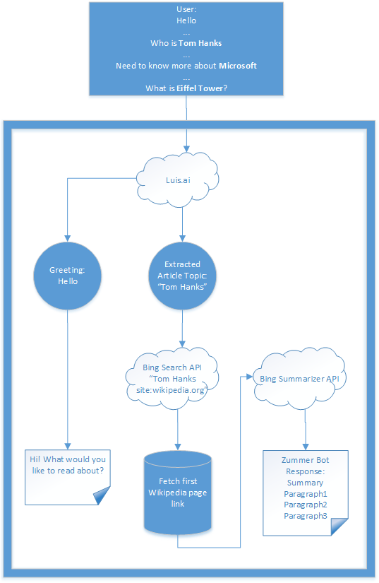
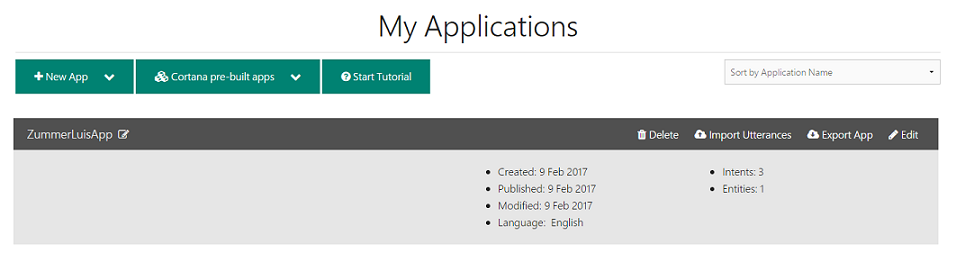
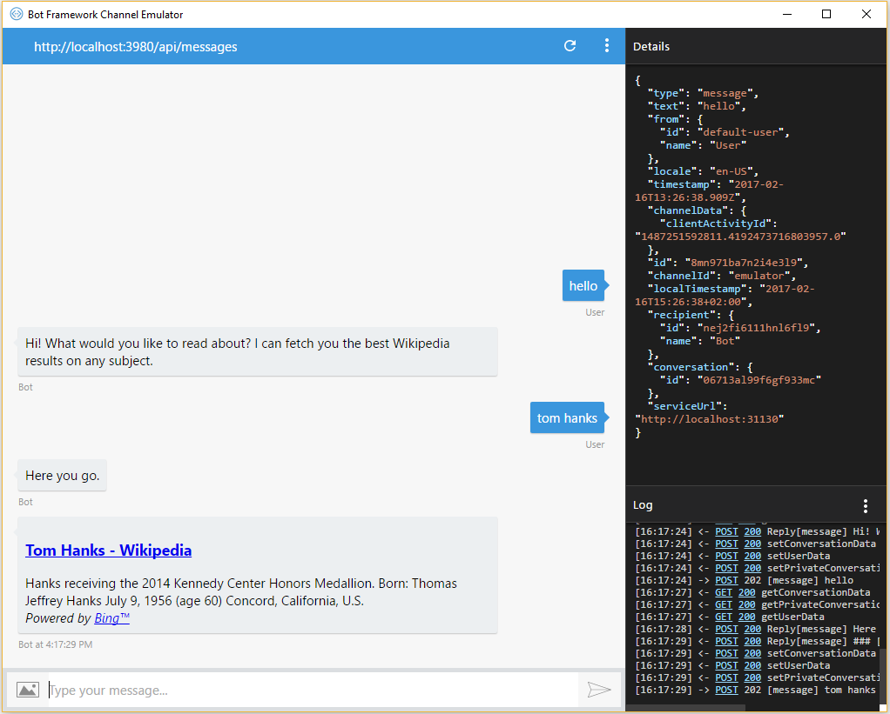

Zummer Bot (C\#)
================

In this tutorial we will cover how to build an information search bot - Zummer
using - [Bing Web Search
API](https://www.microsoft.com/cognitive-services/en-us/bing-web-search-api) and 
[Language Understanding Intelligent Services
(LUIS)](https://www.microsoft.com/cognitive-services/en-us/language-understanding-intelligent-service-luis)

[![Deploy to Azure][Deploy Button]][Deploy CSharp/Zummer]

[Deploy Button]: https://azuredeploy.net/deploybutton.png
[Deploy CSharp/Zummer]: https://azuredeploy.net

Bot Recipe/Prerequisites:
-------------------------

-   **Microsoft Bot Framework** to host and publish to multiple platforms. You
    can download Bot Framework Emulator from
    [here](https://aka.ms/bf-bc-emulator). More details in [this documentation
    article](https://docs.microsoft.com/en-us/bot-framework/dotnet/bot-builder-dotnet-quickstart) 

-   **Bing Web Search API** to fetch the most relevant Wikipedia article on any
    given topic.

-   **Luis.ai** to understand the query intent

 

Let's get started, shall we?
----------------------------

Here is a simple flowchart of what the Zummer bot logic is:

 

Creating a LUIS application and training it to understand the query intent
--------------------------------------------------------------------------

Zummer bot is trained to understand the following intents:

-   Greeting

-   Article Search by topic

 

1.  **Sign in and Create an application** on [www.luis.ai](http://www.luis.ai/)  
    **Note:** You can either import the LUIS application JSON file
    “ZummerLuisApp.json” found in the [sample folder](https://github.com/Microsoft/BotBuilder-Samples/blob/master/CSharp/intelligence-Zummer/ZummerLuisApp.json)

    

2.  **Create intent, entities and train LUIS**

    1.  Add an intent for Greeting and Search each by clicking on '+'

        

    2.  Add utterances like Hi, Hello, etc. and assign it to the Greeting intent

    3.  For Search Intent: Create “ArticleTopic” Entity

        

    4.  Add utterances for queries that contain "ArticleTopic" entity

        

3.  **Train your models** by clicking “Train”

4.  **Publish your application**

5.  **Save your published endpoint URL** which would be used when creating your bot on bot framework

    

### Calling the LUIS application from MS bot framework project

1.  Create a LuisDialog as in MainDialog.cs

    ~~~~~~~~~~~~~~~~~~~~~~~~~~~~~~~~~~~~~~~~~~~~~~~~~~~~~~~~~~~~~~~~~~~~~~~~~ c#
    [Serializable]
    internal sealed class MainDialog : LuisDialog<object>
    {
    private readonly IHandlerFactory handlerFactory;

    public MainDialog(ILuisService luis, IHandlerFactory handlerFactory)
        : base(luis)
    {
        SetField.NotNull(out this.handlerFactory, nameof(handlerFactory), handlerFactory);
    }
    ~~~~~~~~~~~~~~~~~~~~~~~~~~~~~~~~~~~~~~~~~~~~~~~~~~~~~~~~~~~~~~~~~~~~~~~~~~~~

2.  Register both MainDialog and LuisModelAttribute (use the modelId and
    subscriptionKey from the published LUIS URL) in the dependency container, in
    MainModule.cs

    ~~~~~~~~~~~~~~~~~~~~~~~~~~~~~~~~~~~~~~~~~~~~~~~~~~~~~~~~~~~~~~~~~~~~~~~~~ c#
    internal sealed class MainModule : Module
    {
        protected override void Load(ContainerBuilder builder)
        {
            base.Load(builder);

            builder.Register(c => new LuisModelAttribute("b550e80a-74ec-4bb4-bcbc-fe35f5b1fce4", "a6d628faa2404cd799f2a291245eb135")).AsSelf().AsImplementedInterfaces().SingleInstance();

            // Top Level Dialog
            builder.RegisterType<MainDialog>().As<IDialog<object>>().InstancePerDependency();
    ~~~~~~~~~~~~~~~~~~~~~~~~~~~~~~~~~~~~~~~~~~~~~~~~~~~~~~~~~~~~~~~~~~~~~~~~~~~~

3.  Create methods in this dialog to handle your LUIS intents. In this tutorial
    a factory is created that returns the needed object that is responsible
    handling certain intents and  responding to the user

    ~~~~~~~~~~~~~~~~~~~~~~~~~~~~~~~~~~~~~~~~~~~~~~~~~~~~~~~~~~~~~~~~~~~~~~~~~ c#
    [LuisIntent(ZummerStrings.GreetingIntentName)]
    public async Task GreetingIntentHandlerAsync(IDialogContext context, IAwaitable<IMessageActivity> activity, LuisResult result)
    {
        await this.handlerFactory.CreateIntentHandler(ZummerStrings.GreetingIntentName).Respond(activity, result);
        context.Wait(this.MessageReceived);
    }

    [LuisIntent(ZummerStrings.SearchIntentName)]
    public async Task FindArticlesIntentHandlerAsync(IDialogContext context, IAwaitable<IMessageActivity> activity, LuisResult result)
    {
        await this.handlerFactory.CreateIntentHandler(ZummerStrings.SearchIntentName).Respond(activity, result);
        context.Wait(this.MessageReceived);
    }
    ~~~~~~~~~~~~~~~~~~~~~~~~~~~~~~~~~~~~~~~~~~~~~~~~~~~~~~~~~~~~~~~~~~~~~~~~~~~~

 

Fetching Wikipedia articles on a topic using Bing Web Search API
----------------------------------------------------------------

1.  The model classes that represent the Bing Web Search API JSON response can
    be found in folder “Models\\Search*”*

2.  Create a free tier “Key” that will be used for calling the Bing APIs on [Microsoft
    Cognitive Service
    subscriptions](https://www.microsoft.com/cognitive-services/en-US/subscriptions)
    

3.  Bing Web Search API request format details could be found at [Bing Web
    Search API
    reference](https://dev.cognitive.microsoft.com/docs/services/56b43eeccf5ff8098cef3807/operations/56b4447dcf5ff8098cef380d)
    page  
    This tutorial implements communication with Bing Web Search API service and
    manipulating the user's query to get a response with only Wikipedia
    articles through “FindArticles”  in BingSearchServices.cs

    ~~~~~~~~~~~~~~~~~~~~~~~~~~~~~~~~~~~~~~~~~~~~~~~~~~~~~~~~~~~~~~~~~~~~~~~~~ c#
    namespace Zummer.Services 
    { 
        /// 
 
        /// Responsible for calling Bing Web Search API 
        /// 
 
        internal sealed class BingSearchService : ISearchService 
        { 
            private const string BingSearchEndpoint = "https://api.cognitive.microsoft.com/bing/v5.0/search/"; 
     
            private static readonly Dictionary<string, string> Headers = new Dictionary<string, string> 
            { 
                { "Ocp-Apim-Subscription-Key", ConfigurationManager.AppSettings["BingSearchServiceKey"] } 
            };  
     
            private readonly IApiHandler apiHandler; 
     
            public BingSearchService(IApiHandler apiHandler) 
            { 
                SetField.NotNull(out this.apiHandler, nameof(apiHandler), apiHandler); 
            } 
     
            public async Task<BingSearch> FindArticles(string query) 
            { 
                var requestParameters = new Dictionary<string, string> 
                { 
                    { "q", $"{query} site:wikipedia.org" } 
                }; 
     
                return await this.apiHandler.GetJsonAsync<BingSearch>(BingSearchEndpoint, requestParameters, Headers); 
            } 
        } 
    }
    ~~~~~~~~~~~~~~~~~~~~~~~~~~~~~~~~~~~~~~~~~~~~~~~~~~~~~~~~~~~~~~~~~~~~~~~~~~~~

    **Note:** ApiHandler is the class implementing IApiHandler. It is a
    singleton wrapper for HttpClient, to send Http requests. Code can be found
    in “Services\\ApiHandler.cs”

4.  SearchIntentHandler.cs “Respond” method contains

    1.  Calling *“*FindArticles” methods to receive the BingSearch response

    2.  Fetching first result and extracting information needed
        using"PrepareZummerResult" method, then sending a
        [formatted](https://docs.microsoft.com/en-us/bot-framework/dotnet/bot-builder-dotnet-create-messages)
        response to the user

    ~~~~~~~~~~~~~~~~~~~~~~~~~~~~~~~~~~~~~~~~~~~~~~~~~~~~~~~~~~~~~~~~~~~~~~~~~ c#
    public async Task Respond(IAwaitable<IMessageActivity> activity, LuisResult result)
    {
        EntityRecommendation entityRecommendation;

        var query = result.TryFindEntity(ZummerStrings.ArticlesEntityTopic, out entityRecommendation)
            ? entityRecommendation.Entity
            : result.Query;

        await this.botToUser.PostAsync(string.Format(Strings.SearchTopicTypeMessage));

        var bingSearch = await this.bingSearchService.FindArticles(query);

        var zummerResult = this.PrepareZummerResult(query, bingSearch.webPages.value[0]);

        var summaryText =  $"### [{zummerResult.Tile}]({zummerResult.Url})\n{zummerResult.Snippet}\n\n" ;

        summaryText +=
            $"*{string.Format(Strings.PowerBy, $"[Bing™](https://www.bing.com/search/?q={zummerResult.Query} site:wikipedia.org)")}*";

        await this.botToUser.PostAsync(summaryText);
    }
    ~~~~~~~~~~~~~~~~~~~~~~~~~~~~~~~~~~~~~~~~~~~~~~~~~~~~~~~~~~~~~~~~~~~~~~~~~~~~

    ~~~~~~~~~~~~~~~~~~~~~~~~~~~~~~~~~~~~~~~~~~~~~~~~~~~~~~~~~~~~~~~~~~~~~~~~~ c#
    private ZummerSearchResult PrepareZummerResult(string query, Value page)
    {
        string url;
        var myUri = new Uri(page.url);

        if (myUri.Host == "www.bing.com" && myUri.AbsolutePath == "/cr")
        {
            url = HttpUtility.ParseQueryString(myUri.Query).Get("r");
        }
        else
        {
            url = page.url;
        }

        var zummerResult = new ZummerSearchResult
        {
            Url = url,
            Query = query,
            Tile = page.name,
            Snippet = page.snippet
        };

        return zummerResult;
    }
    ~~~~~~~~~~~~~~~~~~~~~~~~~~~~~~~~~~~~~~~~~~~~~~~~~~~~~~~~~~~~~~~~~~~~~~~~~~~~

Outcome
-------

You will see the following when connecting the Bot to the Emulator:

More Information
----------------

To get more information about how to get started in Bot Builder for .NET, 
 Bing Web Search API and LUIS please review the
following resources: 

* [Bot Builder for
.NET](https://docs.microsoft.com/en-us/bot-framework/dotnet/)
* [Bing Web Search
API](https://www.microsoft.com/cognitive-services/en-us/bing-web-search-api) 
* [Language Understanding Intelligent Services
(LUIS)](https://www.microsoft.com/cognitive-services/en-us/language-understanding-intelligent-service-luis)
