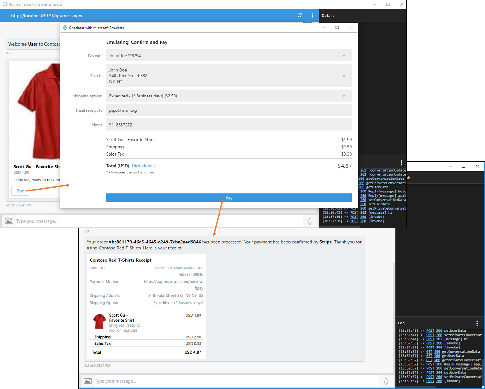

# Payment Bot Sample

A sample bot showing how to integrate with Microsoft Seller Center for payment processing.

[![Deploy to Azure][Deploy Button]][Deploy CSharp/Payments]

[Deploy Button]: https://azuredeploy.net/deploybutton.png
[Deploy CSharp/Payments]: https://azuredeploy.net

### Prerequisites

The minimum prerequisites to run this sample are:
* The latest update of Visual Studio 2015. You can download the community version [here](http://www.visualstudio.com) for free.
* Register your bot with the Microsoft Bot Framework. Please refer to [this](https://docs.botframework.com/en-us/csharp/builder/sdkreference/gettingstarted.html#registering) for the instructions. Once you complete the registration, update the [Bot's Web.config](PaymentsBot/Web.config#L9-L11) file with the registered config values (MicrosoftAppId and MicrosoftAppPassword).

#### Microsoft Bot Builder

This sample has been developed based on Microsoft Bot Builder Dialog system. You can follow the following [sample](https://github.com/Microsoft/BotBuilder-Samples/tree/master/CSharp/core-MultiDialogs) to become familiar with different kind of dialogs and dialog stack in Bot Builder.

#### Microsoft Seller Center

1. <a href="https://dashboard.stripe.com/register" target="_blank">Create and activate a Stripe account if you don't have one already.</a>

2. <a href="https://seller.microsoft.com/en-us/dashboard/registration/seller/?accountprogram=skypebots&setvar=fltsellerregistration:1" target="_blank">Sign in to Seller Center with your Microsoft account.</a>

3. Within Seller Center, connect your account with Stripe.

4. Within Seller Center, navigate to the Dashboard and copy the value of **MerchantID**.

5. Update your bot's **web.config** file to set `MerchantId` to the value that you copied from the Seller Center Dashboard. 

#### Publish
Also, in order to be able to run and test this sample you must [publish your bot, for example to Azure](https://docs.botframework.com/en-us/csharp/builder/sdkreference/gettingstarted.html#publishing). Alternatively, you can use [Ngrok to interact with your local bot in the cloud](https://blogs.msdn.microsoft.com/jamiedalton/2016/07/29/ms-bot-framework-ngrok/). 

### Code Highlights

The Bot Framework provides ways of interacting with external actors (for example ecommerce sites as is shown within this sample) and resume the conversation after. For this purpose the Bot Framework uses a `ConversationReference` instance on the `Conversation` helper static methods. With this reference you can send a message to your Bot and continue the conversation at the point where you left it.

The Bot-Ecommerce interaction starts at the [`WelcomeMessageAsync`](PaymentsBot/Dialogs/RootDialog.cs#L32-L59) method from the [`RootDialog`](PaymentsBot/Dialogs/RootDialog.cs) that starts the conversation with the user. If you take a look on that method, there is a internal call to [`BuildBuyCardAsync`](PaymentsBot/Dialogs/RootDialog.cs#L54) which builds a `HeroCard` and returns it as an attachment.

The [`BuildBuyCardAsync`](PaymentsBot/Dialogs/RootDialog.cs#L127-L153) uses a [`CardAction`](PaymentsBot/Dialogs/RootDialog.cs#L143-L148) with a particular action type held at the following constant `PaymentRequest.PaymentActionType` within the referenced payment class. As you can see the `CardAction` contains a payment payload will all the information required to trigger a Microsoft Wallet payment.

````C#
private static Task<Attachment> BuildBuyCardAsync(string cartId, CatalogItem item)
{
    var heroCard = new HeroCard
    {
        Title = item.Title,
        Subtitle = $"{item.Currency} {item.Price.ToString("F")}",
        Text = item.Description,
        Images = new List<CardImage>
        {
            new CardImage
            {
                Url = item.ImageUrl
            }
        },
        Buttons = new List<CardAction>
        {
            new CardAction
            {
                Title = "Buy",
                Type = PaymentRequest.PaymentActionType,
                Value = BuildPaymentRequest(cartId, item, PaymentService.GetAllowedPaymentMethods())
            }
        }
    };

    return Task.FromResult(heroCard.ToAttachment());
}
````

In addition, if you take a look at the payload you can see it is actually a [`PaymentRequest`](PaymentsBot/Dialogs/RootDialog.cs#L61) created and set to the `CardAction` `Value` by the [`BuildPaymentRequest`](PaymentsBot/Dialogs/RootDialog.cs#L147) method. All the values set there are used to set up the payment options within Microsoft Wallet services.

````C#
private static PaymentRequest BuildPaymentRequest(string cartId, CatalogItem item, MicrosoftPayMethodData methodData)
{
    return new PaymentRequest
    {
        Id = cartId,
        Expires = TimeSpan.FromDays(1).ToString(),
        MethodData = new List<PaymentMethodData>
        {
            methodData.ToPaymentMethodData()
        },
        Details = new PaymentDetails
        {
            Total = new PaymentItem
            {
                Label = Resources.Wallet_Label_Total,
                Amount = new PaymentCurrencyAmount
                {
                    Currency = item.Currency,
                    Value = Convert.ToString(item.Price, CultureInfo.InvariantCulture)
                },
                Pending = true
            },
            DisplayItems = new List<PaymentItem>
            {
                new PaymentItem
                {
                    Label = item.Title,
                    Amount = new PaymentCurrencyAmount
                    {
                        Currency = item.Currency,
                        Value = item.Price.ToString(CultureInfo.InvariantCulture)
                    }
                },
                new PaymentItem
                {
                    Label = Resources.Wallet_Label_Shipping,
                    Amount = new PaymentCurrencyAmount
                    {
                        Currency = item.Currency,
                        Value = "0.00"
                    },
                    Pending = true
                },
                new PaymentItem
                {
                    Label = Resources.Wallet_Label_Tax,
                    Amount = new PaymentCurrencyAmount
                    {
                        Currency = item.Currency,
                        Value = "0.00"
                    },
                    Pending = true
                }
            }
        },
        Options = new PaymentOptions
        {
            RequestShipping = true,
            RequestPayerEmail = true,
            RequestPayerName = true,
            RequestPayerPhone = true,
            ShippingType = PaymentShippingTypes.Shipping
        }
    };
}
````

As said the `CardAction` provides to the channel all the information required to trigger the payment flow when the user clicks on the `HeroCard` `Buy` button.

The payment interface interacts with your Bot by the ussual means, ie. POSTing messages to the REST controller. If you take a look on the POST method of the [`MessagesController`](PaymentsBot/Controllers/MessagesController.cs#L48-L57) you see that all activities received there are handled using a dispatcher. Under the hood this dispatcher takes a look on the activity type and calls the appropiate bound method within your controller (bound by using the `MethodBind` attribute). Within the referenced controller there are two bound methods for dispatching which are: [`OnMessageActivity`](PaymentsBot/Controllers/MessagesController.cs#L62-L64) and [`OnInvoke`](PaymentsBot/Controllers/MessagesController.cs#L72-L74) - resolution is done according to the method's signature.

All messages (actually activities) received from the payment interface are of type `invoke`. So from now on we will focus on the [`OnInvoke`](PaymentsBot/Controllers/MessagesController.cs#L74-L127) method of the controller which looks this way:

````C#
private async Task OnInvoke(IInvokeActivity invoke, IConnectorClient connectorClient, IStateClient stateClient, HttpResponseMessage response, CancellationToken token)
{
    MicrosoftAppCredentials.TrustServiceUrl(invoke.RelatesTo.ServiceUrl);

    var jobject = invoke.Value as JObject;
    if (jobject == null)
    {
        throw new ArgumentException("Request payload must be a valid json object.");
    }

    // This is a temporary workaround for the issue that the channelId for "webchat" is mapped to "directline" in the incoming RelatesTo object
    invoke.RelatesTo.ChannelId = (invoke.RelatesTo.ChannelId == "directline") ? "webchat" : invoke.RelatesTo.ChannelId;

    if (invoke.RelatesTo.User == null)
    {
        // Bot keeps the userId in context.ConversationData[cartId]
        var conversationData = await stateClient.BotState.GetConversationDataAsync(invoke.RelatesTo.ChannelId, invoke.RelatesTo.Conversation.Id, token);
        var cartId = conversationData.GetProperty<string>(RootDialog.CARTKEY);

        if (!string.IsNullOrEmpty(cartId))
        {
            invoke.RelatesTo.User = new ChannelAccount
            {
                Id = conversationData.GetProperty<string>(cartId)
            };
        }
    }

    var updateResponse = default(object);
    switch (invoke.Name)
    {
        case PaymentOperations.UpdateShippingAddressOperationName:
            updateResponse = await this.ProcessShippingUpdate(jobject.ToObject<PaymentRequestUpdate>(), ShippingUpdateKind.Address, token);
            break;

        case PaymentOperations.UpdateShippingOptionOperationName:
            updateResponse = await this.ProcessShippingUpdate(jobject.ToObject<PaymentRequestUpdate>(), ShippingUpdateKind.Options, token);
            break;

        case PaymentOperations.PaymentCompleteOperationName:
            updateResponse = await this.ProcessPaymentComplete(invoke, jobject.ToObject<PaymentRequestComplete>(), token);
            break;

        default:
            throw new ArgumentException("Invoke activity name is not a supported request type.");
    }

    response.Content = new ObjectContent<object>(
      updateResponse,
      this.Configuration.Formatters.JsonFormatter,
      JsonMediaTypeFormatter.DefaultMediaType);

    response.StatusCode = HttpStatusCode.OK;
}
````

There the received `invoke` instance has the operation's name that triggered the call in its `Name` property. This operation is inspected by the switch cases and dispatched to the proper method accordingly (ie. update the shipping address, or update the shipping options, or complete the payment after the user confirmed it).

The [`ProcessShippingUpdate`](PaymentsBot/Controllers/MessagesController.cs#L129-L160) handles shipping address or options changes, and the [`ProcessPaymentComplete`](PaymentsBot/Controllers/MessagesController.cs#L162-L215) handles the payment confirmation from the user.

Let's focus on the last one.

````C#
private async Task<PaymentRequestCompleteResult> ProcessPaymentComplete(IInvokeActivity invoke, PaymentRequestComplete paymentRequestComplete, CancellationToken token = default(CancellationToken))
{
    var paymentRequest = paymentRequestComplete.PaymentRequest;
    var paymentResponse = paymentRequestComplete.PaymentResponse;

    paymentRequest.Details = (await this.ProcessShippingUpdate(
        new PaymentRequestUpdate()
        {
            Id = paymentRequest.Id,
            Details = paymentRequest.Details,
            ShippingAddress = paymentResponse.ShippingAddress,
            ShippingOption = paymentResponse.ShippingOption
        },
        ShippingUpdateKind.Both,
        token)).Details;

    PaymentRecord paymentRecord = null;
    PaymentRequestCompleteResult result = null;
    Exception paymentProcessingException = null;
    try
    {
        paymentRecord = await this.paymentService.ProcessPaymentAsync(paymentRequest, paymentResponse);
        result = new PaymentRequestCompleteResult("success");
    }
    catch (Exception ex)
    {
        paymentProcessingException = ex;
        // TODO: If payment is captured but not charged this would be considered "unknown" (charge the captured amount after shipping scenario).
        result = new PaymentRequestCompleteResult("failure");
    }

    try
    {
        var message = invoke.RelatesTo.GetPostToBotMessage();
        if (result.Result == "success")
        {
            // Resume the conversation with the receipt to user
            message.Text = paymentRequestComplete.Id;
            message.Value = paymentRecord;
        }
        else
        {
            // Resume the conversation with error message
            message.Text = $"Failed to process payment with error: {paymentProcessingException?.Message}";
        }
        await Conversation.ResumeAsync(invoke.RelatesTo, message, token);
    }
    catch (Exception ex)
    {
        Trace.TraceError($"Failed to resume the conversation using ConversationReference: {JsonConvert.SerializeObject(invoke.RelatesTo)} and exception: {ex.Message}");
    }

    return result;
}
````

As you can see the method calls the [`PaymentService`](PaymentsBot/Controllers/MessagesController.cs#L183) which completes the payment by registering the user's action and calls the external payment service (in this case Stripe), and sets the result value with a 'success' or 'failure' depending on the result of that operation. It also returns a `PaymentRecord` which will be sent after to the Bot.

Finally, a message is built in order to send it to the Bot to end the payment conversation by showing a receipt if the operation was successful or show an error otherwise. To build this message a `ConversationReference` instance at [`invoke.RelatesTo`](PaymentsBot/Controllers/MessagesController.cs#L195) is used, and the conversation is resumed using the [`Conversation.ResumeAsync`](PaymentsBot/Controllers/MessagesController.cs#L207) helper.

The conversation is resumed where it was left after showing the `HeroCard` with the `Buy` button to the user. There, the [`AfterPurchaseAsync`](PaymentsBot/Dialogs/RootDialog.cs#L58) handler was stacked within the `IDialogContext` in order to continue the conversation flow. This handler receives the `PaymentRecord` generated by the payment service within the activity's value, and builds a `ReceiptCard` by calling the [`BuildReceiptCardAsync`](PaymentsBot/Dialogs/RootDialog.cs#L239) method (if no payment record is present we assume an error occurred and display the activity message).

````C#
private async Task AfterPurchaseAsync(IDialogContext context, IAwaitable<IMessageActivity> argument)
{
    // clean up state store after completion
    var cartId = context.ConversationData.GetValue<string>(CARTKEY);
    context.ConversationData.RemoveValue(CARTKEY);
    context.ConversationData.RemoveValue(cartId);

    var activity = await argument as Activity;
    var paymentRecord = activity?.Value as PaymentRecord;

    if (paymentRecord == null)
    {
        // show error
        var errorMessage = activity.Text;
        var message = context.MakeMessage();
        message.Text = errorMessage;

        await this.StartOverAsync(context, argument, message);
    }
    else
    {
        // show receipt
        var message = context.MakeMessage();
        message.Text = string.Format(
            CultureInfo.CurrentCulture,
            Resources.RootDialog_Receipt_Text,
            paymentRecord.OrderId,
            paymentRecord.PaymentProcessor);

        message.Attachments.Add(await BuildReceiptCardAsync(paymentRecord));

        await this.StartOverAsync(context, argument, message);
    }
}
````

### Outcome

You'll need to publish Bot to Azure or use [Ngrok to interact with your local bot in the cloud](https://blogs.msdn.microsoft.com/jamiedalton/2016/07/29/ms-bot-framework-ngrok/).

You first need to update the following `web.config` settings shown below:

````XML
<appSettings>
	<add key="MicrosoftAppId" value="YOUR_MICROSOFT_APP_ID" />
	<add key="MicrosoftAppPassword" value="YOUR_MICROSOFT_APP_PASSWORD" />
</appSettings>
````

* Running Bot app
    1. In the Visual Studio Solution Explorer window, right click on the **PaymentsBot** project.
    2. In the contextual menu, select Debug, then Start New Instance and wait for the _Web application_ to start.

You can use the webchat control in bot framework developer portal or the bot emulator to interact with your bot.

The sample is configured by default to run in `test` mode.

When you run it in the Bot emulator you will have the following interaction flow:



### More Information

To get more information about how to get started in Bot Builder for .NET and Conversations please review the following resources:
* [Bot Builder for .NET](https://docs.botframework.com/en-us/csharp/builder/sdkreference/index.html)
* [Bot Framework FAQ](https://docs.botframework.com/en-us/faq/#i-have-a-communication-channel-id-like-to-be-configurable-with-bot-framework-can-i-work-with-microsoft-to-do-that)
* [Request Payment](https://docs.microsoft.com/en-us/bot-framework/dotnet/bot-builder-dotnet-request-payment)
