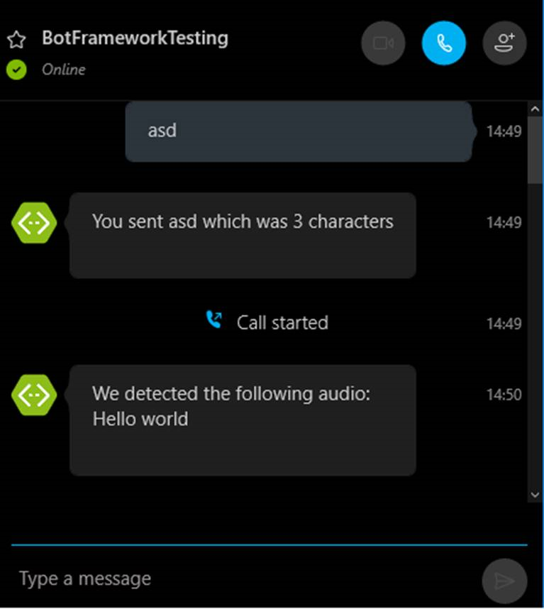

# Skype Calling Bot Sample

A sample bot showing how to use the Skype Bot Plaform for Calling API for receiving and handling Skype voice calls.

[![Deploy to Azure][Deploy Button]][Deploy CSharp/SkypeCallingBot]

[Deploy Button]: https://azuredeploy.net/deploybutton.png
[Deploy CSharp/SkypeCallingBot]: https://azuredeploy.net

### Prerequisites

The minimum prerequisites to run this sample are:
* The latest update of Visual Studio 2015. You can download the community version [here](http://www.visualstudio.com) for free.
* Skype Preview. To install the Skype Preview, get the app from [here](https://www.microsoft.com/en-us/store/p/skype-preview/9wzdncrfj364).
*  To fully test this sample you must:
   *  [Publish your bot, for example to Azure](https://docs.microsoft.com/en-us/bot-framework/publish-bot-overview) or use [Ngrok to interact with your local bot in the cloud](https://blogs.msdn.microsoft.com/jamiedalton/2016/07/29/ms-bot-framework-ngrok/).
   *  Register you bot in [Microsoft Bot Framework Portal](https://dev.botframework.com/bots). Please refer to [this](https://docs.microsoft.com/en-us/bot-framework/portal-register-bot) for the instructions. Once you complete the registration, update the [Bot's Web.config](Web.config#L10-L12) file with the registered config values (Bot Id, MicrosoftAppId and MicrosoftAppPassword). 
   *  Enable the Skype Channel and update the settings by enabling 1:1 audio cals and updating the Calling Webhook to be `https:://{your domain}/api/calling/call`. Refer to [this](https://docs.microsoft.com/en-us/bot-framework/portal-configure-channels) for more information on how to configure channels. 
   * Update the `Microsoft.Bot.Builder.Calling.CallbackUrl` setting of the [Bot's Web.config](Web.config#L15) file with the callback route `https://{yourdomain}/api/calling/callback`. 
   * Subscribe to the Microsoft Cognitive Services Bing Speech API [here](https://www.microsoft.com/cognitive-services/en-us/subscriptions) to get a key to use the API. Update the `MicrosoftSpeechApiKey` setting of the [Bot's Web.config](Web.config#L18) with the obtained key.
    
### Code Highlights

Skype Bot Platform for Calling API provides a mechanism for receiving and handling Skype voice calls by bots.

Check out the [`CallController`](Controllers/CallController.cs#L15) registering the instance of calling bot responsible for handling the calling requests with the [`CallingConversation`](https://docs.botframework.com/en-us/csharp/builder/sdkreference/d6/d56/class_microsoft_1_1_bot_1_1_builder_1_1_calling_1_1_calling_conversation.html) module.

````C#
public CallingController() : base()
{
    CallingConversation.RegisterCallingBot(callingBotService => new IVRBot(callingBotService));
}  
````

Every time a Skype user places a call to a bot, Skype Bot Platform for Calling will look up the calling url that was used during the configuration of the Skype channel (Calling Webhook) bot and notify the bot about the call. Check out the[`CallController`](Controllers/CallController.cs#L24-L28) processing a incoming call calling request within the the [`CallingConversation`](https://docs.botframework.com/en-us/csharp/builder/sdkreference/d6/d56/class_microsoft_1_1_bot_1_1_builder_1_1_calling_1_1_calling_conversation.html) module.

````C#
[Route("call")]
public async Task<HttpResponseMessage> ProcessIncomingCallAsync()
{
    return await CallingConversation.SendAsync(this.Request, CallRequestType.IncomingCall);
}
````

The bot can provide a list basic actions, called workflow, in response to initial call notification. In the first action of the workflow the bot should decide if it�s interested in answering the call or rejecting the call. Should the bot decide to answer the call, the subsequent actions instruct the Skype Bot Platform for Calling to either play prompt, record audio, recognize speech, or collect digits from a dial pad. The last action of the workflow could be a hang up the voice call. Skype Bot Platform for Calling then takes the workflow and attempts to execute actions in order given by bot.

If the workflow is executed successfully, the Skype Bot Platform for Calling will post a result of last action on the callback url configured in the project's Web.config. For example, if the last action was to record audio, the result will be a media content with audio data. If the workflow could not be completed, for example because a Skype user hang up the call, then the result will correspond to last executed action.

Check out the[`CallController`](Controllers/CallController.cs#L18-L22) processing a calling event request within the the [`CallingConversation`](https://docs.botframework.com/en-us/csharp/builder/sdkreference/d6/d56/class_microsoft_1_1_bot_1_1_builder_1_1_calling_1_1_calling_conversation.html) module.


````C#
[Route("callback")]
public async Task<HttpResponseMessage> ProcessCallingEventAsync()
{
    return await CallingConversation.SendAsync(this.Request, CallRequestType.CallingEvent);
}

````

During a voice call, the bot can decide after each callback on how to continue interaction with Skype user. This allows the bots to drive complex interactions comprising of basic action steps.

In the sample, when the incoming call is received, it is answered and the user is presented with a welcome message and new state entry is created for him. The state also contains the participants of the incoming call, as later on the sample information from them will be used.

````C#
private Task OnIncomingCallReceived(IncomingCallEvent incomingCallEvent)
{
    this.callStateMap[incomingCallEvent.IncomingCall.Id] = new CallState(incomingCallEvent.IncomingCall.Participants);

    incomingCallEvent.ResultingWorkflow.Actions = new List<ActionBase>
    {
        new Answer { OperationId = Guid.NewGuid().ToString() },
        GetPromptForText(WelcomeMessage)
    };

    return Task.FromResult(true);
}
````

Once the PlayPrompt of the welcome message is completed, the initial menu is presented to the user.

````C#
private Task OnPlayPromptCompleted(PlayPromptOutcomeEvent playPromptOutcomeEvent)
{
    var callState = this.callStateMap[playPromptOutcomeEvent.ConversationResult.Id];
    SetupInitialMenu(playPromptOutcomeEvent.ResultingWorkflow);

    return Task.FromResult(true);
}
````

The menu is created using a [`Recognize`](https://docs.botframework.com/en-us/skype/calling#recognize) action and set of [`RecognitionOption`](https://docs.botframework.com/en-us/skype/calling#recognitionoption). It supports speech and DTMF choice-based recognition.

Check out the [`CreateIvrOptions`](IVRBot.cs#L113-L141) method automatizing the creation of the `Recognize` action.

````C#
private static Recognize CreateIvrOptions(string textToBeRead, int numberOfOptions, bool includeBack)
{
    if (numberOfOptions > 9)
    {
        throw new Exception("too many options specified");
    }

    var choices = new List<RecognitionOption>();

    for (int i = 1; i <= numberOfOptions; i++)
    {
        choices.Add(new RecognitionOption { Name = Convert.ToString(i), DtmfVariation = (char)('0' + i) });
    }

    if (includeBack)
    {
        choices.Add(new RecognitionOption { Name = "#", DtmfVariation = '#' });
    }

    var recognize = new Recognize
    {
        OperationId = Guid.NewGuid().ToString(),
        PlayPrompt = GetPromptForText(textToBeRead),
        BargeInAllowed = true,
        Choices = choices
    };

    return recognize;
}
````

Once the user choose an option and the recognize is completed, the selection is being processed. 

````C#
private Task OnRecognizeCompleted(RecognizeOutcomeEvent recognizeOutcomeEvent)
{
    var callState = this.callStateMap[recognizeOutcomeEvent.ConversationResult.Id];

    ProcessMainMenuSelection(recognizeOutcomeEvent, callState);

    return Task.FromResult(true);
}
````

In this sample there is only a single option that will asks the user to record a message. Check out the [`SetupRecording`](IVRBot.cs#L143-L160) method creating the [`Record`](https://docs.botframework.com/en-us/skype/calling#record) action to record the user audio.

````C#
private static void SetupRecording(Workflow workflow)
{
    var id = Guid.NewGuid().ToString();

    var prompt = GetPromptForText(NoConsultantsMessage);
    var record = new Record
    {
        OperationId = id,
        PlayPrompt = prompt,
        MaxDurationInSeconds = 60,
        InitialSilenceTimeoutInSeconds = 5,
        MaxSilenceTimeoutInSeconds = 4,
        PlayBeep = true,
        RecordingFormat = RecordingFormat.Wav,
        StopTones = new List<char> { '#' }
    };
    workflow.Actions = new List<ActionBase> { record };
}
````

Once the recording is successfully completed, you will have access to the content recorded by the user.

In this sample, the recorded audio is being sent to the [Microsoft Cognitive Services Bing Speech API](https://www.microsoft.com/cognitive-services/en-us/speech-api) to convert the audio to text and then displayed back to the user within the Skype conversation.

````C#
private async Task OnRecordCompleted(RecordOutcomeEvent recordOutcomeEvent)
{
    recordOutcomeEvent.ResultingWorkflow.Actions = new List<ActionBase>
        {
            GetPromptForText(EndingMessage),
            new Hangup { OperationId = Guid.NewGuid().ToString() }
        };

    // Convert the audio to text
    if (recordOutcomeEvent.RecordOutcome.Outcome == Outcome.Success)
    {
        var record = await recordOutcomeEvent.RecordedContent;
        string text = await this.GetTextFromAudioAsync(record);

        var callState = this.callStateMap[recordOutcomeEvent.ConversationResult.Id];

        await this.SendSTTResultToUser("We detected the following audio: " + text, callState.Participants);
    }

    recordOutcomeEvent.ResultingWorkflow.Links = null;
    this.callStateMap.Remove(recordOutcomeEvent.ConversationResult.Id);
}
````

To send the text back to the conversation, the information from the call participants is used to create an `IMessageActivity` that the `ConnectorClient` sends to the ongoing conversation.

````C#
private async Task SendSTTResultToUser(string text, IEnumerable<Participant> participants)
{
    var to = participants.Single(x => x.Originator);
    var from = participants.First(x => !x.Originator);

    await AgentListener.Resume(to.Identity, to.DisplayName, from.Identity, from.DisplayName, to.Identity, text);
}
````
````C#
public static async Task Resume(
    string toId, 
    string toName, 
    string fromId, 
    string fromName, 
    string conversationId, 
    string message, 
    string serviceUrl = "https://skype.botframework.com", 
    string channelId = "skype")
{
    if (!MicrosoftAppCredentials.IsTrustedServiceUrl(serviceUrl))
    {
        MicrosoftAppCredentials.TrustServiceUrl(serviceUrl);
    }

    try
    {
        var userAccount = new ChannelAccount(toId, toName);
        var botAccount = new ChannelAccount(fromId, fromName);
        var connector = new ConnectorClient(new Uri(serviceUrl));

        IMessageActivity activity = Activity.CreateMessageActivity();

        if (!string.IsNullOrEmpty(conversationId) && !string.IsNullOrEmpty(channelId))
        {
            activity.ChannelId = channelId;
        }
        else
        {
            conversationId = (await connector.Conversations.CreateDirectConversationAsync(botAccount, userAccount)).Id;
        }

        activity.From = botAccount;
        activity.Recipient = userAccount;
        activity.Conversation = new ConversationAccount(id: conversationId);
        activity.Text = message;
        activity.Locale = "en-Us";
        await connector.Conversations.SendToConversationAsync((Activity)activity);
    }
    catch (Exception exp)
    {
        Debug.WriteLine(exp);
    }
}
````

### Outcome

When running the sample, if you send something to the bot, the message will be just echoed. If you call the bot, you will be presented with the menu with a single option. If you press 1, you will be prompted to leave a message which will be recorded, analyzed with the Bing Speech API and displayed back in the conversation.



### More Information

To get more information about how to get started in Bot Builder for .NET and the Skype Calling API please review the following resources:

* [Bot Builder for .NET](https://docs.microsoft.com/en-us/bot-framework/dotnet/)
* [Support audio calls with Skype](https://docs.microsoft.com/en-us/bot-framework/dotnet/bot-builder-dotnet-audio-calls)
* [Skype Calling API](https://docs.botframework.com/en-us/skype/calling/)
* [Microsoft Cognitive Services Bing Speech API](https://www.microsoft.com/cognitive-services/en-us/speech-api)
