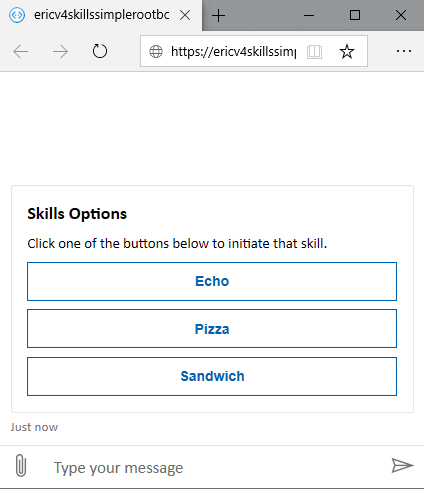

# Bot Framework V3 Skills

This sample was created using `Microsoft.Bot.Builder` [v3.30.0](https://www.nuget.org/packages/Microsoft.Bot.Builder/3.30.0) and [v4.7.2](https://www.nuget.org/packages/Microsoft.Bot.Builder/4.7.2) sdks. It shows how to create a simple skill consumer (SimpleRootBot) which sends message activities to any of three V3 bots converted to skills.



Steps to convert a bot to a Skill using SDK v3.30.0:
1)	In the v3 bot's message controller, change the attribute applied to the controller from `BotAuthentication` to `SkillBotAuthentication`.
1)	In the bot's web.config file, add an `AllowedCallers` app setting. The allowed callers array can restrict which skill consumers can access the skill. Set this to "*" to accept calls from any skill consumer, or set it to a comma-delimited list of the app IDs of the allowed consumers.
1)	Add code to send the skill host `EndOfConversation` when the skill is finished.


## Minimum Prerequisites

- [.NET Core SDK 2.1](https://dotnet.microsoft.com/download) 

  ```bash
  # determine dotnet versions installed
  dotnet --list-sdks
  ```

- [.NET Framework 4.6.1](https://dotnet.microsoft.com/download/dotnet-framework) or greater

  [How to: Determine which .NET Framework versions are installed](https://docs.microsoft.com/en-us/dotnet/framework/migration-guide/how-to-determine-which-versions-are-installed)

## Key concepts in this sample

The solution includes a parent bot (`SimpleRootBot`) built using [v4.7.2](https://www.nuget.org/packages/Microsoft.Bot.Builder/4.7.2) and three skill bots (`EchoBot`, `PizzaBot`, `SimpleSandwichBot`) built using [v3.30.0](https://www.nuget.org/packages/Microsoft.Bot.Builder/3.30.0). This example demonstrates how a parent bot can post activities to skill bots and returns the skill responses to the user.

- `SimpleRootBot`: this project is based on [80.skills-simple-bot-to-bot](https://github.com/microsoft/BotBuilder-Samples/tree/master/samples/csharp_dotnetcore/80.skills-simple-bot-to-bot) It shows how to consume the three V3 skills and includes:
  - A [RootBot](V4SimpleRootBot/Bots/RootBot.cs) which calls the user chosen skill and keeps the conversation active until the user says "end" or "stop". [RootBot](V4SimpleRootBot/Bots/RootBot.cs) also keeps track of the conversation with the skill and handles the `EndOfConversation` activity received from the skill to terminate the conversation.
  - A simple [SkillConversationIdFactory](V4SimpleRootBot/SkillConversationIdFactory.cs) based on an in memory `ConcurrentDictionary` that creates and maintains conversation IDs used to interact with a skill
  - A [SkillsConfiguration](V4SimpleRootBot/SkillsConfiguration.cs) class that loads skill definitions from `appsettings`
  - A [SkillController](V4SimpleRootBot/Controllers/SkillController.cs) that handles skill responses
  - An [AllowedSkillsClaimsValidator](V4SimpleRootBot/Authentication/AllowedSkillsClaimsValidator.cs) is used to validate responses sent to the bot are coming from the configured skills
  - A [Startup](V4SimpleRootBot/Startup.cs) class that shows how to register the different skill components for dependency injection

- `EchoBot`: this project shows a simple echo skill that receives message activities from the parent bot and echoes what the user said. This project includes:
  - A sample [CustomAllowedCallersClaimsValidator.cs](EchoSkillBot/Authentication/CustomAllowedCallersClaimsValidator.cs.cs) that shows how to provide custom validation, ensuring the skill is only invoked from a list of allowed callers.  Other samples use the default `AllowedCallersClaimsValidator`
  - A sample [MessagesController](V3EchoBot/Controllers/MessagesController.cs) that shows how to send EndOfConversation based on the message sent to the skill and yield control back to the parent bot. The MessagesController also shows how to use a custom `AuthenticationConfigurationProviderType` for Skill validation.

- `PizzaBot`: this project shows a simple pizza ordering skill that receives message activities from the parent bot and sends the user's order back to the parent when finished.
  - A sample [SkillHelper](V3PizzaBot/SkillsHelper.cs) that shows how to send EndOfConversation with results back to the parent bot.
  - A sample [MessagesController](V3EchoBot/Controllers/MessagesController.cs) that shows how to use `SkillBotAuthentication`.
  - This project is from the [V3 Samples PizzaBot](https://github.com/microsoft/BotBuilder-V3/tree/master/CSharp/Samples/PizzaBot)  Changes required to return results to the parent can be found in [PizzaOrderDialog](V3PizzaBot/PizzaOrderDialog.cs)'s `PizzaFormComplete` method.

- `SimpleSandwichBot`: this project shows a simple sandwich ordering skill that receives message activities from the parent bot and sends the user's order back to the parent when finished.
  - A sample [SkillHelper](V3SimpleSandwichBot/SkillsHelper.cs) that shows how to send EndOfConversation with results back to the parent bot.
  - A sample [MessagesController](V3SimpleSandwichBot/Controllers/MessagesController.cs) that shows how to use `SkillBotAuthentication`.
  - This project is from the [V3 Samples SimpleSandwichBot](https://github.com/microsoft/BotBuilder-V3/tree/master/CSharp/Samples/SimpleSandwichBot)  Changes required to return results to the parent can be found in [Sandwich](V3SimpleSandwichBot/Sandwich.cs)'s `BuildForm` method's `OnCompletion` handler.

## To try this sample

- Clone the repository.

    ```bash
    git clone https://github.com/microsoft/botbuilder-samples.git
    ```

- Open the `\MigrationV3V4\CSharp\Skills\Skills.sln` and configure it to [start debugging with multiple processes](https://docs.microsoft.com/en-us/visualstudio/debugger/debug-multiple-processes?view=vs-2019#start-debugging-with-multiple-processes). Include all 4 projects.
- Create a bot registration in the azure portal for the `SimpleRootBot` and update [SimpleRootBot/appsettings.json](SimpleRootBot/appsettings.json) with the `MicrosoftAppId` and `MicrosoftAppPassword` of the new bot registration.
- Create a bot registration in the azure portal for the `EchoBot` and update [Web.config](V3EchoBot/Web.config) with the `MicrosoftAppId` and `MicrosoftAppPassword` of the new bot registration.  Do the same for `PizzaBot` and `SimpleSandwichBot`.
- Add the `SimpleRootBot` `MicrosoftAppId` to the `AllowedCallers` list in `web.config` for each skill. (This config setting is called `EchoBotAllowedCallers` in the EchoBot project, as a demonstration of `CustomSkillAuthenticationConfiguration`.)
- Update the `BotFrameworkSkills` section in [SimpleRootBot/appsettings.json](SimpleRootBot/appsettings.json) with the app IDs for the skills you created in the previous steps.

## Testing the bot using Bot Framework Emulator

[Bot Framework Emulator](https://github.com/microsoft/botframework-emulator) is a desktop application that allows bot developers to test and debug their bots on localhost or running remotely through a tunnel.

- Install the Bot Framework Emulator version 4.7.0 or greater from [here](https://github.com/Microsoft/BotFramework-Emulator/releases).

### Connect to the bot using Bot Framework Emulator

- Launch the Bot Framework Emulator.
- Select File -> Open Bot.
- Enter a Bot URL of `http://localhost:3978/api/messages`, the `MicrosoftAppId` and `MicrosoftAppPassword` for the `SimpleRootBot`

## Deploy the bots to Azure

To learn more about deploying a bot to Azure, see [Deploy your bot to Azure](https://aka.ms/azuredeployment) for a complete list of deployment instructions.
