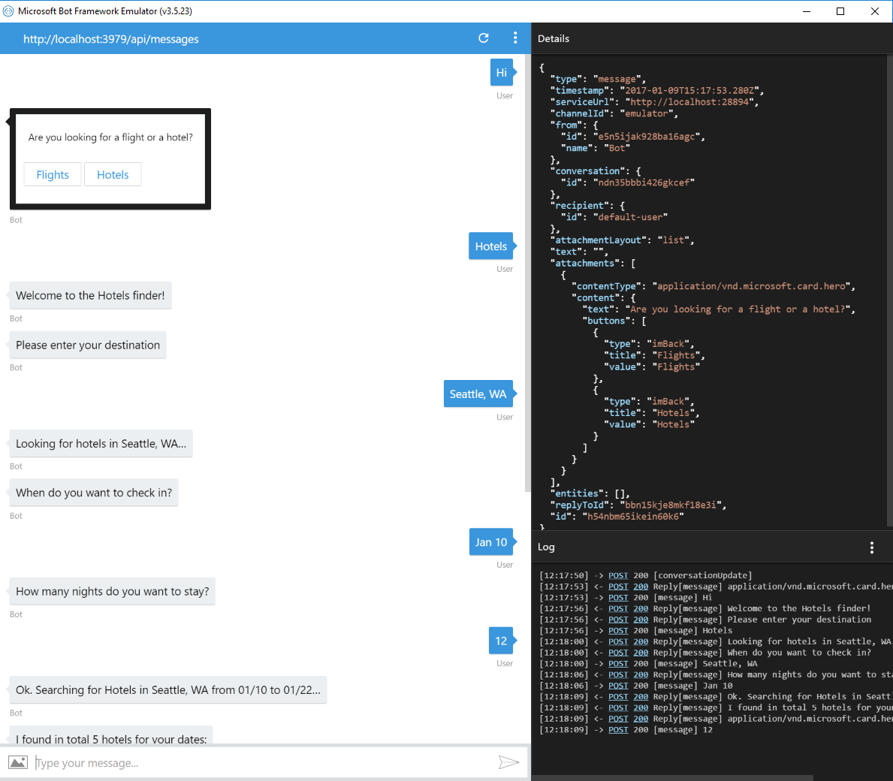
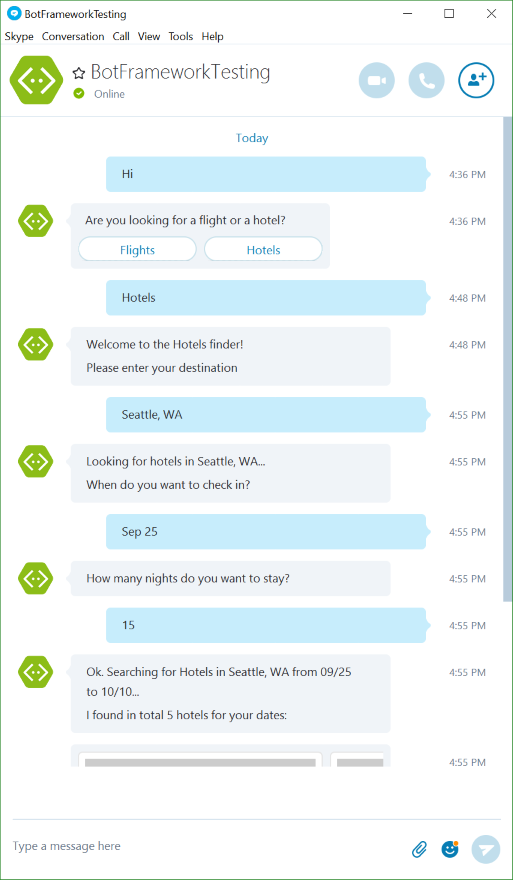

# Multi-Dialog Bot Sample

A sample bot showing different kind of dialogs.

[![Deploy to Azure][Deploy Button]][Deploy Node/MultiDialogs]

[Deploy Button]: https://azuredeploy.net/deploybutton.png
[Deploy Node/MultiDialogs]: https://azuredeploy.net

### Prerequisites

The minimum prerequisites to run this sample are:
* Latest Node.js with NPM. Download it from [here](https://nodejs.org/en/download/).
* The Bot Framework Emulator. To install the Bot Framework Emulator, download it from [here](https://emulator.botframework.com/). Please refer to [this documentation article](https://github.com/microsoft/botframework-emulator/wiki/Getting-Started) to know more about the Bot Framework Emulator.
* **[Recommended]** Visual Studio Code for IntelliSense and debugging, download it from [here](https://code.visualstudio.com/) for free.

### Code Highlights

With the Bot Builder SDK you'll use [dialogs](https://docs.microsoft.com/en-us/bot-framework/nodejs/bot-builder-nodejs-dialog-manage-conversation) to organize your bots conversations with the user. The bot tracks where it is in the conversation with a user using a stack that's persisted to the bots storage system. When the bot receives the first message from a user it will push the bots default dialog (`/`) onto the stack and pass that dialog the users message. The dialog can either process the incoming message and send a reply directly to the user or it can start other dialogs which will guide the user through a series of questions that collect input from the user needed to complete some task.

The session includes several methods for managing the bots dialog stack and therefore manipulate where the bot is conversationally with the user. Once you get the hang of working with the dialog stack you can use a combination of dialogs and the sessions stack manipulation methods to achieve just about any conversational flow you can dream of.

A bots dialogs can be expressed using a variety of forms:

* **Waterfall**

  Waterfalls let you collect input from a user using a sequence of steps. A bot is always in a state of providing a user with information or asking a question and then waiting for input. In the Node version of Bot Builder it's waterfalls that drive this back-n-forth flow.
* **Closure**

  You can also pass a single function for your dialog handler which simply results in creating a 1 step waterfall
* **Dialog object**

  For more specialized dialogs you can add an instance of a class that derives from the Dialog base class. This gives maximum flexibility for how your bot behaves as the built-in prompts and even waterfalls are implemented internally as dialogs.
* **SimpleDialog**

  Allows for the creation of custom dialogs that are based on a simple closure. This is useful for cases where you want a dynamic conversation flow or you have a situation that just doesn't map very well to using a waterfall.

#### Routing dialogs

Bot Builder uses dialogs to manage a bot's conversations with a user. To understand dialogs it's easiest to think of them as the equivalent of routes for a website. All bots will have at least one root ‘/' dialog just like all websites typically have at least one root ‘/' route. When the framework receives a message from the user it will be routed to this root ‘/' dialog for processing. For many bots this single root ‘/' dialog is all that's needed but just like websites often have multiple routes, bots will often have multiple dialogs.

Check out how app.js uses the [UniversalBot constructor](app.js#L26) to register the main waterfall dialog and then `bot.dialog()` to register each of the child dialogs: [`flights, hotels and support`](app.js#L62-L64).
Each dialog has its own route path. We also placed each dialog handler in a separate file for maintainability.

````JavaScript
// hotels.js
module.exports = [
    // Destination
    function (session) {
        session.send('Welcome to the Hotels finder!');
        builder.Prompts.text(session, 'Please enter your destination');
    },
    function (session, results, next) {
        session.dialogData.destination = results.response;
        session.send('Looking for hotels in %s', results.response); 
        next();
    },
    ...
];

// app.js
var bot = new builder.UniversalBot(connector, [
    function (session) {
        // ...
    },
    // ...
]);

bot.dialog('hotels', require('./hotels'));
bot.dialog('flights', require('./flights'));
````

#### Waterfall dialogs
Our [Hotels dialog](hotels.js) shows how to collect user information using a sequence of steps. Some steps starts with a `prompt` to ask the user for information. The following step handles the response by saving it using dialogData. Then invokes the `next` function argument to pass control to the next step.
The last step ends performing an async call to a simulated store, printing the results and ending the dialog with `session.endDialog()`. This also returns control to the parent dialog (our root dialog).

````JavaScript
[
    // Destination
    function (session) {
        session.send('Welcome to the Hotels finder!');
        builder.Prompts.text(session, 'Please enter your destination');
    },
    function (session, results, next) {
        session.dialogData.destination = results.response;
        session.send('Looking for hotels in %s', results.response); 
        next();
    },
    ...
    function (session) {
        var destination = session.dialogData.destination;
        var checkIn = new Date(session.dialogData.checkIn);
        var checkOut = checkIn.addDays(session.dialogData.nights);

        session.send(
            'Ok. Searching for Hotels in %s from %d/%d to %d/%d...',
            destination,
            checkIn.getMonth() + 1, checkIn.getDate(),
            checkOut.getMonth() + 1, checkOut.getDate());

        // Async search
        Store
            .searchHotels(destination, checkIn, checkOut)
            .then(function (hotels) {
                // Results
                session.send('I found in total %d hotels for your dates:', hotels.length);

                var message = new builder.Message()
                    .attachmentLayout(builder.AttachmentLayout.carousel)
                    .attachments(hotels.map(hotelAsAttachment));

                session.send(message);

                // End
                session.endDialog();
            });
    }
]
````

#### Calling new dialogs

New dialogs can be triggered using [`session.beginDialog(id)`](https://docs.botframework.com/en-us/node/builder/chat-reference/classes/_botbuilder_d_.session.html#begindialog). The new dialog is added to the top of the stack and control is transfered to it. In [app.js](app.js#L51-L58) we show how to trigger a dialog based on a user selection.
Control is returned from the child dialog back to the caller (popping of the stack) using [`session.endDialog`](https://docs.botframework.com/en-us/node/builder/chat-reference/classes/_botbuilder_d_.session.html#enddialog) or [`session.endDialogWithResult`](https://docs.botframework.com/en-us/node/builder/chat-reference/classes/_botbuilder_d_.session.html#enddialogwithresult).

#### Listening to specific keywords to trigger dialogs

The Support dialog is triggered when a specific set of words is send by the user. This can be achieved by using the dialog's [triggerAction](https://docs.botframework.com/en-us/node/builder/chat-reference/classes/_botbuilder_d_.dialog.html#triggeraction) method.
Check out how to configure a dialog to [listen to specific words or Regular Expressions](app.js#L65-L67):

````JavaScript
bot.dialog('support', require('./support'))
    .triggerAction({
        matches: [/help/i, /support/i, /problem/i]
    });
````

#### Handling dialog errors

Errors can be signaled from child dialogs using [session.error](https://docs.botframework.com/en-us/node/builder/chat-reference/classes/_botbuilder_d_.session.html#error). This will signal the error via an on('error', err) event, for both the bot object and the session object. In [flights.js](flights.js#L2) we are signalling an error which the parent dialog handles using session.on('error'), as shown in [app.js](app.js#L45-L49):

````JavaScript
session.on('error', function (err) {
    session.send('Failed with message: %s', err.message);
    session.endDialog();
});
````

You can also listen for errors triggered on any level by subscribing to the `error` event exposed by the UniversalBot. Check out [how to log bot errors globally](app.js#L69-L72):

````JavaScript
// log any bot errors into the console
bot.on('error', function (e) {
    console.log('And error ocurred', e);
});
````

#### Asynchronous operations

Inevitably, you're going to want to make some asynchronous network call to retrieve data and then send those results to the user using the session object. This is completely fine but there are a few best practices you'll want to follow.

* Use session.send within your callback or event handler.
* Do not call session.endDialog() immediately after starting the asynchronous call;
* Instead call session.endDialog() from within your callback or event handler. 

Check out [hotels.js](hotels.js#L46-L61) where we are calling an asynchronous method that returns a Promise. Our fulfill method calls `session.send()` and is also responsible for calling `session.endDialog()`.

````JavaScript
// Async search
Store
    .searchHotels(destination, checkIn, checkOut)
    .then(function (hotels) {
        // Results
        session.send('I found in total %d hotels for your dates:', hotels.length);

        var message = new builder.Message()
            .attachmentLayout(builder.AttachmentLayout.carousel)
            .attachments(hotels.map(hotelAsAttachment));

        session.send(message);

        // End
        session.endDialog();
    });
````

### Outcome

You will see the following result in the Bot Framework Emulator when opening and running the sample solution.



You will see the following in your Facebook Messenger.


On the other hand, you will see the following in Skype.



### More Information

To get more information about how to get started in Bot Builder for Node and Dialogs please review the following resources:
* [Bot Builder for Node.js Reference](https://docs.microsoft.com/en-us/bot-framework/nodejs/)
* [Dialogs](https://docs.microsoft.com/en-us/bot-framework/nodejs/bot-builder-nodejs-dialog-manage-conversation)
* [Dialog Stack](https://docs.microsoft.com/en-us/bot-framework/nodejs/bot-builder-nodejs-dialog-manage-conversation#dialog-stack)
* [Prompt users for input](https://docs.microsoft.com/en-us/bot-framework/nodejs/bot-builder-nodejs-dialog-prompt)
* [Starting and ending dialogs] (https://docs.microsoft.com/en-us/bot-framework/nodejs/bot-builder-nodejs-dialog-manage-conversation#starting-and-ending-dialogs)
* [Using Session in Callbacks](https://docs.botframework.com/en-us/node/builder/chat/session/#using-session-in-callbacks)

> **Limitations**  
> The functionality provided by the Bot Framework Activity can be used across many channels. Moreover, some special channel features can be unleashed using the [Message.sourceEvent](https://docs.botframework.com/en-us/node/builder/chat-reference/classes/_botbuilder_d_.message.html#sourceevent) method.
> 
> The Bot Framework does its best to support the reuse of your Bot in as many channels as you want. However, due to the very nature of some of these channels, some features are not fully portable.
> 
> The features used in this sample are fully supported in the following channels:
> - Skype
> - Facebook
> - Microsoft Teams
> - Slack
> - DirectLine
> - WebChat
> - Email
> - GroupMe
> - Kik
> - Telegram
> 
> On the other hand, they are not supported and the sample won't work as expected in the following channel:
> - SMS
