# LUIS Action Binding Sample

A sample that contains a core implementation for doing LUIS Action Binding, in order to handle LUIS intents taking a service result as input. In addition, the project contains Action samples and shows how to integrate them in a console, a bot and a web application.

### Prerequisites

The minimum prerequisites to run this sample are:
* Latest Node.js with NPM. Download it from [here](https://nodejs.org/en/download/).
* The Bot Framework Emulator. To install the Bot Framework Emulator, download it from [here](https://emulator.botframework.com/). Please refer to [this documentation article](https://github.com/microsoft/botframework-emulator/wiki/Getting-Started) to know more about the Bot Framework Emulator.
* **[Recommended]** Visual Studio Code for IntelliSense and debugging, download it from [here](https://code.visualstudio.com/) for free.

#### LUIS Application
If you want to test this sample, you have to import the pre-build [LUIS_MODEL.json](LUIS_MODEL.json) file to your LUIS account.

The first step to using LUIS is to create or import an application. Go to the home page, www.luis.ai, and log in. After creating your LUIS account you'll be able to Import an Existing Application where can you can select a local copy of the LUIS_MODEL.json file an import it.

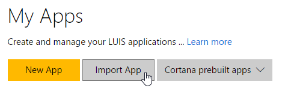

Once you imported the application you'll need to "train" the model ([Training](https://www.microsoft.com/cognitive-services/en-us/LUIS-api/documentation/Train-Test)) before you can "Publish" the model in an HTTP endpoint. For more information, take a look at [Publishing a Model](https://www.microsoft.com/cognitive-services/en-us/LUIS-api/documentation/PublishApp).

Finally, edit the [samples/.env](samples/.env#L6) file and update the `LUIS_MODEL_URL` variable with your's Model URL.

#### Where to find the Model URL

In the LUIS application's dashboard, click the "Publish App" button in the right side bar, select an Endpoint Key and then click the "Publish" button. After a couple of moments, you will see a url that makes your models available as a web service.

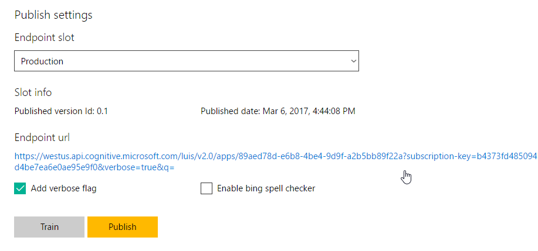

### What is LUIS Action Binding?

There are times when you may want to link an intent to an action at client side (e.g.: in your Bot, or web app, or even a console app), with an easy binding logic for it, where you can also resolve complex things in order to fulfill an user's intent. In the same way that you can define an intent at LUIS UI for your app, you can also specify requirements for this action to be triggered when bound to an intent at client side. These requirements are known as action members, and will match recognizable entities for the intent that the action maps to.

The framework for client side Action Binding supports only one action per intent. Each action includes members (fields) mapping to entities. These action members can be optional or required, the client framework will provide you the tools to validate the action's state in order to see if it can be fulfilled or if further information is required from the user.

As said, the framework provides contracts to allow defining your actions at client side, a way to bind them to LUIS intents, and additional objects that allows validating and filling mandatory missing entities before you can proceed with the action fulfillment in order to complete the flow.

### Framework Supported Scenarios

The framework supports three main scenarios which are described below, but it also provides tools that you can use to implement or support your custom scenarios within your own apps.

#### Scenario #1 : Switch from an Action to a new Action

While filling a parameter for the current action, the user can provide an input that triggers the execution of a different action (related with a different intent)

Next, there is a sample to depict the scenario:

Scenario shows the user changing its mind (context switching)

````
Bot: What do you want to do?
User: Find me a hotel in Madrid                         -- This would trigger a new `FindHotels` intent with Madrid as Location entity
Bot: When do you want to check-in?
User: Today
Bot: When do you want to check-out?
User: I changed my mind, find flights to Madrid         -- This would trigger a new `FindFlights` intent with Madrid as Location entity (`FindHotels` progress is discarded)
Bot: When do you want to flight?
````

#### Scenario #2 : Trigger a Contextual Action within a valid Context

While filling a parameter for the current action, the user can provide an input that will trigger a contextual action that makes sense to execute it in the context of the current action.

Next, there is a sample to depict the scenario:

Scenario shows an user changing one of the context parameters already answered

````
Bot: What do you want to do?
User: Find me a hotel in Madrid                     -- This would trigger a new `FindHotels` intent with Madrid as Location entity
Bot: When do you want to check-in?
User: Today
Bot: When do you want to check-out?
User: Sorry, change the checkin date to tomorrow    -- This would trigger a `FindHotels-ChangeCheckin` intent with tomorrow as date (but will execute within the context of `FindHotels` and will update its check-in date previously set)
Bot: Ok, I changed the check-in date to tomorrow
Bot: When do you want to check-out?
````

#### Scenario #3 : Trigger a Contextual Action with no previous Context (ie. from scratch)

The user can provide an input that will trigger a contextual action (with no current context). The framework supports this scenario by providing a way to instantiate the contexts chain for it (ie. the chain of parent actions that will provide the whole context), and finally executes the request.

Next, there is a sample to depict the scenario:

Scenario shows an user changing a check-in date within its reservation (stored in a booking system)

````
User: Please change my check-in date to tomorrow
Bot: Ok, I changed the check-in date to tomorrow                -- This triggered the `FindHotels-ChangeCheckin` intent which should run in the context of the `FindHotels` action (so main action also is instanced)
Bot: I changed your reservation in Madrid from 03/25 to 03/27   -- The required parameters of the main context are iterated until it can call the action fulfillment
````

The framework also provides, within this scenario, a callback that you can use to hydrate or re-create the parent contexts for the action you are starting. So, for example, in case you have a booking system and you want to change a parameter within a 'PerformBooking' reference (main intent), you can have a related intent 'PerformBookingCheckinChange' which runs in the context of the previous one and if the user already has a reservation you can hydrate the context back from the repository where you stored it (more details about this specific scenario through the document).


### Code Highlights

As said, actions are objects that you define to fulfill a LUIS intent once it has been recognized by LUIS service. Each action would likely be mapped to one intent (although you can map an action to several intents if your domain would required it), and their models contain typed members (properties) that will be used to map entity values recognized within the intent by LUIS service.

As an example, you might have defined a `GetWeatherInPlace` intent within your LUIS app, and that intent would likely have a mandatory entity which is the `Place` you are requiring the weather information for. In order to fulfill that requirement, you would have an action object that will map to that intent, and its model will have a mandatory `string` property for the `Place` entity. The action is responsible for fulfilling the intent by using the appropiate weather service to get the required information.

In addition, you can define contextual actions that ran in the context of a parent action. You can have a `FindHotels` action and an additional contextual action for updating the check-in date. Actions and contextual actions both map to intents within your LUIS service, but the only difference is how you represent them in application and the behavior you want them to achieve. For this, as you will see, the framework has particular interfaces that allows you define actions or contextual actions.

#### Provisioned LUIS app

The provisioned app for the samples have the following intents and entities:

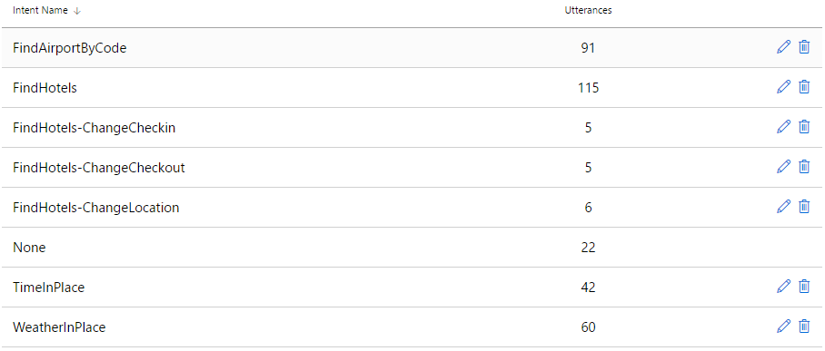

Below is a table describined the relations between the intents and entities recognized by them:

| Intent | Entities recognized | Utterance sample |
|--------|---------------------|------------------|
|FindAirportByCode|Code|Find SFO airport|
|FindHotels|Category, Checkin, Checkout, Place, RoomType|Find 3 stars standard rooms in Barcelona from 02/15 to 02/17|
|FindHotels-ChangeCheckin|Checkin|Change the check-in date to today (this changes the check-in within the `FindHotels` context)|
|FindHotels-ChangeCheckout|Checkout|Change the check-out date to tomorrow (this changes the check-out within the `FindHotels` context)|
|FindHotels-ChangeLocation|Place|Change the location to Madrid (this changes the place within the `FindHotels` context)|
|TimeInPlace|Place|What is the time in Madrid?|
|WeatherInPlace|Place|Tell me the weather in Buenos Aires|

You can find the JSON file to recreate the app into your own subscription here: [LUIS_MODEL.json](../LUIS_MODEL.json).

#### Defining a LUIS Action Binding

In this module (located in the [core folder](core)) you can find the core elements to implement LUIS Action Binding and react to LUIS Intents within your own apps. Each LUIS Action is implemented as a JavaScript object with four main fields, and other optional fields:

 - **intentName** *(string)*

   Determines which LUIS intent name the action should respond to.

- **friendlyName** *(string)*

   The friendly name is used to be displayed in some cases, as for example when you are switching from one action to another a prompt might ask you to confirm the switch and the friendly names of the actions are being shown in the confirmation message
 
 - **schema** *(object)*
 
   Defines the list of object properties the Action requires, their types and message to display to request the parameter. It is defined using schema-inspector. More information [here](https://github.com/Atinux/schema-inspector#v_properties).

   Each parameter is defined using the following fields, plus any [schema-inspector validation property](https://github.com/Atinux/schema-inspector#v_properties):

   - **type** *(string)*

     Defines the expected type. See [schema-inspector types](https://github.com/Atinux/schema-inspector#validation-1) for valid options.

   - **message** *(string)*

     Defines the message displayed to the user when the parameter is missing or validation does not pass.

   - **builtInType** *(string)* - (Optional)

     This is optional and is used to help identify the entity that should match to this parameter. See [LuisActions.BuiltInTypes](core/builtin.js) for valid options.
   
 - **fulfill** *(function)*

   This function fulfills the user action. It recieves the parameter values as a keyed-object and a callback function that should be invoked with the fulfillment result. Here you do whatever is required to fulfill the intent and provide a meaningful result.

 - **confirmOnContextSwitch** *(boolean)* - (Optional - default value is true)

   Indicates if the framework should ask for user confirmation when trying to switch from one context to a completely different one. See [Scenario #1](#scenario-1--switch-from-an-action-to-a-new-action).

 - **canExecuteWithoutContext** *(boolean)* - (Optional - default value is true)

   Indicates if the action can be executed without a previous parent context - only applies to contextual actions which can be triggered from scratch. See [Scenario #3](#scenario-3--trigger-a-contextual-action-with-no-previous-context-ie-from-scratch).

Example of a simple Action Binding:

````JavaScript
var WeatherInPlaceAction = {
    intentName: 'WeatherInPlace',
    friendlyName: 'What\'s the weather?',
    // Property validation based on schema-inspector - https://github.com/Atinux/schema-inspector#v_properties
    schema: {
        Place: {
            type: 'string',
            message: 'Please provide a location'
        }
    },
    // Action fulfillment method, recieves parameters as keyed-object (parameters argument) and a callback function to invoke with the fulfillment result.
    fulfill: function (parameters, callback) {
        rp({
            url: util.format('http://api.apixu.com/v1/current.json?key=%s&q=%s', ApixuApiKey, encodeURIComponent(parameters.Place)),
            json: true
        }).then(function (data) {
            if (data.error) {
                callback(data.error.message + ': "' + parameters.Place + '"');
            } else {
                callback(util.format('The current weather in %s, %s is %s (humidity %s %%)',
                    data.location.name, data.location.country, data.current.condition.text, data.current.humidity));
            }
        }).catch(console.error);
    }
};
````

#### Sample Action Bindings

In the [samples folder](samples/) you'll find samples on how to implement Luis Actions.

For example, [`FindHotelsAction`](samples/hotels.js#L4-L39) defines an Action Binding for the `FindHotels` intent, defined in our previous LUIS model.
This Action Binding has five parameters: three required (Place, Checkin and Checkout) and two optionals (Category and RoomType). These paramteres will be filled with the entities extracted from the user's intent. The matching can be done in two ways: by matching the entity name to the parameter name or by matching the [LUIS Pre-built entity types](https://www.microsoft.com/cognitive-services/en-us/LUIS-api/documentation/Pre-builtEntities) to the parameter's `builtInType` field.

Validation of these paremeters is provided using `schema-inspector` validations, an object schema validator. More information can be found [here](https://github.com/Atinux/schema-inspector#validation).
The fulfillment of this Action is action is a mock implementation, it only prints out the query details.

````JavaScript
var FindHotelsAction = {
    intentName: 'FindHotels',
    friendlyName: 'Find Hotel Room',
    confirmOnContextSwitch: true,           // true by default
    // Property validation based on schema-inspector - https://github.com/Atinux/schema-inspector#v_properties
    schema: {
        Place: {
            type: 'string',
            builtInType: LuisActions.BuiltInTypes.Geography.City,
            message: 'Please provide a location'
        },
        Checkin: {
            type: 'date',
            builtInType: LuisActions.BuiltInTypes.DateTime.Date,
            validDate: true, message: 'Please provide the check-in date'
        },
        Checkout: {
            type: 'date',
            builtInType: LuisActions.BuiltInTypes.DateTime.Date,
            validDate: true, message: 'Please provide the check-out date'
        },
        Category: {
            type: 'string',
            optional: true
         },
        RoomType: {
            type: 'string',
            optional: true
        }
    },
    // Action fulfillment method, recieves parameters as keyed-object (parameters argument) and a callback function to invoke with the fulfillment result.
    fulfill: function (parameters, callback) {
        callback(util.format('Sorry, there are no %s rooms available at %s for your chosen dates (%s) to (%s), please try another search.',
            parameters.RoomType || '', parameters.Place, formatDate(parameters.Checkin), formatDate(parameters.Checkout)));
    }
};
````

Here are more samples of LUIS Actions:

 - [FindHotelsAction and its contextual actions](samples/hotels.js)
 - [FindAirportCodeAction](samples/airports.js)
 - [TimeInPlaceAction](samples/time.js)
 - [WeatherInPlaceAction](samples/weather.js)

Next, you will see how to integrate Action Bindings to your application.

#### Using LUIS Action Binding - Action Model and Programmatic usage

The framework provides an easy hook for integrating Action Binding within a Bot built using BotBuilder (as you'll see in the next section), but a low-level construct is offered that can be used programatically with any application type. The Console and Web application samples makes use of this building block.

This option is provided by the [`LuisAction.evaluate`](core/index.js#L35) method and has the following signature:

````TypeScript
function evaluate(
    modelUrl: string,
    actions: Array<IAction>,
    currentActionModel?: IActionModel,
    userInput?: string,
    onContextCreationHandler?: onContextCreationHandler)
    : PromiseLike<IActionModel>;
````

> NOTE: You can check the [TypeScript bindings](core/index.d.ts) as reference.

The input parameters are:

 - `modelUrl` is the LUIS.ai application url.
 - `actions` is an array of Action Binding definitions (see above for its [definition](#defining-a-luis-action-binding) and [samples](#sample-action-bindings)).
 - `currentActionModel` is the `actionModel` returned from a previous call. The first time you invoke this method, it should be null.
 - `userInput` is the current input string - typically submitted by the user.
 - `onContextCreationHandler` is an optional callback for re-hydrate the context when triggering contextual actions (this is part of [Scenario #3](#scenario-3--trigger-a-contextual-action-with-no-previous-context-ie-from-scratch)).

The returned Promise resolves to an `IActionModel` (just `actionModel` from now on) that can be used to re-call the `evaluate` function and, in that way, keep the *context* of the conversation and the action binding state.

This `IActionModel` object its a plain object that has the following fields:

 - `status` describes the Action status (see [ActionBinding.Status](core/index.js#L9-L12)).
 - `intentName` is the matched intent name. This is later used to locate the action definition again.
 - `result` is the result object when the action status is `Fulfilled`.
 - `userInput` is the current or last input string.
 - `currentParameter` is the parameter name that is being filled. Helps to identify if `userInput` should be evaluated as a parameter's value.
 - `parameters` is a keyed-object with the parameters' values. Each parameter name is used as a key of this object.
 - `parameterErrors` is an array of the missing or invalid parameters. Each item has a `parameterName` and `message` fields.
 - `subcontextResult` contains the intermediate result for a fulfilled contextual action and is used internally by the framework.

When the `actionModel.status` is `ContextSwitch` (this is used to cover [Scenario #1](#scenario-1--switch-from-an-action-to-a-new-action)), two new fields are added:
 - `contextSwitchPrompt` is the message to display to the user that contains information regarding the action about to discard, and the new action about to trigger.
 - `confirmSwitch` is the boolean field that must be set to indicate if the pending context switch should be triggered or ignored. After updating its value, you should call `evaluate` again to confirm or reject the context switch.

The `onContextCreationHandler` parameter is a function used to re-hydrate context for a contextual action, as seen in [Scenario #3](#scenario-3--trigger-a-contextual-action-with-no-previous-context-ie-from-scratch). The function has three parameters:

 - `action`: The Action Binding definition that triggered the context creation.
 - `actionModel`: The action model, which contains the `parameters` object you'll want to complete.
 - `next`: The method that must be called to continue the execution of the Action Binding. This is required to support asynchronous calls.

The Console sample has a [custom handler](samples/console/app.js#L93-L122) that re-hydrates the FindHotels action context with some default values.
 
> NOTE: When defining the `onContextCreationHandler` function, remember to call `next()` to continue executing the action binding's logic.

#### Using LUIS Action Bindings within a Bot

In the [samples/bot/app.js](samples/bot/app.js) you can see how the Action Bindings are used within a bot application.

The key thing here is creating an `IntentDialog` with a `LuisRecognizer`, and bind the Actions array to the bot and dialog using the [`bindToBotDialog`](core/index.js#L181-L208) helper function. Here's a simplified version:

````JavaScript
var LuisModelUrl = process.env.LUIS_MODEL_URL;

var recognizer = new builder.LuisRecognizer(LuisModelUrl);
var intentDialog = bot.dialog('/', new builder.IntentDialog({ recognizers: [recognizer] })
    .onDefault(function (session) {
        session.endDialog(
            'Sorry, I did not understand "%s". Use sentences like "What is the time in Miami?", "Search for 5 stars hotels in Barcelona", "Tell me the weather in Buenos Aires", "Location of SFO airport")',
            session.message.text);
    }));

// Import the Core stuff
var LuisActions = require('../../core');

// Import an array with Binding Actions
var SampleActions = require('../all');

// Finally, bind the actions to the bot and intentDialog, using the same URL from the LuisRecognizer
LuisActions.bindToBotDialog(bot, intentDialog, LuisModelUrl, SampleActions);
````

The [`bindToBotDialog`](core/index.js#L181-L208) function registers each Action Binding with the IntentDialog, using the action's `intentName`. Internally, it uses the dialog's [`matches()`](https://docs.botframework.com/en-us/node/builder/chat-reference/classes/_botbuilder_d_.intentdialog.html#matches) function.

The function also registers with the bot a new BotBuilder library that contains a single dialog, named [`Evaluate`](core/index.js#L216).
Then, it uses the internal [`createBotAction`](core/index.js#L320) function to route incomming messages with matching intents to the [`Evaluate`](core/index.js#L216) dialog.

The `Evaluate` dialog extracts the entities from the [LUIS Result](https://docs.botframework.com/en-us/node/builder/chat-reference/interfaces/_botbuilder_d_.iintentrecognizerresult.html), maps them to parameters, validates the parameter values and, if possible, fulfills the action function, among other things.

When validation does not pass, [prompt messages](core/index.js#L283-L293) are presented to the user to provide each of the missing or invalid parameters and continues until validation passes. Then the [fulfill function is invoked](core/index.js#L302-L307), passing all validated parameters.

The [`bindToBotDialog`](core/index.js#L181-L208) function accepts an optional set of arguments for customizing some of its behavior, as seen in the [bindToBotDialog call](samples/bot/app.js#L26-L30). The optional set of arguments are:

- `defaultReply`: [Optional] Defined as a function that accepts a `session` object. This function is invoked when an intent is detected but not mapped to an action and can be used to reply with a custom message or trigger custom logic. An example is the [DefaultReplyHandler function](samples/bot/app.js#L32-L36).

- `fulfillReply`: [Optional] Defined as a function that accepts a `session` object and the fulfilled `actionModel`. It can be used to send to the user a customized message with the actionModel's result (e.g.: the result wrapped on a RichCard or AdaptiveCard) or do any further processing (e.g.: telemetry). An example is the [FulfillReplyHandler function](samples/bot/app.js#L38-L41).

- `onContextCreation`: [Optional] Function used to re-hydrate context for a contextual action, as seen in [Scenario #3](#scenario-3--trigger-a-contextual-action-with-no-previous-context-ie-from-scratch).
The parameter is defined as a funcion with four parameters:

    - `action`: The Action Binding definition that triggered the context creation.
    - `actionModel`: The action model, which contains the `parameters` object you'll want to complete.
    - `next`: The method that must be called to continue the execution of the Action Binding. This is required to support asynchronous calls.
    - `session`: The BotBuilder session object. Can be used to retrieve the user's address id or even send messages.

    The Bot sample has a [custom handler](samples/bot/app.js#L43-L75) that re-hydrates the FindHotels action context with default values.
 
    > NOTE: When defining the `onContextCreationHandler` function, remember to call `next()` to continue executing the action binding's logic.

#### Using LUIS Action Bindings within a Web Application

In the [samples/web](samples/web) directory you can see how the Action samples are used within an Express web application.

The most important parts are in the [main route](samples/web/routes/index.js) and its corresponding [view](samples/web/views/index.pug).

The first visit to the web page will display a simple query input. This is handled by the [`GET /`](samples/web/routes/index.js#L14) route and returns the `index` view with an empty query model.

Once the user fills in a query like `How is the weather in Seattle`, the form will POST to the same address. The request is then handled by the [`POST /`](samples/web/routes/index.js#L18) route:

1. On the first POST, the handler will call the tryEvaluate function, which acts as a wrapper for the [`LuisAction.evaluate`](core/index.js#L35) low-level function. The `evaluate` function returns a Promise that resolves to an `actionModel`. This object has a `status` field (see possible values in [Status definition](core/index.js#L9-L12)) and the execution that follows depends on this value:

    - `Status.NoActionRecognized`

      No intent was detected or no matching action was found. Proceed to display the query page.

    - `Status.MissingParameters`

      An action was matched, but there are missing or invalid parameters. Proceed to display a form with input fields for each parameter. The input fields are built using the [`createFieldsViewModel`](samples/web/routes/index.js#L76-L86) helper function, along with the action (parameters) schema, the model parameter and its errors.

    - `Status.Fulfilled`

      An action was matched, its parameters were validated and the action was fulfilled. The `actionModel` contains a `result` field with the action's result. Proceed to display the `fulfill` view that prints the result.

The sample provides a basic scaffolding for handling LUIS Action Bindings. It can be easily extended to provide custom views for specific Intent or Actions when returning the [validation errors](samples/web/routes/index.js#L40) or the [fulfillment view](samples/web/routes/index.js#L52).

> NOTE: Contextual Actions, described in [Scenario #3](#scenario-3--trigger-a-contextual-action-with-no-previous-context-ie-from-scratch), are not supported on this Web application sample.

#### Using LUIS Action Bindings within a Console Application

In the [Console sample](samples/console/app.js) you can see how the Action samples are used within a Console application.

> NOTE: Use `node app.js` to run the application from the `samples/console` directory.

The sample follows a similar approach to the web application, relying on the [`LuisAction.evaluate`](core/index.js#L35) function for the heavy lifting.

1. The console application will first ask the user to input a query.
2. The query is then analized with [`LuisAction.evaluate`](core/index.js#L35) function and a Promise that resolves to an `actionModel` is returned. The next steps depends on the `status` field value:

    - `Status.NoActionRecognized`

      No intent was detected or no matching action was found. Proceed to display a 'not understood message' and wait for another user query.

    - `Status.MissingParameters`

      An action was matched, but there are missing or invalid parameters. Proceed to display the first error in the `parameterErrors` array and wait for user's input. Then call the `evaluate` method again with the current `actionModel` and the new input. Internally, it will read the `currentParameter` field to recognize wich is the context's current parameter.

    - `Status.Fulfilled`

      An action was matched, its parameters were validated and the action was fulfilled. The `actionModel` contains a `result` field with the action's result. Proceed to display the result into the console's output.

### Outcome

Within the sample applications you will see the following results while interacting with them:

#### Bot Sample ([samples/bot](samples/bot))

##### FindHotels intent

| All mandatory members recognized | Missing mandatory members |
|----------------------------------|---------------------------|
|||

##### FindAirportByCode intent

| All mandatory members recognized | Missing mandatory members |
|----------------------------------|---------------------------|
|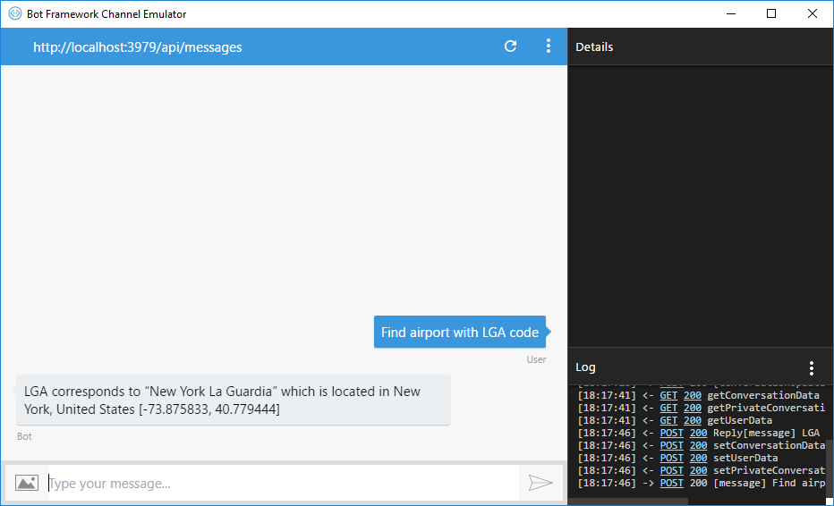||

##### GetWeatherInPlace intent

| All mandatory members recognized | Missing mandatory members |
|----------------------------------|---------------------------|
|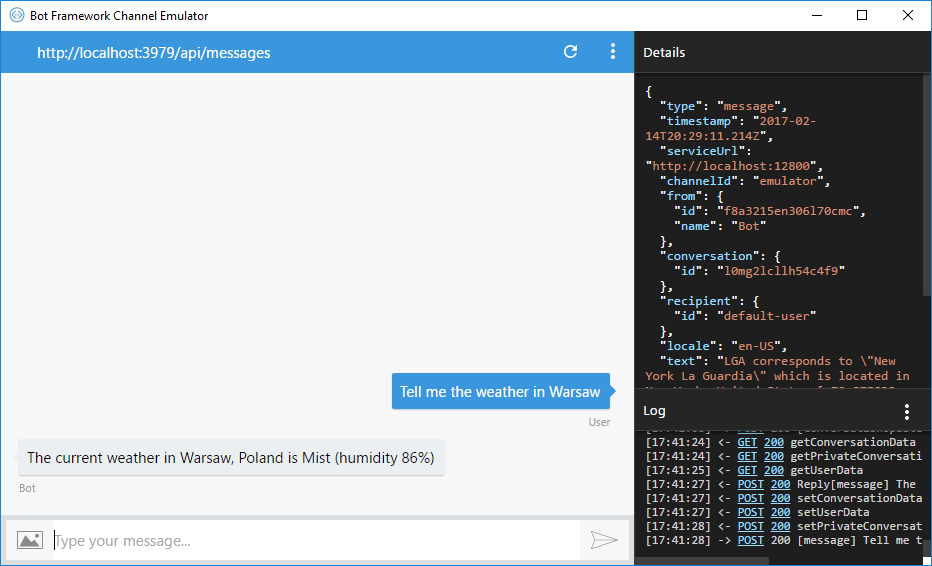||

##### Scenario #1 - Switch from current Intent to a new Intent


User triggers the ‘FindHotels’ intent/action, but when answering required parameters it changes its mind and triggers the ‘FindAirportByCode’ intent/action confirming context switching


User triggers the ‘FindHotels’ intent/action, but when answering required parameters it changes its mind and triggers the ‘FindAirportByCode’ intent/action but prefers to continue with ‘FindHotels’

##### Scenario #2 - Within the current Intent trigger a related Intent

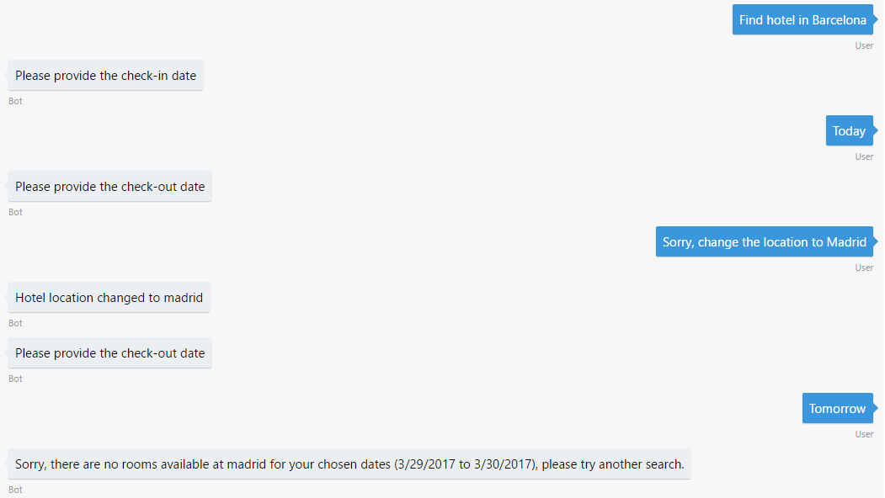
User triggers the ‘FindHotels’ intent/action looking for an hotel in ‘Barcelona’, but while answering required parameters it changes its mind and decides to update the location to ‘Madrid’ (under the hood this triggers the ‘FindHotelsAction_ChangeLocation’ action shown above)

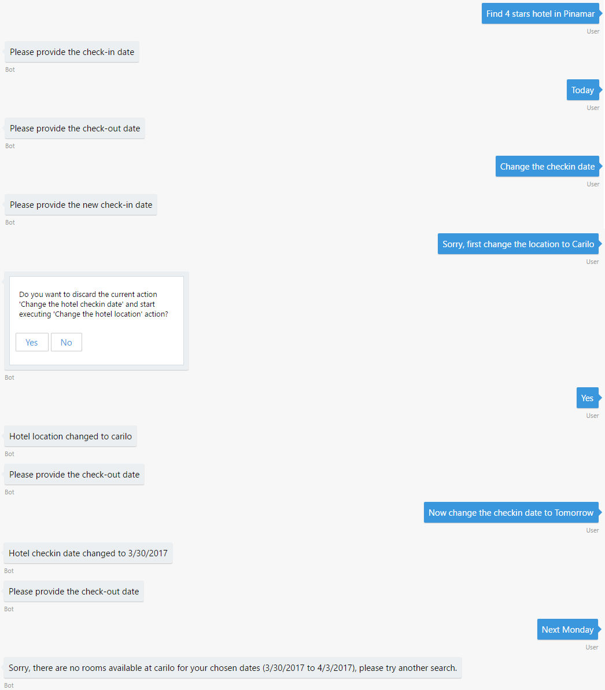
User triggers the ‘FindHotels’ intent/action looking for an hotel in ‘Pinamar, but while answering required parameters it changes its mind and decides to update the check-in date but while changing the date it changes its mind again and chooses to change the location first (this produces a context switch of contextual actions under the same valid context [FindHotels])


User triggers the ‘FindHotels’ intent/action looking for an hotel in ‘Rome’, but while answering required parameters it changes its mind and decides to update the already answered check-in date, but while changing the date it changes its mind again and decides to validate first if its destination airport ‘FCO’ corresponds to Rome (this produces a full context switch from ‘FindHotels’ context to ‘FindAirportByCode’)

##### Scenario #3 - Trigger a contextual Intent with no context


User's request triggers the ‘FindHotelsAction_ChangeLocation’ intent/action, and as it is configured to allow triggering it with no current context (by default) the framework creates the context for it (FindHotels) and executes it (processing first the user's intent and then the root context stuff)

#### Web Sample ([samples/web](samples/web))

##### FindHotels intent

| All mandatory members recognized | Missing mandatory members |
|----------------------------------|---------------------------|
|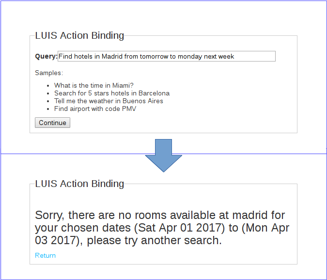|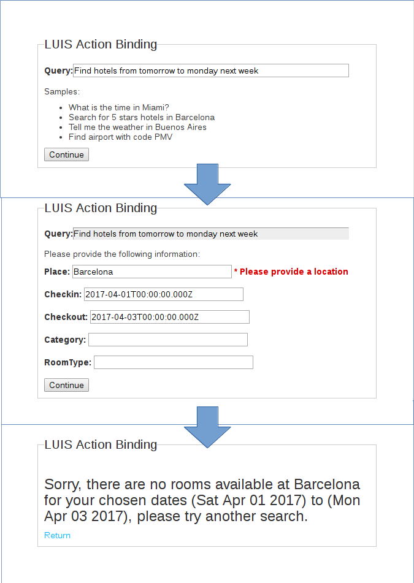|

##### FindAirportByCode intent

| All mandatory members recognized | Missing mandatory members |
|----------------------------------|---------------------------|
|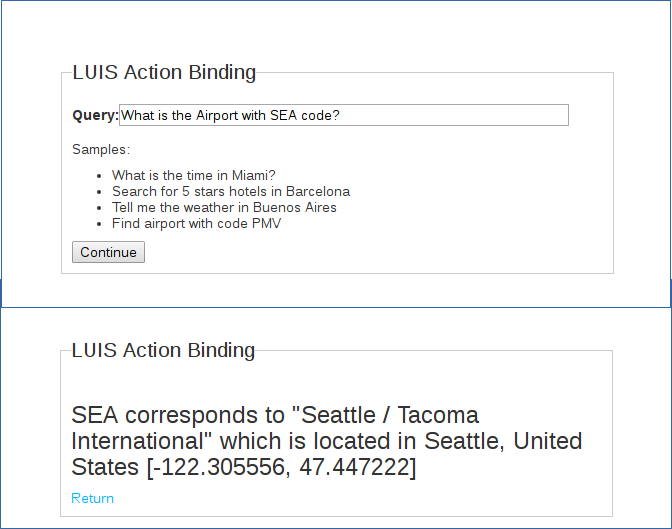|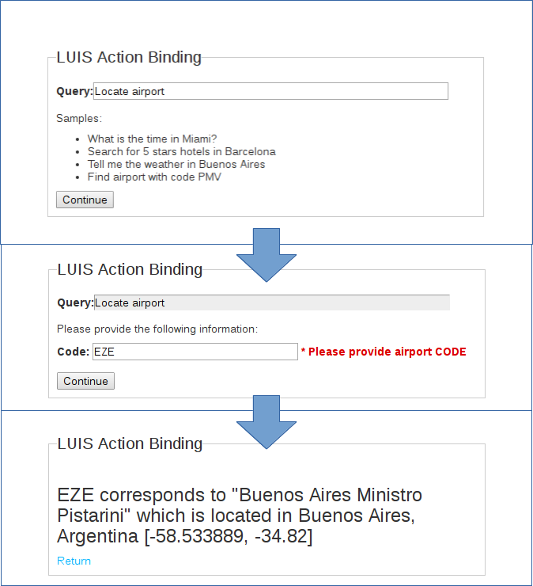|

##### GetWeatherInPlace intent

| All mandatory members recognized | Missing mandatory members |
|----------------------------------|---------------------------|
|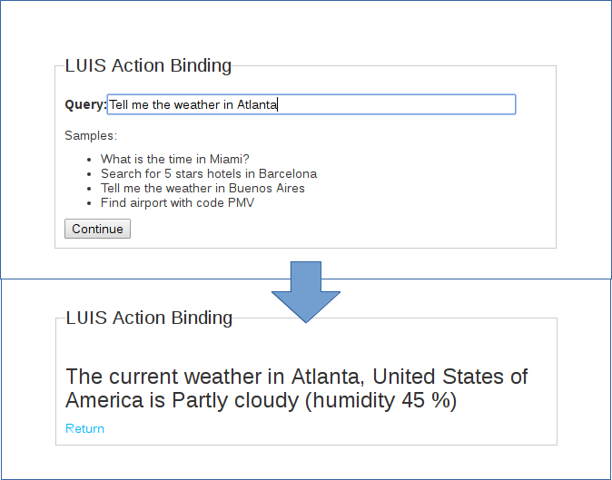|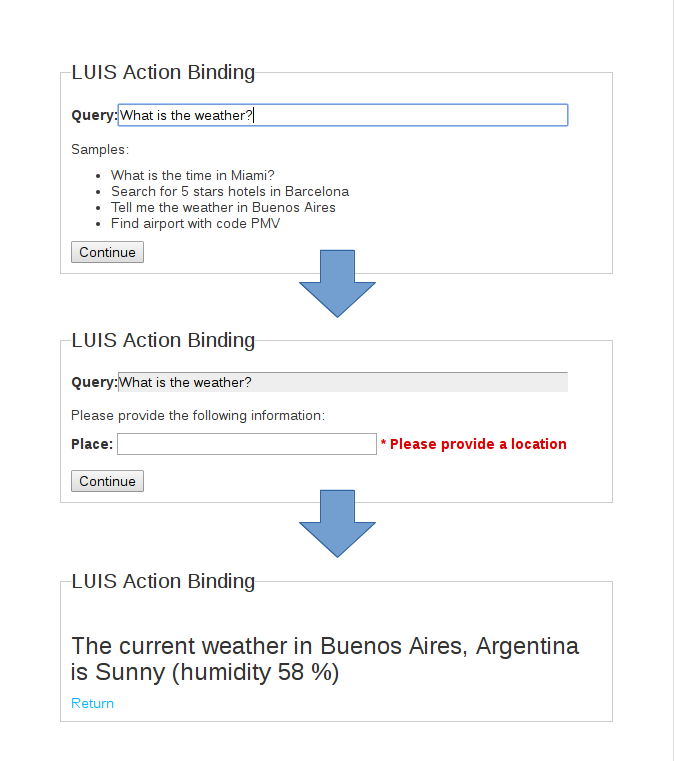|

#### LuisAction.Samples.Console app

##### FindHotels intent

| All mandatory members recognized | Missing mandatory members |
|----------------------------------|---------------------------|
|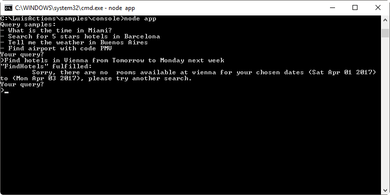|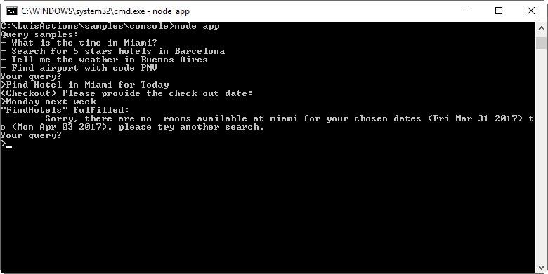|

##### FindAirportByCode intent

| All mandatory members recognized | Missing mandatory members |
|----------------------------------|---------------------------|
|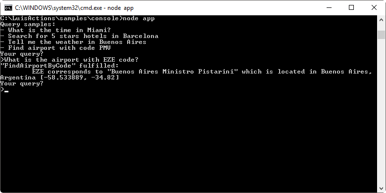|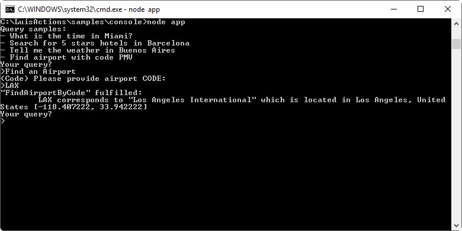|

##### GetWeatherInPlace intent

| All mandatory members recognized | Missing mandatory members |
|----------------------------------|---------------------------|
|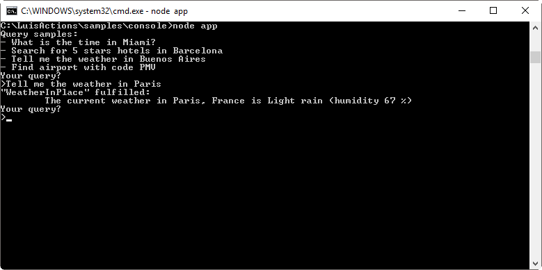|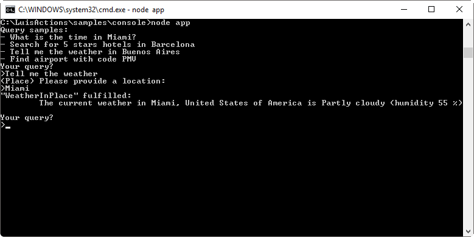|

### More Information

To get more information about how to get started in Bot Builder for Node and LUIS please review the following resources:
* [Bot Builder for Node.js Reference](https://docs.microsoft.com/en-us/bot-framework/nodejs/)
* [Understanding Natural Language](https://docs.botframework.com/en-us/node/builder/guides/understanding-natural-language/)
* [LUIS Help Docs](https://www.luis.ai/Help/)
* [Cognitive Services Documentation](https://www.microsoft.com/cognitive-services/en-us/luis-api/documentation/home)
* [IntentDialog](https://docs.botframework.com/en-us/node/builder/chat/IntentDialog/)
* [LuisRecognizer](https://docs.botframework.com/en-us/node/builder/chat-reference/classes/_botbuilder_d_.luisrecognizer.html)
* [EntityRecognizer](https://docs.botframework.com/en-us/node/builder/chat-reference/classes/_botbuilder_d_.entityrecognizer.html)
* Other examples using LUIS
  * [LUIS Bot Sample](https://github.com/Microsoft/BotBuilder-Samples/tree/master/Node/intelligence-LUIS)
  * [Alarm Bot in Node](https://github.com/Microsoft/BotBuilder/tree/master/Node/examples/basics-naturalLanguage)