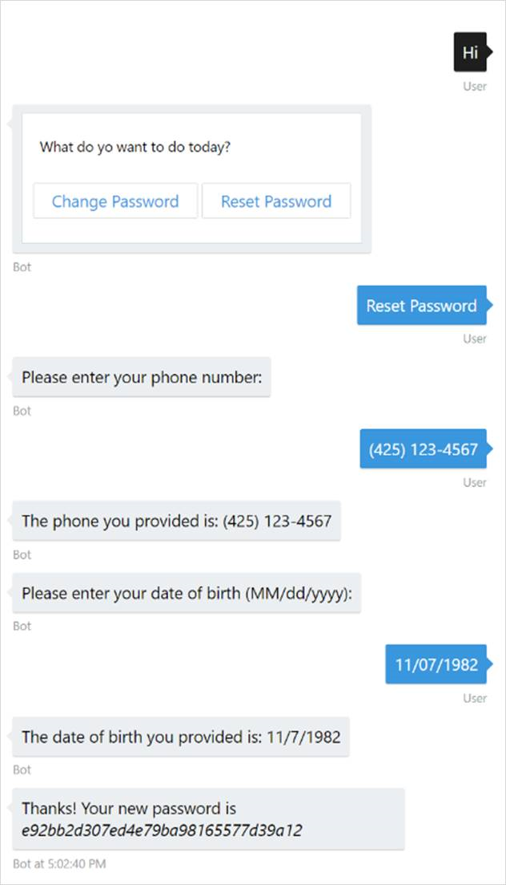

# Simple Task Automation Sample

A sample bot showing how to do simple task automation scenarios.

[![Deploy to Azure][Deploy Button]][Deploy Node/SimpleTaskAutomation]

[Deploy Button]: https://azuredeploy.net/deploybutton.png
[Deploy Node/SimpleTaskAutomation]: https://azuredeploy.net

### Prerequisites

The minimum prerequisites to run this sample are:
* Latest Node.js with NPM. Download it from [here](https://nodejs.org/en/download/).
* The Bot Framework Emulator. To install the Bot Framework Emulator, download it from [here](https://emulator.botframework.com/). Please refer to [this documentation article](https://github.com/microsoft/botframework-emulator/wiki/Getting-Started) to know more about the Bot Framework Emulator.
* **[Recommended]** Visual Studio Code for IntelliSense and debugging, download it from [here](https://code.visualstudio.com/) for free.

### Code Highlights
With the Bot Builder SDK you'll use [dialogs](https://docs.microsoft.com/en-us/bot-framework/nodejs/bot-builder-nodejs-dialog-manage-conversation) to organize your bots conversations with the user. The bot tracks where it is in the conversation with a user using a stack that's persisted to the bots storage system. When the bot receives the first message from a user it will push the bots default dialog (`/`) onto the stack and pass that dialog the users message. The dialog can either process the incoming message and send a reply directly to the user or it can start other dialogs which will guide the user through a series of questions that collect input from the user needed to complete some task.

The session includes several methods for managing the bots dialog stack and therefore manipulate where the bot is conversationally with the user. Once you get the hang of working with the dialog stack you can use a combination of dialogs and the sessions stack manipulation methods to achieve just about any conversational flow you can dream of.

A bots dialogs can be expressed using a variety of forms:

* **Waterfall**

  Waterfalls let you collect input from a user using a sequence of steps. A bot is always in a state of providing a user with information or asking a question and then waiting for input. In the Node version of Bot Builder it's waterfalls that drive this back-n-forth flow.
* **Closure**

  You can also pass a single function for your dialog handler which simply results in creating a 1 step waterfall
* **Dialog object**

  For more specialized dialogs you can add an instance of a class that derives from the Dialog base class. This gives maximum flexibility for how your bot behaves as the built-in prompts and even waterfalls are implemented internally as dialogs.
* **SimpleDialog**

  Allows for the creation of custom dialogs that are based on a simple closure. This is useful for cases where you want a dynamic conversation flow or you have a situation that just doesn't map very well to using a waterfall.

In this sample we start with a dialog that prompts the user to choose the action the bot must do: 

````JavaScript
const ChangePasswordOption = 'Change Password';
const ResetPasswordOption = 'Reset Password';

var bot = new builder.UniversalBot(connector, [
    function (session) {
        builder.Prompts.choice(session,
            'What do yo want to do today?',
            [ChangePasswordOption, ResetPasswordOption],
            { listStyle: builder.ListStyle.button });
    },
	...
]);
````

#### Bot Libraries for Creating Reusable Dialogs

Libraries of reusable parts can be developed by creating a new Library instance and adding dialogs just as you would to a bot. Your library should have a unique name that corresponds to either your libraries website or NPM module name. Bots can then reuse your library by simply adding your parts Library instance to their bot using [UniversalBot.library()](https://docs.botframework.com/en-us/node/builder/chat-reference/classes/_botbuilder_d_.universalbot.html#library).

To invoke dialogs within the bot, we use [session.beginDialog()](https://docs.botframework.com/en-us/node/builder/chat-reference/classes/_botbuilder_d_.session.html#begindialog) with a fully qualified dialog id in the form of ':'.

E.g.: To start the reset password's experience root dialog we use `session.beginDialog('resetPassword:/)`.

````JavaScript
// /dialogs/reset-password.js
const library = new builder.Library('resetPassword');

library.dialog('/', [
    function (session) {
        ...
    },
	...
]);

// /app.js
var bot = new builder.UniversalBot(connector, [
    function (session) {
        builder.Prompts.choice(session,
            'What do yo want to do today?',
            [ChangePasswordOption, ResetPasswordOption],
            { listStyle: builder.ListStyle.button });
    },
    function (session, result) {
        if (result.response) {
            switch (result.response.entity) {
                case ChangePasswordOption:
                    session.send('This functionality is not yet implemented! Try resetting your password.');
                    session.reset();
                    break;
                case ResetPasswordOption:
                    session.beginDialog('resetPassword:/');
                    break;
            }
        } else {
            session.send('I am sorry but I didn\'t understand that. I need you to select one of the options below');
        }
    },
	...
]);
````

Another more common approach for this feature is encapsulating a re-usable dialog. A good example of these are prompt validators. In this sample, common validations are packaged in the [validators](validators.js) library.

This is how you could package a phone validation:

````JavaScript
var builder = require('botbuilder');

const PhoneRegex = new RegExp(/^(\+\d{1,2}\s)?\(?\d{3}\)?[\s.-]?\d{3}[\s.-]?\d{4}$/);

const library = new builder.Library('validators');

library.dialog('phonenumber',
    builder.DialogAction.validatedPrompt(builder.PromptType.text, (response) =>
        PhoneRegex.test(response)));

module.exports = library;
module.exports.PhoneRegex = PhoneRegex;
```` 

And this is how you can call the validator from your existing code:

````JavaScript
// 
library.dialog('/', [
    function (session) {
        session.beginDialog('validators:phonenumber', {
            prompt: 'Please enter your phone number:',
            retryPrompt: 'The value entered is not phone number. Please try again using the following format (xyz) xyz-wxyz:',
            maxRetries: 2
        });
    },
    function (session, args) {
        if (args.resumed) {
            session.send('You have tried to enter your phone number many times. Please try again later.');
            session.endDialogWithResult({ resumed: builder.ResumeReason.notCompleted });
            return;
        }

        session.dialogData.phoneNumber = args.response;
        session.send('The phone you provided is: ' + args.response);

        builder.Prompts.time(session, 'Please enter your date of birth (MM/dd/yyyy):', {
            retryPrompt: 'The value you entered is not a valid date. Please try again:',
            maxRetries: 2
        });
    },
````

> It is worth noting that calling other dialogs within your library don't need to be prefixed with the library's id. It is only when crossing from one library context to another that you need to include the library name prefix on your `session.beginDialog()` calls.

> To limit the times the user will reprompt when the response is not valid, the [maxRetries](https://docs.botframework.com/en-us/node/builder/chat-reference/interfaces/_botbuilder_d_.ipromptargs.html#maxretries) can be specified. If the maximum number of retries are reached the next dialog is called with the [args.resumed](https://docs.botframework.com/en-us/node/builder/chat-reference/interfaces/_botbuilder_d_.ipromptresult.html#resumed) set in [notCompleted](https://docs.botframework.com/en-us/node/builder/chat-reference/enums/_botbuilder_d_.resumereason.html#notcompleted). 
The message the bot will send when an no valid user input was received is customizable with the [retryPrompt](https://docs.botframework.com/en-us/node/builder/chat-reference/interfaces/_botbuilder_d_.ipromptargs.html#retryprompt).

### Outcome

You will see the following result in the Bot Framework Emulator when opening and running the sample solution.



### More Information

To get more information about how to get started in Bot Builder for Node and Dialogs please review the following resources:
* [Bot Builder for Node.js Reference](https://docs.microsoft.com/en-us/bot-framework/nodejs/)
* [Dialogs](https://docs.microsoft.com/en-us/bot-framework/nodejs/bot-builder-nodejs-dialog-manage-conversation)
* [UniversalBot.library()](https://docs.botframework.com/en-us/node/builder/chat-reference/classes/_botbuilder_d_.universalbot.html#library)
* [Prompt users for input](https://docs.microsoft.com/en-us/bot-framework/nodejs/bot-builder-nodejs-dialog-prompt)
* [session.beginDialog](https://docs.botframework.com/en-us/node/builder/chat-reference/classes/_botbuilder_d_.session.html#begindialog)
* [session.endDialogWithResult](https://docs.botframework.com/en-us/node/builder/chat-reference/classes/_botbuilder_d_.session.html#enddialogwithresult)
* [IPromptArgs](https://docs.botframework.com/en-us/node/builder/chat-reference/interfaces/_botbuilder_d_.ipromptargs.html)
