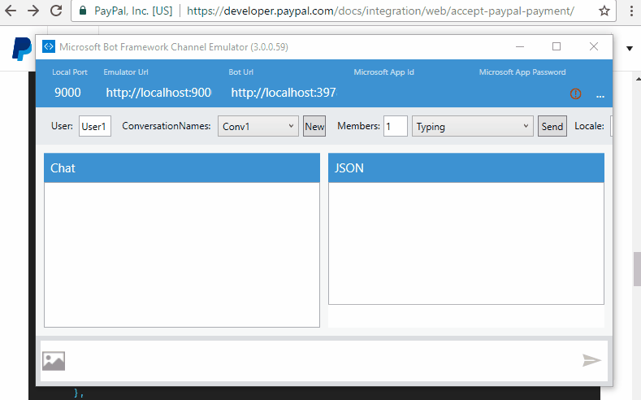

# node-paymentbot



## Description

A sample bot that demonstrates an integration between Bot Framework and PayPal

## Setup

1. Download and install a Bot Framework emulator, as this bot can be run locally: https://docs.botframework.com/en-us/tools/bot-framework-emulator/

2. Create a PayPal account, and then create an application. You can do that here: https://developer.paypal.com/developer/applications/create. 
After creating the application, grab the **Client ID** and **Client Secret** from the application dashboard. These will be used to allow the bot to connect to PayPal.

3. Create a PayPal sandbox test user here: https://developer.paypal.com/developer/accounts/. This is only needed if you use the PayPal "sandbox" environment to test payments. 
You can change the environment PayPal will create payments on by changing the `PAYPAL_CLIENT_MODE` environment variable to "live".

4. Export these environment variables: **PAYPAL_CLIENT_MODE**, **PAYPAL_CLIENT_ID**, **PAYPAL_CLIENT_SECRET**.

5. Export bot credentials into environment variables: **MICROSOFT_APP_ID**, **MICROSOFT_APP_PASSWORD** (Get them from https://dev.botframework.com)

For Mac OS/Linux:

```
export PAYPAL_CLIENT_MODE="sandbox"
PAYPAL_CLIENT_ID="YOUR CLIENT ID FROM PAYPAL"
PAYPAL_CLIENT_SECRET="YOUR CLIENT SECRET FROM PAYPAL"
MICROSOFT_APP_ID="YOUR BOT APP ID"
MICROSOFT_APP_PASSWORD="YOUT BOT APP PASSWORD"
```

For Windows using PowerShell:

```
$env:PAYPAL_CLIENT_MODE = "sandbox"
$env:PAYPAL_CLIENT_ID = "YOUR CLIENT ID FROM PAYPAL"
$env:PAYPAL_CLIENT_SECRET = "YOUR CLIENT SECRET FROM PAYPAL"
$env:MICROSOFT_APP_ID = "YOUR BOT APP ID"
$env:MICROSOFT_APP_PASSWORD = "YOUT BOT APP PASSWORD"
```

## Installation

Assuming that you've installed a version of Node 6:

1. `git clone http://github.com/bnookala/node-paymentbot`
2. `cd node-paymentbot`
3. `npm install`
4. `node app.js`
5. Start up the emulator, verify the 'Bot URL' field is the same as the URL written to your console by the application.
6. Done! :tada:

## License
**MIT**. See LICENSE file.

## Questions? 
[Tweet at me!](https://twitter.com/bhargav)