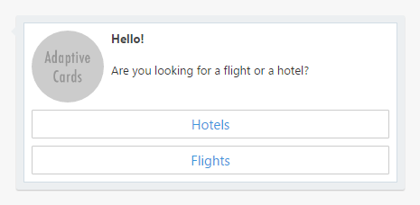
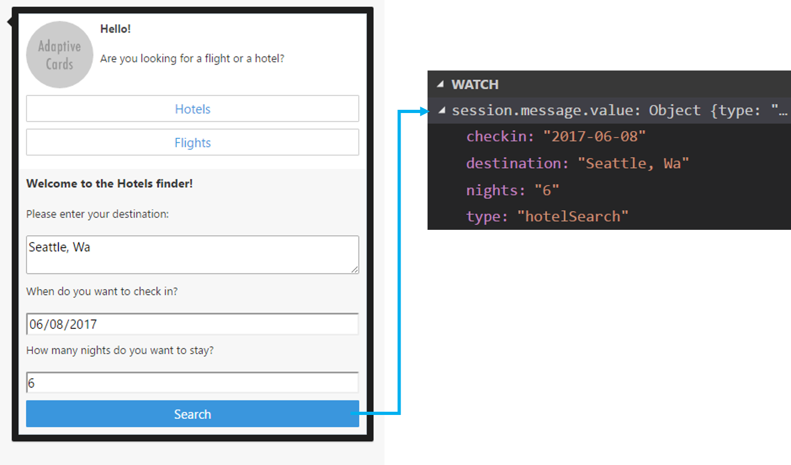
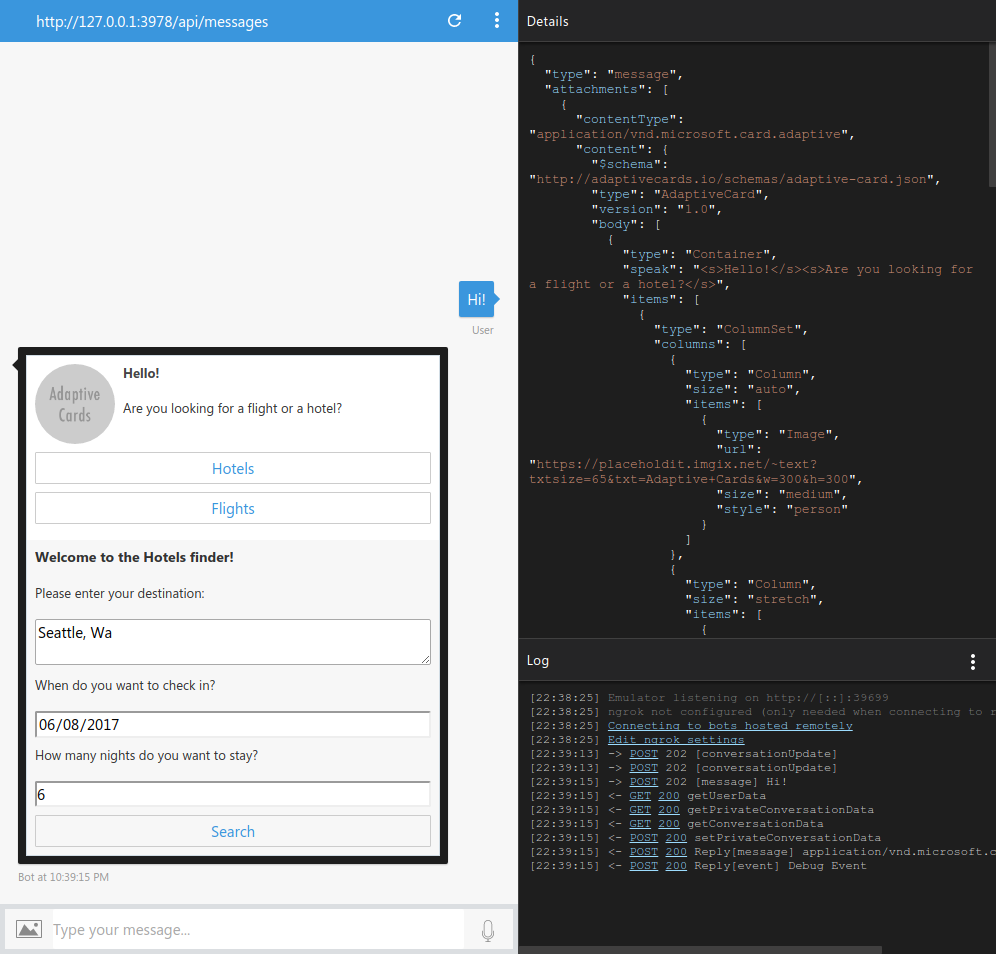
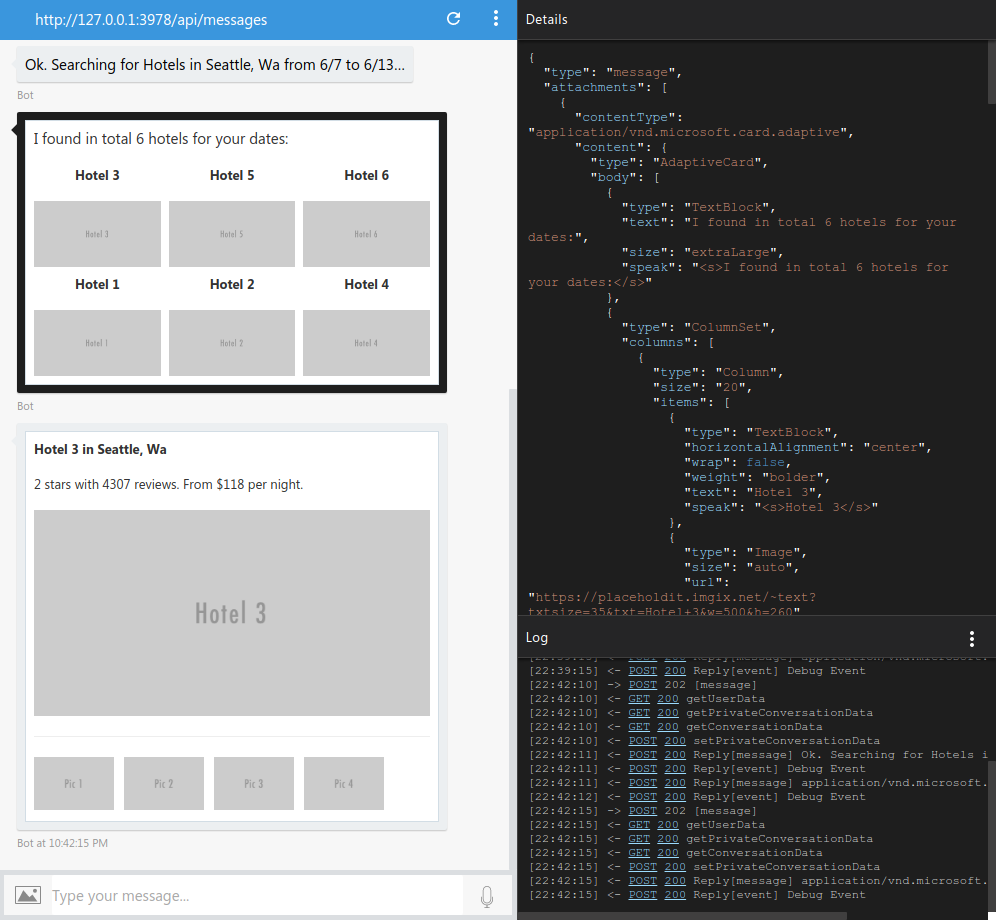

# Adaptive Cards Bot Sample

A sample bot using [Adaptive Cards](http://adaptivecards.io/) and how to handle user interaction with them.

[![Deploy to Azure][Deploy Button]][Deploy Node/AdaptiveCards]

[Deploy Button]: https://azuredeploy.net/deploybutton.png
[Deploy Node/AdaptiveCards]: https://azuredeploy.net

### Prerequisites

The minimum prerequisites to run this sample are:
* Latest Node.js with NPM. Download it from [here](https://nodejs.org/en/download/).
* The Bot Framework Emulator. To install the Bot Framework Emulator, download it from [here](https://emulator.botframework.com/). Please refer to [this documentation article](https://github.com/microsoft/botframework-emulator/wiki/Getting-Started) to know more about the Bot Framework Emulator.
* **[Recommended]** Visual Studio Code for IntelliSense and debugging, download it from [here](https://code.visualstudio.com/) for free.

### Code Highlights

[Adaptive Cards](http://adaptivecards.io/) are an open card exchange format that enables developers to exchange UI content in a common and consistent way. The Bot Framework has the ability  to use this type of cards and provide a richer interaction experience.

The Adaptive Card can contain any combination of text, speech, images, buttons, and input fields. Adaptive Cards are created using the JSON format specified in the Adaptive Cards schema, which gives you full control over card content and format.

The aesthetics of the card are adapted to the channel's look and feel, making it feel native to the app and familiar to the user. You can use the [Adaptive Cards' Visualizer](http://adaptivecards.io/visualizer) to see how your card renders on different channels.

> Note: At the time of writing this sample, the Adaptive Cards support on the different channels is limited. This sample works properly on the Emulator and WebChat channel. See [more information](https://github.com/Microsoft/AdaptiveCards/issues/367) about channel support.

See how the sample composes a [welcome card](app.js#L30-L156) along with search options:

````JavaScript
var card = {
    'contentType': 'application/vnd.microsoft.card.adaptive',
    'content': {
        '$schema': 'http://adaptivecards.io/schemas/adaptive-card.json',
        'type': 'AdaptiveCard',
        'version': '1.0',
        'body': [
            {
                'type': 'Container',
                'speak': '<s>Hello!</s><s>Are you looking for a flight or a hotel?</s>',
                'items': [
                    {
                        'type': 'ColumnSet',
                        'columns': [
                            {
                                'type': 'Column',
                                'size': 'auto',
                                'items': [
                                    {
                                        'type': 'Image',
                                        'url': 'https://placeholdit.imgix.net/~text?txtsize=65&txt=Adaptive+Cards&w=300&h=300',
                                        'size': 'medium',
                                        'style': 'person'
                                    }
                                ]
                            },
                            {
                                'type': 'Column',
                                'size': 'stretch',
                                'items': [
                                    {
                                        'type': 'TextBlock',
                                        'text': 'Hello!',
                                        'weight': 'bolder',
                                        'isSubtle': true
                                    },
                                    {
                                        'type': 'TextBlock',
                                        'text': 'Are you looking for a flight or a hotel?',
                                        'wrap': true
                                    }
                                ]
                            }
                        ]
                    }
                ]
            }
        ],
        'actions': [ /* */ ]
    }
};
````

The previous code will generate a card similar to this one:



Adaptive Cards are created using JSON, like the one depicted above, and sent as a message attachment:

````JavaScript
var msg = new builder.Message(session)
    .addAttachment(card);
session.send(msg);
````

Adaptive Cards contain many elements that allow to exchange UI content in a common and consistent way. Some of these elements are:

- **TextBlock**

  The TextBlock element allows for the inclusion of text, with various font sizes, weight and color.

- **ImageSet** and **Image**

  The ImageSet allows for the inclusion of a collection images like a photo set, and the Image element allows for the inclusion of images.

- **Input elements**

  Input elements allow you to ask for native UI to build simple forms:

  - **Input.Text** - get text content from the user
  - **Input.Date** - get a Date from the user
  - **Input.Time** - get a Time from the user
  - **Input.Number** - get a Number from the user
  - **Input.ChoiceSet** - Give the user a set of choices and have them pick
  - **Input.ToggleChoice** - Give the user a single choice between two items and have them pick

- **Container**

  A Container is a CardElement which contains a list of CardElements that are logically grouped.

- **ColumnSet** and **Column**

  The columnSet element adds the ability to have a set of Column objects.

- **FactSet**

  The FactSet element makes it simple to display a series of "facts" (e.g. name/value pairs) in a tabular form.

Finally, Adaptive Cards support special elements that enable interaction:

- **Action.OpenUrl**

  When Action.OpenUrl is invoked it will show the given url, either by launching it to an external web browser or showing in-situ with embedded web browser.

- **Action.Submit**

  Action.Submit gathers up input fields, merges with optional data field and generates event to client asking for data to be submitted. The Bot Framework will send an activity through the messaging medium to the bot.

- **Action.Http**

  Action.Http represents the properties needed to do an Http request. All input properties are available for use via data binding. Properties can be data bound to the Uri and Body properties, allowing you to send a request to an arbitrary url.

- **Action.ShowCard**

  Action.ShowCard defines an inline AdaptiveCard which is shown to the user when it is clicked.

You can visit the [Adaptive Cards Schema Explorer](http://adaptivecards.io/explorer/) for samples and the properties each element supports.

#### Creating an inline Adaptive Card

A card may offer the user multiple options to continue. Each option can be offered as a button that, once clicked, expands into a new card within the existing one. This is accomplised using a *ShowCard Action*.
See app.js [Flight's option](app.js#L138-L153) for a simple card and [Hotel's option](app.js#L80-L137) for a complex one.
These are defined within the `actions` element of the main card. See below how the `type` of each action is defined as `Action.ShowCard` and the `card` property contains a new Adaptive Card.

````JavaScript
var card = {
    'contentType': 'application/vnd.microsoft.card.adaptive',
    'content': {
        '$schema': 'http://adaptivecards.io/schemas/adaptive-card.json',
        'type': 'AdaptiveCard',
        'version': '1.0',
        'body': [ /* */ ],
        'actions': [
            // Hotels Search form
            {
                'type': 'Action.ShowCard',
                'title': 'Hotels',
                'speak': '<s>Hotels</s>',
                'card': {
                    'type': 'AdaptiveCard',
                    'body': [ /* */ ],
                    'actions': [
                        {
                            'type': 'Action.Submit',
                            'title': 'Search',
                            'speak': '<s>Search</s>',
                            'data': {
                                'type': 'hotelSearch'
                            }
                        }
                    ]
                }
            },
            {
                'type': 'Action.ShowCard',
                'title': 'Flights',
                'speak': '<s>Flights</s>',
                'card': {
                    'type': 'AdaptiveCard',
                    'body': [
                        {
                            'type': 'TextBlock',
                            'text': 'Flights is not implemented =(',
                            'speak': '<s>Flights is not implemented</s>',
                            'weight': 'bolder'
                        }
                    ]
                }
            }
        ]
    }
};
````

#### Collecting and handling input from the user

Adaptive Cards can include input controls for gathering information from the user that is viewing the card.

At the time of writing this sample, the Adaptive Cards support for input controls is: [Text](http://adaptivecards.io/explorer/#InputText), [Date](http://adaptivecards.io/explorer/#InputDate), [Time](http://adaptivecards.io/explorer/#InputTime), [Number](http://adaptivecards.io/explorer/#InputNumber) and for selecting options there are the [Toggle](http://adaptivecards.io/explorer/#InputToggle) and [ChoiceSet](http://adaptivecards.io/explorer/#InputChoiceSet).

See app.js hotel's search form for a simple sample:

````JavaScript
{
    'type': 'Action.ShowCard',
    'title': 'Hotels',
    'speak': '<s>Hotels</s>',
    'card': {
        'type': 'AdaptiveCard',
        'body': [
            {
                'type': 'TextBlock',
                'text': 'Welcome to the Hotels finder!',
                'speak': '<s>Welcome to the Hotels finder!</s>',
                'weight': 'bolder',
                'size': 'large'
            },
            {
                'type': 'TextBlock',
                'text': 'Please enter your destination:'
            },
            {
                'type': 'Input.Text',
                'id': 'destination',
                'speak': '<s>Please enter your destination</s>',
                'placeholder': 'Miami, Florida',
                'style': 'text'
            },
            {
                'type': 'TextBlock',
                'text': 'When do you want to check in?'
            },
            {
                'type': 'Input.Date',
                'id': 'checkin',
                'speak': '<s>When do you want to check in?</s>'
            },
            {
                'type': 'TextBlock',
                'text': 'How many nights do you want to stay?'
            },
            {
                'type': 'Input.Number',
                'id': 'nights',
                'min': 1,
                'max': 60,
                'speak': '<s>How many nights do you want to stay?</s>'
            }
        ],
        'actions': [
            {
                'type': 'Action.Submit',
                'title': 'Search',
                'speak': '<s>Search</s>',
                'data': {
                    'type': 'hotelSearch'
                }
            }
        ]
    }
}
````

The above card will generate a card similar to this one:


Submitting the information can be be done in two possible ways:

- **Http**

  Action.Http represents the properties needed to do an Http request. All input properties are available for use via data binding. Properties can be data bound to the Uri and Body properties, allowing you to send a request to an arbitrary url. This method can be used to call a service hosted elsewhere through HTTP.

- **Submit**

  Action.Submit gathers up input fields, merges with optional data field and generates event to client asking for data to be submitted. The Bot Framework will send an activity through the messaging medium to the bot. This is the method used in the sample.

When using the **Submit** method, the Bot Framework will handle the submission and your bot will receive a new message with its `value` field filled with the form data as a JSON object.

````JavaScript
var bot = new builder.UniversalBot(connector, function (session) {

    if (session.message && session.message.value) {
        // A Card's Submit Action obj was received
        processSubmitAction(session, session.message.value);
        return;
    }

    // ...
});
````



You'll note in the `Action.Submit` action that there is a `data` field with a `{ 'type': 'hotelSearch' }` object. The `type` attribute is used To later identify the originating submit action. When submitting, the Adaptive Card combines the form values to the [Submit Action's `data` property](http://adaptivecards.io/explorer/#ActionSubmit).

Once received the search form parameters, [validation is triggered](app.js#L182), and once it passes, the [`hotels-search`](hotels-search.js) dialog is called with the search parameters as the dialog's argument:

````JavaScript
session.beginDialog('hotels-search', value);
````

#### Displaying information with ColumnSet

For displaying the hotel search results, the sample uses `ColumnSet` and `Columns` to format them into rows and columns. See how the [`hotels-search` dialog](hotels-search.js#L24-L43) makes use of these elements to create the layout depicted below:

````JavaScript
var rows = _.chunk(hotels, 3).map(group =>
    ({
        'type': 'ColumnSet',
        'columns': group.map(asHotelItem)
    }));

var card = {
    'contentType': 'application/vnd.microsoft.card.adaptive',
    'content': {
        'type': 'AdaptiveCard',
        'body': [
            {
                'type': 'TextBlock',
                'text': title,
                'size': 'extraLarge',
                'speak': '<s>' + title + '</s>'
            }
        ].concat(rows)
    }
};

// Helpers
function asHotelItem(hotel) {
    return {
        'type': 'Column',
        'size': '20',
        'items': [
            {
                'type': 'TextBlock',
                'horizontalAlignment': 'center',
                'wrap': false,
                'weight': 'bolder',
                'text': hotel.name,
                'speak': '<s>' + hotel.name + '</s>'
            },
            {
                'type': 'Image',
                'size': 'auto',
                'url': hotel.image
            }
        ],
        'selectAction': {
            'type': 'Action.Submit',
            'data': _.extend({ type: 'hotelSelection' }, hotel)
        }
    };
}
````


### Outcome

You will see the following in the Bot Framework Emulator when opening and running the sample.





### More Information

To get more information about how to get started in Bot Builder for Node and Attachments please review the following resources:
* [Bot Builder for Node.js Reference](https://docs.microsoft.com/en-us/bot-framework/nodejs/)
* [Adaptive Cards](http://adaptivecards.io/)
* [Adaptive Cards Visualizer](http://adaptivecards.io/visualizer/)
* [Adaptive Cards Schema Explorer](http://adaptivecards.io/explorer/)
* [Send an Adaptive Card](https://docs.microsoft.com/en-us/bot-framework/nodejs/bot-builder-nodejs-send-rich-cards#send-an-adaptive-card)

> **Limitations**
> The functionality provided in this sample only works with WebChat and the Emulator. Other channels have limited functionality as described in the following [link](https://github.com/Microsoft/AdaptiveCards/issues/367).