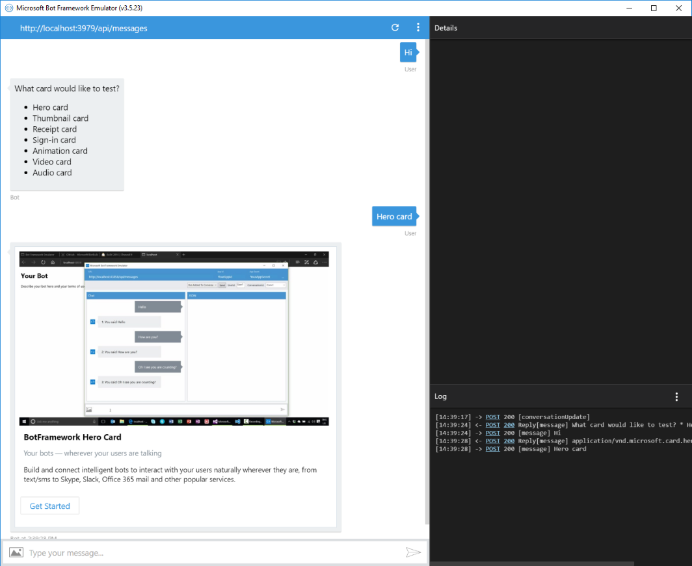
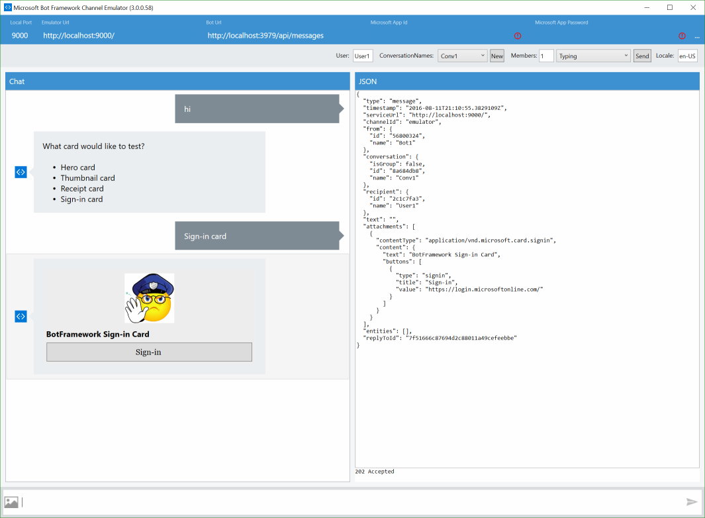
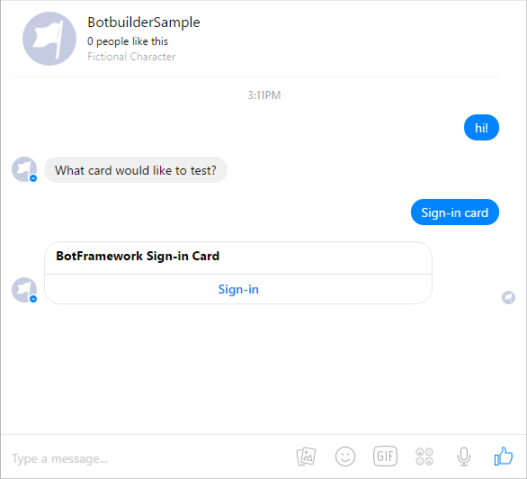
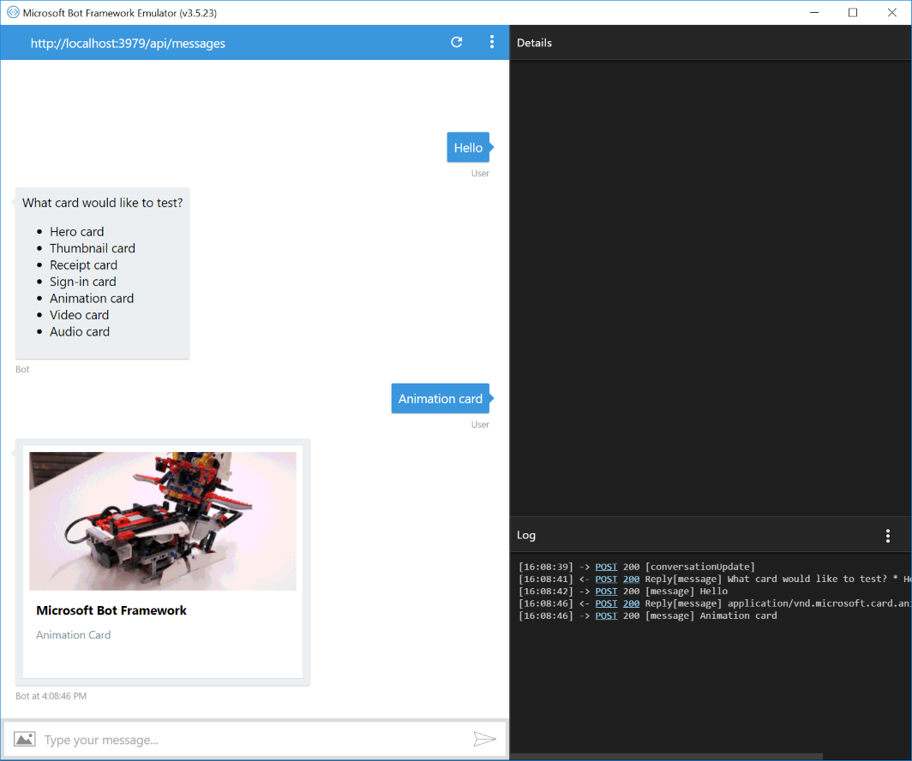
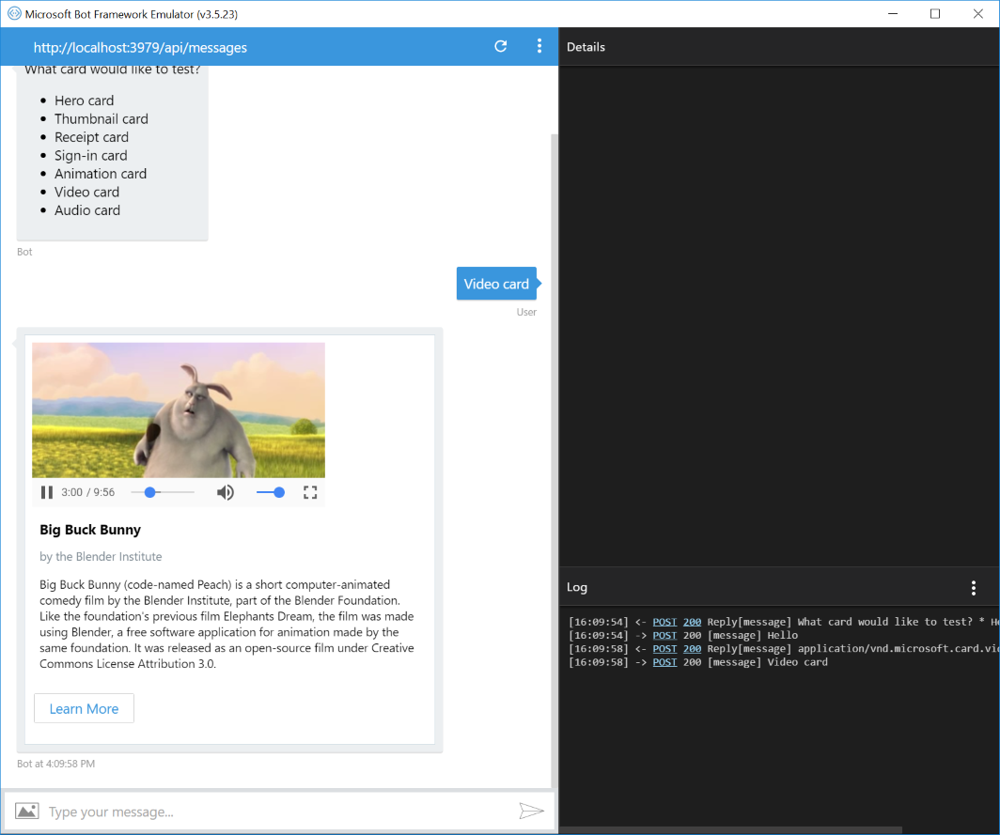
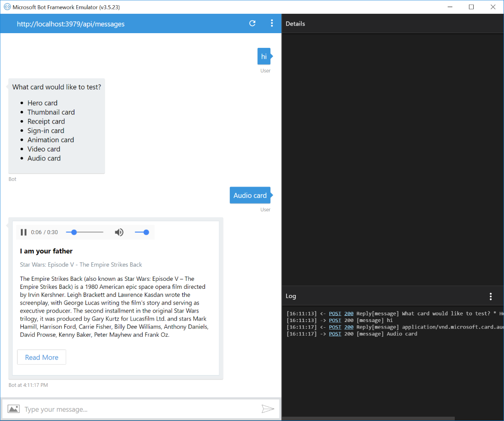
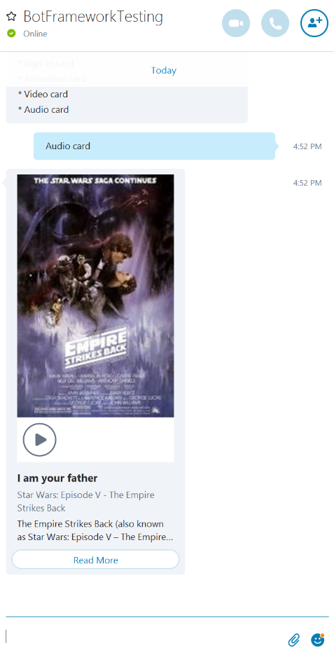

# Rich Cards Bot Sample

A sample bot to renders several types of cards as attachments.

[![Deploy to Azure][Deploy Button]][Deploy Node/RichCards]

[Deploy Button]: https://azuredeploy.net/deploybutton.png
[Deploy Node/RichCards]: https://azuredeploy.net

### Prerequisites

The minimum prerequisites to run this sample are:
* Latest Node.js with NPM. Download it from [here](https://nodejs.org/en/download/).
* The Bot Framework Emulator. To install the Bot Framework Emulator, download it from [here](https://emulator.botframework.com/). Please refer to [this documentation article](https://github.com/microsoft/botframework-emulator/wiki/Getting-Started) to know more about the Bot Framework Emulator.
* **[Recommended]** Visual Studio Code for IntelliSense and debugging, download it from [here](https://code.visualstudio.com/) for free.

### Code Highlights

Many messaging channels provide the ability to attach richer objects. The Bot Framework has the ability to render rich cards as attachments. There are several types of cards supported: Hero Card, Thumbnail Card, Receipt Card, Sign-In Card, Animation Card, Video Card and Audio Card. Once the desired Card type is selected, it is mapped into an `Attachment` data structure. Check out the key code located in [app.js](app.js#L29-L35) where a card is attached to the constructed message.

````JavaScript
function (session, results) {

    // create the card based on selection
    var selectedCardName = results.response.entity;
    var card = createCard(selectedCardName, session);

    // attach the card to the reply message
    var msg = new builder.Message(session).addAttachment(card);
    session.send(msg);
}
````

#### Hero Card

The Hero card is a multipurpose card; it primarily hosts a single large image, a button, and a "tap action", along with text content to display on the card. Check out the `createHeroCard` function in [app.js](app.js#L69-L80) for a Hero Card sample.

````JavaScript
function createHeroCard(session) {
    return new builder.HeroCard(session)
        .title('BotFramework Hero Card')
        .subtitle('Your bots — wherever your users are talking')
        .text('Build and connect intelligent bots to interact with your users naturally wherever they are, from text/sms to Skype, Slack, Office 365 mail and other popular services.')
        .images([
            builder.CardImage.create(session, 'https://sec.ch9.ms/ch9/7ff5/e07cfef0-aa3b-40bb-9baa-7c9ef8ff7ff5/buildreactionbotframework_960.jpg')
        ])
        .buttons([
            builder.CardAction.openUrl(session, 'https://docs.microsoft.com/bot-framework', 'Get Started')
        ]);
}
````

#### Thumbnail Card
The Thumbnail card is a multipurpose card; it primarily hosts a single small image, a button, and a "tap action", along with text content to display on the card. Check out the `createThumbnailCard` function in [app.js](app.js#L82-L93) for a Thumbnail Card sample.

```JavaScript
function createThumbnailCard(session) {
    return new builder.ThumbnailCard(session)
        .title('BotFramework Thumbnail Card')
        .subtitle('Your bots — wherever your users are talking')
        .text('Build and connect intelligent bots to interact with your users naturally wherever they are, from text/sms to Skype, Slack, Office 365 mail and other popular services.')
        .images([
            builder.CardImage.create(session, 'https://sec.ch9.ms/ch9/7ff5/e07cfef0-aa3b-40bb-9baa-7c9ef8ff7ff5/buildreactionbotframework_960.jpg')
        ])
        .buttons([
            builder.CardAction.openUrl(session, 'https://docs.microsoft.com/bot-framework', 'Get Started')
        ]);
}
````

#### Receipt Card
The receipt card allows the Bot to present a receipt to the user. Check out the `createReceiptCard` function in [app.js](app.js#L96-L117) for a Receipt Card sample.

````JavaScript
function createReceiptCard(session) {
    return new builder.ReceiptCard(session)
        .title('John Doe')
        .facts([
            builder.Fact.create(session, '1234', 'Order Number'),
            builder.Fact.create(session, 'VISA 5555-****', 'Payment Method')
        ])
        .items([
            builder.ReceiptItem.create(session, '$ 38.45', 'Data Transfer')
                .quantity(368)
                .image(builder.CardImage.create(session, 'https://github.com/amido/azure-vector-icons/raw/master/renders/traffic-manager.png')),
            builder.ReceiptItem.create(session, '$ 45.00', 'App Service')
                .quantity(720)
                .image(builder.CardImage.create(session, 'https://github.com/amido/azure-vector-icons/raw/master/renders/cloud-service.png'))
        ])
        .tax('$ 7.50')
        .total('$ 90.95')
        .buttons([
            builder.CardAction.openUrl(session, 'https://azure.microsoft.com/en-us/pricing/', 'More Information')
                .image('https://raw.githubusercontent.com/amido/azure-vector-icons/master/renders/microsoft-azure.png')
        ]);
}
````

#### Sign-In Card
The Sign-In card is a card representing a request to sign in the user. Check out the `createSigninCard` function in [app.js](app.js#L119-L123) for a Sign-In Card sample.

> Note: The sign in card can be used to initiate an authentication flow which is beyond this sample. For a complete authentication flow sample take a look at [AuthBot](https://github.com/MicrosoftDX/AuthBot) (Please, notice the samples are currently in C# only).

````JavaScript
function createSigninCard(session) {
    return new builder.SigninCard(session)
        .text('BotFramework Sign-in Card')
        .button('Sign-in', 'https://login.microsoftonline.com')
}
````

#### Animation Card
The Animation card is a card that’s capable of playing animated GIFs or short videos. Check out the `createAnimationCard` method in [app.js](app.js#L125-L133) for an Animation Card sample.

````JavaScript
function createAnimationCard(session) {
    return new builder.AnimationCard(session)
        .title('Microsoft Bot Framework')
        .subtitle('Animation Card')
        .image(builder.CardImage.create(session, 'https://docs.microsoft.com/en-us/bot-framework/media/how-it-works/architecture-resize.png'))
        .media([
            { url: 'http://i.giphy.com/Ki55RUbOV5njy.gif' }
        ]);
}
````

> Note: At the time of writing this sample, Skype requires the Animation card to have a Thumbnail Url.

#### Video Card
The Video card is a card that’s capable of playing videos. Check out the `createVideoCard` method in [app.js](app.js#L135-L147) for a Video Card sample.

````JavaScript
function createVideoCard(session) {
    return new builder.VideoCard(session)
        .title('Big Buck Bunny')
        .subtitle('by the Blender Institute')
        .text('Big Buck Bunny (code-named Peach) is a short computer-animated comedy film by the Blender Institute, part of the Blender Foundation. Like the foundation\'s previous film Elephants Dream, the film was made using Blender, a free software application for animation made by the same foundation. It was released as an open-source film under Creative Commons License Attribution 3.0.')
        .image(builder.CardImage.create(session, 'https://upload.wikimedia.org/wikipedia/commons/thumb/c/c5/Big_buck_bunny_poster_big.jpg/220px-Big_buck_bunny_poster_big.jpg'))
        .media([
            { url: 'http://download.blender.org/peach/bigbuckbunny_movies/BigBuckBunny_320x180.mp4' }
        ])
        .buttons([
            builder.CardAction.openUrl(session, 'https://peach.blender.org/', 'Learn More')
        ]);
}
````

> Note: At the time of writing this sample, Skype requires the Video card to have a Thumbnail Url.

#### Audio Card
The Audio card is a card that’s capable of playing an audio file. Check out the `createAudioCard` method in [app.js](app.js#L149-L161) for an Audio Card sample.

````JavaScript
function createAudioCard(session) {
    return new builder.AudioCard(session)
        .title('I am your father')
        .subtitle('Star Wars: Episode V - The Empire Strikes Back')
        .text('The Empire Strikes Back (also known as Star Wars: Episode V – The Empire Strikes Back) is a 1980 American epic space opera film directed by Irvin Kershner. Leigh Brackett and Lawrence Kasdan wrote the screenplay, with George Lucas writing the film\'s story and serving as executive producer. The second installment in the original Star Wars trilogy, it was produced by Gary Kurtz for Lucasfilm Ltd. and stars Mark Hamill, Harrison Ford, Carrie Fisher, Billy Dee Williams, Anthony Daniels, David Prowse, Kenny Baker, Peter Mayhew and Frank Oz.')
        .image(builder.CardImage.create(session, 'https://upload.wikimedia.org/wikipedia/en/3/3c/SW_-_Empire_Strikes_Back.jpg'))
        .media([
            { url: 'http://www.wavlist.com/movies/004/father.wav' }
        ])
        .buttons([
            builder.CardAction.openUrl(session, 'https://en.wikipedia.org/wiki/The_Empire_Strikes_Back', 'Read More')
        ]);
}
````

> Note: At the time of writing this sample, Skype requires the Audio card to have a Thumbnail Url.

### Outcome

You will see the following in the Bot Framework Emulator, Facebook Messenger and Skype when opening and running the sample.

#### Hero Card

| Emulator | Facebook | Skype |
|----------|-------|----------|
||||

#### Thumbnail Card

| Emulator | Facebook | Skype |
|----------|-------|----------|
||||

#### Receipt Card

| Emulator | Facebook | Skype |
|----------|-------|----------|
||||

#### Sign-In Card

| Emulator | Facebook | Skype |
|----------|-------|----------|
||||

#### Animation Card

| Emulator | Facebook | Skype |
|----------|-------|----------|
||||

#### Video Card

| Emulator | Facebook | Skype |
|----------|-------|----------|
||||

#### Audio Card

| Emulator | Facebook | Skype |
|----------|-------|----------|
||||

### More Information

To get more information about how to get started in Bot Builder for Node and Attachments please review the following resources:
* [Bot Builder for Node.js Reference](https://docs.microsoft.com/en-us/bot-framework/nodejs/)
* [Send and receive attachments](https://docs.microsoft.com/en-us/bot-framework/nodejs/bot-builder-nodejs-send-receive-attachments)
* [HeroCard](https://docs.botframework.com/en-us/node/builder/chat-reference/classes/_botbuilder_d_.herocard.html)
* [ThumbnailCard](https://docs.botframework.com/en-us/node/builder/chat-reference/classes/_botbuilder_d_.thumbnailcard.html)
* [ReceiptCard](https://docs.botframework.com/en-us/node/builder/chat-reference/classes/_botbuilder_d_.receiptcard.html)
* [SigninCard](https://docs.botframework.com/en-us/node/builder/chat-reference/classes/_botbuilder_d_.signincard.html)
* [AnimationCard](https://docs.botframework.com/en-us/node/builder/chat-reference/classes/_botbuilder_d_.animationcard.html)
* [VideoCard](https://docs.botframework.com/en-us/node/builder/chat-reference/classes/_botbuilder_d_.videocard.html)
* [AudioCard](https://docs.botframework.com/en-us/node/builder/chat-reference/classes/_botbuilder_d_.audiocard.html)
* [Message.addAttachment](https://docs.botframework.com/en-us/node/builder/chat-reference/classes/_botbuilder_d_.message.html#addattachment)
* [Attachment](https://docs.botframework.com/en-us/node/builder/chat-reference/interfaces/_botbuilder_d_.iattachment.html)
* [Cards and buttons on Microsoft Teams](https://msdn.microsoft.com/en-us/microsoft-teams/bots#cards-and-buttons)

> **Limitations**  
> The functionality provided by the Bot Framework Activity can be used across many channels. Moreover, some special channel features can be unleashed using the [Message.sourceEvent](https://docs.botframework.com/en-us/node/builder/chat-reference/classes/_botbuilder_d_.message.html#sourceevent) method.
> 
> The Bot Framework does its best to support the reuse of your Bot in as many channels as you want. However, due to the very nature of some of these channels, some features are not fully portable.
> 
> The Hero card and Thumbnail card used in this sample are fully supported in the following channels:
> - Skype
> - Facebook
> - Telegram
> - DirectLine
> - WebChat
> - Slack
> - Email
> - GroupMe
> 
> They are also supported, with some limitations, in the following channel:
> - Kik
> 
> On the other hand, they are not supported and the sample won't work as expected in the following channel:
> - SMS
>
> The Receipt card and Sign-in card used in this sample are fully supported in the following channels:
> - Skype
> - Facebook
> - Telegram
> - DirectLine
> - WebChat
> - Slack
> - Email
> - GroupMe
> 
> They are also supported, with some limitations, in the following channel:
> - Kik
> 
> On the other hand, they are not supported and the sample won't work as expected in the following channel:
> - SMS
> - Microsoft Teams
>
> The Animation card, Video card and Audio card used in this sample are fully supported in the following channels:
> - Skype
> - Facebook
> - WebChat
>
> They are also supported, with some limitations, in the following channel:
> - Slack (Only Animation card is supported)
> - GroupMe
> - Telegram (Only Animation and Audio cards are supported)
> - Email
>
> On the other hand, they are not supported and the sample won't work as expected in the following channel:
> - Microsoft Teams
> - Kik
> - SMS
>