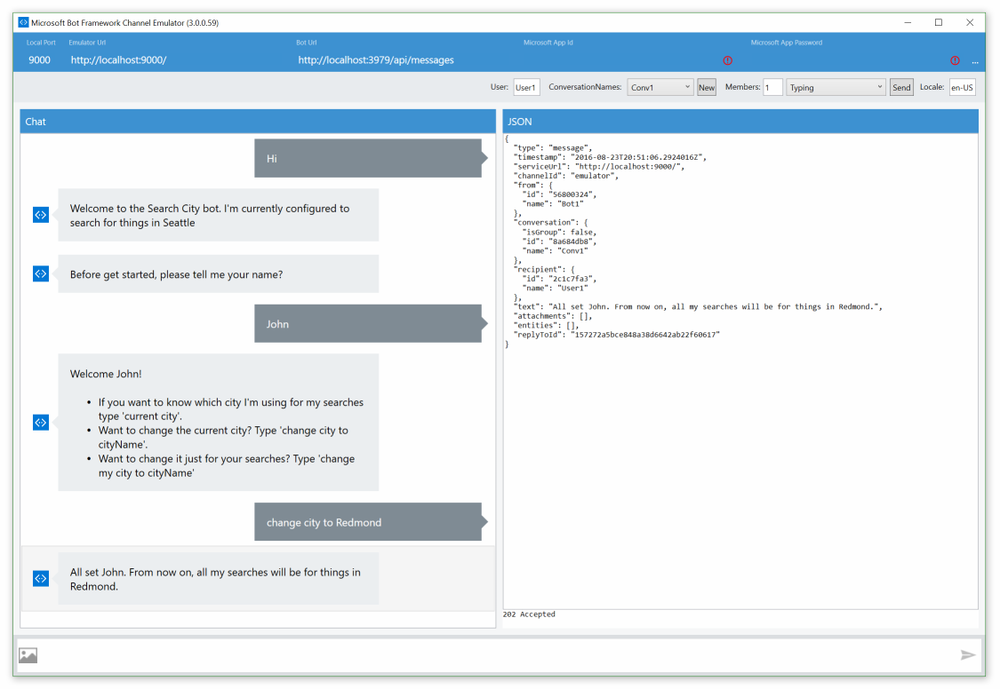

# Application Insights integration Bot Sample
A sample bot which logs telemetry to an Application Insights instance.

[![Deploy to Azure][Deploy Button]][Deploy Node/AppInsights]
[Deploy Button]: https://azuredeploy.net/deploybutton.png
[Deploy Node/AppInsights]: https://azuredeploy.net

### Prerequisites

The minimum prerequisites to run this sample are:
* Latest Node.js with NPM. Download it from [here](https://nodejs.org/en/download/).
* The Bot Framework Emulator. To install the Bot Framework Emulator, download it from [here](https://aka.ms/bf-bc-emulator). Please refer to [this documentation article](https://docs.botframework.com/en-us/csharp/builder/sdkreference/gettingstarted.html#emulator) to know more about the Bot Framework Emulator.
* **[Recommended]** Visual Studio Code for IntelliSense and debugging, download it from [here](https://code.visualstudio.com/) for free.
* An Application Insights instance in Azure. The Instrumentation Key for which must be put in the `APPINSIGHTS_INSTRUMENTATION_KEY` key in [.env](.env) file to try it out further.

### Code Highlights

This bot is based off the StateDialog bot, but adds in the ability to log custom telemetry events to an Application Insights instance in Azure.

### Outcome

After configuring, running the bot (locally or in a deployed instance), and having a conversation with it [see the State bot sample for details on the conversation flow](../core-State) you will begin to see events hitting the Application Insights instance you configured within seconds. You can easily filter these events by turning **off** showing Dependency Events so that you're only looking at Custom telemetry (Events, Exceptions, Trace)

Clicking the button directly will open up a new pane in Visual Studio from which you can view, filter, and search your telemetry items. For viewing your custom-logged items we recommend unchecking `Dependency` and `Request` telemetry. However, note that these are useful in watching what, when, and how the bot framework's endpoints are used by your bot web application.

Clicking on any item in the table will open up another pane allowing you to view and filter the various properties of that telemetry event.

For more information logged directly from the Bot Connector, be sure to put your instrumentation key in to your bot's listing in the Bot Directory.

