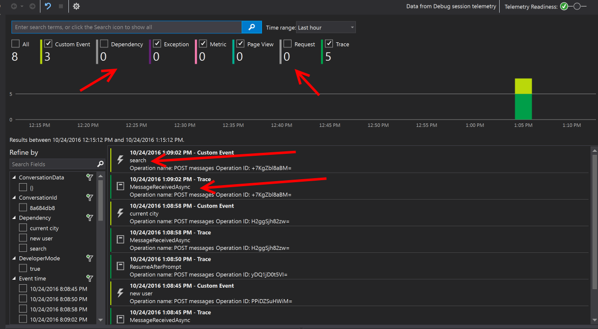
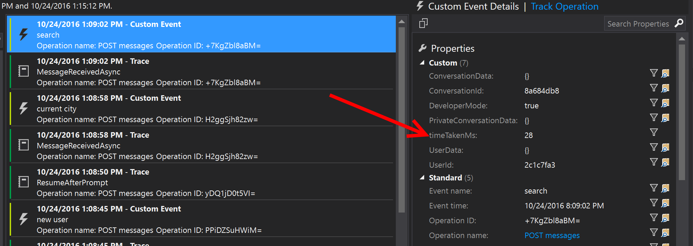

# Application Insights integration Bot Sample
A sample bot which logs telemetry to an Application Insights instance.

[![Deploy to Azure][Deploy Button]][Deploy Node/AppInsights]

[Deploy Button]: https://azuredeploy.net/deploybutton.png
[Deploy Node/AppInsights]: https://azuredeploy.net

### Prerequisites

The minimum prerequisites to run this sample are:
* Latest Node.js with NPM. Download it from [here](https://nodejs.org/en/download/).
* The Bot Framework Emulator. To install the Bot Framework Emulator, download it from [here](https://emulator.botframework.com/). Please refer to [this documentation article](https://github.com/microsoft/botframework-emulator/wiki/Getting-Started) to know more about the Bot Framework Emulator.
* **[Recommended]** Visual Studio Code for IntelliSense and debugging, download it from [here](https://code.visualstudio.com/) for free.
* An Application Insights instance in Azure. The Instrumentation Key for which must be put in the `APPINSIGHTS_INSTRUMENTATION_KEY` key in the [.env](.env) file to try it out further.

### Code Highlights

This bot is based off the State API bot, but adds in the ability to log custom telemetry events to an Application Insights instance in Azure.

The notable changes to the State API bot which enable telemetry logging are threefold:
1. Addition of Application Insights SDK and `appInsightsClient` 

    ````javascript
    var appInsights = require('applicationinsights');
    appInsights.setup(process.env.APPINSIGHTS_INSTRUMENTATION_KEY).start();
    var appInsightsClient = appInsights.getClient();
    ...
    ````

2. [Telemetry module](telemetry-module.js) to enable creation of Telemetry objects that will be pre-populated with conversation and user data to enable quick filter/pivoting in the Application Insights dashboard.
3. Usage of these methods throughout the bot's code (eg: here, here, and here)

### Outcome

After configuring, running the bot (locally or in a deployed instance), and having a conversation with it [see the State bot sample for details on the conversation flow](../core-State) you will begin to see events hitting the Application Insights instance you configured within seconds.



Clicking on any item in the table will open up another pane allowing you to view and filter the various properties of that telemetry event.



For more information logged directly from the Bot Connector, be sure to put your instrumentation key in to your bot's listing in the Bot Directory.


### More Information

To get more information about how to get started in Bot Builder for Node and Attachments please review the following resources:
* [Bot Builder for Node.js Reference](https://docs.microsoft.com/en-us/bot-framework/nodejs/)
* [AppInsights Overview](https://docs.microsoft.com/en-us/azure/application-insights/app-insights-overview)
* [AppInsights for Custom Events and Metrics](https://docs.microsoft.com/en-us/azure/application-insights/app-insights-api-custom-events-metrics)