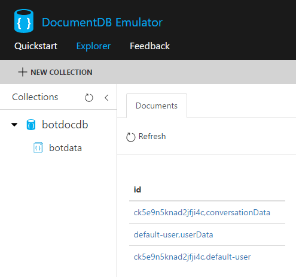
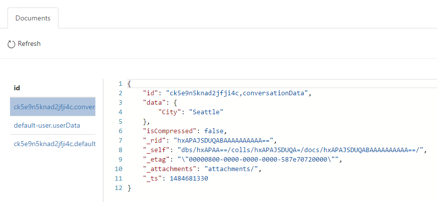
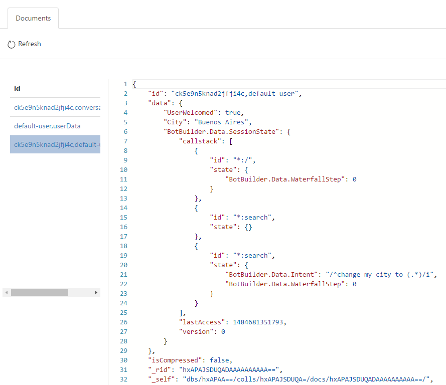

# Custom State API Bot Sample

A stateless sample bot tracking context of a conversation using a custom storage provider.

[![Deploy to Azure][Deploy Button]][Deploy Node/CustomState]

[Deploy Button]: https://azuredeploy.net/deploybutton.png
[Deploy Node/CustomState]: https://azuredeploy.net

### Prerequisites

The minimum prerequisites to run this sample are:
* Latest Node.js with NPM. Download it from [here](https://nodejs.org/en/download/).
* The Bot Framework Emulator. To install the Bot Framework Emulator, download it from [here](https://emulator.botframework.com/). Please refer to [this documentation article](https://github.com/microsoft/botframework-emulator/wiki/Getting-Started) to know more about the Bot Framework Emulator.
* The Azure DocumentDB Emulator. To install the Azure DocumentDB Emulator, download it from [here](https://aka.ms/documentdb-emulator). Please refer to [this documentation article](https://docs.microsoft.com/en-us/azure/documentdb/documentdb-nosql-local-emulator) to know more about the Azure DocumentDB Emulator.
* **[Recommended]** Visual Studio Code for IntelliSense and debugging, download it from [here](https://code.visualstudio.com/) for free.

### Code Highlights

The Bot Framework provides several ways of persisting data relative to a user or conversation. Behind the scenes the Bot Framework uses the Bot State Service for tracking context of a conversation. This allows the creation of stateless Bot web services so that they can be scaled.

There might be times when a custom storage wants to be used. Reasons for wanting this could be many, however the most common ones are:

* **Geographic Affinity**: Users can create their storage service (e.g. Azure Tables or Azure DocumentDB) in regions geographically close to their other services, minimizing latencies and improving user experience
* **Geo-replication & Redundancy**: Different storage services might provide varying degrees of redundancy, high availability, disaster recovery and geographic replication, which users might prefer (e.g. Azure Table and Azure DocumentDB)
* **Data ownership / Compliance**: Company policies and regulations may require the data to be in an account owned by the company
* **Leveraging data**: Users may benefit from having their own data available for querying or feeding into other processes such as analytics, etc.

This bot is based on the [State bot](../core-State), with the addition that it uses a custom storage for tracking the context of a conversation. In this case, we are storing the bot state in DocumentDB by using the [`AzureBotStorage`](https://github.com/Microsoft/BotBuilder-Azure/blob/master/Node/src/AzureBotStorage.ts) along with a [`DocumentDbClient`](https://github.com/Microsoft/BotBuilder-Azure/blob/master/Node/src/DocumentDbClient.ts) instance, both provided by the [BotBuilder Azure Extensions for Node.js](https://www.npmjs.com/package/botbuilder-azure) package.

Check out the creation of the `AzureBotStorage` and `DocumentDbClient` instances in the [app.js](./app.js#L51-L58). Also, see [how to configure the bot](./app.js#L61) to use this new custom storage:

````JavaScript
// Azure DocumentDb State Store
var docDbClient = new azure.DocumentDbClient({
    host: process.env.DOCUMENT_DB_HOST,
    masterKey: process.env.DOCUMENT_DB_MASTER_KEY,
    database: process.env.DOCUMENT_DB_DATABASE,
    collection: process.env.DOCUMENT_DB_COLLECTION
});
var botStorage = new azure.AzureBotStorage({ gzipData: false }, docDbClient);

// Set Custom Store
bot.set('storage', botStorage);
````

The `DocumentDbClient` requires a few settings that can be obtained when you [create a DocumentDB account](https://docs.microsoft.com/en-us/azure/documentdb/documentdb-create-account). The sample looks for these settings in the Environment variables and, by default, is configured to use the [DocumentDB Emulator](https://docs.microsoft.com/en-us/azure/documentdb/documentdb-nosql-local-emulator). Checkout the [.env](.env#L5-L9) file for the emulator configuration.

### Outcome

The sample itself will behave exactly as the [State bot](../core-State) with the difference that the bot state is being stored in DocumentDB.

After running the sample, go to the [Azure DocumentDB Emulator Data Explorer](https://localhost:8081/_explorer/index.html#) to check the documents that were stored in DocumentDB. Different Documents are created depending on the bot store type being used. 

The samples uses the three bot store types (UserData, ConversationData and PrivateConversationData), so three documents will appear in the DocumentDB collection.



Each of the documents contains the information related to the bot store type:

| UserData| ConversationData | PrivateConversationData |
|----------|-------|----------|
||||

### More Information

To get more information about how to get started in Bot Builder for .NET and State please review the following resources:
* [Bot Builder for Node.js Reference](https://docs.microsoft.com/en-us/bot-framework/nodejs/)
* [Bot Builder SDK Azure Extensions](https://github.com/Microsoft/BotBuilder-Azure)
* [Bot Builder Azure Extensions package](https://npmjs.com/package/botbuilder-azure)
* [Save user data](https://docs.microsoft.com/en-us/bot-framework/nodejs/bot-builder-nodejs-save-user-data)
* [Adding Dialogs and Memory](https://docs.botframework.com/en-us/node/builder/guides/core-concepts/#adding-dialogs-and-memory)
* [Bot State Service](https://docs.botframework.com/en-us/csharp/builder/sdkreference/stateapi.html)
* [State sample](../core-State)
