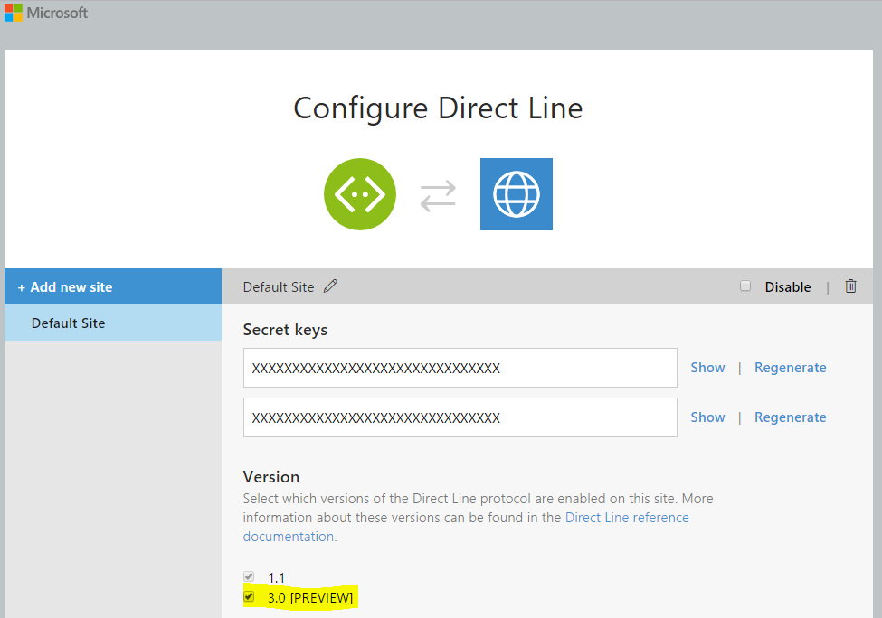
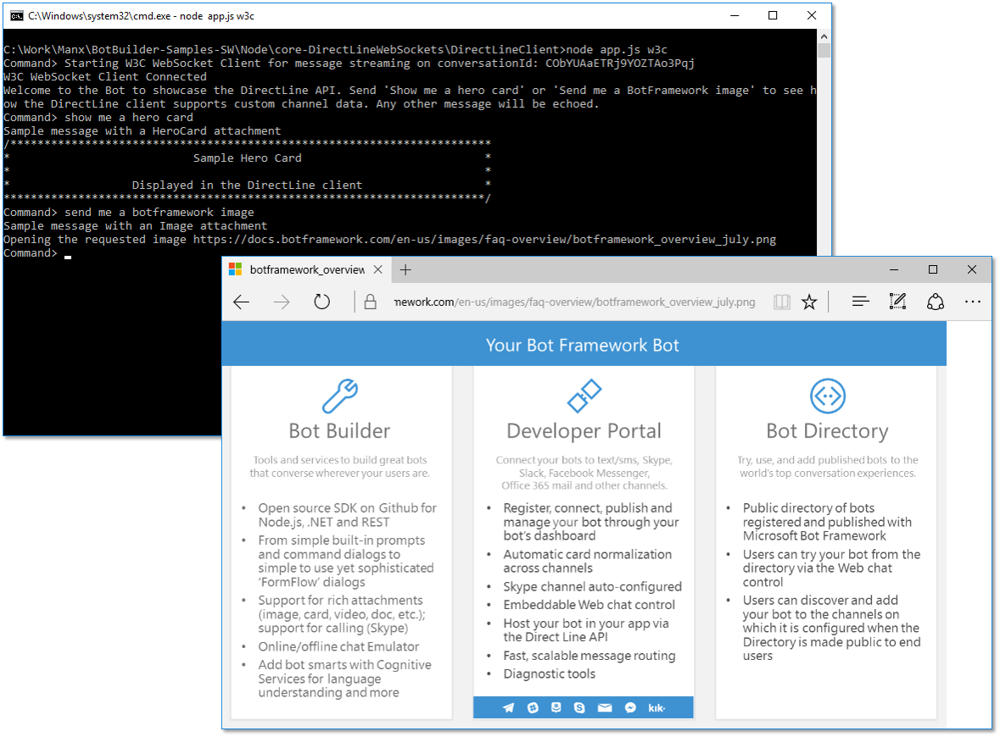

# Direct Line Bot Sample (using client WebSockets)

A sample bot and a custom client communicating to each other using the Direct Line API.

> For many developers, the [DirectLineJs](https://github.com/Microsoft/BotFramework-DirectLineJs) project is an easy way to connect to the Direct Line in Node.js.
>
> If you're interested in writing your own client without using DirectLineJs, use this sample.

[![Deploy to Azure][Deploy Button]][Deploy Node/DirectLineWebSockets]

[Deploy Button]: https://azuredeploy.net/deploybutton.png
[Deploy Node/DirectLineWebSockets]: https://azuredeploy.net

### Prerequisites

The minimum prerequisites to run this sample are:
* Latest Node.js with NPM. Download it from [here](https://nodejs.org/en/download/).
* The Bot Framework Emulator. To install the Bot Framework Emulator, download it from [here](https://emulator.botframework.com/). Please refer to [this documentation article](https://github.com/microsoft/botframework-emulator/wiki/Getting-Started) to know more about the Bot Framework Emulator.
* Register your bot with the Microsoft Bot Framework. Please refer to [this](https://docs.microsoft.com/en-us/bot-framework/portal-register-bot) for the instructions. Once you complete the registration, update your bot configuration with the registered config values (See [Debugging locally using ngrok](https://docs.microsoft.com/en-us/bot-framework/debug-bots-emulator) or [Deploying to Azure](https://docs.microsoft.com/en-us/bot-framework/publish-bot-overview)
* **[Recommended]** Visual Studio Code for IntelliSense and debugging, download it from [here](https://code.visualstudio.com/) for free.

#### Direct Line API
Credentials for the Direct Line API must be obtained from the Bot Framework developer portal, and will only allow the caller to connect to the bot for which they were generated.
In the Bot Framework developer portal, enable Direct Line in the channels list and then, configure the Direct Line secret and update its value in [DirectLineClient's app.js](DirectLineClient/app.js#L6) (`directLineSecret` variable). Make sure that the checkbox for version 3.0 [PREVIEW] is checked. 
Refer to [this](https://docs.microsoft.com/en-us/bot-framework/portal-configure-channels) for more information on how to configure channels.



#### Publish
Also, in order to be able to run and test this sample you must [publish your bot, for example to Azure](https://docs.microsoft.com/en-us/bot-framework/publish-bot-overview). Alternatively, you can [Debug locally using ngrok](https://docs.microsoft.com/en-us/bot-framework/debug-bots-emulator).
Remember to update the environment variables with the `MICROSOFT_APP_ID` and `MICROSOFT_APP_PASSWORD` on the [.env](DirectLineBot/.env) file.

### Code Highlights

The Direct Line API is a simple REST API for connecting directly to a single bot. This API is intended for developers writing their own client applications, web chat controls, or mobile apps that will talk to their bot. In this sample, we are using the [Direct Line Swagger file](https://docs.botframework.com/en-us/restapi/directline3/swagger.json) and [Swagger JS](https://github.com/swagger-api/swagger-js) to create a client for Node that will simplify access to the underlying REST API. Check out the client's [app.js](DirectLineClient/app.js#L22-L46) to see the client setup & initialization.

You'll see that we are using the Direct Line secret to [obtain a token](DirectLineClient/app.js#L32-L45). This step is optional, but prevents clients from accessing conversations they aren't participating in.
After the token is obtained, the client's auth secret is replaced with this new token.

````JavaScript
var directLineSpecUrl = 'https://docs.botframework.com/en-us/restapi/directline3/swagger.json';
var directLineClient = rp(directLineSpecUrl)
    .then(function (spec) {
        // Client
        return new Swagger({
            spec: JSON.parse(spec.trim()),
            usePromise: true
        });
    })
    .then(function (client) {
        // Obtain a token using the Direct Line secret
        return rp({
            url: 'https://directline.botframework.com/v3/directline/tokens/generate',
            method: 'POST',
            headers: {
                'Authorization': 'Bearer ' + directLineSecret
            },
            json: true            
        }).then(function (response) {
            // Then, replace the client's auth secret with the new token
            var token = response.token;
            client.clientAuthorizations.add('AuthorizationBotConnector', new Swagger.ApiKeyAuthorization('Authorization', 'Bearer ' + token, 'header'));
            return client;            
        });
    })
    .catch(function (err) {
        console.error('Error initializing DirectLine client', err);
        throw err;
    });
````

Each conversation on the Direct Line channel must be explicitly started using the `client.Conversations.Conversations_StartConversation()` function.
Check out the client's following [function call](DirectLineClient/app.js#L53-L69) which creates a new conversation.

````JavaScript
directLineClient.then(function (client) {
    client.Conversations.Conversations_StartConversation()
        .then(function (response) {
            var responseObj = response.obj;

            // Start console input loop from stdin
            sendMessagesFromConsole(client, responseObj.conversationId);
            
            if (useW3CWebSocket) {
                // Start receiving messages from WS stream - using W3C client
                startReceivingW3CWebSocketClient(responseObj.streamUrl, responseObj.conversationId);
            } else {
                // Start receiving messages from WS stream - using Node client
                startReceivingWebSocketClient(responseObj.streamUrl, responseObj.conversationId);
            }
        });
});
````

Once the conversation is created, a `conversationId` is returned and it can be used to call other endpoints to poll or send messages, as well as other activities.

User messages are sent to the Bot using the Direct Line Client `client.Conversations.Conversations_PostActivity` function using the `conversationId` generated in the previous step. This uses the HTTPS protocol and hits the REST API.

````JavaScript
client.Conversations.Conversations_PostActivity(
    {
        conversationId: conversationId,
        activity: {
            textFormat: 'plain',
            text: input,
            type: 'message',
            from: {
                id: directLineUserId,
                name: directLineUserId
            }
        }
    }).catch(function (err) {
        console.error('Error sending message:', err);
    });
````

Messages from the Bot are being received using the WebSocket protocol (actually WSS). For this, after the conversation was created a `streamUrl` is also returned and it will be the target for the WebSocket connection.

Check out the client's [startReceivingWebSocketClient](DirectLineClient/app.js#L104-L133) and [startReceivingW3CWebSocketClient](DirectLineClient/app.js#L135-L161) functions which create WebSocket clients hitting the `streamUrl` value returned when the conversation was created (one or other will be called dependening on the `w3c` optional flag when running the console app). Messages are then filtered from anyone but our own client using the [`printMessages`](DirectLineClient/app.js#L164-L179) function.

Each of these functions showcase the two ways you can connect to the `streamUrl` using WebSockets (first one using a custom Node.js implementation, while the second one uses W3C one). If you look closely they are very similar and within the `on message` event handler the bot's response is being parsed to JSON in order to print it.

For `startReceivingWebSocketClient` we have the following [handler](DirectLineClient/app.js#L121-L129):

````JavaScript
connection.on('message', function (message) {
    // Occasionally, the Direct Line service sends an empty message as a liveness ping
    // Ignore these messages
    if (message.type === 'utf8' && message.utf8Data.length > 0) {
        var data = JSON.parse(message.utf8Data);
        printMessages(data.activities);
    }
});
````

And for `startReceivingW3CWebSocketClient` we have the following [handler](DirectLineClient/app.js#L152-L160):

````JavaScript
ws.onmessage = function (e) {
    // Occasionally, the Direct Line service sends an empty message as a liveness ping
    // Ignore these messages
    if (typeof e.data === 'string' && e.data.length > 0) {
        var data = JSON.parse(e.data);
        printMessages(data.activities);
    }
};
````

> Clients should keep track of the `watermark` value from each `ActivitySet` so they can use it on reconnect. Note that a null or missing watermark should be ignored and should not overwrite a prior watermark in the client.

Direct Line v3.0 (unlike version 1.1) has supports for Attachments (see [send and receive attachments](https://docs.microsoft.com/en-us/bot-framework/nodejs/bot-builder-nodejs-send-receive-attachments) for more information about attachments).

Check out the [`printMessage`](DirectLineClient/app.js#L181-L200) function to see how the Attachments are retrieved and rendered appropriately based on their type.

````JavaScript
function printMessage(activity) {
    if (activity.text) {
        console.log(activity.text);
    }

    if (activity.attachments) {
        activity.attachments.forEach(function (attachment) {
            switch (attachment.contentType) {
                case "application/vnd.microsoft.card.hero":
                    renderHeroCard(attachment);
                    break;

                case "image/png":
                    console.log('Opening the requested image ' + attachment.contentUrl);
                    open(attachment.contentUrl);
                    break;
            }
        });
    }
}
````

### Outcome

To run the sample, you'll need to run both Bot and Client apps.

* Running Bot app
  1. Open a CMD console and CD to sample's `DirectLineBot` directory
  2. Run `node app.js`
* Running Client app
  1. Open a CMD console and CD to sample's `DirectLineClient` directory
  2. Run `node app.js {w3c}` - if you use the `w3c` optional flag then a W3C WebSocket will be used, otherwise a Node.js implementation is instanced
  
To test the ChannelData custom messages type in the Client's console `show me a hero card` or `send me a botframework image` and you should see the following outcome.



### More Information

To get more information about how to get started in Bot Builder for Node and Direct Line API please review the following resources:
* [Bot Builder for Node.js Reference](https://docs.microsoft.com/en-us/bot-framework/nodejs/)
* [Bot Framework FAQ](https://docs.botframework.com/en-us/faq/#i-have-a-communication-channel-id-like-to-be-configurable-with-bot-framework-can-i-work-with-microsoft-to-do-that)
* [Direct Line API - v3.0](https://docs.botframework.com/en-us/restapi/directline3/)
* [Direct Line API - v3.0 - Authentication](https://docs.botframework.com/en-us/restapi/directline3/#authentication-secrets-and-tokens)
* [Direct Line Swagger file - v3.0](https://docs.botframework.com/en-us/restapi/directline3/swagger.json)
* [Swagger-JS](https://github.com/swagger-api/swagger-js)
* [Send and receive attachments](https://docs.microsoft.com/en-us/bot-framework/nodejs/bot-builder-nodejs-send-receive-attachments)
* [Debugging locally using ngrok](https://docs.microsoft.com/en-us/bot-framework/debug-bots-emulator)
