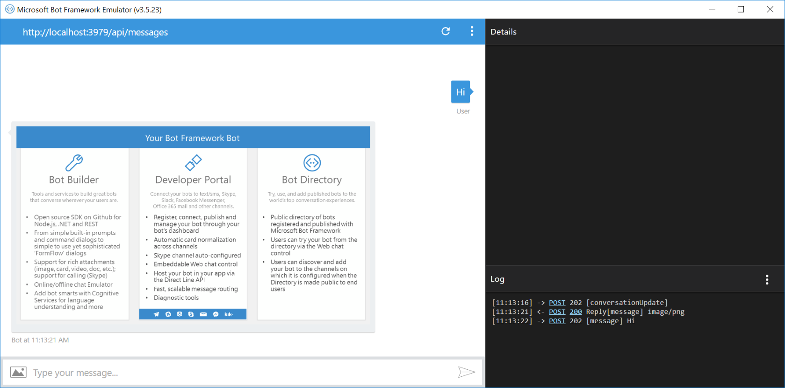
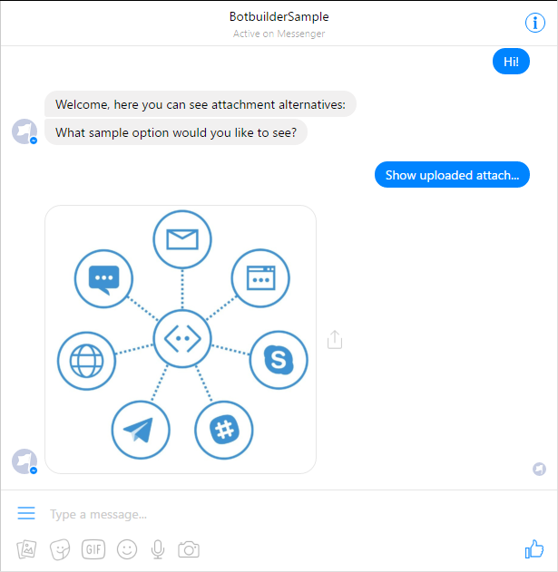
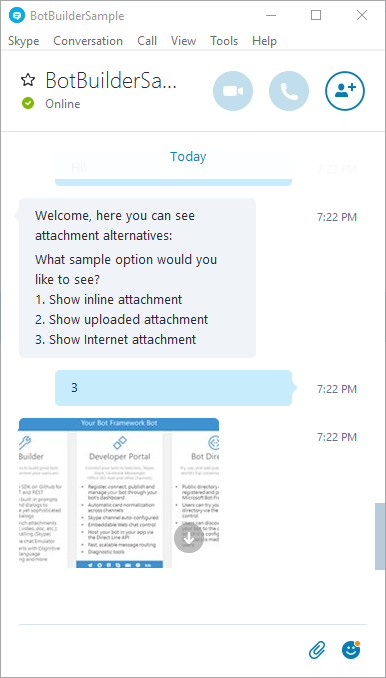

# Send Attachment Bot Sample

A sample bot that passes simple media attachments (images) to a message.

[![Deploy to Azure][Deploy Button]][Deploy Node/SendAttachment]

[Deploy Button]: https://azuredeploy.net/deploybutton.png
[Deploy Node/SendAttachment]: https://azuredeploy.net

### Prerequisites

The minimum prerequisites to run this sample are:
* Latest Node.js with NPM. Download it from [here](https://nodejs.org/en/download/).
* The Bot Framework Emulator. To install the Bot Framework Emulator, download it from [here](https://emulator.botframework.com/). Please refer to [this documentation article](https://github.com/microsoft/botframework-emulator/wiki/Getting-Started) to know more about the Bot Framework Emulator.
* **[Recommended]** Visual Studio Code for IntelliSense and debugging, download it from [here](https://code.visualstudio.com/) for free.

### Code Highlights

Many messaging channels provide the ability to attach richer objects. Bot Builder lets you express these attachments in a cross channel way and [connectors](https://docs.botframework.com/en-us/node/builder/chat-reference/interfaces/_botbuilder_d_.iconnector.html) will do their best to render the attachments using the channels native constructs. If you desire more control over the channels rendering of a message you can use [Message.sourceEvent](https://docs.botframework.com/en-us/node/builder/chat-reference/classes/_botbuilder_d_.message.html#sourceevent) to provide attachments using the channels native schema. The types of attachments that can be sent varies by channel but these are the basic types:
* **Media and Files**: Basic files can be sent by setting [contentType](https://docs.botframework.com/en-us/node/builder/chat-reference/interfaces/_botbuilder_d_.iattachment.html#contenttype) to the MIME type of the file and then passing a link to the file in [contentUrl](https://docs.botframework.com/en-us/node/builder/chat-reference/interfaces/_botbuilder_d_.iattachment.html#contenturl).
* **Cards and Keyboards**: A rich set of visual cards and custom keyboards can by setting [contentType](https://docs.botframework.com/en-us/node/builder/chat-reference/interfaces/_botbuilder_d_.iattachment.html#contenttype) to the cards type and then passing the JSON for the card in [content](https://docs.botframework.com/en-us/node/builder/chat-reference/interfaces/_botbuilder_d_.iattachment.html#content). If you use one of the rich card builder classes like [HeroCard](https://docs.botframework.com/en-us/node/builder/chat-reference/classes/_botbuilder_d_.herocard.html) the attachment will automatically filled in for you.

As a developer, you have three ways to send the attachment. The attachment can be:
 - An inline file, by encoding the file as base64 and use it in the contentUrl
 - A file uploaded to the channel's store via the Connection API, then using the attachmentId to create the contentUrl
 - An externally hosted file, by just specifying the Url of the file (it should be publicly accessible)

#### Attaching the image inline

It consists on sending the file contents, encoded in base64, along with the message payload. This option works for small files, like icon size images. 
You'll need to encode file's content, then set the attachment's `contentUrl` as follows:

````
data:image/png;base64,iVBORw0KGgo…
````

Checkout [app.js](./app.js#L60-L78) to see how to convert a file read using `fs.readFile()` and then create the message attachment.

````JavaScript
fs.readFile('./images/small-image.png', function (err, data) {
    var contentType = 'image/png';
    var base64 = Buffer.from(data).toString('base64');

    var msg = new builder.Message(session)
        .addAttachment({
            contentUrl: util.format('data:%s;base64,%s', contentType, base64),
            contentType: contentType,
            name: 'BotFrameworkLogo.png'
        });

    session.send(msg);
});
````

#### Uploading the file via the Connector API

This option should be used when the file to send is less than 256Kb in size when encoded to base64. A good scenario are images generated based on user input.
It does require a few more steps than the other methods, but leverages the channels store to store the file:

0. Read (or generate) the content file and store it in a Buffer for encoding to base64 ([relevant code](./app.js#L131))
1. Create a client to the Connector API ([relevant code](./app.js#L12-L17))
2. Inject the Bot Connector's token into the Connector API client ([relevant code](./app.js#L151))
3. Set the Connector API client service url to the Connector's ([relevant code](./app.js#L152-L156))
4. Upload the base64 encoded payload to the conversations/attachments endpoint ([relevant code](./app.js#L158-L168))
5. Use the returned attachmentId to generate the contentUrl ([relevant code](./app.js#L170-L174))

This sample provides a [helper method](./app.js#L128-L177) you can use that encapsulates most of the previous steps.

````JavaScript
// read file content and upload
fs.readFile('./images/big-image.png', function (err, data) {
    if (err) {
        return session.send('Oops. Error reading file.');
    }

    // Upload file data using helper function
    uploadAttachment(
        data,
        'image/png',
        'BotFrameworkImage.png',
        connector,
        connectorApiClient,
        session.message.address.serviceUrl,
        session.message.address.conversation.id)
        .then(function (attachmentUrl) {
            // Send Message with Attachment obj using returned Url
            var msg = new builder.Message(session)
                .addAttachment({
                    contentUrl: attachmentUrl,
                    contentType: 'image/png',
                    name: 'BotFrameworkLogo.png'
                });

            session.send(msg);
        })
        .catch(function (err) {
            console.log('Error uploading file', err);
            session.send('Oops. Error uploading file. ' + err.message);
        });
});
````

#### Using an externally hosted file

This option is the simplest but requires the image to be already on the Internet and be publicly accesible.
You could also provide an Url pointing to your own site.

Checkout [app.js](./app.js#L118-L125) to see how to create a message with a single image attachment.

````JavaScript
var msg = new builder.Message(session)
    .addAttachment({
        contentUrl: 'https://docs.botframework.com/en-us/images/faq-overview/botframework_overview_july.png',
        contentType: 'image/png',
        name: 'BotFrameworkOverview.png'
    });

session.send(msg);
````

### Outcome

You will see the following in the Bot Framework Emulator when selecting the inline attachment. See how the image is encoded in the `contentUrl` of the attachment.



You will see the following in your Facebook Messenger when selecting to upload the attachment.



On the other hand, you will see the following in Skype when selecting an Internet attachment.



### More Information

To get more information about how to get started in Bot Builder for Node and Attachments please review the following resources:
* [Bot Builder for Node.js Reference](https://docs.microsoft.com/en-us/bot-framework/nodejs/)
* [Send and receive attachments](https://docs.microsoft.com/en-us/bot-framework/nodejs/bot-builder-nodejs-send-receive-attachments)
* [Attachments](https://docs.botframework.com/en-us/node/builder/chat-reference/interfaces/_botbuilder_d_.iattachment.html)
* [Message.addAttachment method](https://docs.botframework.com/en-us/node/builder/chat-reference/classes/_botbuilder_d_.message.html#addattachment)
* [Connector API - UploadAttachment](https://docs.botframework.com/en-us/restapi/connector/#!/Conversations/Conversations_UploadAttachment)
