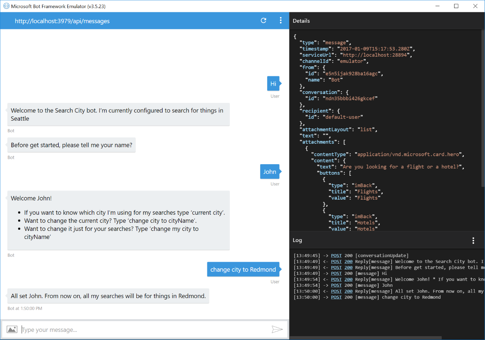
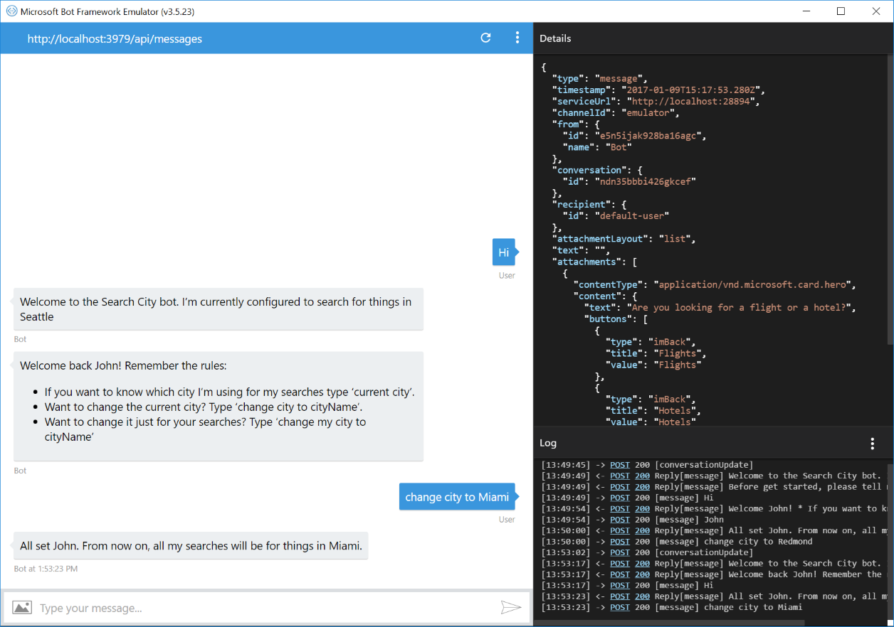

# State API Bot Sample

A stateless sample bot tracking context of a conversation.

[![Deploy to Azure][Deploy Button]][Deploy Node/State]

[Deploy Button]: https://azuredeploy.net/deploybutton.png
[Deploy Node/State]: https://azuredeploy.net

### Prerequisites

The minimum prerequisites to run this sample are:
* Latest Node.js with NPM. Download it from [here](https://nodejs.org/en/download/).
* The Bot Framework Emulator. To install the Bot Framework Emulator, download it from [here](https://emulator.botframework.com/). Please refer to [this documentation article](https://github.com/microsoft/botframework-emulator/wiki/Getting-Started) to know more about the Bot Framework Emulator.
* **[Recommended]** Visual Studio Code for IntelliSense and debugging, download it from [here](https://code.visualstudio.com/) for free.

### Code Highlights

The Bot Framework provides several ways of persisting data relative to a user or conversation.
Bots built using Bot Builder are designed to be stateless so that they can easily be scaled to run across multiple compute nodes. Because of that you should generally avoid the temptation to save state using a global variable or function closure. Doing so will create issues when you want to scale out your bot. Instead leverage the data bags above to persist temporary and permanent state.

Field | Use Cases
-------- | ---------
userData | Stores information globally for the user across all conversations.
conversationData | Stores information globally for a single conversation. This data is visible to everyone within the conversation so care should be used to what’s stored there. It’s disabled by default and needs to be enabled using the bots [`persistConversationData`](https://docs.botframework.com/en-us/node/builder/chat-reference/interfaces/_botbuilder_d_.iuniversalbotsettings.html#persistconversationdata) setting.
privateConversationData | Stores information globally for a single conversation but its private data for the current user. This data spans all dialogs so it’s useful for storing temporary state that you want cleaned up when the conversation ends.
dialogData | Persists information for a single dialog instance. This is essential for storing temporary information in between the steps of a waterfall.

**NOTE:** If you are planning to use `conversationData`, remember to enable conversation data persistence by using the [`persistConversationData`](https://docs.botframework.com/en-us/node/builder/chat-reference/interfaces/_botbuilder_d_.iuniversalbotsettings.html#persistconversationdata) setting flag. Check out [app.js](app.js#L51) as a reference:

````JavaScript
bot.set('persistConversationData', true);
````

Check out the use of `session.conversationData` in the [`main dialog`](app.js#L29-L33) to store a default search city. The conversationData object is shared for all users within a conversation.

````JavaScript
// initialize with default city
if (!session.conversationData[CityKey]) {
    session.conversationData[CityKey] = 'Seattle';
    session.send('Welcome to the Search City bot. I\'m currently configured to search for things in %s', session.conversationData[CityKey]);
}
````

Also, check out the use of `session.privateConversationData` in the [`printCurrentCity` dialog](app.js#L75-L88). Logic is included to override data stored in the `conversationData` object. `privateConversationData` is private to a specific user within a conversation.

````JavaScript
var userName = session.userData[UserNameKey];
var defaultCity = session.conversationData[CityKey];
var userCity = session.privateConversationData[CityKey];
if (!defaultCity) {
    session.endDialog('I don\'t have a search city configured yet.');
} else if (userCity) {
    session.endDialog(
        '%s, you have overridden the city. Your searches are for things in %s. The default conversation city is %s.',
        userName, userCity, defaultCity);
} else {
    session.endDialog('Hey %s, I\'m currently configured to search for things in %s.', userName, defaultCity);
}
````

In contrast, check out the use of `session.userData` in the [`greet` dialog](app.js#L109-L117) to remember the user's name. `userData` is shared across all channels and conversations for this user.

````JavaScript
bot.dialog('greet', new builder.SimpleDialog(function (session, results) {
    if (results && results.response) {
        session.userData['UserName'] = results.response;
        ...
    }
}));
````

Additionally, `dialogData` field is persisted with this dialog on each message. It ensures that the dialogs state is properly maintained between each turn of the conversation. You can store anything you want into this field but should limit yourself to JavaScript primitives that can be properly serialized.

### Outcome

The first time you run this sample it will display a welcome message and configure itself to issue search queries for the 'Seattle' city, storing this value in the `conversationData` bag. It will also prompt you for your name and store it in the `userData` bag and display a help message. Issuing the `change my city` command will allow you to change the search city for this conversation only and just for your user, storing the value in the `privateConversationData` bag.



Subsequently, you can start a new conversation (In the Bot Framework Channel Emulator this can be done by using the 'ConversationNames - New' button) and this time the bot will remember you name but will forget the city override we executed in the previous conversation. Using the `change city` command this can be changed for all the users in the conversation.



### More Information

To get more information about how to get started in Bot Builder for Node and Dialogs please review the following resources:
* [Bot Builder for Node.js Reference](https://docs.microsoft.com/en-us/bot-framework/nodejs/)
* [Adding Dialogs and Memory](https://docs.botframework.com/en-us/node/builder/guides/core-concepts/#adding-dialogs-and-memory)
* [Save user data](https://docs.microsoft.com/en-us/bot-framework/nodejs/bot-builder-nodejs-save-user-data)
* [session.userData](https://docs.botframework.com/en-us/node/builder/chat-reference/classes/_botbuilder_d_.session.html#userdata)
* [session.conversationData](https://docs.botframework.com/en-us/node/builder/chat-reference/classes/_botbuilder_d_.session.html#conversationdata)
* [session.privateConversationData](https://docs.botframework.com/en-us/node/builder/chat-reference/classes/_botbuilder_d_.session.html#privateconversationdata)
* [session.dialogData](https://docs.botframework.com/en-us/node/builder/chat-reference/classes/_botbuilder_d_.session.html#dialogdata)
* [bot's persistConversationData setting](https://docs.botframework.com/en-us/node/builder/chat-reference/interfaces/_botbuilder_d_.iuniversalbotsettings.html#persistconversationdata)
