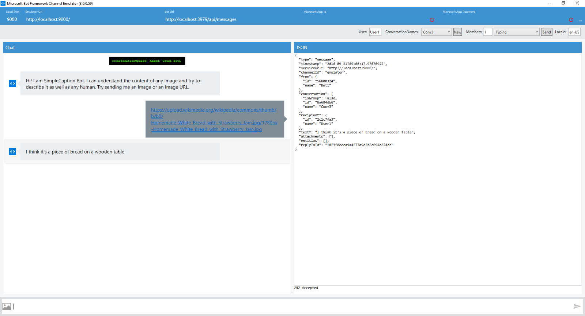
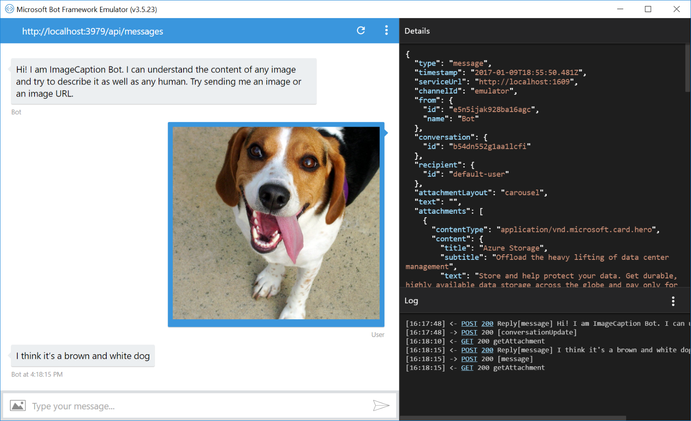

# Image Caption Bot Sample

A sample bot that illustrates how to use the Microsoft Cognitive Services Computer Vision API to analyze an image from a stream or a URL and return to the user the image caption.

[![Deploy to Azure][Deploy Button]][Deploy Node/ImageCaption]

[Deploy Button]: https://azuredeploy.net/deploybutton.png
[Deploy Node/ImageCaption]: https://azuredeploy.net

### Prerequisites

The minimum prerequisites to run this sample are:
* Latest Node.js with NPM. Download it from [here](https://nodejs.org/en/download/).
* The Bot Framework Emulator. To install the Bot Framework Emulator, download it from [here](https://emulator.botframework.com/). Please refer to [this documentation article](https://github.com/microsoft/botframework-emulator/wiki/Getting-Started) to know more about the Bot Framework Emulator.
* Computer Vision App ID. You can obtain one from [Microsoft Cognitive Services Subscriptions Page](https://www.microsoft.com/cognitive-services/en-us/subscriptions?productId=/products/54d873dd5eefd00dc474a0f4).
* **[Recommended]** Visual Studio Code for IntelliSense and debugging, download it from [here](https://code.visualstudio.com/) for free.
* This sample currently uses a free trial Microsoft Cognitive service key with limited QPS. Please subscribe to Vision API services [here](https://www.microsoft.com/cognitive-services/en-us/subscriptions) and update the `MICROSOFT_VISION_API_KEY` key in [.env](.env) file to try it out further.


### Code Highlights

Microsoft Computer Vision API provides a number of methods that allows you to analyze an image. Check out [Computer Vision API - v1.0](https://westus.dev.cognitive.microsoft.com/docs/services/56f91f2d778daf23d8ec6739/operations/56f91f2e778daf14a499e1fa) for a complete reference of the methods available. In this sample we are using the 'analyze' endpoint with the 'visualFeatures' parameter set to 'Description' `https://westus.api.cognitive.microsoft.com/vision/v1.0/analyze?visualFeatures=Description` 

The main components are:

* [caption-service.js](caption-service.js): is the core component illustrating how to call the Computer Vision RESTful API.
* [app.js](app.js): is the bot service listener receiving messages from the connector service and passing them down to caption-service.js.

In this sample we are using the API to get the image description and send it back to the user. Check out the use of the `captionService.getCaptionFromStream(stream)` method in [app.js](app.js#L35-L40).

````JavaScript
if (hasImageAttachment(session)) {
    var stream = getImageStreamFromMessage(session.message);
    captionService
        .getCaptionFromStream(stream)
        .then(function (caption) { handleSuccessResponse(session, caption); })
        .catch(function (error) { handleErrorResponse(session, error); });
}
````

And here is the implementation of `captionService.getCaptionFromStream(stream)` in [caption-service.js](caption-service.js#L15).

````JavaScript
/** 
 *  Gets the caption of the image from an image stream
 * @param {stream} stream The stream to an image.
 * @return {Promise} Promise with caption string if succeeded, error otherwise
 */
exports.getCaptionFromStream = function (stream) {
    return new Promise(
        function (resolve, reject) {
            var requestData = {
                url: VISION_URL,
                encoding: 'binary',
                headers: { 'content-type': 'application/octet-stream' }
            };

            stream.pipe(request.post(requestData, function (error, response, body) {
                if (error) {
                    reject(error);
                }
                else if (response.statusCode !== 200) {
                    reject(body);
                }
                else {
                    resolve(extractCaption(JSON.parse(body)));
                }
            }));
        }
    );
};
````

### Outcome

You will see the following when connecting the Bot to the Emulator and send it an image URL:

Input:


Output:



You can also choose to upload an image directly to the bot:



### More Information

To get more information about how to get started in Bot Builder for Node and Microsoft Cognitive Services Computer Vision API please review the following resources:
* [Bot Builder for Node.js Reference](https://docs.microsoft.com/en-us/bot-framework/nodejs/)
* [Microsoft Cognitive Services Computer Vision API](https://www.microsoft.com/cognitive-services/en-us/computer-vision-api)
