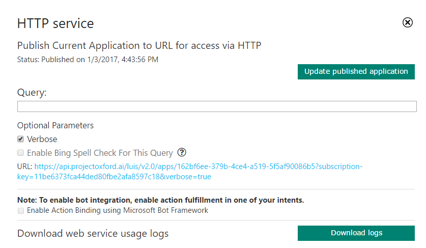
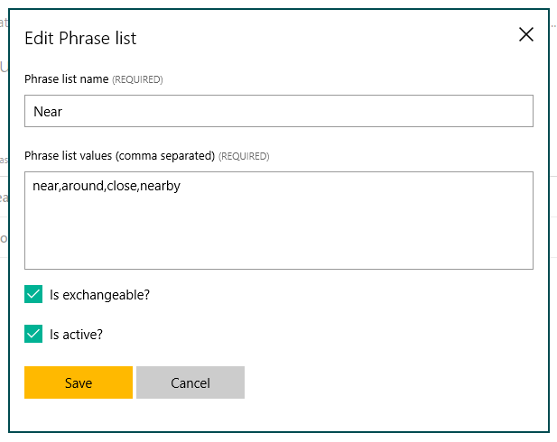

# LUIS Bot Sample

A sample bot integrated with a LUIS.ai application for understanding natural language.

[![Deploy to Azure][Deploy Button]][Deploy Node/LUIS]

[Deploy Button]: https://azuredeploy.net/deploybutton.png
[Deploy Node/LUIS]: https://azuredeploy.net

### Prerequisites

The minimum prerequisites to run this sample are:
* Latest Node.js with NPM. Download it from [here](https://nodejs.org/en/download/).
* The Bot Framework Emulator. To install the Bot Framework Emulator, download it from [here](https://emulator.botframework.com/). Please refer to [this documentation article](https://github.com/microsoft/botframework-emulator/wiki/Getting-Started) to know more about the Bot Framework Emulator.
* **[Recommended]** Visual Studio Code for IntelliSense and debugging, download it from [here](https://code.visualstudio.com/) for free.

#### LUIS Application
If you want to test this sample, you have to import the pre-build [LuisBot.json](LuisBot.json) file to your LUIS account.

The first step to using LUIS is to create or import an application. Go to the home page, www.luis.ai, and log in. After creating your LUIS account you'll be able to Import an Existing Application where can you can select a local copy of the LuisBot.json file an import it.


Once you imported the application you'll need to "train" the model ([Training](https://www.microsoft.com/cognitive-services/en-us/LUIS-api/documentation/Train-Test)) before you can "Publish" the model in an HTTP endpoint. For more information, take a look at [Publishing a Model](https://www.microsoft.com/cognitive-services/en-us/LUIS-api/documentation/PublishApp).

Finally, edit the [.env](.env#L6) file and update the `LUIS_MODEL_URL` variable with your's Model URL.

#### Where to find the Model URL

In the LUIS application's dashboard, click the "Publish App" button in the right side bar, select an Endpoint Key and then click the "Publish" button. After a couple of moments, you will see a url that makes your models available as a web service.



### Code Highlights

One of the key problems in human-computer interactions is the ability of the computer to understand what a person wants, and to find the pieces of information that are relevant to their intent. In the LUIS application, you will bundle together the intents and entities that are important to your task. Read more about [Planning an Application](https://www.microsoft.com/cognitive-services/en-us/LUIS-api/documentation/Plan-your-app) in the LUIS Help 

#### Intent Recognizers

The BotBuilder Node SDK contains Recognizer plugins that allow to detect intention from user messages using different methods, from Regex to natural language understading. These Recognizer plugins and the IntentDialog are useful for building more open ended bots that support natural language style understanding.

Out of the box, Bot Builder comes with a [LuisRecognizer](https://docs.botframework.com/en-us/node/builder/chat-reference/classes/_botbuilder_d_.luisrecognizer) that can be used to call a machine learning model you have trained via the [LUIS web site](https://www.luis.ai/). You can create a LuisRecognizer that is pointed at your model and then pass that recognizer to an IntentDialog at creation time using the [options](https://docs.botframework.com/en-us/node/builder/chat-reference/interfaces/_botbuilder_d_.iintentdialogoptions) structure, or you can register a global recognizer that will listen to every user message and detect intention. Check out how to [register a global LuisRecognizer](app.js#L25-L28):

````JavaScript
// You can provide your own model by specifing the 'LUIS_MODEL_URL' environment variable
// This Url can be obtained by uploading or creating your model from the LUIS portal: https://www.luis.ai/
var recognizer = new builder.LuisRecognizer(process.env.LUIS_MODEL_URL);
bot.recognizer(recognizer);
````

Intent recognizers return matches as named intents. To match against an intent from a recognizer you pass the name of the intent you want to handle to [IntentDialog.matches()](https://docs.botframework.com/en-us/node/builder/chat-reference/classes/_botbuilder_d_.intentdialog#matches) or use the dialog's [triggerAction()](https://docs.botframework.com/en-us/node/builder/chat-reference/classes/_botbuilder_d_.intentdialog.html#triggeraction) by specifing the intent name with [matches](https://docs.botframework.com/en-us/node/builder/chat-reference/interfaces/_botbuilder_d_.itriggeractionoptions.html#matches) property. See how the bot matches the [`SearchHotels`](app.js#L80), [`ShowHotelsReviews`](app.js#L100) and [`Help`](app.js#L106) intents.

````JavaScript
bot.dialog('SearchHotels', [
    // ... waterfall dialog ...
]).triggerAction({
    matches: 'SearchHotels'
});

bot.dialog('ShowHotelsReviews', function (session, args) {
    // ...
}).triggerAction({
    matches: 'ShowHotelsReviews'
});

bot.dialog('Help', function (session) {
    // ...
}).triggerAction({
    matches: 'Help'
});
````

#### Entity Recognition

LUIS can not only identify a users intention given an utterance, it can extract entities from their utterance as well. Any entities recognized in the users utterance will be passed to the intent handler via its [`args`](https://docs.botframework.com/en-us/node/builder/chat-reference/interfaces/_botbuilder_d_.iintentrecognizerresult) parameter.

Bot Builder includes an [`EntityRecognizer`](https://docs.botframework.com/en-us/node/builder/chat-reference/classes/_botbuilder_d_.entityrecognizer.html) class to simplify working with these entities. You can use [`EntityRecognizer.findEntity()`](https://docs.botframework.com/en-us/node/builder/chat-reference/classes/_botbuilder_d_.entityrecognizer.html#findentity) and [`EntityRecognizer.findAllEntities()`](https://docs.botframework.com/en-us/node/builder/chat-reference/classes/_botbuilder_d_.entityrecognizer.html#findallentities) to search for entities of a specific type by name. Check out how [city and airport entities are extracted](app.js#L34-L36).

````JavaScript
var cityEntity = builder.EntityRecognizer.findEntity(args.intent.entities, 'builtin.geography.city');
var airportEntity = builder.EntityRecognizer.findEntity(args.intent.entities, 'AirportCode');
````

The `AirportCode` entity makes use of the LUIS Pattern Features which helps LUIS infer entities based on an Regular Expression match, for instance, Airport Codes consist of three consecutive alphabetic characters. You can read more about Pattern Features in the [Add Features](https://www.microsoft.com/cognitive-services/en-us/LUIS-api/documentation/Add-Features#pattern-features) section of the LUIS Help Docs.


Another LUIS Model Feature used is Phrase List Features, for instance, the model includes a phrase list named Near which categorizes the words: near, around, close and nearby. Phrase list features work for both words and phrase and what LUIS learns about one phrase will automatically be applied to the others as well.

> Note: Both RegEx and Phrase List are transparent from the Bot's implementation perspective. Think of model features as "hints" used by the Machine Learning algorithm to help categorize and recognize words that compound Entities and Intents.



In our sample, we are using a [waterfall dialog](https://docs.microsoft.com/en-us/bot-framework/nodejs/bot-builder-nodejs-dialog-waterfall) for the hotel search. This is a common pattern that you'll likely use for most of your intent handlers. The way waterfalls work in Bot Builder is the very first step of the waterfall is called when a dialog (or in this case intent handler) is triggered. The step then does some work and continues execution of the waterfall by either calling another dialog (like a built-in prompt) or calling the optional `next()` function passed in. When a dialog is called in a step, any result returned from the dialog will be passed as input to the results parameter for the next step. 

Our bot tries to check if an entity of city or airport type were [matched and forwards it](app.js#L37-L44) to the next step. If that's not the case, the user is [prompted with a destination](app.js#L47). The [next step](app.js#L50) will receive the destination or airport code in the `results` argument.

````JavaScript
bot.dialog('SearchHotels', [
    function (session, args, next) {
        session.send('Welcome to the Hotels finder! We are analyzing your message: \'%s\'', session.message.text);

        // try extracting entities
        var cityEntity = builder.EntityRecognizer.findEntity(args.intent.entities, 'builtin.geography.city');
        var airportEntity = builder.EntityRecognizer.findEntity(args.intent.entities, 'AirportCode');
        if (cityEntity) {
            // city entity detected, continue to next step
            session.dialogData.searchType = 'city';
            next({ response: cityEntity.entity });
        } else if (airportEntity) {
            // airport entity detected, continue to next step
            session.dialogData.searchType = 'airport';
            next({ response: airportEntity.entity });
        } else {
            // no entities detected, ask user for a destination
            builder.Prompts.text(session, 'Please enter your destination');
        }
    },
    function (session, results) {
        var destination = results.response;

        var message = 'Looking for hotels';
        if (session.dialogData.searchType === 'airport') {
            message += ' near %s airport...';
        } else {
            message += ' in %s...';
        }

        session.send(message, destination);

        // Async search
        Store
            .searchHotels(destination)
            .then(function (hotels) {
                // args
                session.send('I found %d hotels:', hotels.length);

                var message = new builder.Message()
                    .attachmentLayout(builder.AttachmentLayout.carousel)
                    .attachments(hotels.map(hotelAsAttachment));

                session.send(message);

                // End
                session.endDialog();
            });
    }
]).triggerAction({
    matches: 'SearchHotels',
    onInterrupted: function (session) {
        session.send('Please provide a destination');
    }
});
````

Similarly, the [`ShowHotelsReviews`](app.js#L86) uses a single closure to search for hotel reviews.

````
bot.dialog('ShowHotelsReviews', function (session, args) {
    // retrieve hotel name from matched entities
    var hotelEntity = builder.EntityRecognizer.findEntity(args.intent.entities, 'Hotel');
    if (hotelEntity) {
        session.send('Looking for reviews of \'%s\'...', hotelEntity.entity);
        Store.searchHotelReviews(hotelEntity.entity)
            .then(function (reviews) {
                var message = new builder.Message()
                    .attachmentLayout(builder.AttachmentLayout.carousel)
                    .attachments(reviews.map(reviewAsAttachment));
                session.endDialog(message);
            });
    }
}).triggerAction({
    matches: 'ShowHotelsReviews'
});
````

> **NOTE:** When using an IntentDialog, you should avoid adding a matches() handler for LUIS’s “None” intent. Add a onDefault() handler instead (or a default dialog when using global recognizers). The reason for this is that a LUIS model will often return a very high score for the None intent if it doesn’t understand the users utterance. In the scenario where you’ve configured the IntentDialog with multiple recognizers that could cause the None intent to win out over a non-None intent from a different model that had a slightly lower score. Because of this the LuisRecognizer class suppresses the None intent all together. If you explicitly register a handler for “None” it will never be matched. The onDefault() handler (or the bot's default dialog) however can achieve the same effect because it essentially gets triggered when all of the models reported a top intent of “None”.

### Spelling Correction

If you want to enable spelling correction, set the `IS_SPELL_CORRECTION_ENABLED` key to `true` in the [.env](.env#L14) file.

Microsoft Bing Spell Check API provides a module that allows you to to correct the spelling of the text. Check out the [reference](https://dev.cognitive.microsoft.com/docs/services/56e73033cf5ff80c2008c679/operations/56e73036cf5ff81048ee6727) to know more about the modules available. 

[spell-service.js](spell-service.js) is the core component illustrating how to call the Bing Spell Check RESTful API.

In this sample we added spell correction as a middleware. Check out the middleware in [app.js](app.js#L109-L125).

````JavaScript
if (process.env.IS_SPELL_CORRECTION_ENABLED === 'true') {
    bot.use({
        botbuilder: function (session, next) {
            spellService
                .getCorrectedText(session.message.text)
                .then(function (text) {
                    session.message.text = text;
                    next();
                })
                .catch(function (error) {
                    console.error(error);
                    next();
                });
        }
    });
}
````

### Outcome

You will see the following in the Bot Framework Emulator when opening and running the sample solution.


### More Information

To get more information about how to get started in Bot Builder for Node and LUIS please review the following resources:
* [Bot Builder for Node.js Reference](https://docs.microsoft.com/en-us/bot-framework/nodejs/)
* [Understanding Natural Language](https://docs.botframework.com/en-us/node/builder/guides/understanding-natural-language/)
* [LUIS Help Docs](https://www.luis.ai/home/help)
* [Cognitive Services Documentation](https://www.microsoft.com/cognitive-services/en-us/luis-api/documentation/home)
* [IntentDialog](https://docs.botframework.com/en-us/node/builder/chat/IntentDialog/)
* [EntityRecognizer](https://docs.botframework.com/en-us/node/builder/chat-reference/classes/_botbuilder_d_.entityrecognizer.html)
* [Alarm Bot in Node](https://github.com/Microsoft/BotBuilder/tree/master/Node/examples/basics-naturalLanguage)
* [Microsoft Bing Spell Check API](https://www.microsoft.com/cognitive-services/en-us/bing-spell-check-api)

> **Limitations**  
> The functionality provided by the Bot Framework Activity can be used across many channels. Moreover, some special channel features can be unleashed using the [Message.sourceEvent](https://docs.botframework.com/en-us/node/builder/chat-reference/classes/_botbuilder_d_.message.html#sourceevent) method.
> 
> The Bot Framework does its best to support the reuse of your Bot in as many channels as you want. However, due to the very nature of some of these channels, some features are not fully portable.
> 
> The features used in this sample are fully supported in the following channels:
> - Skype
> - Facebook
> - Microsoft Teams
> - DirectLine
> - WebChat
> - Slack
> - GroupMe
> - Telegram
> 
> They are also supported, with some limitations, in the following channels:
> - Kik
> - Email
> 
> On the other hand, they are not supported and the sample won't work as expected in the following channel:
> - SMS
