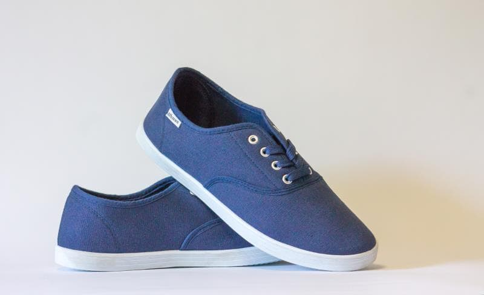
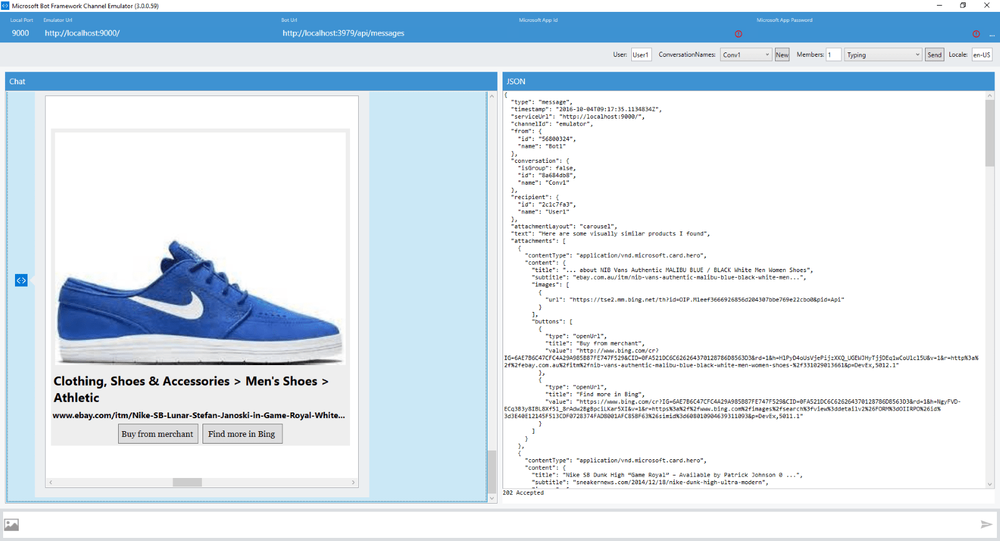

# Similar Products Bot Sample

A sample bot that illustrates how to use the [Microsoft Bing Image Search API](https://www.microsoft.com/cognitive-services/en-us/bing-image-search-api) to find visually similar products from an image stream or a URL.

[](https://azuredeploy.net)

### Prerequisites

The minimum prerequisites to run this sample are:
* Latest Node.js with NPM. Download it from [here](https://nodejs.org/en/download/).
* The Bot Framework Emulator. To install the Bot Framework Emulator, download it from [here](https://aka.ms/bf-bc-emulator). Please refer to [this documentation article](https://docs.botframework.com/en-us/csharp/builder/sdkreference/gettingstarted.html#emulator) to know more about the Bot Framework Emulator.
* **[Recommended]** Visual Studio Code for IntelliSense and debugging, download it from [here](https://code.visualstudio.com/) for free.
* This sample currently uses a free trial Microsoft Bing Search API key with limited QPS. Please subscribe [here](https://www.microsoft.com/cognitive-services/en-us/subscriptions) to obtain your own key and update the `BING_SEARCH_API_KEY` key in [.env](.env) file to try it out further..


### Code Highlights

Microsoft Bing Image Search API provides a number of modules that allows you to search by image. Check out the [reference](https://msdn.microsoft.com/en-us/library/dn760791.aspx) to know more about the modules available. In this sample we are using the 'SimilarProducts' module to get similar products of to an image, We set the 'modulesRequested' parameter set to 'SimilarProducts' `https://api.cognitive.microsoft.com/bing/v5.0/images/search?modulesRequested=SimilarProducts` 

The main components are:

* [image-service.js](image-service.js): is the core component illustrating how to call the  Bing Image Search RESTful API.
* [app.js](app.js): is the bot service listener receiving messages from the connector service and passing them down to image-service.js and constructing the response.

In this sample we are using the API to get the similar products and send it back to the user. Check out the use of the `imageService.getSimilarProductsFromStream(stream)` method in [app.js](app.js).

````JavaScript
if (hasImageAttachment(session)) {
        var stream = getImageStreamFromAttachment(session.message.attachments[0]);
        imageService
            .getSimilarProductsFromStream(stream)
            .then(visuallySimilarProducts => handleApiResponse(session, visuallySimilarProducts))
            .catch(error => handleErrorResponse(session, error));
    }
````
and here is the implementation of `imageService.getSimilarProductsFromStream(stream)` in [image-service.js](image-service.js)
````JavaScript
/** 
 *  Gets the similar products of the image from an image stream
 * @param {stream} stream The stream to an image.
 * @return (Promise) Promise with visuallySimilarProducts array if succeeded, error otherwise
 */
exports.getSimilarProductsFromStream = stream => {
    return new Promise(
        (resolve, reject) => {       
            const requestData = {
                url: BING_API_URL,
                encoding: 'binary',
                formData: {
                    file: stream
                },
                headers: {
                    "Ocp-Apim-Subscription-Key": BING_SEARCH_API_KEY
                }
            };

            request.post(requestData, (error, response, body) => {
                if (error) {
                    reject(error);
                }
                else if (response.statusCode != 200) {
                    reject(body);
                }
                else {
                    resolve(JSON.parse(body).visuallySimilarProducts);
                }
            });
        }
    );
}
````

### Outcome

You will see the following when connecting the Bot to the Emulator and send it an image or a URL:

Input:



Output:



### More Information

To get more information about how to get started in Bot Builder for Node and Microsoft Bing Images Search API please review the following resources:
* [Bot Builder for Node.js Reference](https://docs.botframework.com/en-us/node/builder/overview/#navtitle)
* [Microsoft Bing Image Search API](https://www.microsoft.com/cognitive-services/en-us/bing-image-search-api)
* [Microsoft Bing Image Search API Reference](https://msdn.microsoft.com/en-us/library/dn760791.aspx)