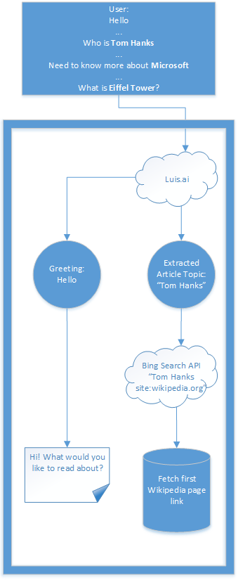
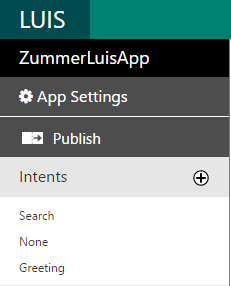
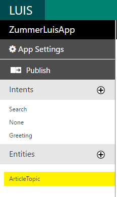
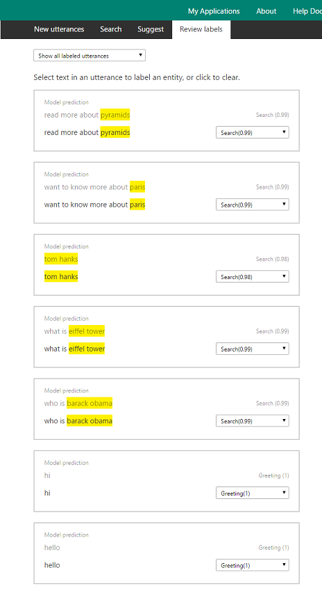
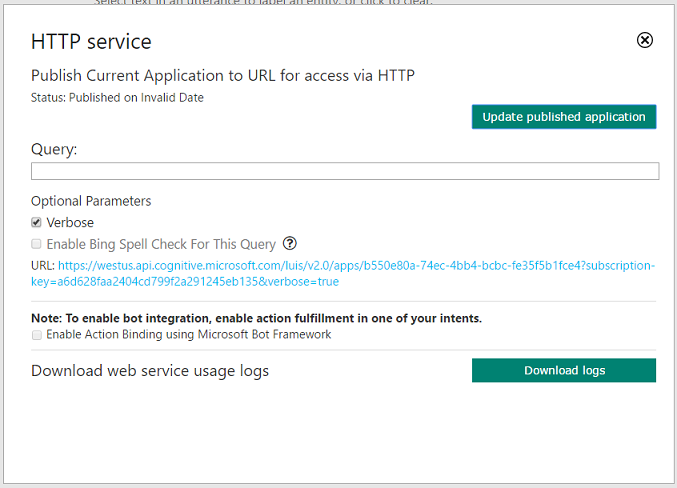

Zummer Bot (Node.js)
====================

In this tutorial we will cover how to build an information search bot - Zummer
using [Bing Web Search
API](https://www.microsoft.com/cognitive-services/en-us/bing-web-search-api),
[Language Understanding Intelligent Services
(LUIS)](https://www.microsoft.com/cognitive-services/en-us/language-understanding-intelligent-service-luis)

[![Deploy to Azure][Deploy Button]][Deploy Node/Zummer]

[Deploy Button]: https://azuredeploy.net/deploybutton.png
[Deploy Node/Zummer]: https://azuredeploy.net

Bot Recipe/Prerequisites:
-------------------------

-   **Microsoft Bot Framework** to host and publish to multiple platforms. You
    can download Bot Framework Emulator from
    [here](https://aka.ms/bf-bc-emulator). More details in [this documentation
    article](https://docs.microsoft.com/en-us/bot-framework/nodejs/bot-builder-nodejs-quickstart) 

-   **Bing Web Search API** to fetch the most relevant Wikipedia article on any
    given topic.

-   **Luis.ai** to understand the query intent

 

Let's get started, shall we?
----------------------------

Here is a simple flowc of what the Zummer bot logic is:

 

Creating a LUIS application and training it to understand the query intent
--------------------------------------------------------------------------

Zummer bot is trained to understand the following intents:

-   Greeting

-   Article Search by topic

 

1.  **Sign in and Create an application** on [www.luis.ai](http://www.luis.ai/)  
    **Note:** You can either import the LUIS application JSON file
    “ZummerLuisApp.json” found in the sample folder

    

2.  **Create intent, entities and train LUIS**

    1.  Add an intent for Greeting and Search each by clicking on '+'

        

    2.  Add utterances like Hi, Hello, etc. and assign it to the Greeting intent

    3.  For Search Intent: Create “ArticleTopic” Entity

        

    4.  Add utterances for queries that contain "ArticleTopic" entity

        

3.  **Train your models** by clicking “Train”

4.  **Publish your application**

5.  **Save your published endpoint URL** to be used to create a bot on bot framework

    

### Calling the LUIS application from MS bot framework project

1.  Create a IntentDialog as in app.js One of the benefits of IntentDialog is
    that we can bind some functions to LUIS intents and other functions to
    regex.

    ~~~~~~~~~~~~~~~~~~~~~~~~~~~~~~~~~~~~~~~~~~~~~~~~~~~~~~~~~~~~~~~~~~~~~~~~~ c#
    const LuisModelUrl = process.env.LUIS_MODEL_URL ||
        'https://westus.api.cognitive.microsoft.com/luis/v2.0/apps/b550e80a-74ec-4bb4-bcbc-fe35f5b1fce4?subscription-key=a6d628faa2404cd799f2a291245eb135';

    // Main dialog with LUIS
    var recognizer = new builder.LuisRecognizer(LuisModelUrl);
    var intents = new builder.IntentDialog({ recognizers: [recognizer] })
    ~~~~~~~~~~~~~~~~~~~~~~~~~~~~~~~~~~~~~~~~~~~~~~~~~~~~~~~~~~~~~~~~~~~~~~~~~~~~

2.  Create functions that are responsible to handel LUIS (Greetings and Search)
    intents.

    ~~~~~~~~~~~~~~~~~~~~~~~~~~~~~~~~~~~~~~~~~~~~~~~~~~~~~~~~~~~~~~~~~~~~~~~~~ c#
    var intents = new builder.IntentDialog({ recognizers: [recognizer] })
        .matches('Greeting', [
            (session) => {
                session.send(zummerStrings.GreetOnDemand).endDialog();
            }
        ])
        .matches('Search', [[(session, args) => { ... }])
    ~~~~~~~~~~~~~~~~~~~~~~~~~~~~~~~~~~~~~~~~~~~~~~~~~~~~~~~~~~~~~~~~~~~~~~~~~~~~

 

Fetching Wikipedia articles on a topic using Bing Web Search API
----------------------------------------------------------------

1.  Create a free tier “Key” that will be used for calling the Bing APIs on [Microsoft
    Cognitive Service
    subscriptions](https://www.microsoft.com/cognitive-services/en-US/subscriptions)
    

2.  Bing Web Search API request format details can be found at [Bing Web API
    reference](https://dev.cognitive.microsoft.com/docs/services/56b43eeccf5ff8098cef3807/operations/56b4447dcf5ff8098cef380d)
    page  
    This tutorial implements communication with Bing Web Search API service and
    mainpulating the user's query to get response with only Wikipedia articles
    through "** *** *findsArticles" in bing-search-service.js

    ~~~~~~~~~~~~~~~~~~~~~~~~~~~~~~~~~~~~~~~~~~~~~~~~~~~~~~~~~~~~~~~~~~~~~~~~~ c#
    var apiHandler = require('./api-handler-service');

    const BING_SEARCH_API_URL = "https://api.cognitive.microsoft.com/bing/v5.0/search/",
        BING_SEARCH_API_KEY = process.env.BING_SEARCH_API_KEY;

    var headers = { "Ocp-Apim-Subscription-Key": BING_SEARCH_API_KEY }

    module.exports = {
        findArticles: (query) => {
            return apiHandler.getResponse(BING_SEARCH_API_URL, { "q": query + " site:wikipedia.org" }, headers)
                .then(result => { return JSON.parse(result); }, err => { return err });
        }
    }
    ~~~~~~~~~~~~~~~~~~~~~~~~~~~~~~~~~~~~~~~~~~~~~~~~~~~~~~~~~~~~~~~~~~~~~~~~~~~~

    **Note:** api-handler-service module is responsible to issue requests for
    the passed endpoints, code could be found  “api-handler-service.js”

3.  Anonymous function that is binded to "Search" intent contains

    1.  Calling “findArticles” function to receive the BingSearch response

    2.  Fetching first result and extracting information needed
        using"prepareZummerResult" function, then sending a
        [formatted](https://docs.botframework.com/en-us/core-concepts/reference/) response
        to the user

    ~~~~~~~~~~~~~~~~~~~~~~~~~~~~~~~~~~~~~~~~~~~~~~~~~~~~~~~~~~~~~~~~~~~~~~~~~ c#
    var intents = new builder.IntentDialog({ recognizers: [recognizer] })
        .matches('Greeting', [
            (session) => {...}
        ])
        .matches('Search', [
            (session, args) => {
                var entityRecognized;
                var query;

                if ((entityRecognized = builder.EntityRecognizer.findEntity(args.entities, 'ArticleTopic'))) {
                    query = entityRecognized.entity;
                } else {
                    query = session.message.text;
                }

                bingSearchService.findArticles(query).then((bingSearch) => {

                    session.send(zummerStrings.SearchTopicTypeMessage);

                    var zummerResult = prepareZummerResult(query, bingSearch.webPages.value[0]);

                    var summaryText = util.format("### [%s](%s)\n%s\n\n", zummerResult.title, zummerResult.url, zummerResult.snippet);

                    summaryText += util.format("*%s*", util.format(zummerStrings.PoweredBy, util.format("[Bing™](https://www.bing.com/search/?q=%s site:wikipedia.org)", zummerResult.query)));

                    session.send(summaryText).endDialog();
                });
            }
        ])
    ~~~~~~~~~~~~~~~~~~~~~~~~~~~~~~~~~~~~~~~~~~~~~~~~~~~~~~~~~~~~~~~~~~~~~~~~~~~~

    ~~~~~~~~~~~~~~~~~~~~~~~~~~~~~~~~~~~~~~~~~~~~~~~~~~~~~~~~~~~~~~~~~~~~~~~~~ c#
    function prepareZummerResult(query, bingSearchResult) {
        var myUrl = urlObj.parse(bingSearchResult.url, true);
        var zummerResult = {};

        if (myUrl.host == "www.bing.com" && myUrl.pathname == "/cr") {
            zummerResult.url = myUrl.query["r"];
        } else {
            zummerResult.url = bingSearchResult.url;
        }

        zummerResult.title = bingSearchResult.name;
        zummerResult.query = query;
        zummerResult.snippet = bingSearchResult.snippet;

        return zummerResult;
    }
    ~~~~~~~~~~~~~~~~~~~~~~~~~~~~~~~~~~~~~~~~~~~~~~~~~~~~~~~~~~~~~~~~~~~~~~~~~~~~

Outcome
-------

You will see the following when connecting the Bot to the Emulator:

More Information
----------------

To get more information about how to get started in Bot Builder for .NET, 
 Bing Web Search API and LUIS please review the
following resources: \* [Bot Builder for
Node.js](https://docs.microsoft.com/en-us/bot-framework/nodejs/) \* [Bing Web
Search
API](https://www.microsoft.com/cognitive-services/en-us/bing-web-search-api) \*
[Language Understanding Intelligent Services
(LUIS)](https://www.microsoft.com/cognitive-services/en-us/language-understanding-intelligent-service-luis)
