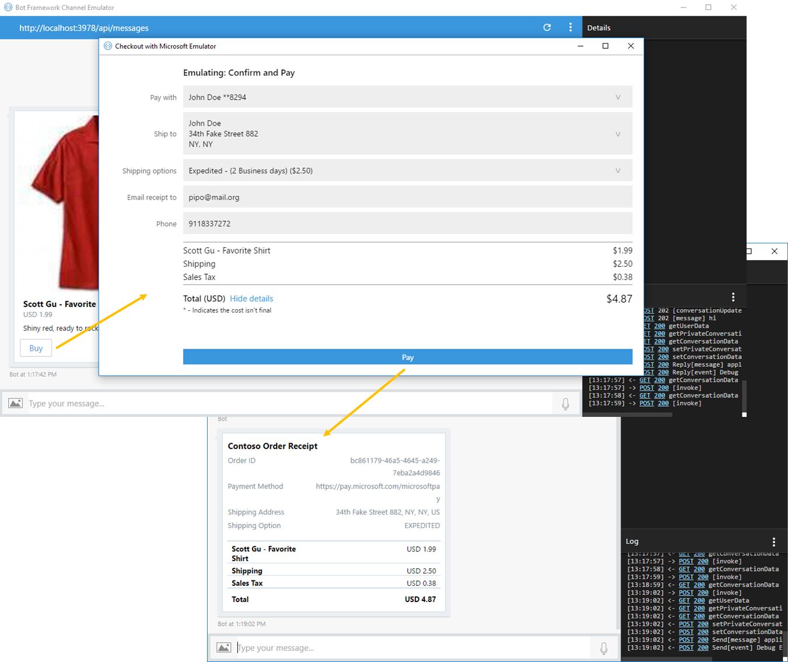

# Payment Bot Sample

A sample bot showing how to integrate with Microsoft Seller Center for payment processing.

[![Deploy to Azure][Deploy Button]][Deploy Node/Payments]

[Deploy Button]: https://azuredeploy.net/deploybutton.png
[Deploy Node/Payments]: https://azuredeploy.net

### Prerequisites

The minimum prerequisites to run this sample are:
* The latest update of Visual Studio 2015. You can download the community version [here](http://www.visualstudio.com) for free.
* Register your bot with the Microsoft Bot Framework. Please refer to [this](https://docs.botframework.com/en-us/csharp/builder/sdkreference/gettingstarted.html#registering) for the instructions. Once you complete the registration, update the [Bot's .env](.env#L3-L4) file with the registered config values (MicrosoftAppId and MicrosoftAppPassword).

#### Microsoft Bot Builder

This sample has been developed based on Microsoft Bot Builder Dialog system. You can see the following [sample](https://github.com/Microsoft/BotBuilder-Samples/tree/master/Node/core-MultiDialogs) to become familiar with different kind of dialogs and dialog stack in Bot Builder framework.

#### Microsoft Seller Center

1. <a href="https://dashboard.stripe.com/register" target="_blank">Create and activate a Stripe account if you don't have one already.</a>

2. <a href="https://seller.microsoft.com/en-us/dashboard/registration/seller/?accountprogram=skypebots&setvar=fltsellerregistration:1" target="_blank">Sign in to Seller Center with your Microsoft account.</a>

3. Within Seller Center, connect your account with Stripe.

4. Within Seller Center, navigate to the Dashboard and copy the value of **MerchantID**.

5. Update your bot's **.env** file to set `PAYMENTS_MERCHANT_ID` to the value that you copied from the Seller Center Dashboard. 

#### Publish
Also, in order to be able to run and test this sample you must [publish your bot, for example to Azure](https://docs.microsoft.com/en-us/bot-framework/nodejs/bot-builder-nodejs-quickstart). Alternatively, you can use [Ngrok to interact with your local bot in the cloud](https://blogs.msdn.microsoft.com/jamiedalton/2016/07/29/ms-bot-framework-ngrok/). 

### Code Highlights

The Bot-Payment interaction starts at the [`default message handler`](app.js#L25-L52) function provided when created the [`UniversalBot`](app.js#L24) instance. If you take a look on that function, a `HeroCard` is built and returned as an attachment.

The [`HeroCard`](app.js#L36-L48) built there uses a [`CardAction`](app.js#L44-L47) with a particular action type held at the following constant `paymentRequest.PaymentActionType` within the referenced module. As you can see the `CardAction` contains a [`paymentRequest`](app.js#L34) payload will all the information required to trigger a Microsoft Wallet payment.

````JavaScript
catalog.getPromotedItem().then(product => {

  // Store userId for later, when reading relatedTo to resume dialog with the receipt
  var cartId = product.id;
  session.conversationData[CartIdKey] = cartId;
  session.conversationData[cartId] = session.message.address.user.id;

  // Create PaymentRequest obj based on product information
  var paymentRequest = createPaymentRequest(cartId, product);

  var buyCard = new builder.HeroCard(session)
    .title(product.name)
    .subtitle(util.format('%s %s', product.currency, product.price))
    .text(product.description)
    .images([
      new builder.CardImage(session).url(product.imageUrl)
    ])
    .buttons([
      new builder.CardAction(session)
        .title('Buy')
        .type(payments.PaymentActionType)
        .value(paymentRequest)
    ]);

   session.send(new builder.Message(session)
    .addAttachment(buyCard));
});
````

In addition, if you can take a look at the function that builds the payload there at [`createPaymentRequest`](app.js#L175-L236). All the values set there are used to set up the payment options within Microsoft Wallet services.

````JavaScript
function createPaymentRequest(cartId, product) {
  if (!cartId) {
    throw new Error('cartId is missing');
  }

  if (!product) {
    throw new Error('product is missing');
  }

  // PaymentMethodData[]
  var paymentMethods = [{
    supportedMethods: [payments.MicrosoftPayMethodName],
    data: {
      mode: process.env.PAYMENTS_LIVEMODE === 'true' ? null : 'TEST',
      merchantId: process.env.PAYMENTS_MERCHANT_ID,
      supportedNetworks: ['visa', 'mastercard'],
      supportedTypes: ['credit']
    }
  }];

  // PaymentDetails
  var paymentDetails = {
    total: {
      label: 'Total',
      amount: { currency: product.currency, value: product.price.toFixed(2) },
      pending: true
    },
    displayItems: [
      {
        label: product.name,
        amount: { currency: product.currency, value: product.price.toFixed(2) }
      }, {
        label: 'Shipping',
        amount: { currency: product.currency, value: '0.00' },
        pending: true
      }, {
        label: 'Sales Tax',
        amount: { currency: product.currency, value: '0.00' },
        pending: true
      }],
    // until a shipping address is selected, we can't offer shipping options or calculate taxes or shipping costs
    shippingOptions: []
  };

  // PaymentOptions
  var paymentOptions = {
    requestPayerName: true,
    requestPayerEmail: true,
    requestPayerPhone: true,
    requestShipping: true,
    shippingType: 'shipping'
  };

  // PaymentRequest
  return {
    id: cartId,
    expires: '1.00:00:00',          // 1 day
    methodData: paymentMethods,     // paymethodMethods: paymentMethods,
    details: paymentDetails,        // paymentDetails: paymentDetails,
    options: paymentOptions         // paymentOptions: paymentOptions
  };
}
````

As said the `CardAction` provides to the channel all the information required to trigger the payment flow when the user clicks on the `HeroCard` `Buy` button.

The payment interface interacts with your Bot by the ussual means, ie. POSTing messages to the REST controller. The `ChatConnector` provides an `onInvoke` callback that is used to handle activities of a particular type (ie. not ussual messages). All messages (actually activities) received from the payment interface are of type `invoke`.

We are using this handler within the sample as you can see on the function bind to [`connector.onInvoke`](app.js#L57-L136). As activities received from the payment interface are of type `invoke` as said, this function will handle all the request made by the payment interface:

````JavaScript
connector.onInvoke((invoke, callback) => {
  console.log('onInvoke', invoke);

  // This is a temporary workaround for the issue that the channelId for "webchat" is mapped to "directline" in the incoming RelatesTo object
  invoke.relatesTo.channelId = invoke.relatesTo.channelId === 'directline' ? 'webchat' : invoke.relatesTo.channelId;

  var storageCtx = {
    address: invoke.relatesTo,
    persistConversationData: true,
    conversationId: invoke.relatesTo.conversation.id
  };

  connector.getData(storageCtx, (err, data) => {
    var cartId = data.conversationData[CartIdKey];
    if (!invoke.relatesTo.user && cartId) {
      // Bot keeps the userId in context.ConversationData[cartId]
      var userId = data.conversationData[cartId];
      invoke.relatesTo.useAuth = true;
      invoke.relatesTo.user = { id: userId };
    }

    // Continue based on PaymentRequest event
    var paymentRequest = null;
    switch (invoke.name) {
      case payments.Operations.UpdateShippingAddressOperation:
      case payments.Operations.UpdateShippingOptionOperation:
        paymentRequest = invoke.value;

        // Validate address AND shipping method (if selected)
        checkout
          .validateAndCalculateDetails(paymentRequest, paymentRequest.shippingAddress, paymentRequest.shippingOption)
          .then(updatedPaymentRequest => {
            // return new paymentRequest with updated details
            callback(null, updatedPaymentRequest, 200);
          }).catch(err => {
            // return error to onInvoke handler
            callback(err);
            // send error message back to user
            bot.beginDialog(invoke.relatesTo, 'checkout_failed', {
              errorMessage: err.message
            });
          });

        break;

      case payments.Operations.PaymentCompleteOperation:
        var paymentRequestComplete = invoke.value;
        paymentRequest = paymentRequestComplete.paymentRequest;
        var paymentResponse = paymentRequestComplete.paymentResponse;

        // Validate address AND shipping method
        checkout
          .validateAndCalculateDetails(paymentRequest, paymentResponse.shippingAddress, paymentResponse.shippingOption)
          .then(updatedPaymentRequest =>
            // Process Payment
            checkout
              .processPayment(updatedPaymentRequest, paymentResponse)
              .then(chargeResult => {
                // return success
                callback(null, { result: "success" }, 200);
                // send receipt to user
                bot.beginDialog(invoke.relatesTo, 'checkout_receipt', {
                  paymentRequest: updatedPaymentRequest,
                  chargeResult: chargeResult
                });
              })
          ).catch(err => {
            // return error to onInvoke handler
            callback(err);
            // send error message back to user
            bot.beginDialog(invoke.relatesTo, 'checkout_failed', {
              errorMessage: err.message
            });
          });

        break;
    }

  });
});
````

There the received `invoke` instance has the operation's name that triggered the call in its `name` property. This operation is inspected by the switch cases and handled by the proper logic accordingly (ie. update the shipping address, or update the shipping options, or complete the payment after the user confirmed it).

The [`first cases`](app.js#L81-L100) handles shipping address or options changes, and the [`last case`](app.js#L102-L132) handles the payment confirmation from the user.

Let's focus on the last one.

````JavaScript
case payments.Operations.PaymentCompleteOperation:
  var paymentRequestComplete = invoke.value;
  paymentRequest = paymentRequestComplete.paymentRequest;
  var paymentResponse = paymentRequestComplete.paymentResponse;

  // Validate address AND shipping method
  checkout
    .validateAndCalculateDetails(paymentRequest, paymentResponse.shippingAddress, paymentResponse.shippingOption)
    .then(updatedPaymentRequest =>
      // Process Payment
      checkout
        .processPayment(updatedPaymentRequest, paymentResponse)
        .then(chargeResult => {
          // return success
          callback(null, { result: "success" }, 200);
          // send receipt to user
          bot.beginDialog(invoke.relatesTo, 'checkout_receipt', {
            paymentRequest: updatedPaymentRequest,
            chargeResult: chargeResult
          });
        })
    ).catch(err => {
      // return error to onInvoke handler
      callback(err);
      // send error message back to user
      bot.beginDialog(invoke.relatesTo, 'checkout_failed', {
        errorMessage: err.message
      });
    });

  break;
````

As you can see the [`checkout`](checkout.js#L137-L140) module exports helper functions to handle these requests. When the user confirms the payment at the payment interface, this handler calls the [`processPayment`](checkout.js#L62-L135) function which completes the payment by registering the user's action and calls the external payment service (in this case Stripe), and sets the result value with a 'success' or 'failure' depending on the result of that operation. It also returns a `PaymentRecord` which will be sent after to the Bot.

Finally, a dialog is being used in order instruct the Bot to end the payment conversation by showing a receipt if the operation was [successful](app.js#L118-L121) or show an [error](app.js#L127-L129) otherwise. These dialogs are registered within the bot [here](app.js#L138-L167) and [here](app.js#L169-L172).

The payment flow then is completed by showing a [`ReceiptCard`](app.js#L153-L162) to the user, and the child dialog is [ended immediatelly](app.js#L164-L166) as well giving control back to the default handler we described before.

````JavaScript
bot.dialog('checkout_receipt', function (session, args) {
  console.log('checkout_receipt', args);

  cleanupConversationData(session);

  var paymentRequest = args.paymentRequest;
  var chargeResult = args.chargeResult;
  var shippingAddress = chargeResult.shippingAddress;
  var shippingOption = chargeResult.shippingOption;
  var orderId = chargeResult.orderId;

  // send receipt card
  var items = paymentRequest.details.displayItems
    .map(o => builder.ReceiptItem.create(session, o.amount.currency + ' ' + o.amount.value, o.label));

  var receiptCard = new builder.ReceiptCard(session)
    .title('Contoso Order Receipt')
    .facts([
      builder.Fact.create(session, orderId, 'Order ID'),
      builder.Fact.create(session, chargeResult.methodName, 'Payment Method'),
      builder.Fact.create(session, [shippingAddress.addressLine, shippingAddress.city, shippingAddress.region, shippingAddress.country].join(', '), 'Shipping Address'),
      builder.Fact.create(session, shippingOption, 'Shipping Option')
    ])
    .items(items)
    .total(paymentRequest.details.total.amount.currency + ' ' + paymentRequest.details.total.amount.value);

  session.endDialog(
    new builder.Message(session)
      .addAttachment(receiptCard));
});
````

### Outcome

You'll need to publish Bot to Azure or use [Ngrok to interact with your local bot in the cloud](https://blogs.msdn.microsoft.com/jamiedalton/2016/07/29/ms-bot-framework-ngrok/).

You first need to update the following `.env` settings shown below:

````JavaScript
# Bot Framework Credentials

MICROSOFT_APP_ID=
MICROSOFT_APP_PASSWORD=

PAYMENTS_LIVEMODE=false
PAYMENTS_MERCHANT_ID=merk_123
PAYMENTS_STRIPE_API_KEY=stripe_123
````

* Running Bot app
    1. First install all dependencies by running: npm install,
    2. And then execute: node app.js.

You can use the webchat control in bot framework developer portal or the bot emulator to interact with your bot.

The sample is configured by default to run in `test` mode.

When you run it in the Bot emulator you will have the following interaction flow:



### More Information

To get more information about how to get started in Bot Builder for .NET and Conversations please review the following resources:
* [Bot Builder for Node.js Reference](https://docs.microsoft.com/en-us/bot-framework/nodejs/)
* [Request Payment](https://docs.microsoft.com/en-us/bot-framework/nodejs/bot-builder-nodejs-request-payment)