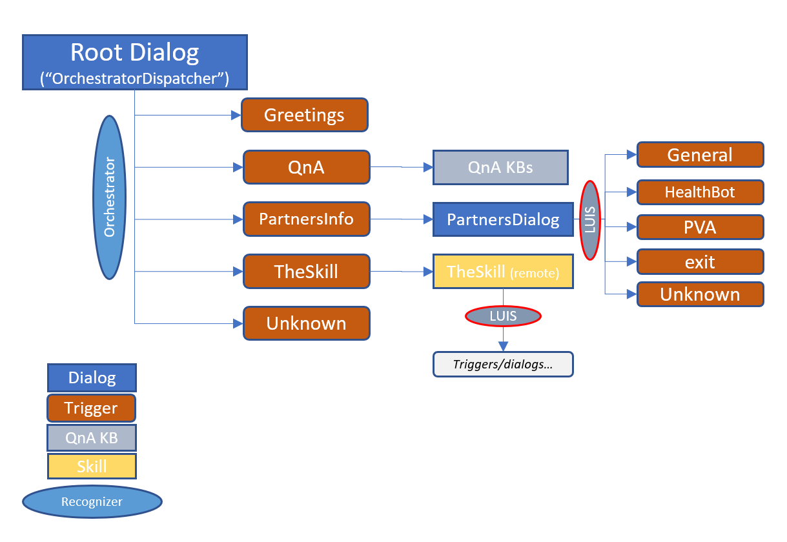

# Dispatch with Orchestrator Sample

The following bot demonstrates a simple Bot with Orchestrator as top dispatcher to the following:

* Remote skill
* LUIS dialog
* QnAMaker KB

## Setup

The bot depends on external services, namely LUIS, QnAMaker, and the remote skill which is already deployed for demonstration purposes. 

### Steps

1. Start Composer and load this project.
2. Configure LUIS and QnAMaker keys.
3. Configure Microsoft App Id & password.
4. Get the Orchestrator package in package manager.
5. Build/run, note your bot port.
6. Setup tunneling to localhost using ngrok (or other technology) using the noted port.
7. Specify in Skill Configuration the skill callback URL e.g. https://tunnel-id.ngrok.io/api/skills (assuming ngrok).
8. Build/run again
9. Test your bot

## Demo Patterns

You may try the following:

* Type: "The skill" to invoke and interact with the skill.
* Type:  "tell me about Composer" or "custom actions" to trigger QnA KB response.
* Type:  "partners info" to invoke the LUIS dialog, then type "healthbot" to trigger LUIS recognition.

### Diagram

## Other Observations

### Parent/Skill Intent Collisions

When calling *TheSkill*'s "Aks a question" you will be interacting with the skill's LUIS recognizer via the parent bot. In this case, there can be intent recognition "collision" where if the intent is also detected by the parent, it'll take over the conversation. Thus, since in this case both parent and skill have same triggers, collisions will happen and the conversation will be interrupted by the parent. 

For example:

* *skills*: parent to invoke the skill; the skill about skill info
* *composer*: info about composer in parent via QnAMaker; in skill via LUIS dialog 
* *exit*: both parent and skill implement a trigger for exit. Parent will override skill's trigger.
* *contact*: will only be recognized by skill. To prevent low score detection at parent, an intent condition of > 0.7 was specified.