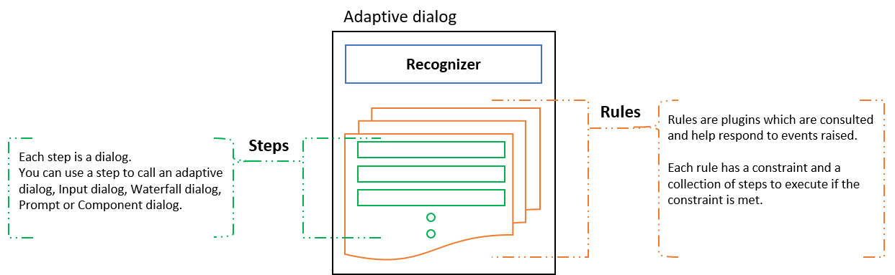
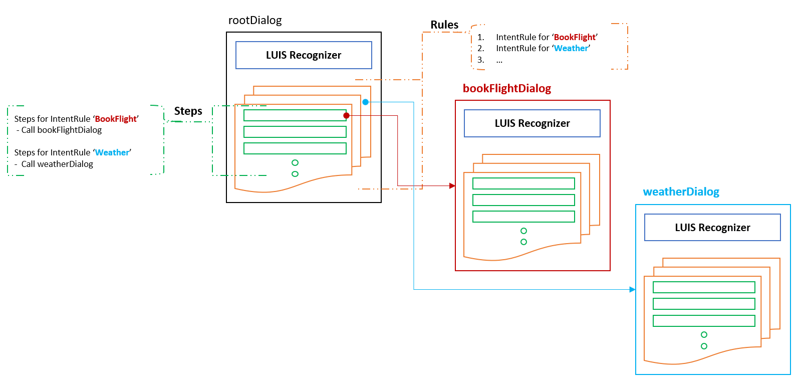
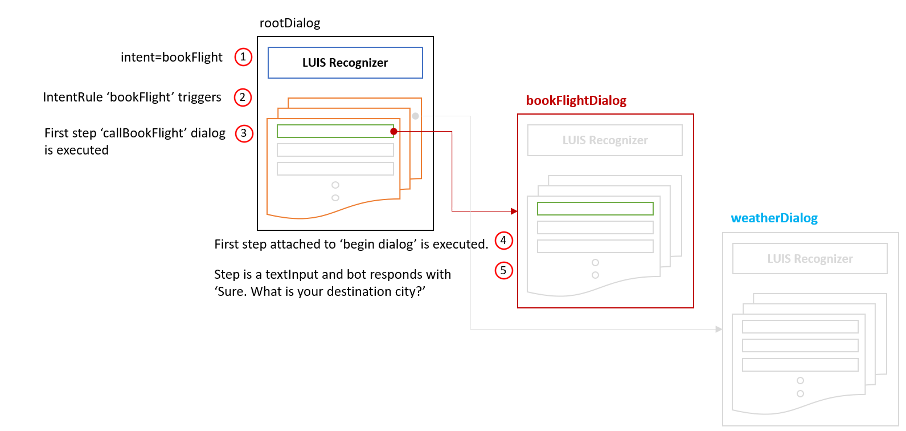
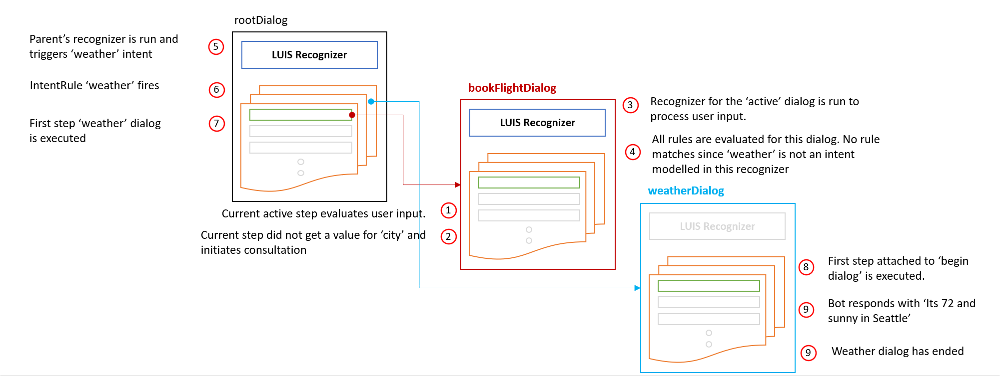

# Adaptive dialog: Anatomy and runtime behavior

## Anatomy: Adaptive dialog

***Adaptive dialogs*** at the core comprise of 4 main concepts - 
- [Recognizers](#Recognizers)
- [Rules](#Rules)
- [Steps](#Steps)
- [Inputs](#Inputs)

<p align="center">
    
</p>

### Recognizers
_Recognizers_ help understand and extract meaningful pieces of information from user's input. All recognizers emit events - of specific interest is the 'recognizedIntent' event that fires when the recognizer picks up an intent (or extracts entities) from given user utterance. See [here][1] to learn more about supported recognizers and their usage.

### Rules
_Rules_ enable you to catch and respond to events. The broadest rule is the EventRule that allows you to catch and attach a set of steps to execute when a specific event is emitted by any sub-system. Adaptive dialogs supports couple of other specialized rules to wrap common events that your bot would handle. See [here][2] to learn more about supported Rules and their usage.

### Steps
_Steps_ help put together the flow of conversation when a specific event is captured via a Rule. **_Note:_** unlike Waterfall dialog where each step is a function, each step in an Adaptive dialog is in itself a dialog. This enables adaptive dialogs by design to: 
- have a simple way to handle interruptions.
- branch conditionally based on context or current state.
See [here][3] to learn more about supported steps and their usage.

### Inputs
_Inputs_ are wrappers around Bot Builder [prompts][2] that you can use in an adaptive dialog step to ask and collect a piece of input from user, validate and accept the input  into memory. Inputs include these pre-built features:  
- Performs existential checks before prompting, to avoid prompting for information the bot already has. 
- Grounds input to the specified property if the input from user matches the type of entity expected. 
- Accepts constraints - min, max, etc. 

See [here][4] to learn more about supported Inputs and their usage.

## Runtime behavior: Adaptive dialog

To help illustrate this, let's take a scenario based walk through of the runtime behavior of Adaptive dialogs.

***Travel agent bot***
```
    User: I’d like to book a flight
    Bot:  Sure. What is your destination city?
    User: How’s the weather in Seattle?
    Bot:  Its 72 and sunny in Seattle
    ...
    ...
```

<p align="center">
    
</p>

For this scenario, we have three adaptive dialogs - 
1. rootDialog which is an adaptive dialog with its own 'LUIS' model and a set of rules and steps
2. bookFlightDialog which is an adaptive dialog that can handle conversations about booking a flight
3. weatherDialog which is an adaptive dialog that can handle conversations about getting weather information. 

Here's the flow when user says `I'd like to book a flight`

<p align="center">
    
</p>
The active dialog (rootDialog) recognizer triggers an IntentRule that you can handle. In this case the BegingDialog step to call for the Book a flight dialog. The book a flight dialog execute its steps, one of them is asking which city do you want to fly to.

The bot's end user can provide any type of answer, and here's the flow when user says `How's the weather in Seattle?`

<p align="center">
    
</p>

Using Adaptive dialog and Inputs, the bot propogate the handling of this up the conversation stack, up to through all the calling dialogs. In this case just one top dialog, the rootDialog. The rootDialog has a rule to handle the *weather* intent, which then call BeginDialog step to call to the weather dialog. Once the Weather dialog ends, the bot returns to the conversation, before the weather interuption, and prompt the user again for the destination city.

To summarize: 
1. Each dialog's _recognizer_ is run 
    - if there are no active dialog (remember each step is also a dialog) .or.
    - if the active dialog initiates a consultation
2. Each dialog's _rules_ are executed
    - when a new event is raised. All sub-systems (including your own set of steps) can raise events with a payload. e.g. recognizer raises the 'IntentRecognized' event with intents and entities as possible payload.


[1]:./recognizers-rules-steps-reference.md#Recognizers
[2]:./recognizers-rules-steps-reference.md#Rules
[3]:./recognizers-rules-steps-reference.md#Steps
[4]:./recognizers-rules-steps-reference.md#Inputs
