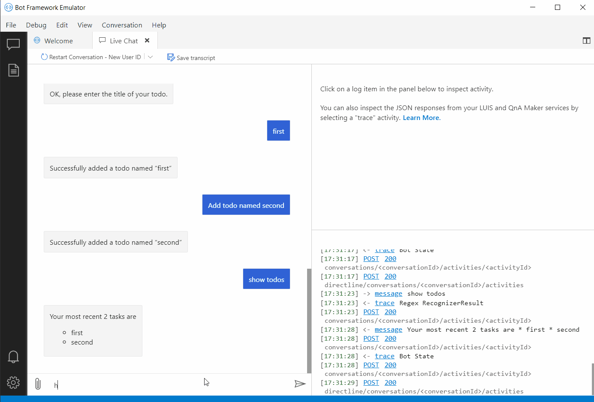

# Bot Framework Adaptive Tools

Bot Framework Adaptive Tools is a Microsoft VS Code extension that helps developers handle LG (.lg), LU (.lu), and dialog (.dialog) files efficiently. Adaptive Tools has tools and settings that make it easy to debug, analyze and enhance you language files.

Supported features include the following:
<!--
- LG/LU/QNA syntax highlighting
- LG/LU/QNA diagnostic checks
- LG/LU/QNA autocompletion
- LG template and function hover
- LG template definition
- LG template, function, and structure suggestions
- Dialog (.dialog) debugging
- LG debugging
-->

| Feature                                       | File type supported |
|-----------------------------------------------|---------------------|
| [Syntax highlighting](#syntax-highlighting-diagnostic-checks-and-autocompletion)                           | LG, LU, QNA              |
| [Diagnostic checks](#syntax-highlighting-diagnostic-checks-and-autocompletion)                             | LG, LU, QNA              |
| [Autocompletion](#syntax-highlighting-diagnostic-checks-and-autocompletion)                                | LG, LU, QNA              |
| [Template and function hover](#hover-suggestions-and-navigation)                   | LG                  |
| [Template definition](#hover-suggestions-and-navigation)                           | LG                  |
| [Template, function, and structure suggestions](#hover-suggestions-and-navigation) | LG                  |
| [Debugging](#debugging)                                     | LG, LU, QNA, Dialog      |

## Getting started

Adaptive Tools can be installed [from the Visual Studio Marketplace](#install-from-the-visual-studio-marketplace) or [from a local VSIX file](#install-from-a-local-vsix-file).

### Install from the Visual Studio Marketplace

1. Install [Bot Framework Adaptive Tools](https://marketplace.visualstudio.com/items?itemName=adaptive-tool) from the [VS Code](https://marketplace.visualstudio.com/vscode) tab of the Visual Studio Marketplace.
1. Open an LG, LU, or dialog file and the extension will activate.

### Install from a local VSIX file

1. Clone the [BotBuilder-Samples](https://github.com/microsoft/BotBuilder-Samples) repo.
1. In a terminal or command prompt, navigate to the directory containing the Adaptive Tools, **experimental/adaptive-tool**, and run the following commands:

    ```cmd
    npm install
    ```

    ```cmd
    npm run build
    ```

  1. Run the command below to install [vsce](https://www.npmjs.com/package/vsce):

      ```cmd
      npm install -g vsce
      ```

1. Finally, run the following command to export the VSIX file:

    ```cmd
    vsce package
    ```

    You're now ready to install Adaptive Tools.
1. Open VS Code and open the **Extensions** view.
1. Click the **Views and More Actions** button (...) in the upper-right corner of the Extensions panel. Then click **Install from VSIX..** and select the VSIX file you created earlier.
1. Open an LG, LU, QNA, or dialog file and the extension will activate.

## Language features

Language features are driven by the [language server protocol](./languageServer.md). See the [Language Server Extension Guide](https://code.visualstudio.com/api/language-extensions/language-server-extension-guide) for more information.

### Syntax highlighting, diagnostic checks, and autocompletion

#### LU

Different colors and styles for intent, entity, and comment components:


Formatting warnings and errors:


Automatic completion of some entities:


#### QNA

Different colors and styles for intent, entity, and comment components:


Formatting warnings and errors:


Automatic completion of some entities:


#### LG

Different colors and styles for template, function, multiline, structure, comment, condition, and switch components:


Formatting warnings and errors:


### Hover, suggestions, and navigation

#### LG

Template reference hover:


Prebuilt function hover:


Suggestions for templates and functions:


Structure property suggestions:


Template navigation:


## Debugging

Adaptive Tools lets developers debug LG, LU, and dialog files. When using a debugger you set breakpoints in your code, but those breakpoints correspond to classes and methods.  Setting breakpoints in dialogs, LG and LU files allow you to get breakpoints in specific instances of a template rather than a code breakpoint which applies to all instances. This section covers the steps and shows an example of how to [configure](#configuration), [initialize](#start-your-bot-and-complete-initialization), and [debug](#debug-your-bot) a bot.

### Configuration

- [Install](#getting-started) the Adaptive Tools extension.
- Open the LG, LU ,or dialog file to debug.
- To configure Visual Studio Code, add a target in your `launch.settings` file.

Here's an example of a typical `launch.json`:

```json
{
    "type": "json",
    "request": "attach",
    "name": "Attach to Dialog",
    "debugServer": 4712
}
```

`debugServer` refers to the port bot runs on. The default value is `4712`.

### Start your bot and complete initialization

1. Start a bot. For this example we'll start the bot project `TodoBot` in [SampleBots](https://github.com/microsoft/botbuilder-dotnet/tree/main/tests/Microsoft.Bot.Builder.TestBot.Json).
1. Make sure the debugger port has been registered in `BotFrameworkHttpAdapter` with the `UseDebugger` method.
1. There are several ways to initialize a bot, and the [BotFramework Emulator](https://github.com/microsoft/BotFramework-Emulator) is a typical approach. Open the Emulator and attach it to the bot to finish the initialization.

### Debug your bot

1. Run the VS Code program by clicking **F5** and set break points in the LG, LU, QNA, and dialog files.
1. Chat with the bot in the Emulator.
1. If the extension is working properly the cursor will stop when the code hits any of corresponding breakpoints.



## Adaptive Tools settings

Settings for LG files can be found under **LG** in the Extensions settings.

|Setting name|Description|
|-----|---------------|
|`LG.Expression.ignoreUnknownFunction`|Set the severity diagnostic level for unknown functions in a LG file.<br><br>The levels include:<br/>`error`: treat unknown functions as an error<br>`warn`: treat unknown functions as a warning<br>`ignore`: ignore unknown functions|
|`LG.Expression.customFunctionList`| Create a comma-separated customized function list (example: a, b, c). You can use both custom functions added in your logic as well as functions added to the `customFunctionList` setting.|

## Contributing

Code contributions are welcome via the [BotBuilder-Samples](https://github.com/microsoft/BotBuilder-Samples) repo.
Change NODE_DEBUG to true in `.env` for debugging.

## Feedback

File bugs in [GitHub Issues](https://github.com/Microsoft/BotBuilder-Samples/issues).
