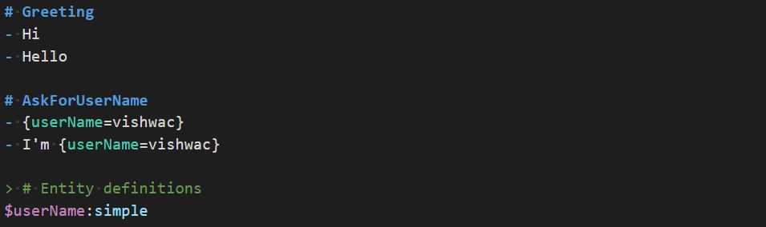
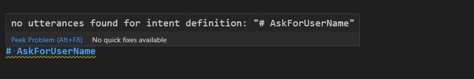
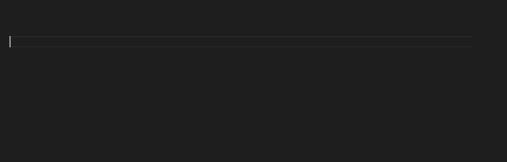
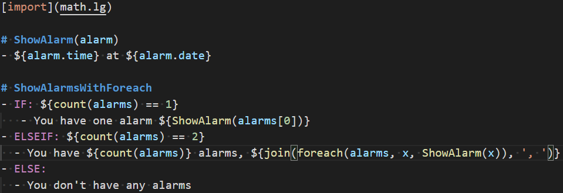
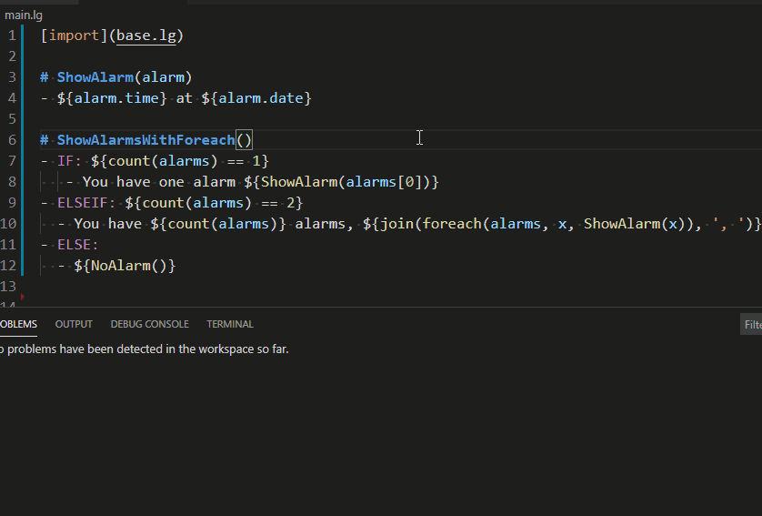
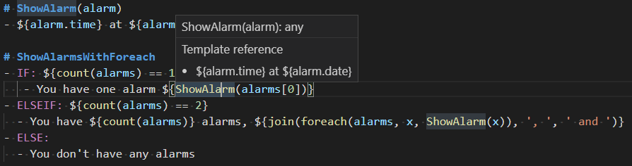
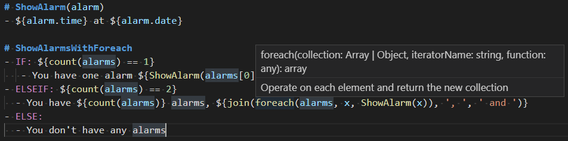
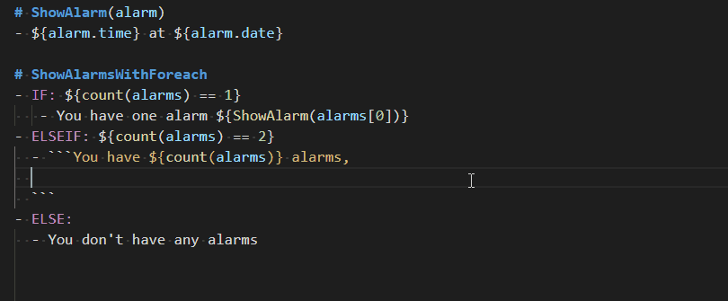
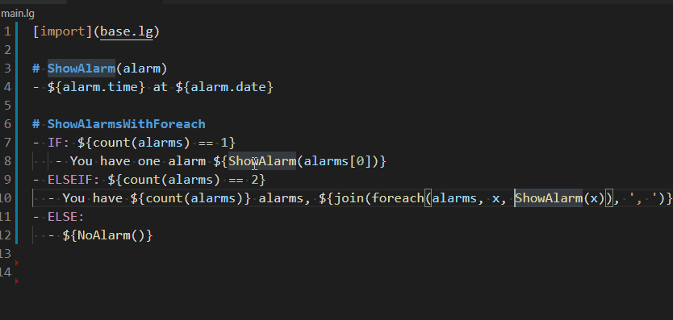

# Bot Framework Adaptive Tool
BotFramework adaptive tool is a vscode extension to help developers to improve the fficiency of handering LG/LU files.

# Features

## language features
language features are driven by [language server protocol](./languageServer.md)

### Syntax highlighting, diagnostic check, auto-suggest, functionality
#### .lu documents
- syntax highlighting

- diagnostic check

- completion 

#### .lg documents
- syntax highlighting

- diagnostic check

- template reference hover

- builtin function hover

- buildin function and template suggestion

- structure property suggestion

- template definition

## debugging feature
 see more details in [debugging](./debugging.md)

# how to build and use this extension
- `npm install`
- `npm run compile`
- `npm install -g vsce`, if `vsce` is not installed globally.
- run `vsce package` to export vsix file
- open vscode and navigate to extension tab
- select 'install from VSIX...'
- pick exported vsix file, and restart vscode if needed
- edit a lg file, try some features
- press `F1` then type `LG live test` to start LG webview test

# Contribute
ref to [contribute](./contribute.md)