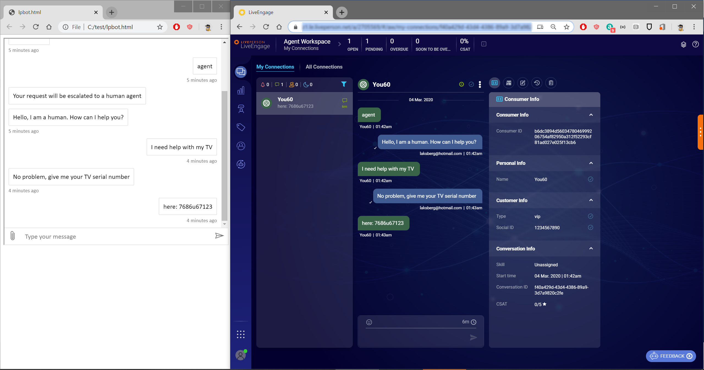

# LivePerson Proxy Bot

This sample demonstrates how to connect any Bot Framework channel to the LivePerson agent hub. The bot uses the new Bot Framework Handoff APIs.

# Configuring the sample

Before you run the sample, you need to set up your LivePerson account and configure your application, pointing webhooks to the bot's endpoints:

# Running the sample

To run the sample, type 'agent' and the bot will initiate handoff to a human agent. The user can the proceed talking with an agent:

