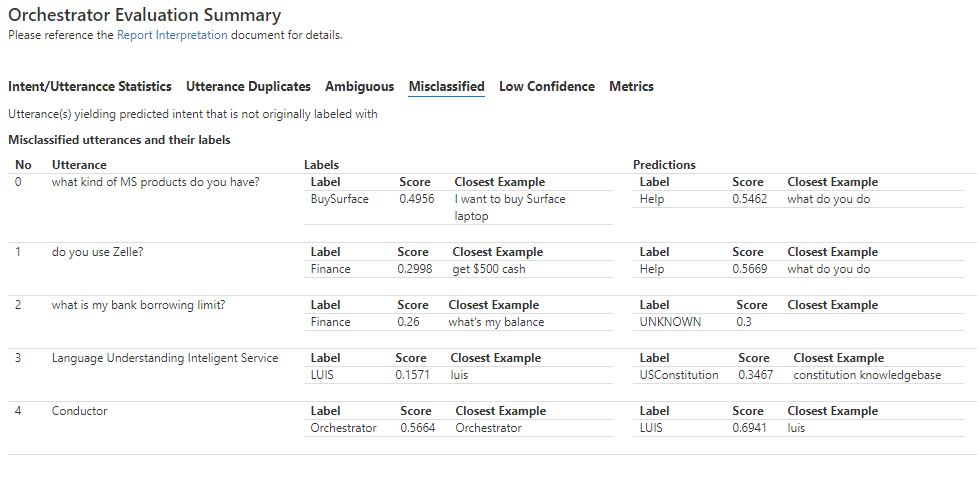
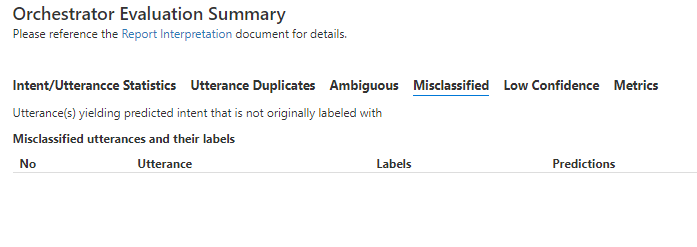

# Improve Language Model with BF CLI

The following sample illustrates how to evaluate and improve a simple language model using the Orchestrator report. You may adopt this process simply by editing the [demo.cmd](./demo.cmd) script to use your language model files.

## Prerequisites

* [Bot Framework CLI][5]
* [Bot Framework CLI Orchestrator plugin](1) 
* An understanding of [Orchestrator][6] feature usage.

## Walkthrough

The following files make up this illustration:

```
demo.cmd: Script run evaluation and produces report
common.lu: Bot Language Model LU
common.test.lu: A test set containing examples not present in  original LU
common.fixed.lu: A corrected Language Model based on evaluation run
```

Assume a bot with a simple language model in [common.lu](./common.lu) file as follows:

```
# Help
- help
- i need help
- please help
- can you please help
- what do you do
- what is this bot for


# BuySurface
- How can I buy {ProductType=Surface PRO}
- I want to buy {ProductType=Surface PRO}
- I want to buy {ProductType=Surface laptop}
- Can I buy {ProductType=Surface PRO} online

# USConstitution
- Tell me about the US Constitution
- US Constitution
- Info on the Constitution
- tell me about the Constitution
- constitution knowledgebase
- constitution faq
- what do you know about the constitution
- The united states constitution

# Restart
- restart
- reset
- start over
- menu
- top menu

# Finance
- pay my bills
- transfer funds
- what's my balance
- get $500 cash

# LUIS
- luis

# Orchestrator
- Orchestrator
- Orch

```

This evaluation examines how the Orchestrator engine can generalize language understanding from a few examples to include phrases never seen before. Hence, for proper language evaluation, the test file [common.test.lu](./common.test.lu) should contain utterances not present in the original "training" set:

```
# Help
- help
- do you have help
- any assistance in this bot?

# BuySurface
- Looking for a computer made by MSFT
- what kind of MS products do you have?

# USConstitution
- Where can I read our founding fathers famous document?
- Is there an analysis of the bill of rights?
- What is that proclamation thing?

# Restart
- reset
- go to the beginning

# Finance
- can i pay with credit card?
- do you use Zelle?
- what is my bank borrowing limit?

# LUIS
- Language Understanding Inteligent Service

# Orchestrator
- Conductor

```

Next, run the [demo.cmd](./demo.cmd) script.  

In first run you need to download the Orchestrator basemodel so execute ```demo.cmd getmodel``` which will download the model and run the test. Consequent runs can reuse the same basemodel (hint: see ```bf orchestrator:basemodel:list``` for alternate models). Also, if you wish to compare to [LUIS](https://luis.ai) results, edit the script with your LUIS application info.

This will produce a report in report folder such as follows:



Notice how 5 utterances were misclassified.  For example ```do you use Zelle?``` was classified as *Help* (with low score of 0.2998) instead of *Finance*. Also, note that what led to this misclassification is that the nearest example scored 0.5669 under the *Help* label. 

The observation shows that the concepts for those misclassified utterances are not present in the original  common.lu language model. To correct, we'll add representative examples in the original common.lu file. Note how we don't add the exact utterances, only representative examples:


The corrected file is available for reference as [common.fixed.lu](./common.fixed.lu). You may copy it over the common.lu.

Now, re-run the test ```demo.cmd``` and view the resulting report:




## Summary

This walkthrough showed how to improve your bot's language model before ever deploying it. It uses BF CLI to test the language model, and use the resulting report to correct the language model. One should construct a language model with as many examples representing expected user utterances. However, it also illustrates how one does not need to account for all utterance permutations, rather only to present concepts within those utterances. The Orchestrator engine generalizes and can accurately detect similar utterances. 

## Additional Reading

- [Orchestrator Documentation][6]
- [BF CLI Orchestrator Command Usage][4]
- [Report Interpretation][3]
- [LU File Format][2]


[1]: https://aka.ms/bforchestratorcli	"Orchestrator Plugin"
[2]:https://docs.microsoft.com/en-us/azure/bot-service/file-format/bot-builder-lu-file-format?view=azure-bot-service-4.0	"LU file format"
[3]:https://aka.ms/bforchestratorreport "report interpretation"
[4]: https://github.com/microsoft/botframework-sdk/blob/main/Orchestrator/docs/BFOrchestratorUsage.md "BF Orchestrator usage"
[5]: https://github.com/microsoft/botframework-cli
[6]: https://aka.ms/bf-orchestrator


