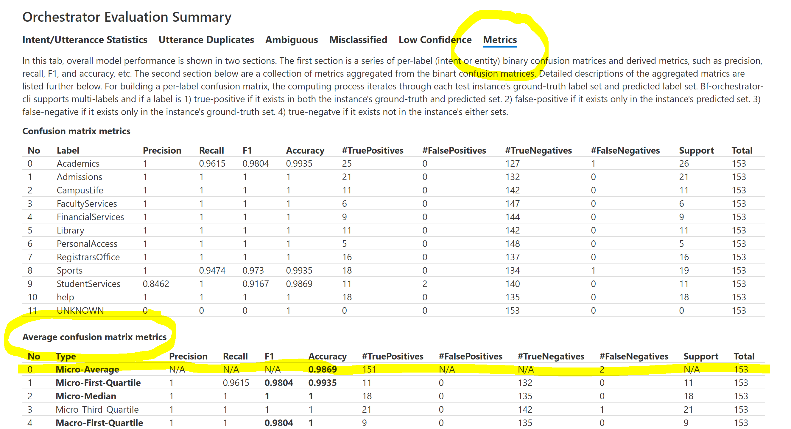
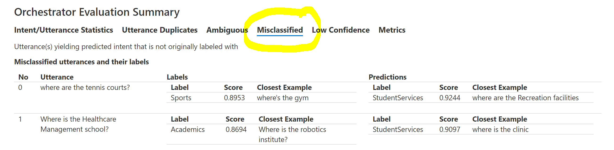

# School skill navigator bot

This example shows from end-to-end how to use bf orchestrator commandlets to improve the quality of a training set ( in [.lu format](https://docs.microsoft.com/en-us/azure/bot-service/file-format/bot-builder-lu-file-format?view=azure-bot-service-4.0)), and how to use [Composer](https://docs.microsoft.com/en-us/composer/introduction) to build a bot from examples in [.lu format](https://docs.microsoft.com/en-us/azure/bot-service/file-format/bot-builder-lu-file-format?view=azure-bot-service-4.0). 

This example can be split into two parts: [the first part](#part-1:-evaluate-and-improve-the-quality-of-the-training-set) takes a training set (in [.lu format](https://docs.microsoft.com/en-us/azure/bot-service/file-format/bot-builder-lu-file-format?view=azure-bot-service-4.0)) and a test set (in [.lu format](https://docs.microsoft.com/en-us/azure/bot-service/file-format/bot-builder-lu-file-format?view=azure-bot-service-4.0)) as input, and the output is a revised training set that performs more accurately. You can skip this part if you don't have a test set. The [second part](#part-2:-use-composer-to-build-a-bot-from-a-training-file) takes a training set in [.lu format](https://docs.microsoft.com/en-us/azure/bot-service/file-format/bot-builder-lu-file-format?view=azure-bot-service-4.0) (either the original file, or the revised one from Part 1) as input, and outputs a bot by using [Composer](https://docs.microsoft.com/en-us/composer/introduction).

## Prerequisites

This sample **requires** prerequisites in order to run.

- Install BF CLI with Orchestrator plugin

  - Install bf cli 

  ```bash
  > npm i -g @microsoft/botframework-cli
  ```

  - Install bf orchestrator

  ```bash
  > bf plugins:install @microsoft/bf-orchestrator-cli@beta
  ```

    If you have previously installed bf orchestrator plugin, uninstall that version and then run the install command again.
    Uninstall command:

  ```bash
  > bf plugins:uninstall @microsoft/bf-orchestrator-cli
  ```

  - Make sure bf orchestrator command is working and shows all available orchestrator commands

  ```bash
  > bf orchestrator
  ```

## To try this bot sample

- Clone the repository

  ```bash
  > git clone https://github.com/microsoft/botbuilder-samples.git
  ```

- CD experimental/orchestrator/Composer/01.school-skill-navigator

  ```bash
  > cd experimental/orchestrator/Composer/01.school-skill-navigator
  ```
  
- Download Orchestrator base model
 ```bash
  > mkdir model
  > bf orchestrator:basemodel:get --out ./model
 ```

## Part 1: Evaluate and improve the quality of the training set

To statistically evaluate the performance of a training set, we need a test set. If you do not have a test set, please skip to [Part 2](#part-2:-use-composer-to-build-a-bot-from-a-training-file). To explain the example, we have two files attached in this folder: a training file [schoolnavigatorbot.train.lu](schoolnavigatorbot.train.lu) to build the language model, and a test file [schoolnavigatorbot.test.lu](schoolnavigatorbot.test.lu) to evaluate the accuracy of the language model.

### Evaluation

- First, we generate the language model from the training file:


```
> bf orchestrator:create -m model -i schoolnavigatorbot.train.lu -o .
```

The snapshot of the language model file should be written to schoolnavigatorbot.train.blu

- Then we evaluate the performance of the generated language model by using:

```
> bf orchestrator:test -m model -i schoolnavigatorbot.train.blu -t schoolnavigatorbot.test.lu -o report
```

Evaluation reports should be written to folder [report](report). Detail report interpretation can be found [here](https://github.com/microsoft/botframework-sdk/blob/main/Orchestrator/docs/BFOrchestratorReport.md).

- Open **report/orchestrator_testing_set_summary.html** through a browser, and navigate to the **Average confusion matrix metrics** section from the last page **Metrics**, you will find the recommended evaluation metric: **Micro-Average Accuracy** = 0.8954.

### Improve

Accuracy 0.8954 is high but not perfect yet. To improve the quality of the training set, we could benefit from the **Misclassified** information from the evaluation report. In this page, all mis-labeled query utterances from the test set are listed. **Labels** refer to the ground-truth labels, and **predictions** refer to the model predictions. In our example, there are in total 16 mis-labeled utterances, we are using the top 2 to illustrate the improving process here.

Next we are going to use the first two mis-classified query utterances to show how to improve the training set.

- The first utterance "where are the tennis courts" should be labeled as Sports, but is mis-labeled as StudentServices. Closest Example shows the closest evidence example from that category, and Score shows the similarity between the query utterance and Closest Example. Taking a closer look into the examples, "where are the Recreation facilities" and "where's the gym" are essentially referring to the same thing, but separated into different labels, which eventually confused the model. To clarify the concepts, we could **manually relabel the utterance "where are the Recreation facilities" by moving it  from # StudentServices to # Sports in schoolnavigatorbot.train.lu.** 

- The second utterance "where is the Healthcare Management school" should be labeled as Academics, but is mis-labeled as StudentServices. To correct the query prediction, we could **manually add it ("where is the Healthcare Management school") to # Academics in schoolnavigatorbot.train.lu.**

- After fixing the two query utterances, we could try the evaluation process again to check the progress:

  ```
  > bf orchestrator:create -m model -i schoolnavigatorbot.train.lu -o .
  > bf orchestrator:test -m model -i schoolnavigatorbot.train.blu -t schoolnavigatorbot.test.lu -o report
  ```

- Open **report/orchestrator_testing_set_summary.html** again, and check the **Micro-Average** under **Metrics** page, the accuracy has improved from 0.8953 to 0.9085, and the two query utterances no longer show up in misclassified page.

- Users could repeat the aforementioned procedures until satisfying with accuracy, refined as (1) using Misclassified page to check for mis-labeled utterances; (2) editing .lu file to add or relabel utterances; (3) using bf orchestrator:create to regenerate the language model; and (4) using bf orchestrator:test to evaluate the performance.

- Advanced users could also use bf orchestrator:interactive to interactively add/change/remove example utterances to improve the training set. Further information please refer to [bf orchestrator interactive](https://github.com/microsoft/botframework-sdk/blob/main/Orchestrator/docs/BFOrchestratorInteractive.md#start-an-interactive-session-with-a-training-set). 


## Part 2: Use Composer to build a bot from a training set (.lu file)


