## 1. Setup bot in bot service

A. Create new bot channel registration resource in Azure

B. Go into channels and add "Microsoft Teams" channel

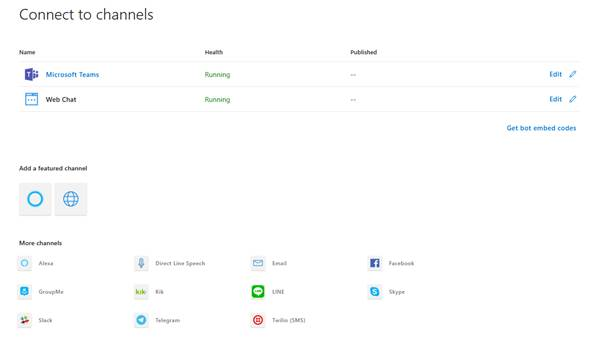

## 2. Configure AAD app

A. Create AAD App for SSO

- The same AAD App as the bot  (created in step 1) or a separate AAD app can be used. If using the same AAD app as bot, skip to step (2.B)

- Navigate to Azure AD App Registration Blade

- Click "New Registration"

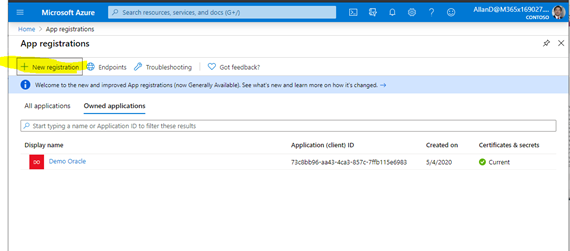

- Fill out name and select third option for supported account type and click "Register"

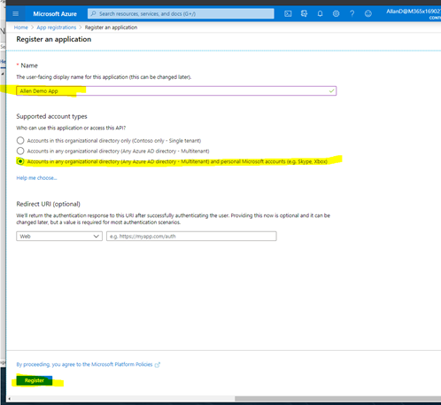

- Skip to step (2.C Create Client Secret)

### 2. If you are using the AAD app created for your bot in step 1, 
- Navigate to the "App Registration" blade in the Azure AD and find your bot's AAD app by search for bot handle. Open the app by clicking the display name.

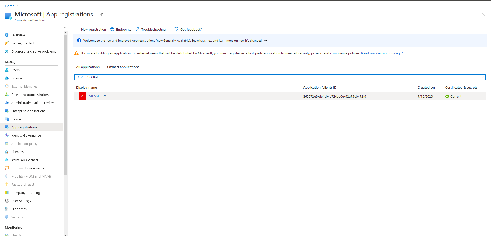

### 3. Create Client Secret

- If you have the client secret for your app, skip to the next step (2.D Expose API Endpoint). If you do not have or know the secret, you'll need to create a new one.

- Navigate to the "Certificates & secrets" blade and add a client secret by clicking "New Client Secret"

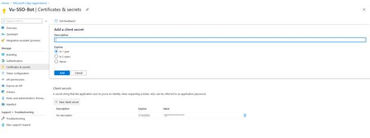

- Copy and paste the secret somewhere safe. You'll need it in a future step

### 4. Expose API endpoint

- Click "Expose an API" in the left rail

    - Update your application ID URL to include your bot id - api://botid-<your_bot_id>, where <your_bot_id> is the id of the bot that will be making the SSO request and found in your Teams Application Manifest.

    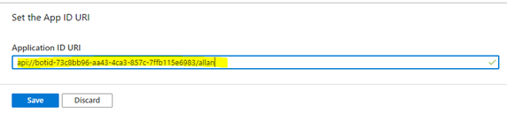

    - Click "Add a scope"

        - access_as_user as the Scope name.

        - Set Who can consent? to Admins and users

        - Fill in the fields for configuring the admin and user consent prompts with values that are appropriate for the access_as_user scope. Suggestions:

            - Admin consent title: Teams can access the user’s profile

            - Admin consent description: Allows Teams to call the app’s web APIs as the current user.

            - User consent title: Teams can access your user profile and make requests on your behalf

        - User consent description: Enable Teams to call this app’s APIs with the same rights that you have

        - Ensure that State is set to Enabled

        - Select Add scope (Note: The domain part of the Scope name displayed just below the text field should automatically match the Application ID URI set in the previous step, with /access_as_user appended to the end)

        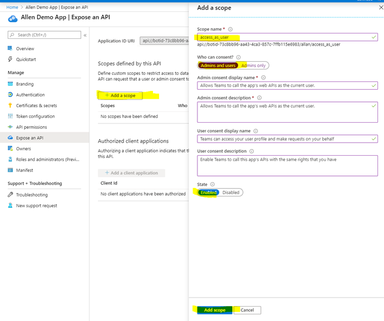

### 5. Authorize client applications

Add the following Ids as authorized clients for your application

- 1fec8e78-bce4-4aaf-ab1b-5451cc387264 (Teams mobile/desktop application)

- 5e3ce6c0-2b1f-4285-8d4b-75ee78787346 (Teams web application)

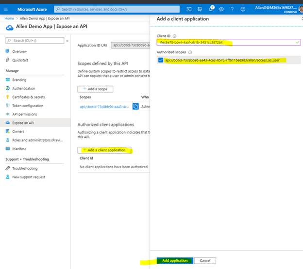

### 6. Add any necessary API permissions for downstream calls

- Navigate to "API permissions" blade on the left hand side

- Add any user delegated permissions that your app will need to downstream APIs, (like Microsoft Graph)

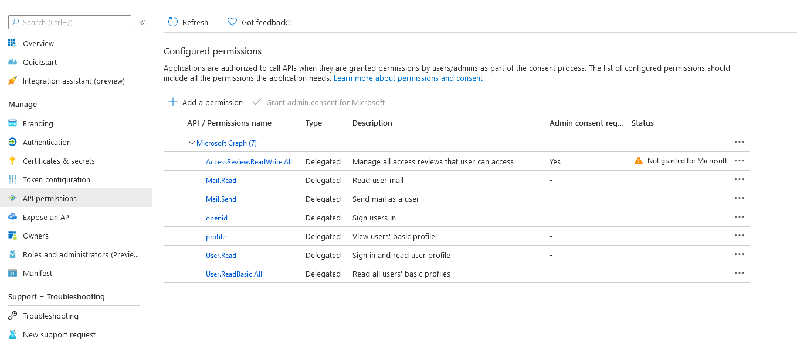

### 7. Store client id and application id uri for later use 
    - Switch back to the "Overview" blade and copy the Application (client) Id and the Application ID URI somewhere. You'll need it in step 3 to setup the connection

## 3. Setup Bot Service Connection (TokenStore)

- A. In the Azure Portal, navigate back to the Bot Channels Registration created in Step 1

- B. Switch to the "Settings" blade and click "Add Setting" under the OAuth Connection Settings section

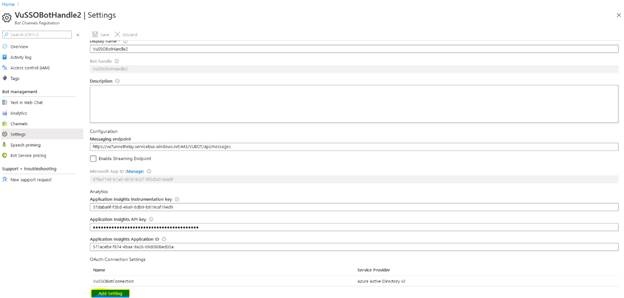

- C. Fill out the Connection Setting form

    - Enter a name for your new Connection setting. This will be the name that gets referenced inside the settings of your bot service code in step 5

    - In the Service Provider dropdown, select Azure Active Directory V2

    - Enter in the client id and client secret obtained in step 2

    - For the Token Exchange URL use the Application ID URL obtained in step 2

    - Specify "common" as the Tenant ID

    - Add all the scopes configured when specifying permissions to downstream APIs in step 2

    - Click "Save"

    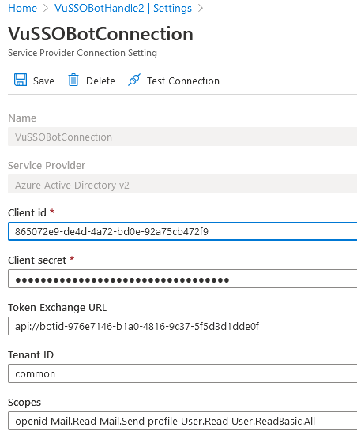

## 4. Update Teams App manifest

    - A. Make sure "bots" section is added to Teams App Manifest if using newly created bot from step 1

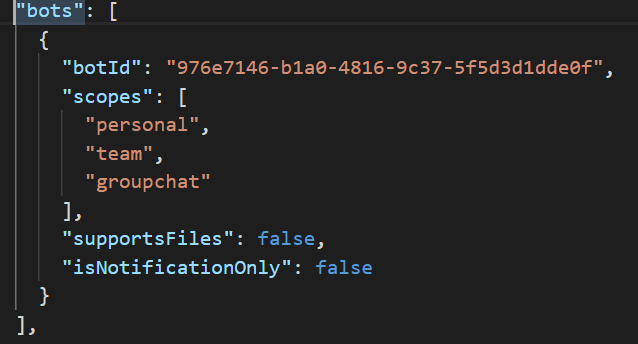

    - B. Update valid domains to include "token.botframework.com" and "ngrok.io" for testing

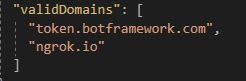

    - C. Add webApplicationInfo section

        - Update "id" to the Application (client) ID of the AAD app from step 2

        - Update "resource" value to the Application ID URI from step 2

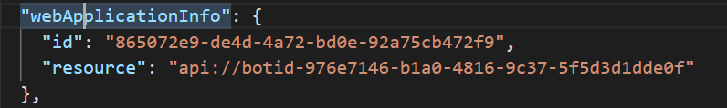

## 5. Configure bot sample

    - A. Update bot with connection setting name configured in Step 3

    - B. Update bot app credentials

    - C. Update messaging endpoint in the Azure Bots Channel Registration-Settings to the endpoint that will bot app will be listening on

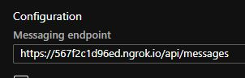