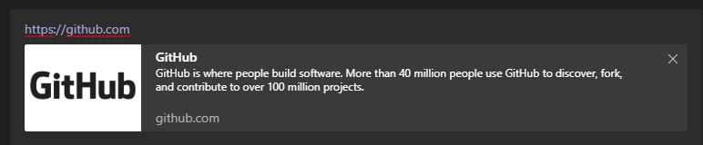

# LinkUnfurling

This bot has been created using [Bot Framework](https://dev.botframework.com), it demonstrate link unfurling feature in Teams channel.

## Prerequisites

This sample **requires** prerequisites in order to run.

### Install .NET Core CLI

- [.NET Core SDK](https://dotnet.microsoft.com/download) version 2.1

  ```bash
  # determine dotnet version
  dotnet --version
  ```

### Clone the repository

```bash
git clone https://github.com/Microsoft/botbuilder-samples.git
```

### Ngrok setup

1. Download and install [Ngrok](https://ngrok.com/download)
2. In terminal navigate to the directory where Ngrok is installed
3. Run this command: ```ngrok http -host-header=rewrite 3978 ```
4. Copy the https://xxxxxxxx.ngrok.io address and put it into notepad. **NOTE** You want the https address.

### Azure Set up to provision bot with Team Channel enabled

1. Login to the [Azure Portal](https://portal.azure.com) 
2. (optional) create a new resource group if you don't currently have one
3. Go to your resource group 
4. Click "Create a new resource" 
5. Search for "Bot Channel Registration" 
6. Click Create 
7. Enter bot name, subscription
8. In the "Messaging endpoint url" enter the ngrok address from earlier. 
8a. Finish the url with "/api/messages. It should look like ```https://xxxxxxxxx.ngrok.io/api/messages```
9. Click the "Microsoft App Id and password" box 
10. Click on "Create New" 
11. Click on "Create App ID in the App Registration Portal" 
12. Click "New registration" 
13. Enter a name 
14. Under "Supported account types" select "Accounts in any organizational directory and personal Microsoft accounts" 
15. Click register 
16. Copy the application (client) ID and put it in Notepad. Label it "Microsoft App ID" 
17. Go to "Certificates & Secrets" 
18. Click "+ New client secret" 
19. Enter a description 
20. Click "Add" 
21. Copy the value and put it into Notepad. Label it "Password"
22. (back in the channel registration view) Copy/Paste the Microsoft App ID and Password into their respective fields 
23. Click Create 
24. Go to "Resource groups" on the left 
25. Select the resource group that the bot channel reg was created in 
26. Select the bot channel registration 
27. Go to Settings  
28. Select the "Teams" icon under "Add a featured channel 
29. Click Save 


### Updating Sample Project Settings

1. Open the project 
2. Open appsettings.json 
3. Enter the app id under the MicrosoftAppId and the password under the MicrosoftAppPassword 
4. Save the close the file 
5. Build the project
6. Under the TeamsAppManifest open the manifest.json file 
7. Update the ```botId``` fields with the Microsoft App ID from before  (2 places)
8. Update the ```id``` with the Microsoft App ID from before 


### Uploading the bot to Teams

1. In file explorer navigate to the TeamsAppManifest folder in the project 

2. Select the 3 files and zip them 

3. Open Teams 

4. Click on "Apps" 

5. Select "Upload a custom app" on the left at the bottom 

6. Select the zip  

7. Select for you  

8. (optionally) click install if prompted 

9. Click open 

   

## To try this sample

- In a terminal, navigate to bot folder (ie LinkUnfurling)

- Run the bot from a terminal or from Visual Studio, choose option A or B.

  A) From a terminal

  ```bash
  # run the bot
  dotnet run
  ```

  B) Or from Visual Studio

  - Launch Visual Studio
  - File -> Open -> Project/Solution 
  - Navigate to tests\Teams folder and click on Scenarios.sln
  - Set LinkUnfurling project as StartUp Project
  - Open launchSettings.json under Properties and update applicationUrl fields to http://localhost:3978/
  - Press `F5` to run the project

### Interacting with the bot

1. Send a message to your bot in Teams
2. Type any valid url, ie http://www.bing.com, wait until the url is bolded, hit the space key and you should see a thumbnail card for the url info populated, like below. 
   

### Notes
1. Url already typed in in earlier chat is cached and you might not see the thumbnail if you enter the same url.  Try step #2 with different url.
2. If you install multiple bots which handle link unfurling, the first one returned which be displayed
3. If the bot returns multiple results, the first result will be displayed
4. Link unfurling action is handled by OnTeamsAppBasedLinkQueryAsync method in the bot code
