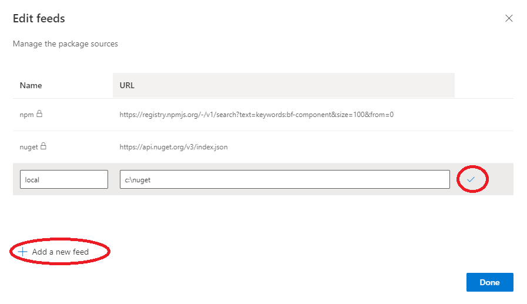
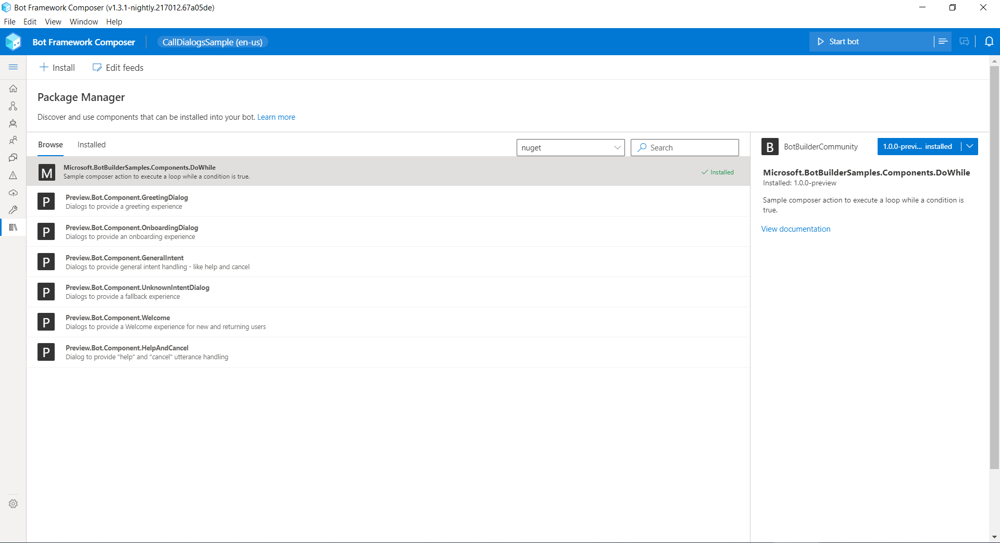
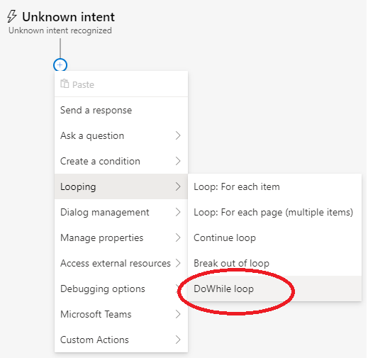
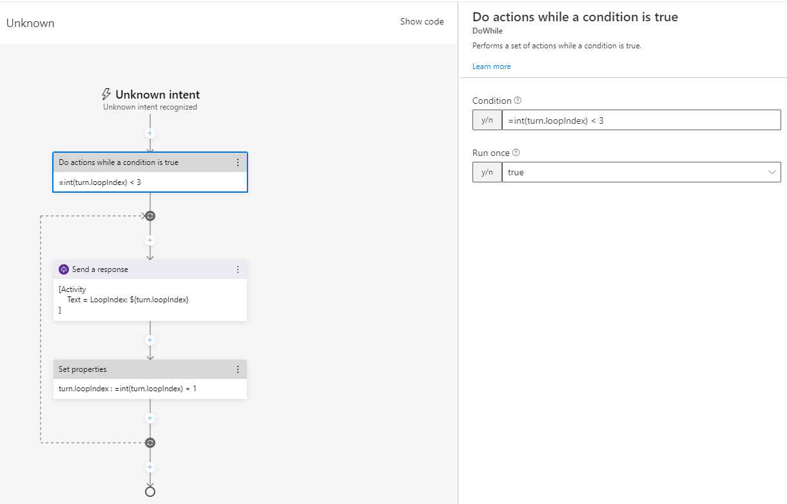

# DoWhile Component

This sample demonstrates how to extend [Bot Framework Composer](https://docs.microsoft.com/en-us/composer/introduction) with a new DoWhile custom action component.

The following classes and schema files are included in the project:

| File | Description |
| ------ | ------ |
| [DoWhile.cs](#DoWhile) | Inherits from ActionScope and manages execution of a block of actions supporting Break and Continue semantics.. |
| [DoWhilePlugin.cs](#Plugin) | Loaded by the adaptive runtime DependencyInjection Abstractions and calls ComponentRegistration, adding DoWhileComponentRegistration. |
| [DoWhileComponentRegistration.cs](#ComponentRegistration) | Registers the DoWhile component with the adaptive dialog system. |
| [.schema](#schema) | Declarative definition of the DoWhile component. |
| [.uischema](#uischema) | DoWhile component visual interface declarative definition. |

## Prerequisites

- [Bot Framework Composer](https://docs.microsoft.com/en-us/composer/install-composer) version 1.3.1
- [.NET Core SDK](https://dotnet.microsoft.com/download) version 3.1
- [nuget.exe](https://www.nuget.org/downloads) recommended latest
    - A local package feed is required. See ([nuget local feed](https://docs.microsoft.com/en-us/nuget/hosting-packages/local-feeds)) for details.

## To try this sample

1) Clone the repository

    ```bash
    git clone https://github.com/Microsoft/botbuilder-samples.git
    ```

2) If you are using Visual Studio
  - Launch Visual Studio
  - File -> Open -> Project/Solution
  - Navigate to `samples/csharp_dotnetcore/101.components-dowhile` folder
  - Select `Microsoft.BotBuilderSamples.Components.DoWhile.csproj` file
  - Building the project

3) The .nupkg should now be in the bin folder.  Next, run `nuget add` 

    ```bash
    nuget add Microsoft.BotBuilderSamples.Components.DoWhile.1.0.0-preview.nupkg -source c:\nuget
    ```

## Composer

### Package Installation

Add the local package feed to Composer


The local package can now be installed from composers Package Manager screen. Just select the package from the list and click install.



### Usage

Once installed you should find the DoWhile action under the "Looping" menu.




#### Do While

Add the DoWhile action to a dialog, and add some child actions.  Ensure the condition will eventually resolve to `true`.




## Deploy the bot to Azure

To learn more about deploying a bot to Azure, see [Deploy your bot to Azure](https://aka.ms/azuredeployment) for a complete list of deployment instructions.

## Further reading

- [Add custom actions](https://docs.microsoft.com/en-us/composer/how-to-add-custom-action)
