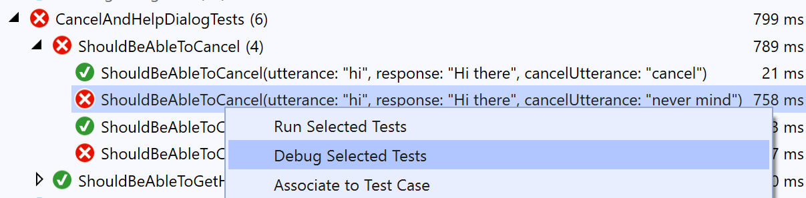
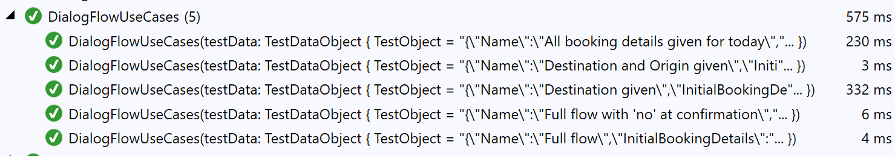


# CoreBot.Tests <!-- omit in toc -->

Bot Framework v4 core bot tests sample.

This project uses the [Microsoft.Bot.Builder.Testing](https://botbuilder.myget.org/feed/botbuilder-v4-dotnet-daily/package/nuget/Microsoft.Bot.Builder.Testing) package, [XUnit](https://xunit.net/) and [Moq](https://github.com/moq/moq) to create unit tests for the [CoreBot](https://github.com/microsoft/BotBuilder-Samples/tree/master/samples/csharp_dotnetcore/13.core-bot) bot.

This project shows how to:

- Create unit tests for dialogs, bots and controllers
- Create different types of data driven tests using XUnit Theory tests
- Create mock objects for the different dependencies of a dialog (i.e. LUIS recognizers, other dialogs, configuration, etc.)
- Assert the activities returned by a dialog turn against expected values
- Assert the results returned by a dialog

## Table of Contents <!-- omit in toc -->

- [Testing Dialogs](#Testing-Dialogs)
  - [Asserting activities](#Asserting-activities)
  - [Passing parameters to your dialogs](#Passing-parameters-to-your-dialogs)
  - [Asserting dialog turn results](#Asserting-dialog-turn-results)
  - [Analyzing test output](#Analyzing-test-output)
- [Data Driven Tests](#Data-Driven-Tests)
  - [Theory tests using InlineData](#Theory-tests-using-InlineData)
  - [Theory tests using MemberData and complex types](#Theory-tests-using-MemberData-and-complex-types)
- [Using Mocks](#Using-Mocks)
  - [Mocking Dialogs](#Mocking-Dialogs)
  - [Mocking LUIS results](#Mocking-LUIS-results)
  - [mocking other objects](#mocking-other-objects)
  - [Helper Mock Factory](#Helper-Mock-Factory)
- [References](#References)

## Testing Dialogs

Dialogs are unit tested through the `DialogTestClient` class which provides a mechanism for testing them in isolation outside of a bot and without having to deploy your code to a web service.

This class is used to write unit tests for dialogs that test their responses on a turn-by-turn basis. Any dialog built using the botbuilder dialogs library should work.

Here is an simple example on how a test that uses DialogTestClient looks like:

```csharp
var sut = new BookingDialog();
var testClient = new DialogTestClient(Channels.Msteams, sut);

var reply = await testClient.SendActivityAsync<IMessageActivity>("hi");
Assert.Equal("Where would you like to travel to?", reply.Text);

reply = await testClient.SendActivityAsync<IMessageActivity>("Seattle");
Assert.Equal("Where are you traveling from?", reply.Text);

reply = await testClient.SendActivityAsync<IMessageActivity>("New York");
Assert.Equal("When would you like to travel?", reply.Text);

reply = await testClient.SendActivityAsync<IMessageActivity>("tomorrow");
Assert.Equal("OK, I will book a flight from Seattle to New York for tomorrow, Is this Correct?", reply.Text);

reply = await testClient.SendActivityAsync<IMessageActivity>("yes");
Assert.Equal("Sure thing, wait while I finalize your reservation...", reply.Text);

reply = testClient.GetNextReply<IMessageActivity>();
Assert.Equal("All set, I have booked your flight to Seattle for tomorrow", reply.Text);
```

The first parameter for `DialogTestClient` is the target channel. This allows you to test different rendering logic based on the target channel for your bot (Teams, Slack, Cortana, etc.). If you are uncertain about your target channel, you can use the Emulator or Test channel ids but keep in mind that some components may behave differently depending on the current channel, for example, ConfirmPrompt renders the Yes/No options differently for the Test and Emulator channels. Your custom dialog may also have conditional logic that you may want to test.

The second parameter is an instance of the dialog being tested (Note: **"sut"** stands for "System Under Test", we use this acronym across the tests in this sample).

The `DialogTestClient` constructor provides additional parameters that allows you to further customize the client behavior or pass parameters to the dialog being tested if needed. You can pass initialization data, add custom middlewares or use your own TestAdapter and message processing callback. We use the first two parameters in several tests in this example.

The `SendActivityAsync<IActivity>` method allows you send a text utterance or an IActivity to your dialog and returns the first message sent by it. The `<T>` parameter is used to return a strong typed instance of the reply so you can assert it without having to cast it.

`SendActivityAsync<IActivity>` returns the first reply from the dialog, but in some scenarios your bot may send several messages in response to a single utterance, in this cases `DialogTestClient` will queue the replies and you can use the `GetNextReply<IActivity>` method to pop the next message from the response queue.

```csharp
reply = testClient.GetNextReply<IMessageActivity>();
Assert.Equal("All set, I have booked your flight to Seattle for tomorrow", reply.Text);
```

`GetNextReply<IActivity>` will return null if there are no further messages.

### Asserting activities

This sample only asserts the Text properties of returned activities. In more complex bots your may want to assert other properties like Speak, InputHints, ChannelData etc.

```csharp
Assert.Equal("Sure thing, wait while I finalize your reservation...", reply.Text);
Assert.Equal("One moment please...", reply.Speak);
Assert.Equal(InputHints.IgnoringInput, reply.InputHint);
```

You may want to do this by hand as shown above, you can write your own helper utilities for asserting activities or you consider using other frameworks like [FluentAssertions](https://fluentassertions.com/) to write custom assertions and simplify your test code.

### Passing parameters to your dialogs

The `DialogTestClient` constructor has an `initialDialogOptions` that can be used to pass parameters to your dialog. For example, the `MainDialog` in this sample, initializes a `BookingDetails` object from the LUIS results with the entities it could resolve from the user's utterance and passes this object in the `BeginDialogAsync` call to invoke `BookingDialog`.

You can implement this in a test as follows:

```csharp
var inputDialogParams = new BookingDetails()
{
    Destination = "Seattle",
    TravelDate = $"{DateTime.UtcNow.AddDays(1):yyyy-MM-dd}"
};

var sut = new BookingDialog();
var testClient = new DialogTestClient(Channels.Msteams, sut, inputDialogParams);

```

`BookingDialog` will receive this parameter and can access it in the test the same way as if it would have been invoked from `MainDialog`.

```csharp
private async Task<DialogTurnResult> DestinationStepAsync(WaterfallStepContext stepContext, CancellationToken cancellationToken)
{
    var bookingDetails = (BookingDetails)stepContext.Options;
    ...
}
```

### Asserting dialog turn results

Some dialogs like `BookingDialog` or `DateResolverDialog` return a value to the calling dialog. The `DialogTextClient` object exposes a `DialogTurnResult` that can be used to analyze and assert the results return by the dialog.

For example:

```csharp
var sut = new BookingDialog();
var testClient = new DialogTestClient(Channels.Msteams, sut);

var reply = await testClient.SendActivityAsync<IMessageActivity>("hi");
Assert.Equal("Where would you like to travel to?", reply.Text);

...

var bookingResults = (BookingDetails)testClient.DialogTurnResult.Result;
Assert.Equal("New York", bookingResults?.Origin);
Assert.Equal("Seattle", bookingResults?.Destination);
Assert.Equal("2019-06-21", bookingResults?.TravelDate);
```

The `DialogTurnResult` can also be used to inspect and assert intermediate results returned by the steps in a waterfall.

### Analyzing test output

Sometimes it is necessary to read a unit test transcript so we can analyze the test execution without having to debug the test.
The [Microsoft.Bot.Builder.Testing](https://botbuilder.myget.org/feed/botbuilder-v4-dotnet-daily/package/nuget/Microsoft.Bot.Builder.Testing) package includes an `XUnitOutputMiddleware` that logs the messages sent and received by the dialog to the console.

To use this middleware, your test needs to expose a constructor that receives an `ITestOutputHelper` object that is provided by the XUnit test runner and create a `XUnitOutputMiddleware` that will be passed to `DialogTestClient` trough the `middlewares` parameter.

```csharp
public class BookingDialogTests
{
    private readonly XUnitOutputMiddleware[] _middlewares;

    public BookingDialogTests(ITestOutputHelper output)
        : base(output)
    {
        _middlewares = new[] { new XUnitOutputMiddleware(output) };
    }

    [Fact]
    public async Task SomeBookingDialogTest()
    {
        // Arrange
        var sut = new BookingDialog();
        var testClient = new DialogTestClient(Channels.Msteams, sut, middlewares: _middlewares);

        ...
    }
}
```

Here is an example of what the `XUnitOutputMiddleware` logs to the output window when is configured:


This output will be also logged on the build server during the CI builds and helps analyze build failures.

For additional information on sending test output to the console when using XUnit see [Capturing Output](https://xunit.net/docs/capturing-output.html) in the XUnit documentation.

## Data Driven Tests

In most cases the dialog logic is static and the different execution paths in a conversation are based on the user utterances. Rather than writing a single unit test for each variant in the conversation it is easier to use data driven tests (also known as parameterized test).

For example, the sample test in the overview section of this documents shows how to test one execution flow, but what happens if the user says no to the confirmation? what if they use a different date?, etc.

Data driven tests allow us to test all these permutations without having to rewrite the tests.

In this project, we use Theory tests from XUnit to parameterize tests.

### Theory tests using InlineData

The following test checks that a dialog gets cancelled when the user says "cancel".

```csharp
[Fact]
public async Task ShouldBeAbleToCancel()
{
    var sut = new TestCancelAndHelpDialog();
    var testClient = new DialogTestClient(Channels.Test, sut);

    var reply = await testClient.SendActivityAsync<IMessageActivity>("Hi");
    Assert.Equal("Hi there", reply.Text);
    Assert.Equal(DialogTurnStatus.Waiting, testClient.DialogTurnResult.Status);

    reply = await testClient.SendActivityAsync<IMessageActivity>("cancel");
    Assert.Equal("Cancelling...", reply.Text);
    Assert.Equal(DialogTurnStatus.Cancelled, testClient.DialogTurnResult.Status);
}
```

Consider now that we need to be able to handle other utterances for cancel: "quit", "never mind" and "stop it". Rather than writing 3 more repetitive tests for each new utterance, we can refactor the test as a `Theory` test that uses `InlineData` to define the parameters for each test case:

```csharp
[Theory]
[InlineData("hi", "Hi there", "cancel")]
[InlineData("hi", "Hi there", "quit")]
[InlineData("hi", "Hi there", "never mind")]
[InlineData("hi", "Hi there", "stop it")]
public async Task ShouldBeAbleToCancel(string utterance, string response, string cancelUtterance)
{
    var sut = new TestCancelAndHelpDialog();
    var testClient = new DialogTestClient(Channels.Test, sut, middlewares: _middlewares);

    var reply = await testClient.SendActivityAsync<IMessageActivity>(utterance);
    Assert.Equal(response, reply.Text);
    Assert.Equal(DialogTurnStatus.Waiting, testClient.DialogTurnResult.Status);

    reply = await testClient.SendActivityAsync<IMessageActivity>(cancelUtterance);
    Assert.Equal("Cancelling...", reply.Text);
    Assert.Equal(DialogTurnStatus.Cancelled, testClient.DialogTurnResult.Status);
}
```

The new test will be executed 4 times with the different parameters and each case will show as a child item under the `ShouldBeAbleToCancel` test in Visual Studio Test Explorer. If any of them fail like shown below, the developer can right click and debug the scenario that failed rather than re-running the entire set of tests.



### Theory tests using MemberData and complex types

`InlineData' is useful for small data driven tests that receive simple value type parameters (string, int, etc.).

The `BookingDialog` receives a `BookingDetails` object and returns a new `BookingDetails` object. A non parameterized version of a test for this dialog would look as follows:

```csharp
[Fact]
public async Task DialogFlow()
{
    // Initial parameters
    var initialBookingDetails = new BookingDetails
    {
        Origin = "Seattle",
        Destination = null,
        TravelDate = null,
    };

    // Expected booking details
    var expectedBookingDetails = new BookingDetails
    {
        Origin = "Seattle",
        Destination = "New York",
        TravelDate = "2019-06-25",
    };

    var sut = new BookingDialog();
    var testClient = new DialogTestClient(Channels.Test, sut, initialBookingDetails);

    // Act/Assert
    var reply = await testClient.SendActivityAsync<IMessageActivity>("hi");
    ...

    var bookingResults = (BookingDetails)testClient.DialogTurnResult.Result;
    Assert.Equal(expectedBookingDetails.Origin, bookingResults?.Origin);
    Assert.Equal(expectedBookingDetails.Destination, bookingResults?.Destination);
    Assert.Equal(expectedBookingDetails.TravelDate, bookingResults?.TravelDate);
}
```

To parameterize this test, we created a `BookingDialogTestCase` class that contains our test case data: the initial `BookingDetails` object, the expected `BookingDialogTestCase` and an array of strings containing the utterances sent from the user and the expected replies from the dialog.

```csharp
public class BookingDialogTestCase
{
    public BookingDetails InitialBookingDetails { get; set; }

    public string[,] UtterancesAndReplies { get; set; }

    public BookingDetails ExpectedBookingDetails { get; set; }
}
```

We also created a helper `BookingDialogTestsDataGenerator` class that exposes a `IEnumerable<object[]> BookingFlows()` method that returns a collection of the test cases to be used by the test.

In order to display each test case as a separate test in VS Test Explorer, the test runner requires that complex types like `BookingDialogTestCase` implement `IXunitSerializable`, to simplify this, the `BotBuilder.Testing` framework provides a `TestDataObject` class that Implements this interface and can be used to wrap the test case data without having to implement `IXunitSerializable`. Here is a fragment of `IEnumerable<object[]> BookingFlows()` that shows how the two classes are used:

```csharp
public static class BookingDialogTestsDataGenerator
{
    public static IEnumerable<object[]> BookingFlows()
    {
        // Create the first test case object
        var testCaseData = new BookingDialogTestCase
        {
            InitialBookingDetails = new BookingDetails(),
            UtterancesAndReplies = new[,]
            {
                { "hi", "Where would you like to travel to?" },
                { "Seattle", "Where are you traveling from?" },
                { "New York", "When would you like to travel?" },
                { "tomorrow", $"Please confirm, I have you traveling to: Seattle from: New York on: {DateTime.Now.AddDays(1):yyyy-MM-dd}. Is this correct? (1) Yes or (2) No" },
                { "yes", null },
            },
            ExpectedBookingDetails = new BookingDetails
            {
                Destination = "Seattle",
                Origin = "New York",
                TravelDate = $"{DateTime.Now.AddDays(1):yyyy-MM-dd}",
            }, 
        };
        // wrap the test case object into TestDataObject and return it.
        yield return new object[] { new TestDataObject(testCaseData) };

        // Create the second test case object
        testCaseData = new BookingDialogTestCase
        {
            InitialBookingDetails = new BookingDetails
            {
                Destination = "Seattle",
                Origin = "New York",
                TravelDate = null,
            },
            UtterancesAndReplies = new[,]
            {
                { "hi", "When would you like to travel?" },
                { "tomorrow", $"Please confirm, I have you traveling to: Seattle from: New York on: {DateTime.Now.AddDays(1):yyyy-MM-dd}. Is this correct? (1) Yes or (2) No" },
                { "yes", null },
            },
            ExpectedBookingDetails = new BookingDetails
            {
                Destination = "Seattle",
                Origin = "New York",
                TravelDate = $"{DateTime.Now.AddDays(1):yyyy-MM-dd}",
            }, 
        };
        // wrap the test case object into TestDataObject and return it.
        yield return new object[] { new TestDataObject(testCaseData) };
    }
}
```

Once we created an object to store the test data and a class that exposes a collection test cases, we use the XUnit `MemberData` attribute instead of `InlineData` to feed the data into the test, the first parameter for `MemeberData` is the name of the static function that returns the collection of test cases and the second attribute is the type of the class that exposes this method.

```csharp
[Theory]
[MemberData(nameof(BookingDialogTestsDataGenerator.BookingFlows), MemberType = typeof(BookingDialogTestsDataGenerator))]
public async Task DialogFlowUseCases(TestDataObject testData)
{
    // Get the test data instance from TestDataObject
    var bookingTestData = testData.GetObject<BookingDialogTestCase>();
    var sut = new BookingDialog();
    var testClient = new DialogTestClient(Channels.Test, sut, bookingTestData.InitialBookingDetails);

    // Iterate over the utterances and replies array.
    for (var i = 0; i < bookingTestData.UtterancesAndReplies.GetLength(0); i++)
    {
        var reply = await testClient.SendActivityAsync<IMessageActivity>(bookingTestData.UtterancesAndReplies[i, 0]);
        Assert.Equal(bookingTestData.UtterancesAndReplies[i, 1], reply?.Text);
    }

    // Assert the resulting BookingDetails object
    var bookingResults = (BookingDetails)testClient.DialogTurnResult.Result;
    Assert.Equal(bookingTestData.ExpectedBookingDetails?.Origin, bookingResults?.Origin);
    Assert.Equal(bookingTestData.ExpectedBookingDetails?.Destination, bookingResults?.Destination);
    Assert.Equal(bookingTestData.ExpectedBookingDetails?.TravelDate, bookingResults?.TravelDate);
}
```

Here is an example of the results for `DialogFlowUseCases` in Visual Studio Test Explorer when the test is executed:



## Using Mocks

Mocks allow us to configure the dependencies of a dialog and ensure they are in a known state during the execution of the test without having to rely on external resources like databases, LUIS models or other objects.

In order to make your dialog easier to test and reduce its dependencies on external objects, you may need to inject the external dependencies in the dialog constructor. 

For example, instead of instantiating `BookingDialog` in `MainDialog`:

```csharp
public MainDialog()
    : base(nameof(MainDialog))
{
    ...
    AddDialog(new BookingDialog());
    ...
}
```

We pass an instance of 'BookingDialog' as a constructor parameter

```csharp
public MainDialog(BookingDialog bookingDialog)
    : base(nameof(MainDialog))
{
    ...
    AddDialog(bookingDialog);
    ...
}
```

This allow us to write tests for `MainDialog` that use a mock instance of `BookingDialog`:

```csharp
// Create the mock object
var mockDialog = new Mock<BookingDialog>();

// Use the mock object to instantiate MainDialog
var sut = new MainDialog(mockDialog.Object);

var testClient = new DialogTestClient(Channels.Test, sut);
```

In this example, we use [Moq](https://github.com/moq/moq) to create mock objects and the `Setup` and `Returns` methods to configure their behavior.

### Mocking Dialogs

As described above, MainDialog invokes BookingDialog to obtain the BookingDetails object. We implement and configure the dependent dialog as follows:

```csharp

var expectedBookingDialogResult = new BookingDetails()
{
    Destination = "Seattle",
    Origin = "New York",
    TravelDate = $"{DateTime.UtcNow.AddDays(1):yyyy-MM-dd}"
};

var mockDialog = new Mock<BookingDialog>();
mockDialog
    .Setup(x => x.BeginDialogAsync(It.IsAny<DialogContext>(), It.IsAny<object>(), It.IsAny<CancellationToken>()))
    .Returns(async (DialogContext dialogContext, object options, CancellationToken cancellationToken) =>
    {
        dialogContext.Dialogs.Add(new TextPrompt("MockDialog"));
        return await dialogContext.PromptAsync("MockDialog", new PromptOptions() { Prompt = MessageFactory.Text($"{nameof(BookingDialog)} mock invoked") }, cancellationToken);
    });

var sut = new MainDialog(mockRecognizer.Object, mockDialog.Object, _mockLogger.Object);
```

And then we create the sut (System Under Test) using the mock booking dialog as follows:


### Mocking LUIS results

In some cases you may want to implement your LUIS results through code, for example:


But LUIS results are sometime complex, so it may be also useful to capture the desired result as a json file, add that file as an embedded resource to your project and desrialized it into a LUIS result as follows.


### mocking other objects

[WIP]

This sample uses mock for other objects like Configuration (see XYZ), Logger and other objects (see controllertests) for example.

### Helper Mock Factory

This example provides a helper `SimpleMockFactory` that simplifies the creation of commonly used mocks. However, you may still need to create and configure specific mock objects that better serve the test case in some specific scenarios.

## References

- [Bot Testing POV](https://github.com/microsoft/botframework-sdk/blob/master/specs/testing/testing.md)
