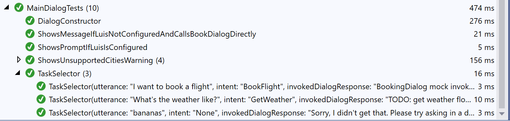


# CoreBot.Tests <!-- omit in toc -->

Bot Framework v4 core bot tests sample.

This project uses the [Microsoft.Bot.Builder.Testing](https://botbuilder.myget.org/feed/botbuilder-v4-dotnet-daily/package/nuget/Microsoft.Bot.Builder.Testing) package, [XUnit](https://xunit.net/) and [Moq](https://github.com/moq/moq) to create unit tests for the [CoreBot](https://github.com/microsoft/BotBuilder-Samples/tree/master/samples/csharp_dotnetcore/13.core-bot) bot.

This project shows how to:

- Create unit tests for dialogs, bots and controllers
- Create different types of data driven tests using XUnit Theory tests
- Create mock objects for the different dependencies of a dialog (i.e. LUIS recognizers, other dialogs, configuration, etc.)
- Assert the activities returned by a dialog turn against expected values
- Assert the results returned by a dialog

## Table of Contents <!-- omit in toc -->

- [Testing Dialogs](#Testing-Dialogs)
  - [Asserting activities](#Asserting-activities)
  - [Passing parameters to your dialogs](#Passing-parameters-to-your-dialogs)
  - [Asserting dialog turn results](#Asserting-dialog-turn-results)
- [Analyzing test output](#Analyzing-test-output)
- [Data Driven Tests](#Data-Driven-Tests)
  - [Data Driven Tests that take complex objects](#Data-Driven-Tests-that-take-complex-objects)
- [Using Mocks](#Using-Mocks)
  - [mocking LUIS results](#mocking-LUIS-results)
  - [mocking Dialogs](#mocking-Dialogs)
  - [mocking other objects](#mocking-other-objects)
- [References](#References)

## Testing Dialogs

Dialogs are unit tested through the `DialogTestClient` class which provides a mechanism for testing them in isolation outside of a bot and without having to deploy your code to a web service.

This class is used to write unit tests for dialogs that test their responses on a turn-by-turn basis. Any dialog built using the botbuilder dialogs library should work.

Here is an simple example on how a test that uses DialogTestClient looks like:

```csharp
var sut = new BookingDialog();
var testClient = new DialogTestClient(Channels.Msteams, sut);

var reply = await testClient.SendActivityAsync<IMessageActivity>("hi");
Assert.Equal("Where would you like to travel to?", reply.Text);

reply = await testClient.SendActivityAsync<IMessageActivity>("Seattle");
Assert.Equal("Where are you traveling from?", reply.Text);

reply = await testClient.SendActivityAsync<IMessageActivity>("New York");
Assert.Equal("When would you like to travel?", reply.Text);

reply = await testClient.SendActivityAsync<IMessageActivity>("tomorrow");
Assert.Equal("OK, I will book a flight from Seattle to New York for tomorrow, Is this Correct?", reply.Text);

reply = await testClient.SendActivityAsync<IMessageActivity>("yes");
Assert.Equal("Sure thing, wait while I finalize your reservation...", reply.Text);

reply = testClient.GetNextReply<IMessageActivity>();
Assert.Equal("All set, I have booked your flight to Seattle for tomorrow", reply.Text);
```

The first parameter for `DialogTestClient` is the target channel. This allows you to test different rendering logic based on the target channel for your bot (Teams, Slack, Cortana, etc.). If you are uncertain about your target channel, you can use the Emulator or Test channel ids but keep in mind that some components may behave differently depending on the current channel, for example, ConfirmPrompt renders the Yes/No options differently for the Test and Emulator channels. Your custom dialog may also have conditional logic that you may want to test.

The second parameter is an instance of the dialog being tested (Note: **"sut"** stands for "System Under Test", we use this acronym across the tests in this sample).

The `DialogTestClient` constructor provides additional parameters that allows you to further customize the client behavior or pass parameters to the dialog being tested if needed. You can pass initialization data, add custom middlewares or use your own TestAdapter and message processing callback. We use the first two parameters in several tests in this example.

The `SendActivityAsync<IActivity>` method allows you send a text utterance or an IActivity to your dialog and returns the first message sent by it. The `<T>` parameter is used to return a strong typed instance of the reply so you can assert it without having to cast it.

`SendActivityAsync<IActivity>` returns the first reply from the dialog, but in some scenarios your bot may send several messages in response to a single utterance, in this cases `DialogTestClient` will queue the replies and you can use the `GetNextReply<IActivity>` method to pop the next message from the response queue.

```csharp
reply = testClient.GetNextReply<IMessageActivity>();
Assert.Equal("All set, I have booked your flight to Seattle for tomorrow", reply.Text);
```

`GetNextReply<IActivity>` will return null if there are no further messages.

### Asserting activities

This sample only asserts the Text properties of returned activities. In more complex bots your may want to assert other properties like Speak, InputHints, ChannelData etc.

```csharp
Assert.Equal("Sure thing, wait while I finalize your reservation...", reply.Text);
Assert.Equal("One moment please...", reply.Speak);
Assert.Equal(InputHints.IgnoringInput, reply.InputHint);
```

You may want to do this by hand as shown above, you can write your own helper utilities for asserting activities or you consider using other frameworks like [FluentAssertions](https://fluentassertions.com/) to write custom assertions and simplify your test code.

### Passing parameters to your dialogs

The `DialogTestClient` constructor has an `initialDialogOptions` that can be used to pass parameters to your dialog. For example, the `MainDialog` in this sample, initializes a `BookingDetails` object from the LUIS results with the entities it could resolve from the user's utterance and passes this object in the `BeginDialogAsync` call to invoke `BookingDialog`.

You can implement this in a test as follows:

```csharp
var inputDialogParams = new BookingDetails()
{
    Destination = "Seattle",
    TravelDate = $"{DateTime.UtcNow.AddDays(1):yyyy-MM-dd}"
};

var sut = new BookingDialog();
var testClient = new DialogTestClient(Channels.Msteams, sut, inputDialogParams);

```

`BookingDialog` will receive this parameter and can access it in the test the same way as if it would have been invoked from `MainDialog`.

```csharp
private async Task<DialogTurnResult> DestinationStepAsync(WaterfallStepContext stepContext, CancellationToken cancellationToken)
{
    var bookingDetails = (BookingDetails)stepContext.Options;
    ...
}
```

### Asserting dialog turn results

Some dialogs like `BookingDialog` or `DateResolverDialog` return a value to the calling dialog. The `DialogTextClient` object exposes a `DialogTurnResult` that can be used to analyze and assert the results return by the dialog.

For example:

```csharp
var sut = new BookingDialog();
var testClient = new DialogTestClient(Channels.Msteams, sut);

var reply = await testClient.SendActivityAsync<IMessageActivity>("hi");
Assert.Equal("Where would you like to travel to?", reply.Text);

...

var bookingResults = (BookingDetails)testClient.DialogTurnResult.Result;
Assert.Equal("New York", bookingResults?.Origin);
Assert.Equal("Seattle", bookingResults?.Destination);
Assert.Equal("2019-06-21", bookingResults?.TravelDate);
```

The `DialogTurnResult` can also be used to inspect and assert intermediate results returned by the steps in a waterfall.

## Analyzing test output

Sometimes it is necessary to read a unit test transcript so we can analyze the test execution without having to debug the test.
The [Microsoft.Bot.Builder.Testing](https://botbuilder.myget.org/feed/botbuilder-v4-dotnet-daily/package/nuget/Microsoft.Bot.Builder.Testing) package includes an `XUnitOutputMiddleware` that logs the messages sent and received by the dialog to the console.

To use this middleware, your test needs to expose a constructor that receives an `ITestOutputHelper` object that is provided by the XUnit test runner and create a `XUnitOutputMiddleware` that will be passed to `DialogTestClient` trough the `middlewares` parameter.

```csharp
public class BookingDialogTests
{
    private readonly XUnitOutputMiddleware[] _middlewares;

    public BookingDialogTests(ITestOutputHelper output)
        : base(output)
    {
        _middlewares = new[] { new XUnitOutputMiddleware(output) };
    }

    [Fact]
    public async Task SomeBookingDialogTest()
    {
        // Arrange
        var sut = new BookingDialog();
        var testClient = new DialogTestClient(Channels.Msteams, sut, middlewares: _middlewares);

        ...
    }
}
```

Here is an example of what the `XUnitOutputMiddleware` logs to the output window when is configured:


This output will be also logged on the build server during the CI builds and helps analyze build failures.

For additional information on sending test output to the console when using XUnit see [Capturing Output](https://xunit.net/docs/capturing-output.html) in the XUnit documentation.

## Data Driven Tests

[WIP]

In most cases the bot logic is static and the different execution paths in a conversation are based on the user utterances. The dialog tests use XUnit Theory tests that 
This project uses XUnit Theory tests that allow us to create data driven tests (also known as parametrized test).

Consider the following simple test for a `DateResolverDialog`:



### Data Driven Tests that take complex objects

[WIP]

BookingDialog receives and returns a BookingDetails object with the reservation info. The VS IDE can only expand data driven tests that use 


## Using Mocks

[WIP]

Mocks allow us to configure the dependencies of a dialog and ensure the are in a know state during the execution of the test without having to rely on external resources like databases, LUIS models or other objects.

In order to make your dialog easier to test, you may need to inject the external dependencies that your'd like to replace by mock objects in the dialog constructor so you can replace them during testing. For example, MainDialog could have instantiated BookingDialog inside the constuctor but that would have prevented us from testing MainDialog without running BookingDialog. So we added BookingDialog as a constructor parameter so we can replace it with a mock object during testing. 

These dependencies are resolved though dependency injection at runtime when the bot is running.

### mocking LUIS results

In some cases you may want to implement your LUIS results through code, for example:


But LUIS results are sometime complex, so it may be also useful to capture the desired result as a json file, add that file as an embedded resource to your project and desrialized it into a LUIS result as follows.

### mocking Dialogs

[WIP]

MainDialog invokes BookingDialog to obtain the BookingDetails object. In the MainDialogTests we want to test maindialog independently of what goes on in BookingDialog so we can mock the dependent dialog as follows:

And then we create the sut (System Under Test) using the mock booking dialog as follows:

### mocking other objects

[WIP]

This sample uses mock for other objects like Configuration (see XYZ), Logger and other objects (see controllertests) for example.

## References

- [Bot Testing POV](https://github.com/microsoft/botframework-sdk/blob/master/specs/testing/testing.md)
