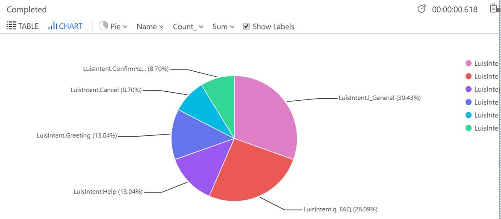
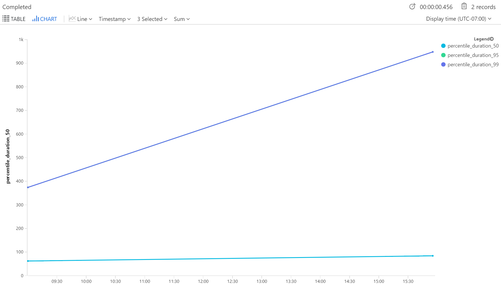
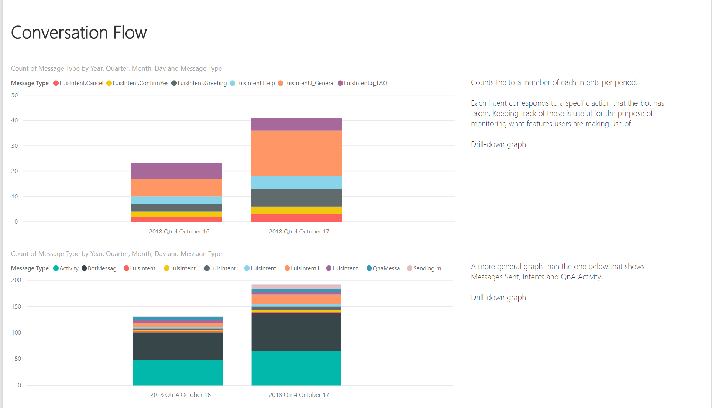
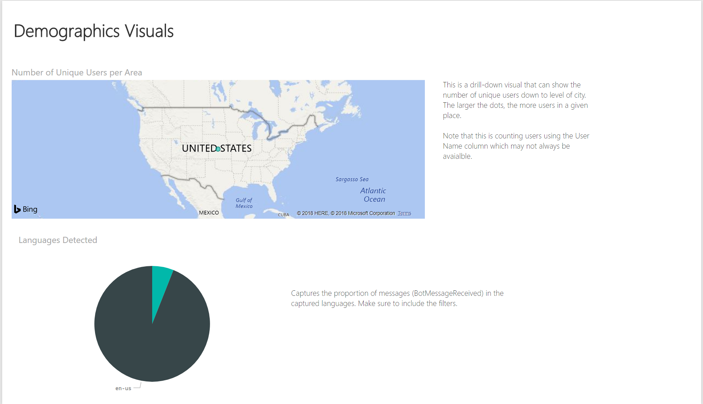
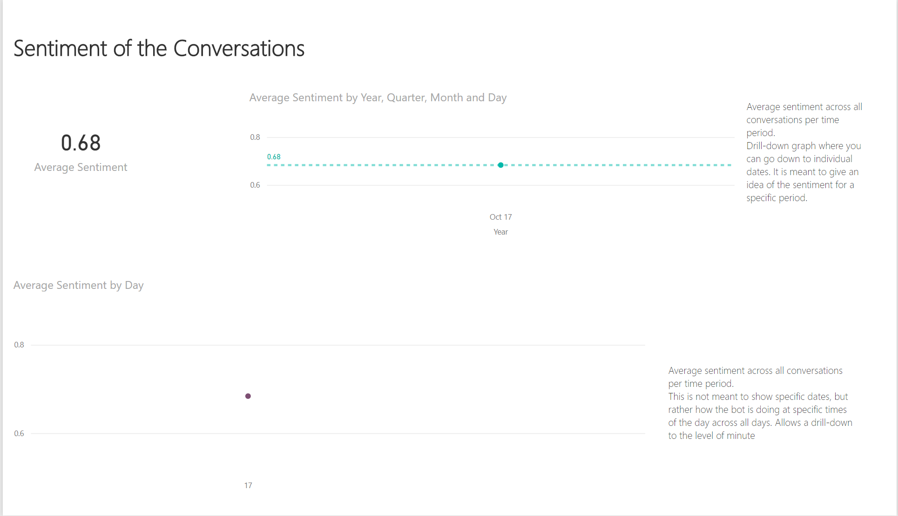
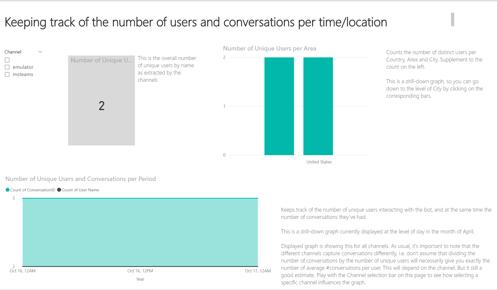
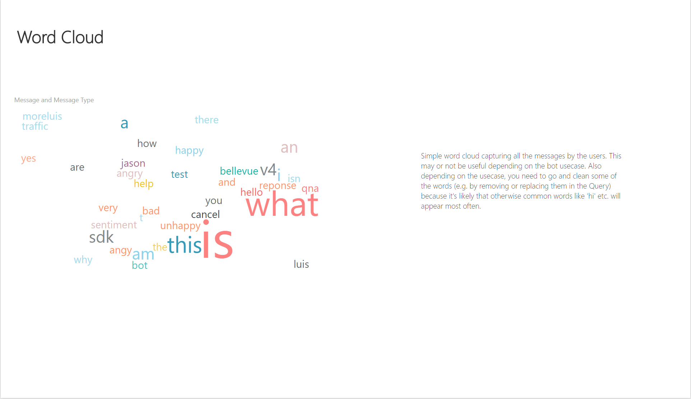

# Application Insights Telemetry for Bots
[Application Insights](https://azure.microsoft.com/en-us/services/application-insights/) is a Azure service which enables analytics about your applications, infrastructure and network.

The Bot Framework can use the  Application Insights telemetry to provide information about how your bot is performing, and track key metrics. 

The Bot Framework SDK ships with several samples that demonstrate how to add telemetry to your bot and produce reports (included).

## Table of Contents
- [Provision Application Insights](#provision-application-insights)
- [Configuring LUIS Sentiment](#configuring-sentiment)
- [Application Insights Queries](#application-insights-queries)
- [Power BI Report](#power-bi)
- [Using Application Insights in Visual Studio](#using-application-insights-in-visual-studio)
- [Disabling Application Insights](#disabling-application-insights)
- [Troubleshooting](#troubleshooting)

## Provision Application Insights
The Application Insights service must be created before the bot is deployed, since configuration strings must be provided to the Bot Configuration file. 
Application Insights can be provisioned through the [Azure Portal](https://portal.azure.com) or through the [MsBot tool](https://github.com/Microsoft/botbuilder-tools/tree/master/packages/MSBot).

The [MSBot](https://github.com/Microsoft/botbuilder-tools/tree/master/packages/MSBot) is a command line tool to create and manage bot resources described via a .bot file. See [here](https://github.com/Microsoft/botbuilder-tools/blob/master/packages/MSBot/docs/bot-file.md) to learn more about the .bot file.

If you want to provision independent of MSBot, the [Application Insights Quick Start Guide](https://docs.microsoft.com/en-us/azure/application-insights/app-insights-dotnetcore-quick-start) is a good place to start.

### Configuring Sentiment
The LUIS service supports sentiment analysis to be provided in responses.  This can be enabled through the [LUIS portal](https://www.luis.ai).
Sentiment is enabled at the application level.  To enable sentiment, log in to the portal, select "My Apps" , click on the specific application you want to enable sentiment.
Select "Manage" on the upper menu, and "Publish Settings" on the side menu.  It should resemble below.

Click on "Use sentiment analysis to determine if a user's utterance is positive, negative, or neutral." checkbox.


## Application Insights Queries
The following provide some examples of retrieving data about your bot, to better understand how your bot (and related services) are performing.

###  LUIS Intents Piechart

The following query demonstrates querying data that was generated by the LUIS telemetry in the sample.  The telemetry logs the top intent from the recognizer (in addition to some other properties), and logs an [Application Insights Custom Event](https://docs.microsoft.com/en-us/azure/application-insights/app-insights-api-custom-events-metrics).


```
customEvents
| where timestamp >= ago(24h)
| where name startswith "LuisIntent"
| summarize count() by name
| order by count_ desc
| render piechart
```


### P50, P95, P99 for Services

The following query demonstrates querying data from the Application Insights `dependencies` table which models calls to external components.



CosmosDB
```
dependencies
| where timestamp >= now(-1d)
| where type == "Azure DocumentDB"
| summarize percentiles(duration,50,95,99) by bin (timestamp, 1m)
| render timechart
```
Azure Blob Storage
```
dependencies
| where timestamp >= now(-1d)
| where type == "Azure blob"
| summarize percentiles(duration,50,95,99) by bin (timestamp, 1m)
| render timechart
```
LUIS

```
dependencies
| where timestamp >= now(-1d)
| where type == "HTTP" and name contains "/luis"
| summarize percentiles(duration,50,95,99) by bin (timestamp, 1m)
| render timechart
```

## Power BI
The samples provide a PowerBI template  that can be used to understand how the bot is performing. 

The Power BI template is located under the following folder: 

`ApplicationInsights\Example Power BI Dashboard.pbit`

Below are some sample pages of the report.

### Overall Usage

### Conversation Flow

### Demographics

### Sentiment

### Users and Conversations

### Common Words

### Word Cloud



## Using Application Insights in Visual Studio
Within Visual Studio, Application Insights events can be queried in the "Application Insights Search" window.  [For more details, see the Application Insights documentation](https://docs.microsoft.com/en-us/azure/application-insights/app-insights-diagnostic-search).

Clicking on "Track Operation" on the details of any event can give you a visualization of where time is being spent, using the events in the telemetry that are automatically correlated:

With this view, you can quickly understand where time is being spent within your bot.

## Disabling Application Insights

To turn off Application Insights logging, remove the `appInsights` section of your `<BOT-NAME>.bot` file and the null logger will be used instead.

## Troubleshooting

### I am not seeing all event types.
- Ensure your `<BOT-NAME>.bot` file is populated your Application Insights information.  Specifically, review the `instrumentationKey` setting.
```json
...
       {
            "type": "appInsights",
            "tenantId": "XXXXXXXX-XXXX-XXXX-XXXX-XXXXXXXXXXXX",
            "subscriptionId": "XXXXXXXX-XXXX-XXXX-XXXX-XXXXXXXXXXXX",   
            "resourceGroup": "RESOURCE_GROUP",
            "name": "NAME",
            "serviceName": "NAME",
            "instrumentationKey": "XXXXXXXX-XXXX-XXXX-XXXX-XXXXXXXXXXXX",
            "applicationId": "XXXXXXXX-XXXX-XXXX-XXXX-XXXXXXXXXXXX",
            "apiKeys": {},
            "id": ""
        },
...
```

- In C# ASP.Net Core, ensure the `<BOT-NAME>.bot` is being referenced by your `appsettings.json` file:
```json
 {
  "botFilePath": "<BOT-NAME>.bot",
  "botFileSecret": "<MySecret>"
}
```

