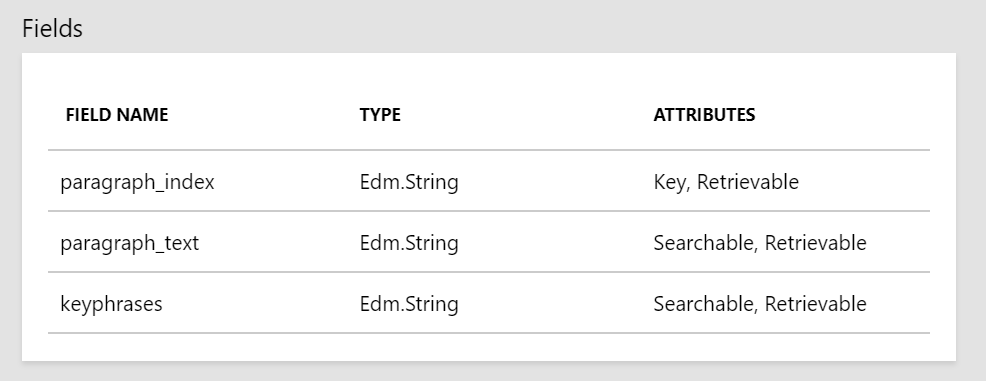
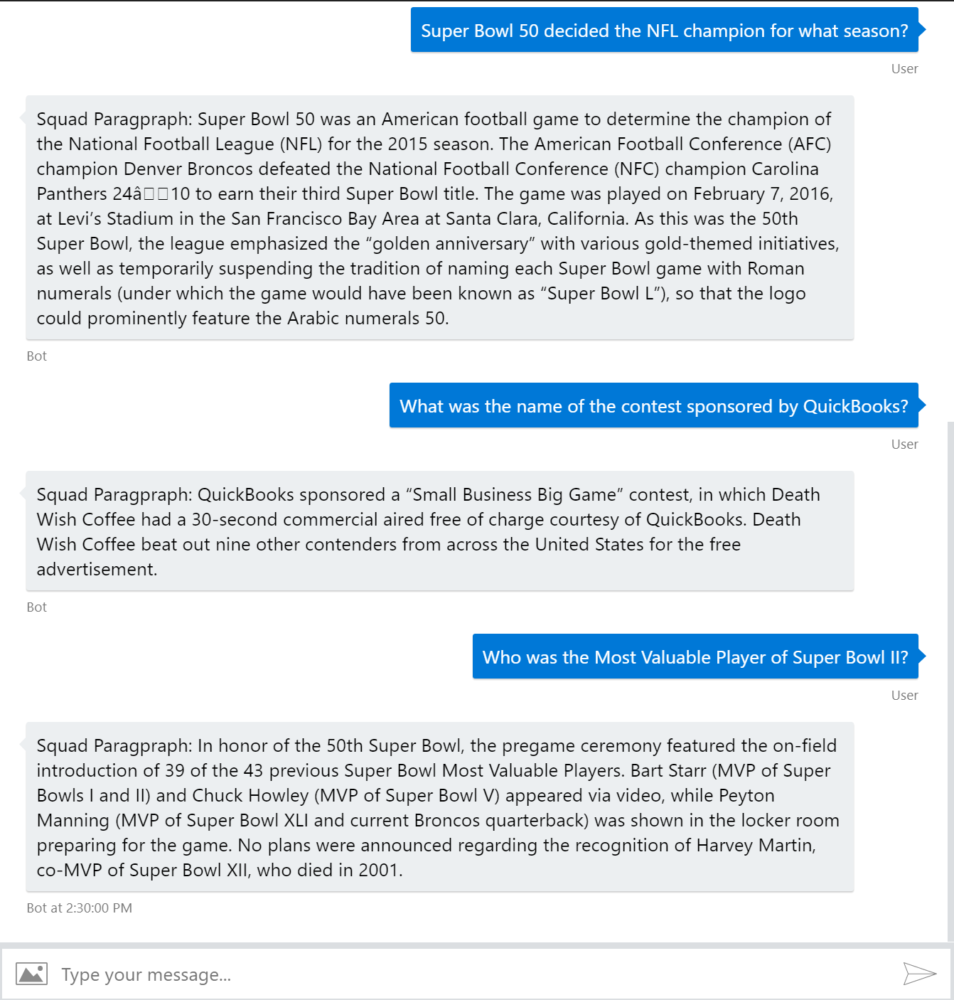

# Bot Framework v4 with Azure Search

This code sample demonstrates how to implement Azure Search with Bot Framework v4 using C#.

In this Azure Search sample I've used SQuAD v1.1 dataset for searching questions within more than +2K paragraphs.

## What is SQuAD?
Stanford Question Answering Dataset (SQuAD) is a reading comprehension dataset, consisting of questions posed by crowdworkers on a set of Wikipedia articles, where the answer to every question is a segment of text, or span, from the corresponding reading passage, or the question might be unanswerable.

Azure Search results to point correct paragraphs live below. Around %78 percentage of the results, retrieve correct paragraph at first place, correct paragraph appers in 3 paragraphs: %91 and in 5 paragraphs: %94.

Over +10K Question here's the benchmark

|Ranking| # of Questions|Score|
|--|--|--|
|Ranking at 1st        | 7935 | %78|
|Ranking in first 3  | 9273 | %91|
|Ranking in first 5  | 9612 | %94|

Fields on Azure Search

  

On a different code sample we'll focus on Azure Search with SQuAD to retrieve correct paragraph to implement MRC.

One sample search result on Azure Search

```JSON
{
    "@search.score": 1.1556818,
    "paragraph_index": "0",
    "paragraph_text": "Super Bowl 50 was an American football game to determine the champion of the National Football League (NFL) for the 2015 season. The American Football Conference (AFC) champion Denver Broncos defeated the National Football Conference (NFC) champion Carolina Panthers 24-10 to earn their third Super Bowl title. The game was played on February 7, 2016, at Levi's Stadium in the San Francisco Bay Area at Santa Clara, California. As this was the 50th Super Bowl, the league emphasized the \"golden anniversary\" with various gold-themed initiatives, as well as temporarily suspending the tradition of naming each Super Bowl game with Roman numerals (under which the game would have been known as \"Super Bowl L\"), so that the logo could prominently feature the Arabic numerals 50.",
    "keyphrases": "Super Bowl game,Super Bowl title,American football game,National Football Conference,American Football Conference,National Football League,champion Denver Broncos,champion Carolina Panthers,Roman numerals,Arabic numerals,San Francisco Bay Area,Santa Clara,NFC,AFC,Levi's Stadium,golden anniversary,various gold-themed initiatives,California,NFL,tradition,logo,season"
}
```

Your `appsettings.json` will look like below. 

```JSON
{
  "botFilePath": "BotConfiguration.bot",
  "botFileSecret": "",
  "SearchServiceName": "YOUR_AZURE_SEARCH_SERVICE_NAME",
  "SearchDialogsIndexName": "YOUR_AZURE_SEARCH_INDEX_NAME",
  "SearchServiceQueryApiKey": "YOUR_AZURE_SEARCH_API_KEY"
}
```

In the sample we only retrieve first result, if you would like to retrieve more you can increase the `ntop` limit in `SearchParameters` .

Here is the result output:

  


